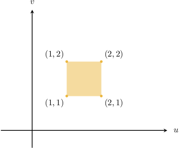
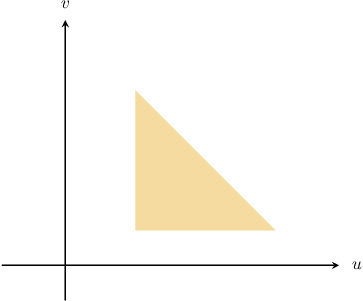

# The Inverse of an Affine Transformation

Source: https://www.mathacademy.com/topics/3707?courseId=154
Topic ID: 3707

## Prerequisites

- [Solving 2x2 Systems of Equations Using Inverse Matrices](../integrated-math-iii-honors/934-solving-2x2-systems-of-equations-using-inverse-matrices.md)
- [Singular Linear Transformations in the Plane](../integrated-math-iii-honors/1351-singular-linear-transformations-in-the-plane.md)
- [Affine Transformations](./3387-affine-transformations.md)

## Lesson

### Introduction

Suppose that $\mathbf T:\mathbb R^2\rightarrow\mathbb R^2$ is an affine transformation. The **inverse** of $\mathbf T$ (if it exists) is an affine transformation $\mathbf T^{-1}$ such that

$$

\mathbf T^{-1} (\mathbf T(\mathbf u)) = \mathbf T (\mathbf T^{-1}(\mathbf u)) = \mathbf u

$$

for every vector $\mathbf u\in\mathbb R^2.$ In other words, the transformation $\mathbf T^{-1}$ reverses the action of $\mathbf T.$

Not all affine transformations are invertible. So how can we determine whether a given affine transformation is invertible?

To answer this, recall that an affine transformation $\mathbf T$ can be expressed in matrix form as

$$

\mathbf x = A \mathbf u + \mathbf b,

$$

where $\mathbf x, \mathbf u,$ and $\mathbf b$ are column vectors in $\mathbb R^2,$ and $A$ is a $2\times 2$ matrix. We can reverse the action of $\mathbf T$ by making $\mathbf u$ the subject of this equation, as follows:

$$

\begin{aligned}𝐴𝐮+𝐛 & =𝐱 \\ 𝐴𝐮 & =𝐱−𝐛 \\ 𝐴^{−1}⋅𝐴𝐮 & =𝐴^{−1}⋅(𝐱−𝐛) \\ 𝐼_{2}⋅𝐮 & =𝐴^{−1}(𝐱−𝐛) \\ 𝐮 & =𝐴^{−1}(𝐱−𝐛)\end{aligned}

$$

This equation gives us a method of computing the inverse of an affine transformation. Additionally, we have the following:

*An affine transformation $\mathbf T$ is invertible if and only if the matrix $A$ that represents the linear transformation associated with $\mathbf T$ is invertible, that is, $\det(A) \neq 0.$*

### Example: Identifying Invertible Affine Transformations

#### Question

Consider the affine transformation $\mathbf T$ defined as

$$

x = u - v - 2, \qquad y = v - u + 5.

$$

Suppose that $A$ is the matrix representing the linear transformation associated with $\mathbf T.$ Which of the following statements are true?

1. $[\begin{aligned}1 & −1 \\ −1 & 1\end{aligned}]$

2. $\det(A) = 0$

3. The transformation is invertible

#### Explanation

An affine transformation $\mathbf T:\mathbb R^2\rightarrow\mathbb R^2$ is a function of the form

$$

\mathbf x = A \mathbf u + \mathbf b,

$$

where $\mathbf x, \mathbf u,$ and $\mathbf b$ are column vectors in $\mathbb R^2,$ and $A$ is a $2\times 2$ matrix.

Let's look at each statement in turn:

- Statement I is true. The given transformation can be expressed as Therefore,

- Statement II is true. Computing the determinant of $A,$ we get

- Statement III is false. Since $\det(A) = 0,$ the affine transformation is ** invertible.

Therefore, the correct answer is "I and II only."

### Finding the Inverse of an Affine Transformation

Consider the affine transformation $\mathbf T,$ expressed in matrix form as

$$

[\begin{aligned}𝑥 \\ 𝑦\end{aligned}]

$$

We wish to determine whether $\mathbf T^{-1}$ exists and find its matrix form if it does exist.

Computing the determinant of $A,$ we get

$$

\begin{aligned}1 & −3 \\ 1 & −2\end{aligned}

$$

Since $\det(A) \neq 0,$ the affine transformation is invertible.

To compute the inverse of $\mathbf T,$ we will use the formula we derived earlier:

$$

\mathbf{u} = A^{-1}(\mathbf{x} - \mathbf{b})

$$

We start by calculating the inverse of $A{:}$

$$

\begin{aligned}𝐴^{−1} & =\frac{1}{1}[\begin{aligned}−2 & 3 \\ −1 & 1\end{aligned}] \\ & =[\begin{aligned}−2 & 3 \\ −1 & 1\end{aligned}]\end{aligned}

$$

Therefore, the matrix form of the inverse affine transformation $\mathbf{T}^{-1}$ is

$$

\begin{aligned}\underset{𝐮}{\underset{}{[\begin{aligned}𝑢 \\ 𝑣\end{aligned}]}} & =\underset{𝐴^{−1}}{\underset{}{[\begin{aligned}−2 & 3 \\ −1 & 1\end{aligned}]}}⋅(\underset{𝐱}{\underset{}{[\begin{aligned}𝑥 \\ 𝑦\end{aligned}]}}−\underset{𝐛}{\underset{}{[\begin{aligned}2 \\ 3\end{aligned}]}}) \\ & =[\begin{aligned}−2 & 3 \\ −1 & 1\end{aligned}][\begin{aligned}𝑥 \\ 𝑦\end{aligned}]−[\begin{aligned}−2 & 3 \\ −1 & 1\end{aligned}][\begin{aligned}2 \\ 3\end{aligned}] \\ & =[\begin{aligned}−2 & 3 \\ −1 & 1\end{aligned}][\begin{aligned}𝑥 \\ 𝑦\end{aligned}]−[\begin{aligned}5 \\ 1\end{aligned}] \\ & =[\begin{aligned}−2 & 3 \\ −1 & 1\end{aligned}][\begin{aligned}𝑥 \\ 𝑦\end{aligned}]+[\begin{aligned}−5 \\ −1\end{aligned}].\end{aligned}

$$

### Example: Inverting Affine Transformations Given in Matrix Form

#### Question

The matrix form of the affine transformation $\mathbf T$ is given by

$$

[\begin{aligned}𝑥 \\ 𝑦\end{aligned}]

$$

Find $a+b+c,$ given that the matrix form of the inverse transformation $\mathbf T^{-1}$ is

$$

[\begin{aligned}𝑢 \\ 𝑣\end{aligned}]

$$

#### Explanation

An affine transformation $\mathbf T:\mathbb R^2\rightarrow\mathbb R^2$ is a function of the form

$$

\mathbf x = A \mathbf u + \mathbf b,

$$

where $\mathbf x, \mathbf u,$ and $\mathbf b$ are column vectors in $\mathbb R^2,$ and $A$ is a $2\times 2$ matrix.

Reversing the action of $\mathbf{T},$ we get

$$

\begin{aligned}𝐴𝐮+𝐛 & =𝐱 \\ 𝐴𝐮 & =𝐱−𝐛 \\ 𝐮 & =𝐴^{−1}(𝐱−𝐛).\end{aligned}

$$

The matrix form of $\mathbf T$ gives us the following information:

$$

[\begin{aligned}−4 & −9 \\ 3 & 7\end{aligned}]

$$

Next, we calculate the inverse of $A{:}$

$$

\begin{aligned}𝐴^{−1} & =\frac{1}{(−4)⋅7−(−9)⋅3}[\begin{aligned}7 & 9 \\ −3 & −4\end{aligned}] \\ & =\frac{1}{−1}[\begin{aligned}7 & 9 \\ −3 & −4\end{aligned}] \\ & =[\begin{aligned}−7 & −9 \\ 3 & 4\end{aligned}]\end{aligned}

$$

Therefore, the inverse transformation $\mathbf{T}^{-1}$ is

$$

\begin{aligned}\underset{𝐮}{\underset{}{[\begin{aligned}𝑢 \\ 𝑣\end{aligned}]}} & =\underset{𝐴^{−1}}{\underset{}{[\begin{aligned}−7 & −9 \\ 3 & 4\end{aligned}]}}⋅(\underset{𝐱}{\underset{}{[\begin{aligned}𝑥 \\ 𝑦\end{aligned}]}}−\underset{𝐛}{\underset{}{[\begin{aligned}5 \\ −3\end{aligned}]}}) \\ & =[\begin{aligned}−7 & −9 \\ 3 & 4\end{aligned}][\begin{aligned}𝑥 \\ 𝑦\end{aligned}]−[\begin{aligned}−7 & −9 \\ 3 & 4\end{aligned}][\begin{aligned}5 \\ −3\end{aligned}] \\ & =[\begin{aligned}−7 & −9 \\ 3 & 4\end{aligned}][\begin{aligned}𝑥 \\ 𝑦\end{aligned}]−[\begin{aligned}−8 \\ 3\end{aligned}] \\ & =[\begin{aligned}−7 & −9 \\ 3 & 4\end{aligned}][\begin{aligned}𝑥 \\ 𝑦\end{aligned}]+[\begin{aligned}8 \\ −3\end{aligned}].\end{aligned}

$$

Therefore, we have

$$

a+b+c = -7 + 3 + 8 = 4.

$$

### Example: Inverting Affine Transformations Given in Parametric Form

#### Question

The affine transformation $\mathbf T$ is defined as

$$

x = u - v + 2, \qquad y = 4u - 5v + 9.

$$

Given that the inverse transformation $\mathbf T^{-1}$ of $\mathbf T$ is

$$

u = \boxed{a}x - y + \boxed{b}, \qquad v = \boxed{c}x - y + 1,

$$

what is the value of $a+b+c?$

#### Explanation

An affine transformation $\mathbf T:\mathbb R^2\rightarrow\mathbb R^2$ is a function of the form

$$

\mathbf x = A \mathbf u + \mathbf b,

$$

where $\mathbf x, \mathbf u,$ and $\mathbf b$ are column vectors in $\mathbb R^2,$ and $A$ is a $2\times 2$ matrix.

Reversing the action of $\mathbf{T},$ we get

$$

\begin{aligned}𝐴𝐮+𝐛 & =𝐱 \\ 𝐴𝐮 & =𝐱−𝐛 \\ 𝐮 & =𝐴^{−1}(𝐱−𝐛).\end{aligned}

$$

So, writing our transformation in matrix form, we have

$$

\begin{aligned}[\begin{aligned}𝑥 \\ 𝑦\end{aligned}] & =[\begin{aligned}𝑢−𝑣+2 \\ 4𝑢−5𝑣+9\end{aligned}] \\ & =[\begin{aligned}𝑢−𝑣 \\ 4𝑢−5𝑣\end{aligned}]+[\begin{aligned}2 \\ 9\end{aligned}] \\ & =\underset{𝐴}{\underset{}{[\begin{aligned}1 & −1 \\ 4 & −5\end{aligned}]}}⋅\underset{𝐮}{\underset{}{[\begin{aligned}𝑢 \\ 𝑣\end{aligned}]}}+\underset{𝐛}{\underset{}{[\begin{aligned}2 \\ 9\end{aligned}]}}.\end{aligned}

$$

Next, we calculate the inverse of $A{:}$

$$

\begin{aligned}𝐴^{−1} & =\frac{1}{1⋅(−5)−(−1)⋅4}[\begin{aligned}−5 & 1 \\ −4 & 1\end{aligned}] \\ & =\frac{1}{−1}[\begin{aligned}−5 & 1 \\ −4 & 1\end{aligned}] \\ & =[\begin{aligned}5 & −1 \\ 4 & −1\end{aligned}]\end{aligned}

$$

Therefore, the inverse transformation $\mathbf{T}^{-1}$ is

$$

\begin{aligned}\underset{𝐮}{\underset{}{[\begin{aligned}𝑢 \\ 𝑣\end{aligned}]}} & =\underset{𝐴^{−1}}{\underset{}{[\begin{aligned}5 & −1 \\ 4 & −1\end{aligned}]}}⋅(\underset{𝐱}{\underset{}{[\begin{aligned}𝑥 \\ 𝑦\end{aligned}]}}−\underset{𝐛}{\underset{}{[\begin{aligned}2 \\ 9\end{aligned}]}}) \\ & =[\begin{aligned}5 & −1 \\ 4 & −1\end{aligned}][\begin{aligned}𝑥−2 \\ 𝑦−9\end{aligned}] \\ & =[\begin{aligned}5⋅(𝑥−2)+(−1)⋅(𝑦−9) \\ 4⋅(𝑥−2)+(−1)⋅(𝑦−9)\end{aligned}] \\ & =[\begin{aligned}5𝑥−𝑦−1 \\ 4𝑥−𝑦+1\end{aligned}].\end{aligned}

$$

Equating the corresponding components, the inverse transformation $\mathbf{T}^{-1}$ in coordinate form is

$$

u = \boxed{5}x - y + \boxed{(-1)}, \qquad v = \boxed{4}x - y + 1.

$$

Therefore, we have

$$

a+b+c = 5 + (-1) + 4 = 8.

$$

### Image Types Formed by Affine Transformations

Consider the square in the $uv$-plane shown below.

We wish to explore the image of this square under an affine transformation

$$

\mathbf{T}: \mathbf{u} \longrightarrow A \mathbf{u} + \mathbf{b},

$$

where $A$ is a $2\times 2$ matrix, and $\mathbf u$ and $\mathbf b$ are $2\times 1$ column vectors.

Similar to linear transformations, there are three possibilities depending on the value of $\det(A)$.

- $\mathbf{T}$ is non-singular ($\det(A)\neq 0$). In this case, our square is mapped to a parallelogram. For example, let the transformation $\mathbf T$ be given by Mapping our square to the $xy$-plane, we get the following parallelogram:

- $\mathbf{T}$ is singular ($\det(A)=0$) and $A$ has at least one nonzero entry. In this case, our square is mapped to a line segment. For example, let the transformation $\mathbf T$ be given by Mapping our square to the $xy$-plane gives the following line segment:

- $\mathbf{T}$ is singular ($\det(A)=0$) and $A$ is the zero matrix. In this case, our square is mapped to a point on the plane. For example, let the transformation $\mathbf T$ be given by Mapping our square to the $xy$-plane gives the following point.

### A Summary of Image Types

In general, if we consider the affine transformation $\mathbf T:\Bbb R^2 \to \Bbb R^2,$ defined by the mapping

$$

\mathbf{T}: \mathbf{u} \longrightarrow A \mathbf{u} + \mathbf{b},

$$

where $A$ is a $2\times 2$ matrix and $\mathbf u$ and $\mathbf b$ are $2\times 1$ column vectors, then we have one of the following three possibilities:

- If $\mathbf{T}$ is non-singular, i.e., when $\det(A) \neq 0,$ then the image of a two-dimensional object is a two-dimensional object. In particular, the image of a polygon with $n$ vertices is a polygon with $n$ vertices.

- If $\mathbf{T}$ is singular, i.e., when $\det(A) = 0,$ we have two additional subcases: If $A$ has at least one nonzero entry, then the image of a two-dimensional object is a one-dimensional line segment. If $A$ is the zero matrix, then the image of a two-dimensional object is a point on the plane (namely, the point with position vector $\mathbf b$).

### Example: Identifying the Types of Images Formed by an Affine Transformation

#### Question

Consider the affine transformation $\mathbf T,$ given by

$$

[\begin{aligned}𝑥 \\ 𝑦\end{aligned}]

$$

Describe the image of the triangle shown above under the action of $\mathbf{T}.$

#### Explanation

Recall that for any affine transformation

$$

\mathbf{T}: \mathbf{u} \longrightarrow A \mathbf{u} + \mathbf{b},

$$

where $A$ is a $2\times 2$ matrix and $\mathbf u$ and $\mathbf b$ are $2\times 1$ column vectors, we have one of the following three possibilities:

- If $\mathbf{T}$ is non-singular, i.e., when $\det(A) \neq 0,$ then the image of a two-dimensional object is a two-dimensional object. In particular, the image of a polygon with $n$ vertices is a polygon with $n$ vertices.

- If $\mathbf{T}$ is singular, i.e., when $\det(A) = 0,$ we have two additional subcases: If $A$ has at least one nonzero entry, then the image of a two-dimensional object is a one-dimensional line segment. If $A$ is the zero matrix, then the image of a two-dimensional object is a point on the plane.

With that in mind, let's examine our transformation.

Notice that the matrix representation of the linear transformation associated with $\mathbf{T}$ is $[\begin{aligned}2 & 1 \\ 4 & 2\end{aligned}]$

Computing the determinant of $A,$ we obtain

$$

\begin{aligned}det(𝑇) & =\begin{aligned}2 & 1 \\ 4 & 2\end{aligned} \\ & =2⋅2−4⋅1 \\ & =0.\end{aligned}

$$

So, we have a singular nonzero matrix.

Therefore, $\mathbf{T}$ is non-invertible and the image of the triangle under the action of $\mathbf{T}$ is a line segment.
