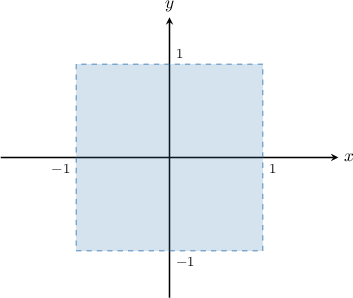
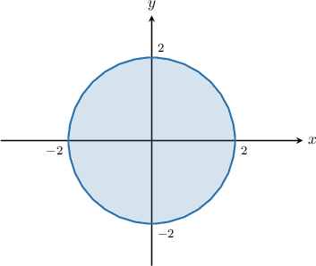
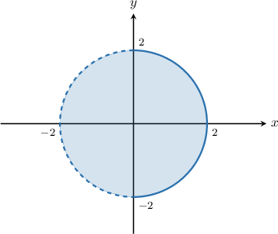

# Open and Closed Sets

Source: https://www.mathacademy.com/topics/4097?courseId=154
Topic ID: 4097

## Prerequisites

- [Interiors and Boundaries of Sets](./4063-interiors-and-boundaries-of-sets.md)

## Lesson

### Introduction

A set $A$ is **open** if it does not contain any of its boundary points. In other words, an open set consists only of the interior points of the set.

For example, let $A$ be the subset of $2$-dimensional space defined as follows:

$$

A = \big\{ (x,y)\in\mathbb R^2 \,:\, -1 < x < 1, \, -1 < y < 1 \big\}

$$

This set is shown below.

Notice that $A$ does not contain any of its boundary points. Therefore, $A$ is an open set.

If $A$ is an open set, then it equals its interior, and we can write

$$

A = \textrm{int}\,A.

$$

### Closed Sets

A set is **closed** if it contains all its boundary points. That is

$$

\partial A \subset \,A

$$

where $\partial A$ denotes the boundary of $A.$

For example, let $A$ be the subset of $2$-dimensional space defined as follows:

$$

A =\big\{(x,y)\in\mathbb R^2 : x^2+y^2\leq 4 \big\}

$$

This set is shown below.

The boundary of $A$ is given by

$$

\partial A = \big\{(x,y) \in\mathbb R^2 \,:\, x^2 + y^2 = 4 \big\} \subset A.

$$

Since $A$ contains **all** of its boundary points, it is closed.

If set $A$ is closed, it consists of all points within its interior and boundary. Using set notation, we can express this as

$$

A = \partial A \cup \textrm{int}\, A.

$$

**Watch out!** Closed and open sets are not opposites of each other. Namely, if a set is *not* closed, this doesn't mean it's necessarily open (and vice versa).

### Example: Identifying Open and Closed Sets of Real Numbers

#### Question

Which of the following sets are open?

1. $(-3,1)\cup(2,4)$

2. $[1,3)$

3. $(-\infty, -2]$

#### Explanation

Recall that:

- A set is ** if it does not contain any of its boundary points. In other words, an open set consists only of the interior points of the set.

- A set is ** if it contains **** of its boundary points. In other words, a closed set consists of all the interior and all the boundary points of the set.

Among the given sets, only $(-3,1) \cup (2,4)$ is open. It consists of two parts, where the boundary points are $-3,1,2,$ and $4.$ None of them lie in the set.

The other sets are not open:

- $[1,3)$ has two boundary points $1$ and $3,$ and the point $1$ lies in the set.

- $(-\infty,-2]$ has a boundary point $-2,$ which lies in the set.

Therefore, the correct answer is "I only".

### Example: Identifying Open and Closed Sets in the Plane in Set Notation

#### Question

Which of the following sets are closed?

1. $\big\{(x,y)\in\mathbb R^2:\ -1 < x< 1, \, 2x^2-2< y < 0\big\}$

2. $\big\{(x,y)\in\mathbb R^2:\ -2 \lt x \lt 6, \, 0 \lt y \lt \sqrt{2x+4} \big\}$

3. $\big\{(x,y)\in\mathbb R^2:\ 0 \leq x \leq 1, \, 0 \leq y \leq x^3\big\}$

#### Explanation

Recall that:

- A set is ** if it does not contain any of its boundary points. In other words, an open set consists only of the interior points of the set.

- A set is ** if it contains **** of its boundary points. In other words, a closed set consists of all the interior and all the boundary points of the set.

Let's examine our sets in turn.

- The first set is ** since it doesn't contain any of its boundary points (all the corresponding inequalities are strict).

- The second set is ** since it doesn't contain any of its boundary points (all the corresponding inequalities are strict).

- The third set is ** since it contains all of its boundary points (all the corresponding inequalities are not strict).

Therefore, the correct answer is "III only."

### Sets that are Neither Open Nor Closed

Some sets are open. Other sets are closed. Some sets are neither open nor closed.

For example, consider the set depicted below. It's a disc, and its boundary is a circle.

Remember that a closed set contains all its boundary points, while an open set contains none of its boundary points.

- The set above is not closed because it does not contain all of its boundary. On the left side of the graph, the circular boundary is dashed, meaning it is not contained within the set.

- The set above is not open because it contains some of its boundary. On the right side of the graph, the circular boundary is solid, meaning that it is contained within the set.

Therefore, the set is neither open nor closed.

### Example: Identifying Sets That are Neither Open Nor Closed

#### Question

Which of the following sets are neither open nor closed?

1. $\big\{(x,y)\in\mathbb R^2 \,:\, 4x^2+y^2 < 1, \, y < 0 \big\}$

2. $\big\{(x,y) \in\mathbb R^2\,:\, 3 \leq x \leq 9, \, 0 < y \leq \sqrt x \big\}$

3. $\big\{(x,y)\in\mathbb R^2 \,:\, 0\leq x \leq 1, \, 0 \leq y \leq 1 \big\}$

#### Explanation

Recall that:

- A set is ** if it does not contain any of its boundary points. In other words, an open set consists only of the interior points of the set.

- A set is ** if it contains **** of its boundary points. In other words, a closed set consists of all the interior and all the boundary points of the set.

Let's examine our sets in turn.

- The first set is ** since it doesn't contain any of its boundary points (all the corresponding inequalities are strict).

- The second set is **. It contains some of its boundary points, for example, the point $(9,3).$ On the other hand, it does not contain some other boundary points, for example, the point $(9,0).$ Notice that the set contains a mix of strict and non-strict inequalities.

- The third set is ** since it contains all its boundary points (all the corresponding inequalities are not strict).

Therefore, the correct answer is "II only."
