# Visualizing Cartesian Products

Source: https://www.mathacademy.com/topics/4387?courseId=154
Topic ID: 4387

## Prerequisites

- [The Cartesian Product](./49-the-cartesian-product.md)
- [Indexed Sets](./55-indexed-sets.md)

## Lesson

### Introduction

Recall that if $A$ and $B$ are sets, the Cartesian product $A \times B$ consists of all ordered pairs $(a,b)$ whose first coordinate belongs to $A$ and whose second coordinate belongs to $B.$

$$

A \times B = \big\{(a, b) \: : \: a \in A,\, b \in B \big\}

$$

Many Cartesian products have natural representations in the Cartesian plane. The most common of these is the Cartesian product $\mathbb R^2{:}$

$$

\mathbb R^2 = \mathbb R\times\mathbb R = \big\{(x, y) \: : \: x,y \in \mathbb R \big\}

$$

This infinite set contains all ordered pairs $(x,y),$ where $x$ and $y$ can be any real numbers. In other words, $\mathbb R^2$ contains every point in the Cartesian plane!

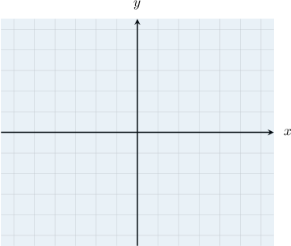

Similarly, the set

$$

\mathbb R^3 = \mathbb R\times\mathbb R\times\mathbb R = \big\{(x, y, z) \: : \: x,y,z \in \mathbb R \big\}

$$

describes every point in three-dimensional Cartesian space.

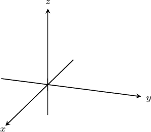

### Example: Sketching Cartesian Products in the Coordinate Plane

#### Question

Sketch a representation of the set $S = \{1, 2\} \times (0, 1)$ in the Cartesian plane.

#### Explanation

The Cartesian product $A \times B$ consists of all ordered pairs whose first coordinate belongs to $A$ and whose second coordinate belongs to $B.$

$$

A\times B = \big\{(a,b) \::\: a\in A,\, b\in B\big\}

$$

In this case, the set

$$

S = \{1,2\} \times (0,1)

$$

contains every point in $\mathbb{R}^2$ whose $x$-coordinate is either $1$ or $2$ and whose $y$-coordinate is any real number in the interval $(0,1).$

$$

S= \Big\{ (x,y) \: : \: x\in \{{\color{red}{1}},{\color{blue}{2}}\},\, y\in (0,1) \Big\}.

$$

To visualize $S$, consider $S_1\subset S$ containing all points whose $x$-coordinate equals ${\color{red}{1}}$ and whose $y$-coordinate is any real number in the interval $(0,1).$

$$

S_1 = \Big\{ ({\color{red}{1}},y) \: : \: y \in(0,1) \Big\}

$$

This set is represented by the line segment shown below.

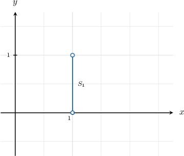

Next, consider $S_2\subset S$ containing all points whose $x$-coordinate equals ${\color{blue}{2}}$ and whose $y$-coordinate is any real number in the interval $(0,1).$

$$

S_2 = \big\{ ({\color{blue}{2}},y) \: : \: y \in(0,1) \big\}.

$$

This set is represented by the line segment shown below.

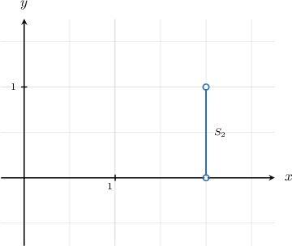

Our Cartesian product is the ** of these subsets:

$$

S = S_1\cup S_2

$$

Therefore, $S$ can be represented by the two line segments shown below.

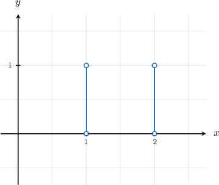

### Cartesian Products of Countably Infinite Sets

Cartesian coordinates can also be used to visualize other Cartesian products.

For example, let's consider the following Cartesian product:

$$

\mathbb{N} \times \mathbb{R}^- = \big\{(x,y) \: : \: x\in\mathbb N,\, y\in\mathbb R^-\big\}

$$

This product contains every point in $\mathbb R^2$ whose $x$-coordinate is a natural number and whose $y$-coordinate is a negative real number.

To visualize this Cartesian product, consider the following subset of our Cartesian product:

$$

S_1 = \big\{ (1,y) \: : \: y \in\mathbb{R}^- \big\} \subset \mathbb{N} \times \mathbb{R}^-

$$

This subset describes all points in the plane whose $x$-coordinate equals $1$ and whose $y$-coordinate is any negative real number. We can represent $S_1$ in the plane as follows:

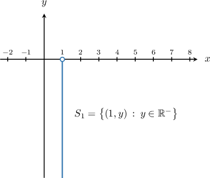

Next, we consider the subset $S_2,$ given by

$$

S_2 = \big\{ (2,y) \: : \: y \in\mathbb{R}^- \big\} \subset \mathbb{N} \times \mathbb{R}^-.

$$

This subset describes all points in the plane whose $x$-coordinate equals $2$ and whose $y$-coordinate is any negative real number.

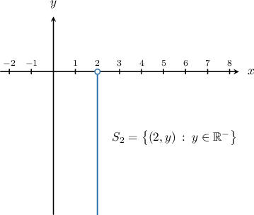

We can create the subsets $S_3, S_4, S_5,\ldots,$ similarly. Our Cartesian product consists of the *union* of these subsets:

$$

\begin{aligned}ℕ×ℝ^{−} & =𝑆_{1}∪𝑆_{2}∪𝑆_{3}∪⋯\end{aligned}

$$

Therefore, we can visualize $\mathbb{N} \times \mathbb{R}^-$ as the set of vertical rays shown in the diagram below.

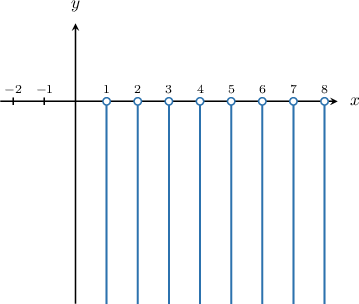

### Example: Sketching Cartesian Products of Special Sets in the Coordinate Plane

#### Question

Sketch a representation of the set $S = \mathbb{Z} \times \mathbb{N}$ in the Cartesian plane.

#### Explanation

The Cartesian product $A \times B$ consists of all ordered pairs whose first coordinate belongs to $A$ and whose second coordinate belongs to $B.$

$$

A\times B = \big\{(a,b) \::\: a\in A,\, b\in B\big\}

$$

In this case, the set

$$

S = \mathbb{Z} \times \mathbb{N}

$$

contains every point in $\mathbb{R}^2$ whose $x$-coordinate is an integer number and whose $y$-coordinate is a natural number.

$$

S= \Big\{ (x,y) \: : \: x\in \mathbb Z,\, y\in \mathbb N\Big\}.

$$

To visualize $S$, consider $S_1\subset S$ containing all points whose $x$-coordinate is any integer number and whose $y$-coordinate equals ${\color{red}{1}}.$

$$

S_1 = \Big\{ (x, {\color{red}{1}}) \: : \: x\in \mathbb Z\Big\}.

$$

We can represent $S_1$ in the plane as follows:

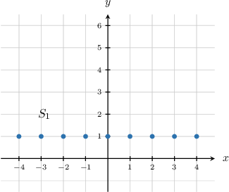

Next, consider $S_2\subset S$ containing all points whose $x$-coordinate is any integer number and whose $y$-coordinate equals ${\color{blue}{2}}.$

$$

S_2 = \Big\{ (x,{\color{blue}{2}}) \: : \: x\in \mathbb Z\Big\}.

$$

We can represent $S_2$ in the plane as follows:

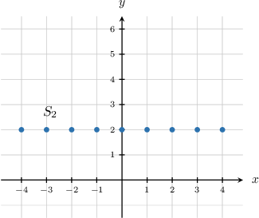

We can create the subsets $S_3,S_4,S_5,\ldots,$ similarly. Our Cartesian product $S$ is the ** of these subsets:

$$

\begin{aligned}𝑆 & =𝑆_{1}∪𝑆_{2}∪𝑆_{3}∪𝑆_{4}∪… \\ & =\underset{𝑖∈ℕ}{⋃}𝑆_{𝑖}\end{aligned}

$$

Therefore, we can visualize $\mathbb{Z} \times \mathbb{N}$ as the set of points in the diagram below.

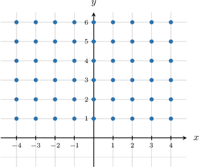

### The Cartesian Product [0,1] x [0,1]

Let's sketch a representation of the set $S= [0,1] \times [0,1]$ in the Cartesian plane.

The Cartesian product $A \times B$ consists of all ordered pairs whose first coordinate belongs to $A$ and whose second coordinate belongs to $B.$

$$

A\times B = \big\{(a,b) \::\: a\in A,\, b\in B\big\}

$$

In this case, the set

$$

S = [0,1] \times [0, 1]

$$

contains every point in $\mathbb{R}^2$ whose $x$-coordinate is any real number in the interval $[0,1]$ and whose $y$-coordinate is any real number in the interval $[0,1].$

$$

S= \big\{ (x,y) \: : \: x\in [0,1],\, y\in [0,1] \big\}.

$$

To visualize $S$, consider $S_0 \subset S$ containing all points whose $x$-coordinate equals ${\color{red}0}$ and whose $y$-coordinate is any real number in the interval $[0,1].$

$$

S_{\color{red}0} = \big\{ ({\color{red}{0}},y) \: : \: y \in [0,1]\big\}

$$

We can represent $S_{\color{red}0}$ in the plane as follows:

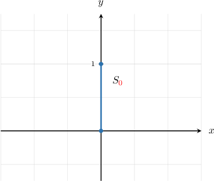

Now, consider a general $S_{\color{blue}{i}} \subset S$ containing all points whose $x$-coordinate equals some ${\color{blue}{i}} \in [0,1]$ and whose $y$-coordinate is any real number in the interval $[0,1].$

$$

S_{\color{blue}{i}} = \big\{ ({\color{blue}{i}},y) \: : \: y \in [0,1]\big\}

$$

For each ${\color{blue}{i}} \in [0,1],$ $S_{\color{blue}{i}}$ is a vertical line segment from the point $({\color{blue}{i}},0)$ to the point $({\color{blue}{i}},1).$

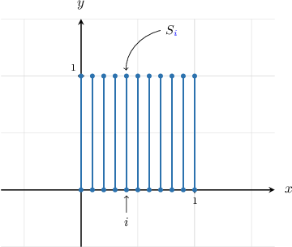

Our Cartesian product $S$ is the union of these subsets over $I = [0,1]{:}$

$$

S = \bigcup_{{\color{blue}i} \in I} S_{\color{blue}i}.

$$

As $\color{blue}i$ runs over $I,$ these line segments sweep the following rectangle that represents the union $\displaystyle \bigcup_{{\color{blue}i} \in I} S_{\color{blue}i}{:}$

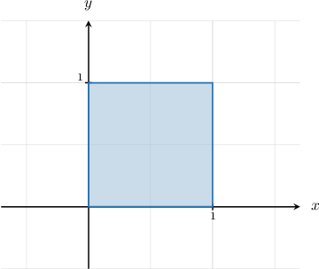

### Example: Visualizing Unions of Uncountable Families of Indexed Sets

#### Question

Sketch a representation of the set $\,\displaystyle \bigcup_{i \in I} X_i$ in the Cartesian plane given that $I = [-1,1] \subset \mathbb{R}$ and $X_i = \{i \} \times [0, \, i^2].$

#### Explanation

Recall that the union of a family of indexed sets consists of those elements that belong to ** set:

$$

\bigcup_{i \in I} A_i = \big\{ x \: : \: x \in A_k \:\:\textrm{for at least one}\:\: k \in I \big\}

$$

Let's now write down one of our indexed sets. For example, if $i=-0.5,$ we have

$$

X_{-0.5} = \{ -0.5 \} \times [0, 0.25] = \big\{ (-0.5,k) \: : \: k \in [0, 0.25] \big\}.

$$

This represents a vertical line segment from the point $(-0.5, 0)$ to the point $(-0.5,0.25)$ in the coordinate plane, as shown below.

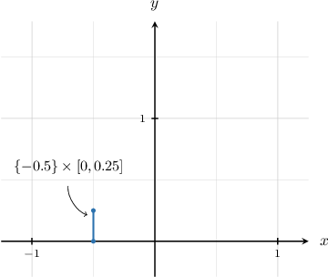

In general,

$$

X_i = \{ i \} \times [0, i^2] = \big\{ (i,k) \: : \: k \in [0, i^2] \big\}

$$

is the vertical line segment from the point $(i,0)$ to the point $(i, i^2).$

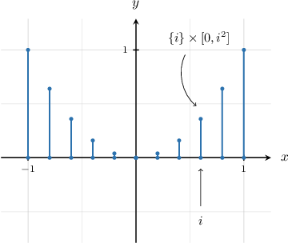

As $i$ runs over $I,$ these line segments sweep the following figure that represents the union $\displaystyle \bigcup_{i \in I} X_i{:}$

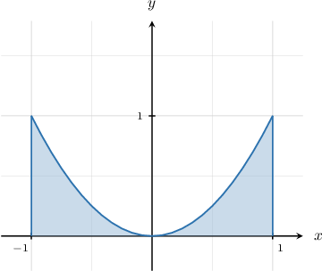

### Example: Visualizing Intersections of Uncountable Families of Indexed Sets

#### Question

Let $I = [0,1] \subset \mathbb{R}$ and $X_i = [-i, 0] \times [-1,1].$ Sketch a representation of $\displaystyle \bigcap_{i \in I} X_i$ in the Cartesian plane.

#### Explanation

Recall that the intersection of a family of indexed sets consists of those elements that belong to ** the sets:

$$

\bigcap_{i \in I} A_i = \big\{ x \: : \: x \in A_k \:\:\textrm{for all}\:\: k \in I \big\}

$$

Let's now write down one of our indexed sets. For example, if $i=0.5,$ we have

$$

X_{0.5} = [-0.5,0] \times [-1, 1] = \big\{ (a,b) \: : \: a \in [-0.5, 0], b \in [-1, 1] \big\}.

$$

This represents a rectangle whose vertices are at $(-0.5, -1),$ $(-0.5, 1),$ $(0, 1),$ and $(0, -1)$ in the coordinate plane, as shown below.

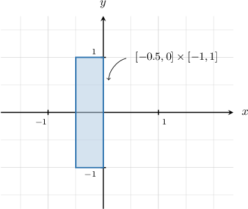

In general,

$$

X_i = [-i, 0] \times [-1,1] = \big\{ (a,b) \: : \: a \in [-i, 0], b \in [-1, 1] \big\}

$$

is the rectangle whose vertices are at $(-i,-1),$ $(-i,1),$ $(0, 1),$ and $(0, -1).$

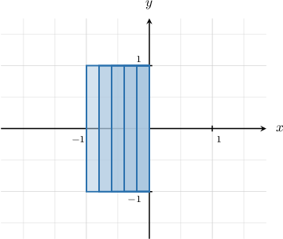

The intersection of all these rectangles is the line segment $\{0\}\times [-1,1]{:}$

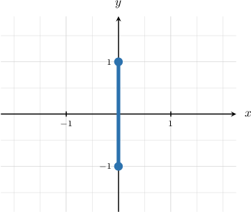
