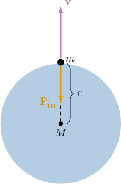

# Modeling Escape Velocity With First-Order ODEs

Source: https://www.mathacademy.com/topics/6699?courseId=154
Topic ID: 6699

## Prerequisites

- [Newton's Second Law](../calculus-i/2722-newton-s-second-law.md)
- [Velocity and Acceleration as Functions of Displacement](./3235-velocity-and-acceleration-as-functions-of-displacement.md)
- [Newton's Law of Universal Gravitation](./6364-newton-s-law-of-universal-gravitation.md)

## Lesson

### Introduction

Consider an object shot straight up from the surface of the Earth, assuming the only force acting on the object is gravity (ignore air resistance and any thrust). How do we model its velocity?

According to Newton's law of gravitation, the magnitude of the inward gravitational force pulling the object toward Earth is

$$

F_\text{in} = G\dfrac{mM}{r^2},

$$

where

- $G$ is the gravitational constant,

- $m$ is the mass of the object,

- $M$ is the mass of the Earth, and

- $r=r(t)$ is the distance between their centers of mass.

At the initial position, when the object is on the surface of the Earth, $r$ equals the radius of the planet $R.$

Then, taking the outward direction as positive and applying Newton's second law, $F=ma,$ where $a$ is the acceleration of the object, we have

$$

\begin{aligned}𝐹 & =−𝐹_{in} \\ 𝑚𝑎 & =−𝐺\frac{𝑚𝑀}{𝑟^{2}} \\ 𝑎 & =−\frac{𝐺𝑀}{𝑟^{2}}.\end{aligned}

$$

In other words, the acceleration is inversely proportional to the square of the distance,

$$

a=\dfrac{k}{r^2},

$$

with constant of proportionality $k=-GM<0.$

To find $k,$ we use the conditions at the Earth's surface. When $r=R$ (Earth's radius), the acceleration is $a=-g$ (where $g$ is standard gravity). Substituting these values:

$$

-g = \dfrac{k}{R^2} \quad\Longrightarrow\quad k = -gR^2.

$$

Substituting $k$ back into our equation for acceleration, we obtain

$$

a = -\dfrac{gR^2}{r^2}.

$$

Now, since $a=\dfrac{\mathrm{d}v}{\mathrm{d}t}$ and $v=\dfrac{\mathrm{d}r}{\mathrm{d}t},$ we can express acceleration as a derivative of velocity with respect to distance $r$ as follows (treating $v$ as a function of $r$ along the trajectory):

$$

\begin{aligned}𝑎 & =\frac{d𝑣}{d𝑡} \\ & =\frac{d𝑣}{d𝑟}⋅\frac{d𝑟}{d𝑡} \\ & =\frac{d𝑣}{d𝑟}⋅𝑣 \\ & =𝑣\,\frac{d𝑣}{d𝑟}.\end{aligned}

$$

Therefore, substituting this result into our equation, we obtain a separable differential equation for the velocity:

$$

v\,\dfrac{\mathrm{d}v}{\mathrm{d}r} = -\dfrac{gR^2}{r^2}.

$$

### Example: Constructing a Radially Projected Model

#### Question

Consider a spherical planet with radius $(6.3\times10^6)\,\textrm{m}$ and surface gravitational acceleration $g = 9.7\,\textrm{m/s}^2.$ Which differential equation best models the velocity $v$ of an object projected radially outward from the planet, where $r$ is the distance from the planet's center to the object? Assume the only force acting on the object is the force due to gravity.

#### Explanation

According to Newton's law of universal gravitation, the magnitude of the inward gravitational force pulling the object toward the planet is

$$

F_\text{in} = G\,\dfrac{mM}{r^2},

$$

where $G$ is the gravitational constant, $m$ is the object's mass, and $M$ is the planet's mass.

Since this is the only force and it acts inward, the resultant force, taking ** as positive, is $F=-F_\textrm{in}.$ Applying Newton's second law, $F=ma,$ where $a$ is the acceleration of the object, we have

$$

\begin{aligned}𝐹 & =−𝐹_{in} \\ 𝑚𝑎 & =−𝐺\,\frac{𝑚𝑀}{𝑟^{2}} \\ 𝑎 & =−\frac{𝐺𝑀}{𝑟^{2}}.\end{aligned}

$$

In other words, the acceleration is inversely proportional to the square of the distance,

$$

a=-\dfrac{k}{r^2},

$$

with constant of proportionality $k=GM > 0.$

When at the surface, $r=(6.3\times10^6)\,\textrm{m},$ the acceleration of the object due to gravity is $a=-9.7\,\textrm{m/s}^2.$ Substituting into our previous equation, we can solve for $k{:}$

$$

\begin{aligned}−9.7 & =−\frac{𝑘}{(6.3×10^{6})^{2}} \\ 𝑘 & =9.7⋅(6.3×10^{6})^{2} \\ & =9.7⋅(6.3)^{2}×(10^{6})^{2} \\ & =384.993×10^{12} \\ & =3.84993×10^{14}\end{aligned}

$$

Substituting back into the equation, we get

$$

a = -\dfrac{3.84993\times10^{14}}{r^2}.

$$

Finally, since acceleration $a$ is the derivative of velocity $v,$ which is the derivative of distance $r,$ we can express acceleration as follows using the chain rule, treating $v$ as a function of $r$ along the trajectory:

$$

\begin{aligned}𝑎 & =\frac{d𝑣}{d𝑡} \\ & =\frac{d𝑟}{d𝑡}⋅\frac{d𝑣}{d𝑟} \\ & =𝑣\frac{d𝑣}{d𝑟}\end{aligned}

$$

Therefore, substituting this result into our equation, we obtain a separable differential equation for the velocity:

$$

v\dfrac{\mathrm{d}v}{\mathrm{d}r} = -\dfrac{3.84993\times10^{14}}{r^2}

$$

### Modeling Velocity of an Object Projected Radially Outward

Now, let's solve the separable differential equation for the velocity:

$$

v\,\dfrac{\mathrm{d}v}{\mathrm{d}r} = -\dfrac{gR^2}{r^2}

$$

Using separation of variables, we have

$$

\begin{aligned}∫𝑣\frac{d𝑣}{d𝑟}\,d𝑟 & =∫(−\frac{𝑔𝑅^{2}}{𝑟^{2}})\,d𝑟 \\ ∫𝑣\,d𝑣 & =−𝑔𝑅^{2}∫\frac{1}{𝑟^{2}}\,d𝑟 \\ \frac{𝑣^{2}}{2} & =−𝑔𝑅^{2}(−\frac{1}{𝑟})+𝐶_{1} \\ 𝑣^{2} & =\frac{2𝑔𝑅^{2}}{𝑟}+𝐶.\end{aligned}

$$

Note that $C=2C_1$ is a constant of integration.

Recall that when the object is at the surface of Earth, $r=R.$ Let $v_0$ be the initial velocity of the object. Applying the initial condition $v(R) = v_0,$ we can solve for $C{:}$

$$

\begin{aligned}𝑣(𝑅)^{2} & =\frac{2𝑔𝑅^{2}}{𝑅}+𝐶 \\ 𝑣_{20}^{} & =2𝑔𝑅+𝐶 \\ 𝐶 & =𝑣_{20}^{}−2𝑔𝑅\end{aligned}

$$

Therefore, the equation for the velocity is

$$

\boxed{v^2 = \dfrac{2gR^2}{r} + v_0^2 - 2gR}.

$$

### Example: Solving a Radially Projected Model for Velocity

#### Question

Consider a spherical planet with radius $(8\times10^5)\,\textrm{m}$ and surface gravitational acceleration $g = 16\,\textrm{m/s}^2.$ Which equation best models the velocity $v$ of an object projected radially outward from the planet's surface with an initial velocity of $(9\times10^{4})\,\textrm{m/s},$ where $r$ is the distance from the planet's center to the object. Assume the only force acting on the object is the force due to gravity.

#### Explanation

Let $R$ be the planet's radius and $g$ be the planet's surface gravitational acceleration.

According to Newton's law of universal gravitation, the magnitude of the inward gravitational force pulling the object toward the planet is

$$

F_\text{in} = G\,\dfrac{mM}{r^2},

$$

where $G$ is the gravitational constant, $m$ is the object's mass, and $M$ is the planet's mass.

Since this is the only force and it acts inward, the resultant force, taking ** as positive, is $F=-F_\textrm{in}.$ Applying Newton's second law, $F=ma,$ where $a$ is the acceleration of the object, we have

$$

\begin{aligned}𝐹 & =−𝐹_{in} \\ 𝑚𝑎 & =−𝐺\,\frac{𝑚𝑀}{𝑟^{2}} \\ 𝑎 & =−\frac{𝐺𝑀}{𝑟^{2}}.\end{aligned}

$$

In other words, the acceleration is inversely proportional to the square of the distance,

$$

a=-\dfrac{k}{r^2},

$$

with constant of proportionality $k=GM > 0.$

When at the surface, $r=R,$ the acceleration of the object due to gravity is $a=-g.$ Substituting into our previous equation, we can solve for $k{:}$

$$

-g = -\dfrac{k}{R^2} \quad\Longrightarrow\quad k = gR^2

$$

Substituting back into the equation, we get

$$

a = -\dfrac{gR^2}{r^2}.

$$

Now, since acceleration $a$ is the derivative of velocity $v,$ which is the derivative of distance $r,$ we can express acceleration as follows using the chain rule, treating $v$ as a function of $r$ along the trajectory:

$$

\begin{aligned}𝑎 & =\frac{d𝑣}{d𝑡} \\ & =\frac{d𝑟}{d𝑡}⋅\frac{d𝑣}{d𝑟} \\ & =𝑣\frac{d𝑣}{d𝑟}\end{aligned}

$$

Substituting this result into our equation, we obtain a separable differential equation for the velocity:

$$

v\dfrac{\mathrm{d}v}{\mathrm{d}r} = -\dfrac{gR^2}{r^2}

$$

Solving using separation of variables, we have

$$

\begin{aligned}∫𝑣\frac{d𝑣}{d𝑟}\,d𝑟 & =∫(−\frac{𝑔𝑅^{2}}{𝑟^{2}})\,d𝑟 \\ ∫𝑣\,d𝑣 & =−𝑔𝑅^{2}∫\frac{1}{𝑟^{2}}\,d𝑟 \\ \frac{𝑣^{2}}{2} & =−𝑔𝑅^{2}(−\frac{1}{𝑟})+𝐶_{1} \\ 𝑣^{2} & =\frac{2𝑔𝑅^{2}}{𝑟}+𝐶.\end{aligned}

$$

Note that $C=2C_1$ is a constant of integration.

Let $v_0$ be the initial velocity of the object. Applying the initial condition $v(R) = v_0,$ we can solve for $C{:}$

$$

\begin{aligned}𝑣(𝑅)^{2} & =\frac{2𝑔𝑅^{2}}{𝑅}+𝐶 \\ 𝑣_{20}^{} & =2𝑔𝑅+𝐶 \\ 𝐶 & =𝑣_{20}^{}−2𝑔𝑅\end{aligned}

$$

Therefore, the equation for the velocity of the object is

$$

v^2 = \dfrac{2gR^2}{r} + v_0^2 - 2gR.

$$

Finally, substituting in the values $R=(8\times10^5),$ $g=16,$ and $v_0=(9\times10^{4}),$ we conclude that the equation for the velocity is

$$

\begin{aligned}𝑣^{2} & =\frac{2⋅16⋅(8×10^{5})^{2}}{𝑟}+(9×10^{4})^{2}−2⋅16⋅(8×10^{5}) \\ & =\frac{2048×10^{10}}{𝑟}+(81×10^{8})−(256×10^{5}) \\ & =\frac{2.048×10^{13}}{𝑟}+(8.1×10^{9})−(0.0256×10^{9}) \\ & =\frac{2.048×10^{13}}{𝑟}+((8.1−0.0256)×10^{9}) \\ & =\frac{2.048×10^{13}}{𝑟}+(8.0744×10^{9}).\end{aligned}

$$

### Modeling Escape Velocity

Recall that the equation for the velocity in our model is

$$

v^2 = \dfrac{2gR^2}{r} + v_0^2 - 2gR.

$$

Now, for an object to *escape* the gravitational pull of the Earth and never go backward, we require two things:

- a positive initial velocity, and

- the velocity to never be zero.

The minimum required initial velocity that allows an object to escape from the surface of the Earth is called the **escape velocity**.

Notice in our velocity equation that the term $\dfrac{2gR^2}{r}$ decreases as $r$ increases. This means the velocity is lowest when $r \to \infty,$ where this term approaches zero.

Therefore, to ensure the velocity never vanishes, the remaining terms must be non-negative:

$$

\begin{aligned}𝑣_{20}^{}−2𝑔𝑅 & ≥0 \\ 𝑣_{20}^{} & ≥2𝑔𝑅 \\ 𝑣_{0} & ≥\sqrt{√2𝑔𝑅}.\end{aligned}

$$

Thus, the minimum velocity of an object to escape the surface of Earth is

$$

\boxed{v_e = \sqrt{2gR}}.

$$

**Note:** On the other hand, if $v_0^2 - 2gR < 0,$ then there will be a critical value of $r$ for which the velocity becomes zero. Hence, the object would stop, the velocity would switch direction, and the object would free-fall, returning to Earth.

### Example: Calculating Escape Velocity

#### Question

Consider a planet with radius $(1.2\times10^{8})\,\textrm{m}$ and surface gravitational acceleration $g = 18.9\,\textrm{m/s}^2.$ What is the escape velocity of an object launched radially outward from the planet's surface? Assume only the force due to gravity acts on the object,

Express your answer in scientific notation, rounding to **** where appropriate.

#### Explanation

Escape velocity is the minimum launch speed from a planet’s surface required to escape its gravity and reach infinity, neglecting all forces except gravity.

Let $R$ be the planet's radius and $g$ be the planet's surface gravitational acceleration.

According to Newton's law of universal gravitation, the magnitude of the inward gravitational force pulling the object toward the planet is

$$

F_\text{in} = G\,\dfrac{mM}{r^2},

$$

where $G$ is the gravitational constant, $m$ is the object's mass, $M$ is the planet's mass, and $r$ is the distance from the planet's center to the object.

Since this is the only force and it acts inward, the resultant force, taking ** as positive, is $F=-F_\textrm{in}.$ Applying Newton's second law, $F=ma,$ where $a$ is the acceleration of the object, we have

$$

\begin{aligned}𝐹 & =−𝐹_{in} \\ 𝑚𝑎 & =−𝐺\,\frac{𝑚𝑀}{𝑟^{2}} \\ 𝑎 & =−\frac{𝐺𝑀}{𝑟^{2}}.\end{aligned}

$$

In other words, the acceleration is inversely proportional to the square of the distance,

$$

a=-\dfrac{k}{r^2},

$$

with constant of proportionality $k=GM > 0.$

When at the surface, $r=R,$ the acceleration of the object due to gravity is $a=-g.$ Substituting into our previous equation, we can solve for $k{:}$

$$

-g = -\dfrac{k}{R^2} \quad\Longrightarrow\quad k = gR^2

$$

Substituting back into the equation, we get

$$

a = -\dfrac{gR^2}{r^2}.

$$

Now, since acceleration $a$ is the derivative of velocity $v,$ which is the derivative of distance $r,$ we can express acceleration as follows using the chain rule, treating $v$ as a function of $r$ along the trajectory:

$$

\begin{aligned}𝑎 & =\frac{d𝑣}{d𝑡} \\ & =\frac{d𝑟}{d𝑡}⋅\frac{d𝑣}{d𝑟} \\ & =𝑣\frac{d𝑣}{d𝑟}\end{aligned}

$$

Substituting this result into our equation, we obtain a separable differential equation for the velocity:

$$

v\dfrac{\mathrm{d}v}{\mathrm{d}r} = -\dfrac{gR^2}{r^2}

$$

Solving using separation of variables, we have

$$

\begin{aligned}∫𝑣\frac{d𝑣}{d𝑟}\,d𝑟 & =∫(−\frac{𝑔𝑅^{2}}{𝑟^{2}})\,d𝑟 \\ ∫𝑣\,d𝑣 & =−𝑔𝑅^{2}∫\frac{1}{𝑟^{2}}\,d𝑟 \\ \frac{𝑣^{2}}{2} & =−𝑔𝑅^{2}(−\frac{1}{𝑟})+𝐶_{1} \\ 𝑣^{2} & =\frac{2𝑔𝑅^{2}}{𝑟}+𝐶.\end{aligned}

$$

Note that $C=2C_1$ is a constant of integration.

Let $v_0$ be the initial velocity of the object. Applying the initial condition $v(R) = v_0,$ we can solve for $C{:}$

$$

\begin{aligned}𝑣(𝑅)^{2} & =\frac{2𝑔𝑅^{2}}{𝑅}+𝐶 \\ 𝑣_{20}^{} & =2𝑔𝑅+𝐶 \\ 𝐶 & =𝑣_{20}^{}−2𝑔𝑅\end{aligned}

$$

Therefore, the equation for the velocity of the object is

$$

v^2 = \dfrac{2gR^2}{r} + v_0^2 - 2gR.

$$

For the object to escape the planet's gravity, we require a positive initial velocity, and for the velocity to never equal zero.

Notice in our velocity equation that as $r \to \infty,$ the expression $\dfrac{2gR^2}{r}$ approaches zero. So, for the velocity to never vanish, we must have that

$$

\begin{aligned}𝑣_{20}^{}−2𝑔𝑅 & ≥0 \\ 𝑣_{20}^{} & ≥2𝑔𝑅 \\ 𝑣_{0} & ≥\sqrt{√2𝑔𝑅}.\end{aligned}

$$

Therefore, the minimum velocity of the object to escape the surface of the planet is

$$

v_e = \sqrt{2gR}.

$$

Finally, substituting in the values $R=(1.2\times10^{8})$ and $g=18.9,$ we conclude that the escape velocity is

$$

\begin{aligned}𝑣_{𝑒} & =\sqrt{√2⋅(1.2×10^{8})⋅18.9} \\ & =\sqrt{√(2⋅1.2⋅18.9)×10^{8}} \\ & =\sqrt{√45.36}×\sqrt{√10^{8}} \\ & ≈(6.73×10^{4})\,m/s,\end{aligned}

$$

rounded to three significant figures.
