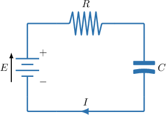
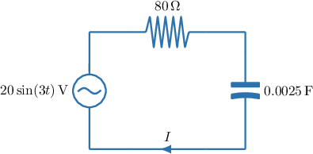
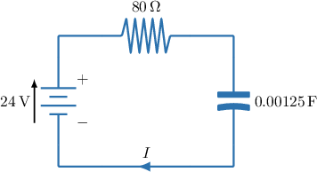
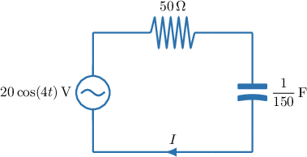

# Modeling RC Circuits With First-Order ODEs

Source: https://www.mathacademy.com/topics/6701?courseId=154
Topic ID: 6701

## Prerequisites

- [Modeling RL Circuits With First-Order ODEs](./1788-modeling-rl-circuits-with-first-order-odes.md)

## Lesson

### Introduction

So far, we've used differential equations to model quantities in circuits containing resistors and inductors. Now, we'll focus on circuits containing resistors and capacitors.

A **capacitor** is a component of an electrical circuit that opposes *changes* in voltage across it by storing energy in an electric field.

The capacitance $C$ (measured in farads) of a capacitor determines how much charge $q$ (measured in coulombs) the capacitor stores for a given voltage, $V_C,$ according to the equation

$$

q = CV_C.

$$

An **RC circuit** is an electrical circuit that contains both a resistor and a capacitor, most commonly in series with a voltage source. An example, with current $I(t),$ is shown below, consisting of a resistance $R,$ in ohms, a capacitance $C,$ in farads, and a source electromotive force (emf) $E,$ in volts.

Let $q(t)$ denote the charge on the capacitor, measured in coulombs, as a function of time $t.$ Can we find a differential equation that best describes the charge $q(t)$ on the capacitor?

First, note that since current is the rate at which electric charge flows, the circuit's current is the derivative of charge with respect to time:

$$

I = \dfrac{\mathrm{d}q}{\mathrm{d}t}

$$

Now, recall Kirchhoff's Voltage law, which states that in a series circuit, the source voltage (EMF) equals the sum of the voltage drops around the loop.

In an RC circuit, there are two voltage drops:

- The resistor *opposes the flow of current*, hence producing a voltage drop $V_R$ proportional to the current, with a constant of proportionality $R{:}$

- The capacitor *opposes changes in voltage*, hence producing a voltage drop $V_C$ related to its charge by $q = CV_C.$ So,

Therefore, by Kirchhoff's Voltage Law, the source voltage $E$ is the sum of the voltage drops: $E = V_R + V_C.$

As a result, the basic equation governing the amount of charge on the capacitor $q$ in the circuit is

$$

E = R\,\dfrac{\mathrm{d}q}{\mathrm{d}t} + \dfrac{q}{C} \quad\Longrightarrow\quad \dfrac{\mathrm{d}q}{\mathrm{d}t} + \dfrac{1}{RC}q = \dfrac{E}{R}.

$$

Note that since $I(t) = \dfrac{\mathrm{d}q}{\mathrm{d}t},$ solving for $q(t)$ also tells us the current in the circuit.

### A Worked Example

Consider a series RC circuit with a source electromotive force (EMF) of $8\sin(2t)\,\textrm{V},$ a resistance of $40\,\Omega,$ and a capacitance of $0.0025\,\textrm{F}.$ Let's find the differential equation governing the amount of charge $q$ (in coulombs) on the capacitor at time $t$ (in seconds).

The current $I,$ measured in amperes, is defined as the rate of flow of charge $q,$ measured in coulombs:

$$

I = \dfrac{\mathrm{d}q}{\mathrm{d}t}

$$

Kirchhoff's voltage law states that in a series circuit, the source voltage (EMF) equals the sum of the voltage drops. In an RC circuit, there are two voltage drops:

- The voltage drop across the resistor is proportional to the current, with a constant of proportionality $R = 40\,\Omega.$ So,

- The voltage drop across the capacitor is related to its charge by $q = CV_C.$ Therefore,

Therefore, by Kirchhoff's voltage law, the differential equation governing the amount of charge $q$ on the capacitor is

$$

8\sin(2t) = 40\,\dfrac{\mathrm{d}q}{\mathrm{d}t} + 400q,

$$

which gives

$$

\dfrac{\mathrm{d}q}{\mathrm{d}t} + 10q = \dfrac{1}{5}\sin(2t).

$$

### Example: Constructing an Equation Governing the Charge in an RC Circuit

#### Question

Find the differential equation governing the amount of charge $q$ (in coulombs) on the capacitor at time $t$ (in seconds) in the circuit given in the diagram above.

**

#### Explanation

The diagram shows a series RC circuit with a source electromotive force (EMF) of $20\sin(3t)\,\textrm{V},$ a resistor of resistance $80\,\Omega,$ and a capacitor of capacitance $0.0025\,\textrm{F}.$

The current $I,$ measured in amperes, is defined as the rate of flow of charge $q,$ measured in coulombs.

$$

I = \dfrac{\textrm d q}{\textrm d t}

$$

Kirchhoff's voltage law states that in a series circuit, the source voltage (EMF) equals the sum of the voltage drops.

In an RC circuit, there are two voltage drops:

- The voltage drop across the resistor is proportional to the current, with a constant of proportionality $R = 80\,\Omega.$ So,

- The voltage drop across the capacitor is related to its charge by $q = CV_C.$ Therefore,

Therefore, by Kirchhoff's voltage law, the differential equation governing the amount of charge $q$ on the capacitor is

$$

20\sin(3t) = 80\,\dfrac{\mathrm{d}q}{\mathrm{d}t} + 400q,

$$

which gives

$$

\dfrac{\mathrm{d}q}{\mathrm{d}t} + 5q = \dfrac{1}{4}\sin(3t).

$$

### Steady-State Charges for Constant Voltage RC Circuits

In a first-order linear differential equation, the solution naturally splits into a transient term that decays over time and a steady-state term that remains as $t \to \infty$.

In an RC circuit with a constant electromotive force (EMF), this steady-state value corresponds to the charge the capacitor approaches as $t \to \infty,$ regardless of the initial charge. Physically, this represents the maximum charge the capacitor can store under a constant applied voltage.

To demonstrate how to identify the steady-state charge directly from the general solution of an RC circuit model, suppose the charge $q(t),$ in coulombs, in a series RC circuit is governed by the differential equation

$$

\dfrac{\mathrm{d}q}{\mathrm{d}t} + 12q = \dfrac{7}{10}.

$$

This equation is a first-order linear equation with constant coefficients. To find the general solution, we must sum the complementary and particular solutions.

- To find the complementary solution $q_c,$ we solve the corresponding homogeneous equation, given by Solving using an integration technique, such as separation of variables, we obtain the complementary solution where $A$ is a constant of integration.

- Next, we find the particular solution. Note that the right-hand side of the inhomogeneous equation is a polynomial of degree $0.$ So, we assume that the particular solution is also a polynomial of degree $0,$ i.e., To find the value of $\alpha,$ we substitute $q_p = \alpha$ and $\dfrac{\mathrm{d}q_p}{\mathrm{d}t} = (\alpha)' = 0$ into the inhomogeneous equation: Therefore, the particular solution is $q_p(t) = \dfrac{7}{120}.$

Now, since the general solution is given by the sum of the complementary solution and the particular solution, the general solution in our case is

$$

q(t) = q_c(t) + q_p(t) = Ae^{-12t} + \dfrac{7}{120}.

$$

Note the following:

- The quantity $q_c = Ae^{-12t}$ is the *transient charge*, since it goes to zero as $t \to \infty.$

- The constant $q_p = \dfrac{7}{120}$ is the *steady-state charge*. As $t\to\infty,$ the charge $q$ approaches the value of the steady-state charge.

Therefore, the steady-state charge (the charge the capacitor approaches as time increases) is ${\dfrac{7}{120}}$ coulombs.

### Example: Solving an Equation Governing the Charge in an RC Circuit: Constant EMF

#### Question

Find an equation for the charge $q$ (in coulombs) on the capacitor in the circuit given in the diagram above, expressing your answer in terms of time $t$ (in seconds) ****, and given that the initial charge is $\dfrac{1}{50}\,\textrm{C}.$

**

#### Explanation

The current $I,$ measured in amperes, is defined as the rate of flow of charge $q,$ measured in coulombs.

$$

I = \dfrac{\textrm d q}{\textrm d t}

$$

Kirchhoff's voltage law states that in a series circuit, the source voltage (EMF) equals the sum of the voltage drops.

In an RC circuit, there are two voltage drops:

- The voltage drop across the resistor is proportional to the current, with a constant of proportionality $R = 80\,\Omega.$So,

- The voltage drop across the capacitor is related to its charge by $q = CV_C.$ Therefore,

Therefore, by Kirchhoff's voltage law, the differential equation governing the amount of charge $q$ on the capacitor is

$$

24 = 80\,\dfrac{\mathrm{d}q}{\mathrm{d}t} + 800q,

$$

which gives

$$

\dfrac{\mathrm{d}q}{\mathrm{d}t} + 10q = \dfrac3{10}.

$$

This is a first-order linear equation with constant coefficients. So, to find the general solution, we must find the sum of the complementary and particular solutions.

- To find the complementary solution $q_c,$ we solve the corresponding homogeneous equation, given by Solving using an integration technique, such as separation of variables, we obtain the complementary solution where $A$ is a constant of integration.

- Next, we find the particular solution. Note that the right-hand side of the inhomogeneous equation is a polynomial of degree $0.$ So, we assume that the particular solution is also a polynomial of degree $0,$ i.e., To find the value of $\alpha,$ we substitute $q_p = \alpha$ and $\dfrac{\mathrm{d}q_p}{\mathrm{d}t} = (\alpha)' = 0$ into the inhomogeneous equation: Therefore, the particular solution is $q_p(t) = \dfrac3{100}.$

Now, since the general solution is given by the sum of the complementary solution and the particular solution, the general solution in our case is

$$

q(t) = q_c(t) + q_p(t) = Ae^{-10t} + \dfrac3{100}.

$$

We're told that the circuit starts with an initial charge of $\dfrac{1}{50}\,\textrm{C}$ on the capacitor. So, we can apply the initial condition $q(0) = \dfrac{1}{50},$ and solve for $A{:}$

$$

\begin{aligned}𝑞(0) & =\frac{1}{50} \\ 𝐴𝑒^{−10(0)}+\frac{3}{100} & =\frac{1}{50} \\ 𝐴 & =−\frac{1}{100}\end{aligned}

$$

Therefore, we have the following expression for $q(t){:}$

$$

\begin{aligned}𝑞(𝑡) & =−\frac{1}{100}𝑒^{−10𝑡}+\frac{3}{100} \\ & =\frac{1}{100}(3−𝑒^{−10𝑡})\end{aligned}

$$

Note the following:

- The quantity $q_c = -\dfrac1{100}e^{-10t}$ is the **, since it goes to zero as $t \to \infty.$

- The constant $q_p = \dfrac3{100}$ is the **. As $t\to\infty,$ the charge $q$ approaches the value of the steady-state charge.

### Steady-State Charges for Sinusoidal Voltage RC Circuits

In a first-order linear RC circuit driven by a sinusoidal voltage, the solution consists of a transient charge, which decays over time, and a steady-state charge, which oscillates with the same frequency as the input.

As time increases, the transient charge vanishes, leaving a steady-state charge that oscillates periodically and is independent of the initial condition.

To demonstrate, let's find the amplitude of the steady-state charge in the RC circuit below.

The diagram shows a series RC circuit with a source electromotive force (EMF) of $20\cos(4t)\,\textrm{V},$ a resistor with resistance $50\,\Omega,$ and a capacitor of capacitance $\dfrac{1}{150}\,\textrm{F}.$

The current $I,$ measured in amperes, is defined as the rate of flow of charge $q,$ measured in coulombs:

$$

I = \dfrac{\textrm d q}{\textrm d t}

$$

Kirchhoff's voltage law states that in a series circuit, the source voltage (EMF) equals the sum of the voltage drops.

In an RC circuit, there are two voltage drops:

- The voltage drop across the resistor is proportional to the current, with a constant of proportionality $R = 50\,\Omega.$ So,

- The voltage drop across the capacitor is related to its charge by $q = CV_C.$ Therefore,

Therefore, by Kirchhoff's voltage law, the differential equation governing the amount of charge $q$ on the capacitor is

$$

20\cos(4t) = 50\,\dfrac{\mathrm{d}q}{\mathrm{d}t} + 150q,

$$

which gives

$$

\dfrac{\mathrm{d}q}{\mathrm{d}t} + 3q = \dfrac{2}{5}\cos(4t).

$$

This is a first-order linear equation with constant coefficients. So, to find the general solution, we must find the sum of the complementary and particular solutions.

- To find the complementary solution $q_c,$ we solve the corresponding homogeneous equation, given by Solving using an integration technique, such as separation of variables, we obtain the complementary solution where $A$ is a constant of integration.

- Next, we find the particular solution. Note that the right-hand side of the inhomogeneous equation is sinusoidal with argument $4t.$ So, we assume that the particular solution is also sinusoidal with argument $4t,$ i.e., To find the values of $\alpha$ and $\beta,$ we substitute into the inhomogeneous equation and group like terms on the left-hand side: Equating the coefficients, we get the following system of equations: Solving this system gives $\alpha = \dfrac{6}{125}$ and $\beta = \dfrac{8}{125}.$ Therefore, the particular solution is

Now, since the general solution is given by the sum of the complementary solution and the particular solution, the general solution in our case is

$$

q(t) = q_c(t) + q_p(t) = Ae^{-3t} + \dfrac{6}{125}\cos(4t) + \dfrac{8}{125}\sin(4t).

$$

Note the following:

- The quantity $q_c(t) = Ae^{-3t}$ is the *transient charge*, since it goes to zero as $t \to \infty.$

- The function $q_p(t) = \dfrac{6}{125}\cos(4t) + \dfrac{8}{125}\sin(4t)$ is the *steady-state charge*. It governs the charge's long-term behavior.

Therefore, as $t\to\infty,$ we have

$$

q(t) \approx q_p(t) = \dfrac{6}{125}\cos(4t) + \dfrac{8}{125}\sin(4t).

$$

Finally, the amplitude of the steady-state charge is given by

$$

\sqrt{\left(\dfrac{6}{125}\right)^2 + \left(\dfrac{8}{125}\right)^2} =0.08\,\textrm{coulombs}.

$$

This amplitude represents the maximum magnitude of the oscillating steady-state charge on the capacitor.

### Example: Solving an Equation Governing the Charge in an RC Circuit: Sinusoidal EMF

#### Question

Find the amplitude of the steady-state charge for the RC circuit shown above, in coulombs, rounded to two decimal places.

**

#### Explanation

The diagram shows a series RC circuit with a source electromotive force (EMF) of $90\cos(6t)\,\textrm{V},$ a resistor with resistance $30\,\Omega,$ and a capacitor with capacitance $\dfrac1{150}\,\textrm{F}.$

The current $I,$ measured in amperes, is defined as the rate of flow of charge $q,$ measured in coulombs.

$$

I = \dfrac{\textrm d q}{\textrm d t}

$$

Kirchhoff's voltage law states that in a series circuit, the source voltage (EMF) equals the sum of the voltage drops.

In an RC circuit, there are two voltage drops:

- The voltage drop across the resistor is proportional to the current, with a constant of proportionality $R = 30\,\Omega.$ So,

- The voltage drop across the capacitor is related to its charge by $q = CV_C.$ Therefore,

Therefore, by Kirchhoff's voltage law, the differential equation governing the amount of charge $q$ on the capacitor is

$$

90\cos(6t) = 30\,\dfrac{\mathrm{d}q}{\mathrm{d}t} + 150q,

$$

which gives

$$

\dfrac{\mathrm{d}q}{\mathrm{d}t} + 5q = 3\cos(6t).

$$

This is a first-order linear equation with constant coefficients. So, to find the general solution, we must find the sum of the complementary and particular solutions.

- To find the complementary solution $q_c,$ we solve the corresponding homogeneous equation, given by Solving using an integration technique, such as separation of variables, we obtain the complementary solution where $A$ is a constant of integration.

- Next, we find the particular solution. Note that the right-hand side of the inhomogeneous equation is sinusoidal with argument $6t.$ So, we assume that the particular solution is also sinusoidal with argument $6t,$ i.e., To find the values of $\alpha$ and $\beta,$ we substitute into the inhomogeneous equation and group like terms on the left-hand side: Equating the coefficients, we get the following system of equations: Solving this system gives $\alpha = \dfrac{15}{61}, \beta = \dfrac{18}{61}.$ Therefore, the particular solution is

Now, since the general solution is given by the sum of the complementary solution and the particular solution, the general solution in our case is

$$

q(t) = q_c(t) + q_p(t) = Ae^{-5t} + \dfrac{15}{61}\cos(6t) + \dfrac{18}{61}\sin(6t).

$$

Note the following:

- The quantity $q_c(t) = Ae^{-5t}$ is the **, since it goes to zero as $t \to \infty.$

- The function $q_p(t) = \dfrac{15}{61}\cos(6t) + \dfrac{18}{61}\sin(6t)$ is the **. It governs the charge's long-term behavior.

Therefore, as $t\to\infty,$ we have

$$

q(t)\approx q_p(t) = \dfrac{15}{61}\cos(6t) + \dfrac{18}{61}\sin(6t).

$$

Finally, the amplitude of the steady-state charge, in coulombs, is given by

$$

\sqrt{\left(\dfrac{15}{61}\right)^2 + \left(\dfrac{18}{61}\right)^2} \approx 0.38,

$$

rounded to two decimal places.
