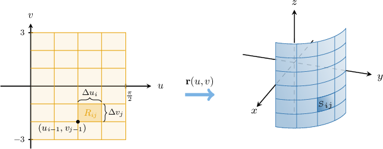
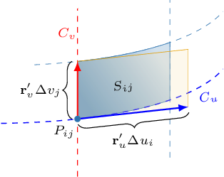

# Areas of Parametric Surfaces

Source: https://www.mathacademy.com/topics/1790?courseId=155
Topic ID: 1790

## Prerequisites

- [Finding Areas Using the Cross Product](../integrated-math-iii-honors/1299-finding-areas-using-the-cross-product.md)
- [Properties of Double Integrals](../mathematical-methods-for-the-physical-sciences-i/2000-properties-of-double-integrals.md)
- [Tangent Planes to Parametric Surfaces](./3373-tangent-planes-to-parametric-surfaces.md)

## Lesson

### Introduction

If a surface is parametrized by a differentiable vector-valued function

$$

\mathbf{r}(u,v) = \big\langle x(u,v), \: y(u,v), \: z(u,v) \big\rangle

$$

where $(u,v) \in D\subseteq \mathbb R^2,$ then the **fundamental vector product** of the surface is defined as

$$

\begin{aligned}𝐢 & 𝐣 & 𝐤 \\ \frac{𝜕𝑥}{𝜕𝑢} & \frac{𝜕𝑦}{𝜕𝑢} & \frac{𝜕𝑧}{𝜕𝑢} \\ \frac{𝜕𝑥}{𝜕𝑣} & \frac{𝜕𝑦}{𝜕𝑣} & \frac{𝜕𝑧}{𝜕𝑣}\end{aligned}

$$

In particular, if the fundamental vector product of a surface is nonzero at a point $(x_0, y_0),$ then it defines a normal vector to the surface at this point.

Let's find the fundamental vector product of the surface generated by the vector-valued function

$$

\mathbf{r}(u,v) = \big\langle \sqrt{2}\cos{u}, \: \sqrt{2}\sin{u}, \: v \big\rangle.

$$

We first compute the tangent vectors to the grid curves:

$$

\begin{aligned}𝐫_{′𝑢}^{} & =⟨\frac{𝜕𝑥}{𝜕𝑢},\,\frac{𝜕𝑦}{𝜕𝑢},\,\frac{𝜕𝑧}{𝜕𝑢}⟩ \\ & =⟨\frac{𝜕}{𝜕𝑢}(\sqrt{√2}cos⁡𝑢),\,\frac{𝜕}{𝜕𝑢}(\sqrt{√2}sin⁡𝑢),\,\frac{𝜕}{𝜕𝑢}(𝑣)⟩ \\ & =⟨−\sqrt{√2}sin⁡𝑢,\,\sqrt{√2}cos⁡𝑢,\,0⟩ \\ 𝐫_{′𝑣}^{} & =⟨\frac{𝜕𝑥}{𝜕𝑣},\,\frac{𝜕𝑦}{𝜕𝑣},\,\frac{𝜕𝑧}{𝜕𝑣}⟩ \\ & =⟨\frac{𝜕}{𝜕𝑣}(\sqrt{√2}cos⁡𝑢),\,\frac{𝜕}{𝜕𝑣}(\sqrt{√2}sin⁡𝑢),\,\frac{𝜕}{𝜕𝑣}(𝑣)⟩ \\ & =⟨0,\,0,\,1⟩\end{aligned}

$$

Therefore, the fundamental vector product is

$$

\begin{aligned}𝐫_{′𝑢}^{}×𝐫_{′𝑣}^{} & =\begin{aligned}𝐢 & 𝐣 & 𝐤 \\ −\sqrt{√2}sin⁡𝑢 & \sqrt{√2}cos⁡𝑢 & 0 \\ 0 & 0 & 1\end{aligned} \\ & =⟨\begin{aligned}\sqrt{√2}cos⁡𝑢 & 0 \\ 0 & 1\end{aligned},\,−\begin{aligned}−\sqrt{√2}sin⁡𝑢 & 0 \\ 0 & 1\end{aligned},\,\begin{aligned}−\sqrt{√2}sin⁡𝑢 & \sqrt{√2}cos⁡𝑢 \\ 0 & 0\end{aligned}⟩ \\ & =⟨\sqrt{√2}cos⁡𝑢,\,\sqrt{√2}sin⁡𝑢,\,0⟩.\end{aligned}

$$

### Example: Calculating the Fundamental Vector Product of a Parametric Surface

#### Question

Find the fundamental vector product of the surface generated by the vector-valued function $\mathbf{r}(u,v) = \big\langle u^2, \: v^2, \: u+v \big\rangle.$

#### Explanation

For a surface with parametrization $\mathbf r (u,v),$ the fundamental vector product is defined as $\mathbf{r}'_u \times \mathbf{r}'_v.$

We first compute the tangent vectors to the grid curves:

$$

\begin{aligned}𝐫_{′𝑢}^{} & =⟨\frac{𝜕𝑥}{𝜕𝑢},\,\frac{𝜕𝑦}{𝜕𝑢},\,\frac{𝜕𝑧}{𝜕𝑢}⟩ \\ & =⟨\frac{𝜕}{𝜕𝑢}(𝑢^{2}),\,\frac{𝜕}{𝜕𝑢}(𝑣^{2}),\,\frac{𝜕}{𝜕𝑢}(𝑢+𝑣)⟩ \\ & =⟨2𝑢,\,0,\,1⟩ \\ 𝐫_{′𝑣}^{} & =⟨\frac{𝜕𝑥}{𝜕𝑣},\,\frac{𝜕𝑦}{𝜕𝑣},\,\frac{𝜕𝑧}{𝜕𝑣}⟩ \\ & =⟨\frac{𝜕}{𝜕𝑣}(𝑢^{2}),\,\frac{𝜕}{𝜕𝑣}(𝑣^{2}),\,\frac{𝜕}{𝜕𝑣}(𝑢+𝑣)⟩ \\ & =⟨0,\,2𝑣,\,1⟩\end{aligned}

$$

Therefore, the fundamental vector product is

$$

\begin{aligned}𝐫_{′𝑢}^{}×𝐫_{′𝑣}^{} & =\begin{aligned}𝐢 & 𝐣 & 𝐤 \\ 2𝑢 & 0 & 1 \\ 0 & 2𝑣 & 1\end{aligned} \\ & =⟨\begin{aligned}0 & 1 \\ 2𝑣 & 1\end{aligned},\,−\begin{aligned}2𝑢 & 1 \\ 0 & 1\end{aligned},\,\begin{aligned}2𝑢 & 0 \\ 0 & 2𝑣\end{aligned}⟩ \\ & =⟨−2𝑣,\,−2𝑢,\,4𝑢𝑣⟩.\end{aligned}

$$

### Surface Areas of Parametric Surfaces

Let $S$ be a surface parametrized by a differentiable vector-valued function

$$

\mathbf{r}(u,v) = \big\langle x(u,v), \: y(u,v), \: z(u,v) \big\rangle

$$

defined over a region $D$ in the $uv$-plane. If each point on $S$ corresponds to exactly one point in $D,$ then we can calculate the surface area of $S$ as

$$

\iint\limits_{S} \: \textrm{d}S = \iint\limits_{D} \| \mathbf{r}'_ u \times \mathbf{r}'_v \| \: \textrm{d}A,

$$

where $\mathbf{r}'_ u \times \mathbf{r}'_v$ is the fundamental vector product of the surface.

For example, let's calculate the surface area of the parametric surface

$$

\mathbf{r}(u,v) = \big\langle u^2, \:u-v, \: v \big\rangle,

$$

that corresponds to $0 \leq u \leq 2$ and $0 \leq v \leq 2.$

We first compute the tangent vectors to the grid curves:

$$

\begin{aligned}𝐫_{′𝑢}^{}=⟨2𝑢,\,1,\,0⟩,\,𝐫_{′𝑣}^{}=⟨0,\,−1,\,1⟩\end{aligned}

$$

Now, the fundamental vector product is

$$

\begin{aligned}𝐫_{′𝑢}^{}×𝐫_{′𝑣}^{} & =\begin{aligned}𝐢 & 𝐣 & 𝐤 \\ 2𝑢 & 1 & 0 \\ 0 & −1 & 1\end{aligned}=⟨1,\,−2𝑢,\,−2𝑢⟩,\end{aligned}

$$

and its magnitude is

$$

\begin{aligned}𝐫_{′𝑢}^{}×𝐫_{′𝑣}^{} & =∥⟨1,\,−2𝑢,\,−2𝑢⟩∥ \\ & =\sqrt{√1^{2}+(−2𝑢)^{2}+(−2𝑢)^{2}} \\ & =\sqrt{√1+4𝑢^{2}+4𝑢^{2}} \\ & =\sqrt{√1+8𝑢^{2}}.\end{aligned}

$$

Therefore, the surface area is given by

$$

\begin{aligned}\underset{𝑆}{∬}\,d𝑆=\underset{𝐷}{∬}𝐫_{′𝑢}^{}×𝐫_{′𝑣}^{}d𝐴=\underset{𝐷}{∬}\sqrt{√1+8𝑢^{2}}\,d𝐴.\end{aligned}

$$

### Example: Finding an Integral That Represents the Surface Area of a Parametric Surface

#### Question

$$

𝐴𝐴𝐴𝐴𝐴𝐴𝐴𝐴

$$

The integral above gives the surface area of the parametric surface $\mathbf{r}(u,v) = \big\langle u, \: v, \: u^3-v \big\rangle$ for $0 \leq u \leq 3$ and $0 \leq v \leq 2.$ What is the missing expression?

#### Explanation

For a surface $S$ with parametrization $\mathbf r (u,v)$ for $(u,v)\in D,$ the surface area of $S$ is given by

$$

\iint\limits_S \,\textrm d S = \iint\limits_D \left\| \mathbf{r}'_u \times \mathbf{r}'_v \right\| \text{d}A.

$$

We first compute the tangent vectors to the grid curves:

$$

\begin{aligned}𝐫_{′𝑢}^{} & =⟨\frac{𝜕𝑥}{𝜕𝑢},\,\frac{𝜕𝑦}{𝜕𝑢},\,\frac{𝜕𝑧}{𝜕𝑢}⟩ \\ & =⟨\frac{𝜕}{𝜕𝑢}(𝑢),\,\frac{𝜕}{𝜕𝑢}(𝑣),\,\frac{𝜕}{𝜕𝑢}(𝑢^{3}−𝑣)⟩ \\ & =⟨1,\,0,\,3𝑢^{2}⟩ \\ 𝐫_{′𝑣}^{} & =⟨\frac{𝜕𝑥}{𝜕𝑣},\,\frac{𝜕𝑦}{𝜕𝑣},\,\frac{𝜕𝑧}{𝜕𝑣}⟩ \\ & =⟨\frac{𝜕}{𝜕𝑣}(𝑢),\,\frac{𝜕}{𝜕𝑣}(𝑣),\,\frac{𝜕}{𝜕𝑣}(𝑢^{3}−𝑣)⟩ \\ & =⟨0,\,1,\,−1⟩\end{aligned}

$$

Now, the fundamental vector product is

$$

\begin{aligned}𝐫_{′𝑢}^{}×𝐫_{′𝑣}^{} & =\begin{aligned}𝐢 & 𝐣 & 𝐤 \\ 1 & 0 & 3𝑢^{2} \\ 0 & 1 & −1\end{aligned} \\ & =⟨\begin{aligned}0 & 3𝑢^{2} \\ 1 & −1\end{aligned},\,−\begin{aligned}1 & 3𝑢^{2} \\ 0 & −1\end{aligned},\,\begin{aligned}1 & 0 \\ 0 & 1\end{aligned}⟩ \\ & =⟨−3𝑢^{2},\,1,\,1⟩,\end{aligned}

$$

and its magnitude is

$$

\begin{aligned}𝐫_{′𝑢}^{}×𝐫_{′𝑣}^{} & =⟨−3𝑢^{2},\,1,\,1⟩ \\ & =\sqrt{√(3𝑢^{2})^{2}+(1)^{2}+(1)^{2}} \\ & =\sqrt{√9𝑢^{4}+2}.\end{aligned}

$$

Therefore, the surface area is

$$

\begin{aligned}\underset{𝑆}{∬}\,d𝑆 & =\underset{𝐷}{∬}𝐫_{′𝑢}^{}×𝐫_{′𝑣}^{}d𝐴 \\ & =\underset{𝐷}{∬}\sqrt{√9𝑢^{4}+2}\,d𝐴.\end{aligned}

$$

### Example: Finding the Surface Area of a Parametric Surface

#### Question

Find the surface area of the parametric surface defined by the equations

$$

x = u, \quad y = v, \quad z = 1 - u - v

$$

for $-1 \leq u \leq 1$ and $0 \leq v \leq 3.$

#### Explanation

For a surface $S$ with parametrization $\mathbf r (u,v)$ for $(u,v)\in D,$ the surface area of $S$ is given by

$$

\iint\limits_S \,\textrm d S = \iint\limits_D \left\| \mathbf{r}'_u \times \mathbf{r}'_v \right\| \text{d}A.

$$

In vector form, our surface has the equation

$$

\mathbf{r}(u,v) = \left\langle u, \: v, \: 1 - u - v \right\rangle.

$$

We first compute the tangent vectors to the grid curves:

$$

\begin{aligned}𝐫_{′𝑢}^{} & =⟨\frac{𝜕𝑥}{𝜕𝑢},\,\frac{𝜕𝑦}{𝜕𝑢},\,\frac{𝜕𝑧}{𝜕𝑢}⟩ \\ & =⟨\frac{𝜕}{𝜕𝑢}(𝑢),\,\frac{𝜕}{𝜕𝑢}(𝑣),\,\frac{𝜕}{𝜕𝑢}(1−𝑢−𝑣)⟩ \\ & =⟨1,\,0,\,−1⟩ \\ 𝐫_{′𝑣}^{} & =⟨\frac{𝜕𝑥}{𝜕𝑣},\,\frac{𝜕𝑦}{𝜕𝑣},\,\frac{𝜕𝑧}{𝜕𝑣}⟩ \\ & =⟨\frac{𝜕}{𝜕𝑣}(𝑢),\,\frac{𝜕}{𝜕𝑣}(𝑣),\,\frac{𝜕}{𝜕𝑣}(1−𝑢−𝑣)⟩ \\ & =⟨0,\,1,\,−1⟩\end{aligned}

$$

Now, the fundamental vector product is

$$

\begin{aligned}𝐫_{′𝑢}^{}×𝐫_{′𝑣}^{} & =\begin{aligned}𝐢 & 𝐣 & 𝐤 \\ 1 & 0 & −1 \\ 0 & 1 & −1\end{aligned} \\ & =⟨\begin{aligned}0 & −1 \\ 1 & −1\end{aligned},\,−\begin{aligned}1 & −1 \\ 0 & −1\end{aligned},\,\begin{aligned}1 & 0 \\ 0 & 1\end{aligned}⟩ \\ & =⟨1,\,1,\,1⟩,\end{aligned}

$$

and its magnitude is

$$

\begin{aligned}𝐫_{′𝑢}^{}×𝐫_{′𝑣}^{} & =∥⟨1,\,1,\,1⟩∥ \\ & =\sqrt{√1^{2}+1^{2}+1^{2}} \\ & =\sqrt{√1+1+1} \\ & =\sqrt{√3}.\end{aligned}

$$

Next, let's denote

$$

D = \{ (u,v) \: : \: -1 \leq u \leq 1, \: 0 \leq v \leq 3\}.

$$

Then, the surface area is

$$

\begin{aligned}\underset{𝑆}{∬}\,d𝑆 & =\underset{𝐷}{∬}𝐫_{′𝑢}^{}×𝐫_{′𝑣}^{}d𝐴 \\ & =\underset{𝐷}{∬}\sqrt{√3}\,d𝐴 \\ & =\sqrt{√3}\underset{𝐷}{∬} \,d𝐴 \\ & =\sqrt{√3}⋅Area(𝐷) \\ & =\sqrt{√3}⋅2⋅3 \\ & =6\sqrt{√3}.\end{aligned}

$$

### Intuition Behind the Formula

Let $S$ be a surface parametrized by a differentiable vector-valued function

$$

\mathbf{r}(u,v) = \big\langle x(u,v), \: y(u,v), \: z(u,v) \big\rangle

$$

defined over a region $D$ in the $uv$-plane. We wish to show that the surface area of $S$ is given by

$$

\iint\limits_S \,\textrm d S = \iint\limits_D \left\| \mathbf{r}'_u \times \mathbf{r}'_v \right\| \text{d}A.

$$

Let's consider a partition $P_1 \times P_2$ of the domain $D,$ where

$$

P_1 = \left\{u_0,u_1,\ldots, u_m\right\},\qquad P_2 = \left\{v_0,v_1,\ldots, v_n\right\},

$$

and

$$

\Delta u_i = u_{i} - u_{i-1}, \qquad \Delta v_j = v_{j} - v_{j-1}.

$$

This partition generates a curved grid on the surface, as shown below.

Now consider a "patch" $S_{ij}$ of the surface that corresponds to the rectangle $R_{ij}$ of the partition. How can we approximate the area of this small patch?

First, let's make a bigger picture of $S_{ij}.$

Here, we assume that the grid curves ${\color{blue}C_u}$ with equation $\mathbf{r}(u,v_j)$ and ${\color{red}C_v}$ with equation $\mathbf{r}(u_i,v)$ pass through the point $P_{ij}$ with position vector $\mathbf{r}(u_i,v_j).$

We now proceed to find a parallelogram whose area is approximately equal to the area of our patch.

- The vector that connects the bottom-left and bottom-right vertices of our patch is given by Using the fact that a difference quotient can be approximated using a partial derivative, this vector is approximately equal to which is the vector that spans the bottom edge of the parallelogram shown in the diagram.

- Similarly, the vector that connects the bottom-left and top-left vertices of our patch is given by This vector is approximately equal to which is the vector that spans the left edge of the parallelogram shown in the diagram.

As a result, we can approximate the area of $S_{ij}$ by the area of the parallelogram spanned by these two vectors. The area of such a parallelogram equals the magnitude of the corresponding cross-product:

$$

\begin{aligned}𝐴(𝑆_{𝑖𝑗}) & ≈‖𝐫_{′𝑢}^{}(𝑢_{𝑖},𝑣_{𝑗})Δ𝑢_{𝑖}×𝐫_{′𝑣}^{}(𝑢_{𝑖},𝑣_{𝑗})Δ𝑣_{𝑗}‖ \\ & =‖𝐫_{′𝑢}^{}(𝑢_{𝑖},𝑣_{𝑗})×𝐫_{′𝑣}^{}(𝑢_{𝑖},𝑣_{𝑗})‖\,Δ𝑢_{𝑖}Δ𝑣_{𝑗}\end{aligned}

$$

Adding up the approximations for all patches, we get

$$

\begin{aligned}𝐴(𝑆) & ≈\underset{\underset{𝑖=0}{∑}}{\overset{}{𝑚}}\underset{\underset{𝑗=0}{∑}}{\overset{}{𝑛}}𝐴(𝑆_{𝑖𝑗}) \\ & =\underset{\underset{𝑖=0}{∑}}{\overset{}{𝑚}}\underset{\underset{𝑗=0}{∑}}{\overset{}{𝑛}}‖𝐫_{′𝑢}^{}(𝑢_{𝑖},𝑣_{𝑗})×𝐫_{′𝑣}^{}(𝑢_{𝑖},𝑣_{𝑗})‖\,Δ𝑢_{𝑖}Δ𝑣_{𝑗}.\end{aligned}

$$

This is a Riemann sum, and the closer the points $P_{ij}$ are to each other, the better our approximation will be. So, in the limit as $m,n\to\infty$ (or $\Delta u_i, \Delta v_j \to 0),$ we have

$$

\begin{aligned}\underset{𝑆}{∬}\,d𝑆 & =\underset{𝐷}{∬}‖𝐫_{′𝑢}^{}×𝐫_{′𝑣}^{}‖\,d𝑢d𝑣 \\ & =\underset{𝐷}{∬}‖𝐫_{′𝑢}^{}×𝐫_{′𝑣}^{}‖\,d𝐴.\end{aligned}

$$
