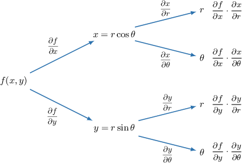

# The Multivariable Chain Rule With Polar Coordinates

Source: https://www.mathacademy.com/topics/1942?courseId=155
Topic ID: 1942

## Prerequisites

- [Cylindrical Polar Coordinates](./1981-cylindrical-polar-coordinates.md)
- [Spherical Polar Coordinates](./1982-spherical-polar-coordinates.md)
- [The Multivariable Chain Rule](../mathematical-methods-for-the-physical-sciences-i/3173-the-multivariable-chain-rule.md)

## Lesson

### Introduction

Given a function $f(x,y),$ how do we calculate the partial derivatives $f_r$ and $f_\theta,$ where $(r,\theta)$ are plane polar coordinates?

To do this, we can use the multivariable chain rule. First, let's write down our tree diagram.

From the tree diagram, we can see that

$$

\begin{aligned}\frac{𝜕𝑓}{𝜕𝑟} & =\frac{𝜕𝑓}{𝜕𝑥}⋅\frac{𝜕𝑥}{𝜕𝑟}+\frac{𝜕𝑓}{𝜕𝑦}⋅\frac{𝜕𝑦}{𝜕𝑟} \\ \frac{𝜕𝑓}{𝜕𝜃} & =\frac{𝜕𝑓}{𝜕𝑥}⋅\frac{𝜕𝑥}{𝜕𝜃}+\frac{𝜕𝑓}{𝜕𝑦}⋅\frac{𝜕𝑦}{𝜕𝜃}.\end{aligned}

$$

Now, let's take the partial derivatives of $x=r\cos\theta$ and $y=r\sin\theta$ with respect to $r$ and $\theta{:}$

$$

\begin{aligned}\frac{𝜕𝑥}{𝜕𝑟} & =cos⁡𝜃 & & & \frac{𝜕𝑦}{𝜕𝑟} & =sin⁡𝜃 \\ \frac{𝜕𝑥}{𝜕𝜃} & =−𝑟sin⁡𝜃 & & & \frac{𝜕𝑦}{𝜕𝜃} & =𝑟cos⁡𝜃\end{aligned}

$$

Substituting these results into the multivariable chain rule, we conclude that

$$

\begin{aligned}\frac{𝜕𝑓}{𝜕𝑟} & =\frac{𝜕𝑓}{𝜕𝑥}cos⁡𝜃+\frac{𝜕𝑓}{𝜕𝑦}sin⁡𝜃, \\ \frac{𝜕𝑓}{𝜕𝜃} & =−\frac{𝜕𝑓}{𝜕𝑥}𝑟sin⁡𝜃+\frac{𝜕𝑓}{𝜕𝑦}𝑟cos⁡𝜃.\end{aligned}

$$

### Example: Calculating the Derivative of a Cartesian Function With Respect to Plane Polar Coordinates

#### Question

Given that $f(x,y)=\dfrac12x^2+y^2,$ find $\dfrac{\partial f}{\partial \theta},$ where $(x,y)$ are Cartesian coordinates and $(r,\theta)$ are the corresponding plane polar coordinates.

#### Explanation

Applying the multivariable chain rule for the function $f(x,y)$ with two independent variables $r$ and $\theta,$ where $x=r\cos\theta$ and $y=r\sin\theta,$ we have

$$

\begin{aligned}\frac{𝜕𝑓}{𝜕𝜃} & =\frac{𝜕𝑓}{𝜕𝑥}⋅\frac{𝜕𝑥}{𝜕𝜃}+\frac{𝜕𝑓}{𝜕𝑦}⋅\frac{𝜕𝑦}{𝜕𝜃} \\ & =−\frac{𝜕𝑓}{𝜕𝑥}𝑟sin⁡𝜃+\frac{𝜕𝑓}{𝜕𝑦}𝑟cos⁡𝜃.\end{aligned}

$$

First, we find the partial derivatives of $f$ with respect to $x$ and $y{:}$

$$

\begin{aligned}\frac{𝜕𝑓}{𝜕𝑥}=𝑥,\,\frac{𝜕𝑓}{𝜕𝑦}=2𝑦\end{aligned}

$$

Writing the above results in terms of $r$ and $\theta,$ we get

$$

\begin{aligned}\frac{𝜕𝑓}{𝜕𝑥} & =𝑟cos⁡𝜃, \\ \frac{𝜕𝑓}{𝜕𝑦} & =2𝑟sin⁡𝜃.\end{aligned}

$$

Finally, substituting these into our chain rule formula, we get

$$

\begin{aligned}\frac{𝜕𝑓}{𝜕𝜃} & =−(𝑟cos⁡𝜃)𝑟sin⁡𝜃+(2𝑟sin⁡𝜃)𝑟cos⁡𝜃 \\ & =−𝑟^{2}sin⁡𝜃cos⁡𝜃+2𝑟^{2}sin⁡𝜃cos⁡𝜃 \\ & =𝑟^{2}sin⁡𝜃cos⁡𝜃 \\ & =\frac{1}{2}𝑟^{2}sin⁡(2𝜃).\end{aligned}

$$

### Differentiating of a Function Given in Polar Coordinates With Respect to Cartesian Coordinates

Up to now, we've been using the following formulas:

$$

\begin{aligned}𝑓_{𝑟} & =𝑓_{𝑥}cos⁡𝜃+𝑓_{𝑦}sin⁡𝜃 \\ 𝑓_{𝜃} & =−𝑟𝑓_{𝑥}sin⁡𝜃+𝑟𝑓_{𝑦}cos⁡𝜃\end{aligned}

$$

We can treat the above as a system of equations in the "unknowns" $f_x$ and $f_y.$ Solving this system gives explicit expressions for $f_x$ and $f_y$ in terms of functions of $r$ and $\theta.$

For example, suppose we want an explicit formula for $f_x.$ We can eliminate $f_y$ by multiplying the first equation by $r\cos\theta$ and the second equation by $\sin\theta$ to give

$$

\begin{aligned}𝑟𝑓_{𝑟}cos⁡𝜃 & =𝑟𝑓_{𝑥}cos^{2}⁡𝜃+𝑟𝑓_{𝑦}sin⁡𝜃cos⁡𝜃, \\ 𝑓_{𝜃}sin⁡𝜃 & =−𝑟𝑓_{𝑥}sin^{2}⁡𝜃+𝑟𝑓_{𝑦}sin⁡𝜃cos⁡𝜃.\end{aligned}

$$

Subtracting the second equation from the first gives

$$

r f_r \cos\theta - f_\theta \sin\theta = r f_x(\sin^2\theta + \cos^2\theta),

$$

which simplifies to

$$

f_x = f_r \cos\theta - \dfrac1r f_\theta \sin\theta.

$$

We can use a similar procedure to write $f_y$ in terms of functions of $r$ and $\theta.$ Our results as summarized below:

$$

\begin{aligned} \dfrac {\partial f}{\partial x} &= \dfrac {\partial f}{\partial r} \cos \theta -\dfrac{1}{r} \dfrac {\partial f}{\partial \theta}\sin \theta\[1ex] \dfrac {\partial f}{\partial y} &= \dfrac {\partial f}{\partial r} \sin \theta + \dfrac{1}{r} \dfrac {\partial f}{\partial \theta}\cos \theta \end{aligned}

$$

### Example: Calculating the Derivative of a Polar Function With Respect to Cartesian Coordinates

#### Question

Given that $w(r, \theta)=r \cos 3\theta,$ find $\dfrac{\partial w}{\partial x},$ where $(x,y)$ are Cartesian coordinates and $(r,\theta)$ are the corresponding plane polar coordinates.

#### Explanation

We will make use of the following chain rule formula:

$$

\dfrac{\partial w}{\partial x} = \dfrac{\partial w}{\partial r}\cos\theta - \dfrac{1}{r}\dfrac{\partial w}{\partial \theta}\sin\theta

$$

First, we find the partial derivatives of $w$ with respect to $r$ and $\theta{:}$

$$

\begin{aligned}\frac{𝜕𝑤}{𝜕𝑟}=cos⁡3𝜃,\,\frac{𝜕𝑤}{𝜕𝜃}=−3𝑟sin⁡3𝜃\end{aligned}

$$

Then, substituting these into our chain rule formula, we get

$$

\begin{aligned}\frac{𝜕𝑤}{𝜕𝑥} & =(cos⁡3𝜃)cos⁡𝜃−\frac{1}{𝑟}(−3𝑟sin⁡3𝜃)sin⁡𝜃 \\ & =cos⁡𝜃cos⁡3𝜃+3sin⁡𝜃sin⁡3𝜃.\end{aligned}

$$

### The Multivariable Chain Rule With Cylindrical Polar Coordinates

Given a function of three variables $f(x,y,z),$ we can find formulas for $f_r, f_\theta,$ and $f_z,$ where $(r,\theta,z)$ are cylindrical polar coordinates. The results that we need are as follows:

$$

\begin{aligned}\frac{𝜕𝑓}{𝜕𝑟} & =\frac{𝜕𝑓}{𝜕𝑥}cos⁡𝜃+\frac{𝜕𝑓}{𝜕𝑦}sin⁡𝜃 \\ \frac{𝜕𝑓}{𝜕𝜃} & =−\frac{𝜕𝑓}{𝜕𝑥}𝑟sin⁡𝜃+\frac{𝜕𝑓}{𝜕𝑦}𝑟cos⁡𝜃 \\ \frac{𝜕𝑓}{𝜕𝑧} & =\frac{𝜕𝑓}{𝜕𝑧}.\end{aligned}

$$

Notice that the first and second equations are identical to the equations derived for plane polar coordinates, as we would expect.

The difference here is that we now have a third equation that deals with the $z$-dependence. But since the $z$-coordinate is the same in both Cartesian and cylindrical polar coordinates, we can simply differentiate with respect to $z$ as usual.

Let's see an example.

### Example: Calculating the Derivative of a Cartesian Function With Respect to Cylindrical Polar Coordinates

#### Question

Given that $w(x,y,z)=z^3(x^2+2y^2),$ find $\dfrac{\partial w}{\partial \theta},$ where $(x,y,z)$ are Cartesian coordinates and $(r,\theta,z)$ are the corresponding cylindrical polar coordinates.

#### Explanation

Applying the multivariable chain rule for the function $w(x,y,z)$ with three independent variables $r, \theta,$ and $z,$ where $x=r\cos\theta, y=r\sin\theta,$ and $z=z,$ we have

$$

\begin{aligned}\frac{𝜕𝑤}{𝜕𝜃} & =\frac{𝜕𝑤}{𝜕𝑥}⋅\frac{𝜕𝑥}{𝜕𝜃}+\frac{𝜕𝑤}{𝜕𝑦}⋅\frac{𝜕𝑦}{𝜕𝜃}+\frac{𝜕𝑤}{𝜕𝑧}⋅\frac{𝜕𝑧}{𝜕𝜃} \\ & =−\frac{𝜕𝑤}{𝜕𝑥}𝑟sin⁡𝜃+\frac{𝜕𝑤}{𝜕𝑦}𝑟cos⁡𝜃.\end{aligned}

$$

First, we find the partial derivatives of $w$ with respect to $x$ and $y{:}$

$$

\begin{aligned}\frac{𝜕𝑤}{𝜕𝑥}=2𝑥𝑧^{3},\,\frac{𝜕𝑤}{𝜕𝑦}=4𝑦𝑧^{3}\end{aligned}

$$

Writing the above results in terms of $r, \theta,$ and $z,$ we get

$$

\begin{aligned}\frac{𝜕𝑤}{𝜕𝑥} & =2𝑟𝑧^{3}cos⁡𝜃, \\ \frac{𝜕𝑤}{𝜕𝑦} & =4𝑟𝑧^{3}sin⁡𝜃.\end{aligned}

$$

Finally, substituting these into our chain rule formula, we get

$$

\begin{aligned}\frac{𝜕𝑤}{𝜕𝜃} & =−(2𝑟𝑧^{3}cos⁡𝜃)𝑟sin⁡𝜃+(4𝑟𝑧^{3}sin⁡𝜃)𝑟cos⁡𝜃 \\ & =−2𝑟^{2}𝑧^{3}cos⁡𝜃sin⁡𝜃+4𝑟^{2}𝑧^{3}sin⁡𝜃cos⁡𝜃 \\ & =2𝑟^{2}𝑧^{3}sin⁡𝜃cos⁡𝜃 \\ & =𝑟^{2}𝑧^{3}sin⁡2𝜃.\end{aligned}

$$

### The Multivariable Chain Rule With Spherical Polar Coordinates

Suppose that we have a function $f(x,y,z),$ and we wish to find formulas for $f_\rho,$ $f_\theta,$ and $f_\phi$, where $(\rho,\theta,\phi)$ are spherical polar coordinates.

Using the multivariable chain rule, it can be shown that

$$

\begin{aligned}\frac{𝜕𝑓}{𝜕𝜌} & =\frac{𝜕𝑓}{𝜕𝑥}cos⁡𝜃sin⁡𝜙+\frac{𝜕𝑓}{𝜕𝑦}sin⁡𝜃sin⁡𝜙+\frac{𝜕𝑓}{𝜕𝑧}cos⁡𝜙, \\ \frac{𝜕𝑓}{𝜕𝜃} & =−\frac{𝜕𝑓}{𝜕𝑥}𝜌sin⁡𝜃sin⁡𝜙+\frac{𝜕𝑓}{𝜕𝑦}𝜌cos⁡𝜃sin⁡𝜙, \\ \frac{𝜕𝑓}{𝜕𝜙} & =\frac{𝜕𝑓}{𝜕𝑥}𝜌cos⁡𝜃cos⁡𝜙+\frac{𝜕𝑓}{𝜕𝑦}𝜌sin⁡𝜃cos⁡𝜙−\frac{𝜕𝑓}{𝜕𝑧}𝜌sin⁡𝜙.\end{aligned}

$$

You might want to try deriving these formulas for yourself!
