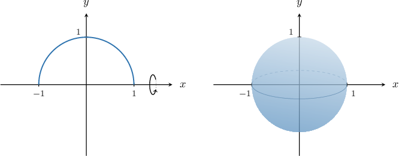

# Surface Areas of Revolution for Parametric Curves

Source: https://www.mathacademy.com/topics/1995?courseId=155
Topic ID: 1995

## Prerequisites

- [The Arc Length of a Parametric Curve](../ap-calculus-bc/997-the-arc-length-of-a-parametric-curve.md)
- [Surface Areas of Revolution: Rotation About the Y-Axis](./3632-surface-areas-of-revolution-rotation-about-the-y-axis.md)

## Lesson

### Introduction

Recall that when we rotate a curve by $2\pi$ radians about the $x$-axis, the area generated by this surface of revolution is given by

$$

S = \int 2\pi y \, \textrm{d}s.

$$

Now suppose we have a parametrically defined curve:

$$

x = x(t), \qquad y = y(t), \qquad t \in \left[t_1,t_2\right].

$$

In the case of a parametric curve, the arc length element $\textrm{d}s$ is given by

$$

\textrm{d}s = \sqrt{\left(\dfrac{\textrm{d}x}{\textrm{d}t}\right)^2+\left(\dfrac{\textrm{d}y}{\textrm{d}t}\right)^2} \, \textrm{d}t.

$$

As a result, we obtain the following formula for the surface area generated by rotating a parametrically defined curve about the $x$-axis:

$$

S = 2\pi \int_{t_1}^{t_2} y(t) \sqrt{\left(\dfrac{\textrm{d}x}{\textrm{d}t}\right)^2+\left(\dfrac{\textrm{d}y}{\textrm{d}t}\right)^2}\,\textrm{d}t

$$

Let's see an example.

### A Worked Example

Consider the curve defined by the parametric equations

$$

x = \cos{t}, \qquad y = \sin{t}, \qquad t \in [0,\pi].

$$

If we rotate this curve by $2\pi$ radians about the $x$-axis, we obtain a sphere of radius $1.$

Computing the derivatives, we get

$$

\begin{aligned}\frac{d𝑥}{d𝑡} & =\frac{d}{d𝑡}(cos⁡𝑡)=−sin⁡𝑡\end{aligned}

$$

and

$$

\begin{aligned}\frac{d𝑦}{d𝑡} & =\frac{d}{d𝑡}(sin⁡𝑡)=cos⁡𝑡.\end{aligned}

$$

Therefore, the surface area of our surface of revolution can be computed as follows:

$$

\begin{aligned}𝑆 & =2𝜋∫_{𝑡_{2}𝑡_{1}}^{}𝑦\sqrt{√(\frac{d𝑥}{d𝑡})^{2}+(\frac{d𝑦}{d𝑡})^{2}}\,d𝑡 \\ & =2𝜋∫_{𝜋0}^{}sin⁡𝑡\sqrt{√(−sin⁡𝑡)^{2}+(cos⁡𝑡)^{2}}\,d𝑡 \\ & =2𝜋∫_{𝜋0}^{}sin⁡𝑡\sqrt{√sin^{2}⁡𝑡+cos^{2}⁡𝑡}\,d𝑡 \\ & =2𝜋∫_{𝜋0}^{}sin⁡𝑡\,d𝑡 \\ & =2𝜋(−cos⁡𝑡)_{𝜋0}^{} \\ & =−2𝜋(cos⁡𝜋−cos⁡0) \\ & =−2𝜋(−1−1) \\ & =4𝜋\end{aligned}

$$

### Example: Integrals Representing Surface Areas Generated by Functions of X

#### Question

Consider the curve defined parametrically as

$$

x = t-\sin t, \quad y = 1-\cos t, \quad t\in \left[0,\pi\right].

$$

What integral gives the surface area generated when this curve is rotated $2\pi$ radians about the $x$-axis?

#### Explanation

We can find the surface area generated when a curve is rotated $2\pi$ radians about the $x$-axis using the formula

$$

S = \int 2\pi y\,\textrm d s.

$$

Since our curve is given in parametric form, we have

$$

\textrm d s = \sqrt{\left(\dfrac{\textrm d x}{\textrm d t}\right)^2+\left(\dfrac{\textrm d y}{\textrm d t}\right)^2}\,\textrm d t.

$$

Therefore, we will use

$$

S = 2\pi \int_{t_1}^{t_2} y \sqrt{\left(\dfrac{\textrm d x}{\textrm d t}\right)^2+\left(\dfrac{\textrm d y}{\textrm d t}\right)^2}\,\textrm d t.

$$

We are told that the limits of integration are from $t_1=0$ to $t_2=\pi.$

Computing the derivatives, we get

$$

\begin{aligned}\frac{d𝑥}{d𝑡} & =\frac{d}{d𝑡}(𝑡−sin⁡𝑡)=1−cos⁡𝑡 \\ \frac{d𝑦}{d𝑡} & =\frac{d}{d𝑡}(1−cos⁡𝑡)=sin⁡𝑡.\end{aligned}

$$

Therefore,

$$

\begin{aligned}𝑆 & =2𝜋∫_{𝑡_{2}𝑡_{1}}^{}𝑦\sqrt{√(\frac{d𝑥}{d𝑡})^{2}+(\frac{d𝑦}{d𝑡})^{2}}\,d𝑡 \\ & =2𝜋∫_{𝜋0}^{}(1−cos⁡𝑡)\sqrt{√(1−cos⁡𝑡)^{2}+(sin⁡𝑡)^{2}}\,d𝑡 \\ & =2𝜋∫_{𝜋0}^{}(1−cos⁡𝑡)\sqrt{√1−2cos⁡𝑡+cos^{2}⁡𝑡+sin^{2}⁡𝑡}\,d𝑡.\end{aligned}

$$

Now, using the identity $\sin^2 t +\cos^2 t= 1,$ we can rewrite our integral as follows:

$$

\begin{aligned}𝑆 & =2𝜋∫_{𝜋0}^{}(1−cos⁡𝑡)\sqrt{√1−2cos⁡𝑡+(sin^{2}⁡𝑡+cos^{2}⁡𝑡)}\,d𝑡 \\ & =2𝜋∫_{𝜋0}^{}(1−cos⁡𝑡)\sqrt{√1−2cos⁡𝑡+1}\,d𝑡 \\ & =2𝜋∫_{𝜋0}^{}(1−cos⁡𝑡)\sqrt{√2−2cos⁡𝑡}\,d𝑡 \\ & =2𝜋∫_{𝜋0}^{}(1−cos⁡𝑡)\sqrt{√2(1−cos⁡𝑡)}\,d𝑡 \\ & =2𝜋∫_{𝜋0}^{}(1−cos⁡𝑡)⋅\sqrt{√2}⋅\sqrt{√1−cos⁡𝑡}\,d𝑡 \\ & =2\sqrt{√2}𝜋∫_{𝜋0}^{}\sqrt{√(1−cos⁡𝑡)^{3}}\,d𝑡\end{aligned}

$$

### Surface Area Generated by Functions of Y

When we rotate a curve by $2\pi$ radians about the $y$-axis, the area generated by this surface of revolution is given by

$$

S = \int 2\pi x \, \textrm{d}s.

$$

Therefore, in the case of a parametrically defined curve

$$

x = x(t), \qquad y = y(t), \qquad t \in [t_1,t_2],

$$

the formula for the surface area generated when this curve is rotated $2\pi$ radians about the $y$-axis is given by

$$

S = 2\pi \int_{t_1}^{t_2} x(t) \sqrt{\left(\dfrac{\textrm{d}x}{\textrm{d}t}\right)^2+\left(\dfrac{\textrm{d}y}{\textrm{d}t}\right)^2}\,\textrm{d}t.

$$

### Example: Integrals Representing Surface Areas Generated by Functions of Y

#### Question

Consider the curve defined parametrically as

$$

x = \sin t, \quad y = e^t, \quad t\in \left[0,1\right].

$$

What integral gives the surface area generated when this curve is rotated $2\pi$ radians about the $y$-axis?

#### Explanation

We can find the surface area generated when a curve is rotated $2\pi$ radians about the $y$-axis using the formula

$$

S = \int 2\pi x\,\textrm d s.

$$

Since our curve is given in parametric form, we have

$$

\textrm d s = \sqrt{\left(\dfrac{\textrm d x}{\textrm d t}\right)^2+\left(\dfrac{\textrm d y}{\textrm d t}\right)^2}\,\textrm d t.

$$

Therefore, we will use

$$

S = 2\pi \int_{t_1}^{t_2} x \sqrt{\left(\dfrac{\textrm d x}{\textrm d t}\right)^2+\left(\dfrac{\textrm d y}{\textrm d t}\right)^2}\,\textrm d t.

$$

We are told that the limits of integration are from $t_1=0$ to $t_2=1.$

Computing the derivatives, we get

$$

\begin{aligned}\frac{d𝑥}{d𝑡} & =\frac{d}{d𝑡}(sin⁡𝑡)=cos⁡𝑡 \\ \frac{d𝑦}{d𝑡} & =\frac{d}{d𝑡}(𝑒^{𝑡})=𝑒^{𝑡}.\end{aligned}

$$

Therefore,

$$

\begin{aligned}𝑆 & =2𝜋∫_{𝑡_{2}𝑡_{1}}^{}𝑥\sqrt{√(\frac{d𝑥}{d𝑡})^{2}+(\frac{d𝑦}{d𝑡})^{2}}\,d𝑡 \\ & =2𝜋∫_{10}^{}sin⁡𝑡\sqrt{√(cos⁡𝑡)^{2}+(𝑒^{𝑡})^{2}}\,d𝑡 \\ & =2𝜋∫_{10}^{}sin⁡𝑡\sqrt{√cos^{2}⁡𝑡+𝑒^{2𝑡}}\,d𝑡.\end{aligned}

$$

### Example: Computing a Surface Area of Revolution

#### Question

Consider the curve defined parametrically as

$$

x = 1+3t, \quad y = 2t^{3/2}, \quad t\in \left[0,1\right].

$$

Calculate the surface area generated when this curve is rotated $2\pi$ radians about the $y$-axis.

#### Explanation

We can find the surface area generated when a curve is rotated $2\pi$ radians about the $y$-axis using the formula

$$

S = \int 2\pi x\,\textrm d s.

$$

Since our curve is given in parametric form, we have

$$

\textrm d s = \sqrt{\left(\dfrac{\textrm d x}{\textrm d t}\right)^2+\left(\dfrac{\textrm d y}{\textrm d t}\right)^2}\,\textrm d t.

$$

Therefore, we will use

$$

S = 2\pi \int_{t_1}^{t_2} x \sqrt{\left(\dfrac{\textrm d x}{\textrm d t}\right)^2+\left(\dfrac{\textrm d y}{\textrm d t}\right)^2}\,\textrm d t.

$$

We are told that the limits of integration are from $t_1=0$ to $t_2=1.$

Computing the derivatives, we get

$$

\begin{aligned}\frac{d𝑥}{d𝑡} & =\frac{d}{d𝑡}(1+3𝑡)=3 \\ \frac{d𝑦}{d𝑡} & =\frac{d}{d𝑡}(2𝑡^{3/2})=3𝑡^{1/2}.\end{aligned}

$$

Therefore,

$$

\begin{aligned}𝑆 & =2𝜋∫_{𝑡_{2}𝑡_{1}}^{}𝑥\sqrt{√(\frac{d𝑥}{d𝑡})^{2}+(\frac{d𝑦}{d𝑡})^{2}}\,d𝑡 \\ & =2𝜋∫_{10}^{}(1+3𝑡)\sqrt{√(3)^{2}+(3𝑡^{1/2})^{2}}\,d𝑡 \\ & =2𝜋∫_{10}^{}(1+3𝑡)\sqrt{√9+9𝑡}\,d𝑡 \\ & =2𝜋∫_{10}^{}(1+3𝑡)\sqrt{√9(1+𝑡)}\,d𝑡 \\ & =2𝜋∫_{10}^{}(1+3𝑡)⋅3\sqrt{√1+𝑡}\,d𝑡 \\ & =6𝜋∫_{10}^{}(1+3𝑡)\sqrt{√1+𝑡}\,d𝑡.\end{aligned}

$$

We evaluate the last integral using the substitution $u = 1+t.$ Then, $1+3t=3u-2$ and $\textrm{d}u = \textrm d t.$ We also need to compute new limits, given below.

Therefore, we get

$$

\begin{aligned}𝑆 & =6𝜋∫_{10}^{}(1+3𝑡)\sqrt{√1+𝑡}\,d𝑡 \\ & =6𝜋∫_{21}^{}(3𝑢−2)\sqrt{√𝑢}\,d𝑢 \\ & =6𝜋∫_{21}^{}(3𝑢^{3/2}−2𝑢^{1/2})\,d𝑢 \\ & =6𝜋⋅[\frac{6𝑢^{5/2}}{5}−\frac{4𝑢^{3/2}}{3}]_{21}^{} \\ & =6𝜋[(\frac{6(2^{5/2})}{5}−\frac{4(2^{3/2})}{3})−(\frac{6}{5}−\frac{4}{3})] \\ & =6𝜋[(\frac{24\sqrt{√2}}{5}−\frac{8\sqrt{√2}}{3})−(\frac{6}{5}−\frac{4}{3})] \\ & =6𝜋[\frac{32\sqrt{√2}}{15}+\frac{2}{15}] \\ & =\frac{4𝜋}{5}(16\sqrt{√2}+1).\end{aligned}

$$
