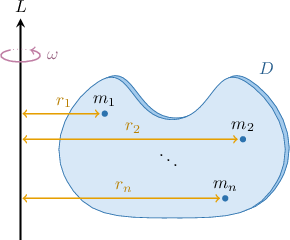
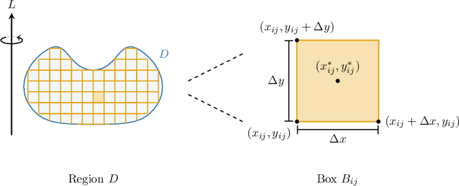
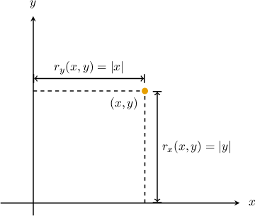
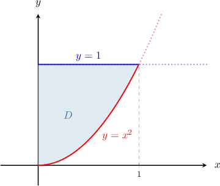
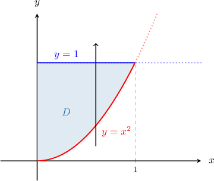
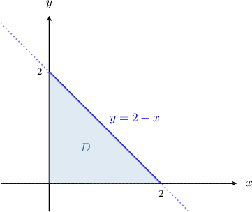
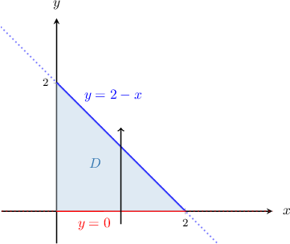
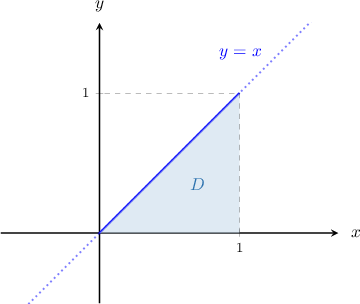
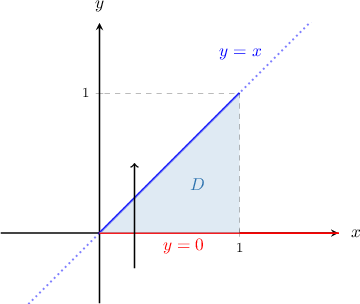
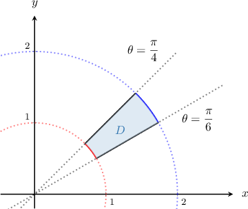

# Moments of Inertia of Laminas About the Coordinate Axes

Source: https://www.mathacademy.com/topics/2027?courseId=155
Topic ID: 2027

## Prerequisites

- [Double Integrals Between Polar Curves](../mathematical-methods-for-the-physical-sciences-i/2835-double-integrals-between-polar-curves.md)
- [Circular Motion About the Origin](./3338-circular-motion-about-the-origin.md)
- [The Work-Energy Principle](./3687-the-work-energy-principle.md)
- [Moments and Centers of Mass of Plane Laminas](./4166-moments-and-centers-of-mass-of-plane-laminas.md)

## Lesson

### Introduction

Suppose a massless, rigid lamina rotates with angular velocity $\omega$ about a fixed axis $L.$ Attached to the lamina are a set of particles $P_1,P_2,\ldots,P_n$ of masses $m_1,m_2,\ldots,m_n$ at distances $r_1,r_2,\ldots,r_n$ from the axis, respectively.

Let's find the total kinetic energy of this system.

Each particle $P_i$ of mass $m_i$ has linear speed $v_i = r_i\omega.$ So, its kinetic energy is

$$

\dfrac12m_iv_i^2 = \dfrac12m_i(r_i\omega)^2 = \dfrac12m_ir_i^2\omega^2.

$$

The total kinetic energy of the system is obtained by adding the energies of all the particles. So, the kinetic energy of the system is

$$

\begin{aligned}Total KE & =\underset{\underset{𝑖=1}{∑}}{\overset{}{𝑛}}\frac{1}{2}𝑚_{𝑖}𝑟_{2𝑖}^{}𝜔^{2} \\ & =\frac{1}{2}𝜔^{2}\underset{\underset{𝑖=1}{∑}}{\overset{}{𝑛}}𝑚_{𝑖}𝑟_{2𝑖}^{}.\end{aligned}

$$

In other words, the total kinetic energy of the system is given by

$$

\text{Total KE} = \dfrac12I\omega^2,

$$

where the quantity

$$

I = \sum\limits_{i=1}^n m_ir_i^2

$$

is called the **moment of inertia** of the system about the fixed axis $L.$ The units of moment of inertia are $\rm{kg}\cdot\rm{m}^2.$

The moment of inertia in angular motion is analogous to mass in linear motion:

- For linear motion, the kinetic energy is given by where $M$ is the (total) mass of a system of particles. The mass of a body measures how resistant the body is to changes in linear motion. It takes a larger force to induce a fixed change in linear motion for a large mass than for a smaller mass.

- For angular motion, the kinetic energy is given by where $I$ is the moment of inertia of a system of particles. The moment of inertia of a body measures how resistant the body is to changes in *angular* motion. It takes a larger force to induce a fixed change in angular motion for an object with a large moment of inertia than for a body with a smaller moment of inertia.

### Moment of Inertia of Plane Laminas

Let's now find a formula for the moment of inertia of a plane lamina with continuously varying mass density.

Consider a plane lamina that occupies the region $D \subseteq \mathbb{R}^2$ with mass density function $\lambda(x,y),$ (in mass/area), which depends on the position.

By choosing a finite number of points $(x_{ij},y_{ij}),$ where $i=1,2,\ldots,m$ and $j=1,2,\ldots,n,$ we can break the region $D$ into non-overlapping boxes $B_{ij} = [x_{ij}, x_{ij} + \Delta x] \times [y_{ij}, y_{ij} + \Delta y]$ of area $\Delta x \Delta y = \Delta A.$

For large $m$ and $n,$ the mass density in each box, $B_{ij}$ is approximately constant and equal to the mass density of a point $(x_{ij}^*, y_{ij}^*)$ in the box. Hence, the mass of this part of the lamina is approximately the product of the mass density at this point and the area of the box:

$$

m_{ij} \approx \lambda(x_{ij}^*, y_{ij}^*) \cdot \Delta A

$$

Suppose the function $r(x,y)$ gives the distance of each point $(x,y) \in D$ from a fixed axis $L.$ Then, using the formula for the moment of inertia for a collection of masses, summing over these points, we get

$$

\begin{aligned}𝐼 & =\underset{\underset{𝑖=1}{∑}}{\overset{}{𝑚}}\underset{\underset{𝑗=1}{∑}}{\overset{}{𝑛}}𝑚_{𝑖}[𝑟(𝑥_{∗𝑖𝑗}^{},𝑦_{∗𝑖𝑗}^{})]^{2} \\ & ≈\underset{\underset{𝑖=1}{∑}}{\overset{}{𝑚}}\underset{\underset{𝑗=1}{∑}}{\overset{}{𝑛}}(𝜆(𝑥_{∗𝑖𝑗}^{},𝑦_{∗𝑖𝑗}^{})⋅Δ𝐴)[𝑟(𝑥_{∗𝑖𝑗}^{},𝑦_{∗𝑖𝑗}^{})]^{2} \\ & ≈\underset{\underset{𝑖=1}{∑}}{\overset{}{𝑚}}\underset{\underset{𝑗=1}{∑}}{\overset{}{𝑛}}𝜆(𝑥_{∗𝑖𝑗}^{},𝑦_{∗𝑖𝑗}^{})[𝑟(𝑥_{∗𝑖𝑗}^{},𝑦_{∗𝑖𝑗}^{})]^{2}Δ𝐴.\end{aligned}

$$

Finally, taking the limit as the length and width of the boxes tend to zero, we get an exact representation of the moment of inertia as an integral:

$$

I = \lim\limits_{m,n\to \infty} \sum\limits_{i=1}^m \sum\limits_{j=1}^n \lambda(x_{ij}^*, y_{ij}^*) [r(x_{ij}^*, y_{ij}^*)]^2 \Delta A = \iint\limits_D \lambda(x,y) [r(x,y)]^2 \:\textrm{d}A.

$$

Therefore, the moment of inertia about a fixed axis $L$ of a plane lamina occupying the region $D$ with mass density $\lambda(x,y)$ is

$$

I_L = \iint\limits_D \lambda(x,y) [r(x,y)]^2 \:\textrm{d}A,

$$

where $r(x,y)$ is the distance from the point $(x,y)$ to the axis $L.$

In this lesson, we'll limit the axis of rotation to the $x$- and $y$-axes. Note that the distance between a point $(x,y)$ and the $x$ and $y$ coordinate axes are $r_x(x,y) = |y|$ and $r_y(x,y) = |x|,$ respectively.

Hence, the moments of inertia of a plate with respect to the coordinate axes $x$ and $y,$ denoted $I_x$ and $I_y$, respectively, are

$$

\begin{aligned}𝐼_{𝑥} & =\underset{𝐷}{∬}𝑦^{2}𝜆(𝑥,𝑦)\,d𝐴 \\ 𝐼_{𝑦} & =\underset{𝐷}{∬}𝑥^{2}𝜆(𝑥,𝑦)\,d𝐴.\end{aligned}

$$

A related concept is the **moment of inertia about the origin** (or **polar moment of inertia**), which deals with the strength of an object when it is rotating. It is defined as

$$

I_0 = \iint\limits_D (x^2+y^2)\lambda(x,y) \:\textrm dA = I_x + I_y.

$$

### Example: Calculating the Moment of Inertia of a Lamina Given a Mass Density Function

#### Question

A plate occupies the region $D$ enclosed by the curves $y=x^2$ and $y=1$ in the first quadrant, as shown above. If the mass density function of $D$ is given by $\lambda(x,y) = 4xy,$ find the moment of inertia of the lamina about the $x$-axis.

#### Explanation

For a plane lamina $D$ with mass density function $\lambda(x,y),$ we have the following definitions:

- The moment of inertia about the $x$-axis is given by

- The moment of inertia about the $y$-axis is given by

- The moment of inertia about the origin is given by

First, notice that $D$ is a type I region with representation

$$

D = \left\{ (x,y) \: : \: 0 \leq x \leq 1, \:\: x^2 \leq y \leq 1 \right\},

$$

as shown below.

Using the formula for $I_x,$ we get

$$

\begin{aligned}𝐼_{𝑥} & =\underset{𝐷}{∬}𝑦^{2}𝜆(𝑥,𝑦)\,d𝐴 \\ & =∫_{10}^{}∫_{1𝑥^{2}}^{}𝑦^{2}⋅4𝑥𝑦\,d𝑦\,d𝑥 \\ & =∫_{10}^{}[∫_{1𝑥^{2}}^{}4𝑥𝑦^{3}\,d𝑦]d𝑥 \\ & =∫_{10}^{}[𝑥𝑦^{4}]_{𝑦=1𝑦=𝑥^{2}}^{}\,d𝑥 \\ & =∫_{10}^{}𝑥(1−𝑥^{8})d𝑥 \\ & =∫_{10}^{}𝑥−𝑥^{9}\,d𝑥 \\ & =[\frac{𝑥^{2}}{2}−\frac{𝑥^{10}}{10}]_{10}^{} \\ & =\frac{1}{2}−\frac{1}{10} \\ & =\frac{2}{5}.\end{aligned}

$$

### Example: Calculating the Moment of Inertia of a Lamina With Uniform Mass Density

#### Question

A triangular plate of mass and uniform mass density occupies the region enclosed between the -axis and the lines and as shown above. Find the moment of inertia of the plate about the -axis.

#### Explanation

For a plane lamina with mass density function we have the following definitions:

- The moment of inertia about the -axis is given by

- The moment of inertia about the -axis is given by

- The moment of inertia about the origin is given by

First, notice that is a type I region with representation

as shown below.

The area of the triangular plate is

Since the plate has uniform density, every unit of area contains the same amount of mass. Therefore, the mass density is constant and is given by the total mass divided by the total area:

Therefore, the moment of inertia about the -axis is

### Example: Calculating the Moment of Inertia Given a Description of a Mass Density Function

#### Question

A triangular plate of mass occupies the region in the first quadrant enclosed by the lines and and the -axis. The mass density at each point is proportional to its distance from the -axis. Find the moment of inertia of the plate about the -axis.

#### Explanation

For a plane lamina with mass density function we have the following definitions:

- The moment of inertia about the -axis is given by

- The moment of inertia about the -axis is given by

- The moment of inertia about the origin is given by

First, notice that is a type I region with representation

as shown below.

From the description, the mass density function can be written as where is a constant of proportionality.

Since the density contains the unknown constant, we first use the total mass to determine

We can find an expression for in terms of by integrating the density function over the plate:

Therefore, and hence Therefore, the moment of inertia about the -axis is

### Moments of Inertia in Polar Coordinates

It's often convenient to calculate moments of inertia by changing from Cartesian coordinates to polar coordinates.

To express an integral using polar coordinates, we use the change of variables formula given by

Applying this formula to the moment of inertia about the -axis of a plane lamina with mass density function we get

If we repeat this process for moments of inertia about the -axis and the origin, we obtain two more definitions. Let's summarize them below:

- The moment of inertia of about -axis is given by

- The moment of inertia of about -axis is given by

- The moment of inertia of about origin is given by

Note that we denote the density function expressed in polar coordinates.

### Example: Calculating Moments of Inertia Using Polar Coordinates

#### Question

Consider the plate that occupies the region $D$ enclosed by the polar circles $r = 1$ and $r = 2$ and the polar rays $\theta = \dfrac{\pi}{6}$ and $\theta = \dfrac{\pi}{4}$ in the first quadrant, as shown above. The mass density function of the plate is given by $\lambda(x,y) = \dfrac{1}{x^2}.$ Find the moment of inertia of the plate about the $y$-axis.

#### Explanation

For a plane lamina $D$ with mass density function $\lambda(r,\theta),$ we have the following definitions:

- The moment of inertia about the $x$-axis, in polar coordinates, is given by

- The moment of inertia about the $y$-axis, in polar coordinates, is given by

- The moment of inertia about the origin, in polar coordinates, is given by

First, note that the region $D$ in polar coordinates can be expressed as

$$

D = \left\{ (r,\theta) \: : \: 1 \leq r \leq 2, \:\: \dfrac{\pi}{6} \leq \theta \leq \dfrac{\pi}{4} \right\}.

$$

Also, the mass density function in polar coordinates is

$$

\lambda(r,\theta) = \dfrac{1}{r^2 \cos^2{\theta}}.

$$

Therefore, the moment of inertia about the $y$-axis is

$$

\begin{aligned}𝐼_{𝑦} & =\underset{𝐷}{∬}𝜆(𝑟,𝜃)⋅𝑟^{3}cos^{2}⁡𝜃\,d𝑟\,d𝜃 \\ & =∫_{𝜋/4𝜋/6}^{}∫_{21}^{}\frac{1}{𝑟^{2}cos^{2}⁡𝜃}⋅𝑟^{3}cos^{2}⁡𝜃\,d𝑟\,d𝜃 \\ & =∫_{𝜋/4𝜋/6}^{}∫_{21}^{}𝑟\,d𝑟\,d𝜃 \\ & =(∫_{21}^{}𝑟\,d𝑟)(∫_{𝜋/4𝜋/6}^{}d𝜃) \\ & =\frac{1}{2}𝑟^{2}\,_{21}^{}⋅𝜃\,_{𝜋/4𝜋/6}^{} \\ & =\frac{1}{2}(4−1)⋅(\frac{𝜋}{4}−\frac{𝜋}{6}) \\ & =\frac{1}{2}⋅3⋅\frac{𝜋}{12} \\ & =\frac{𝜋}{8}.\end{aligned}

$$
