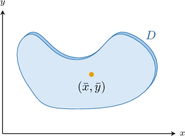
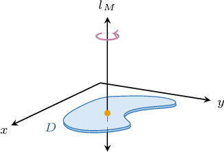
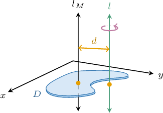
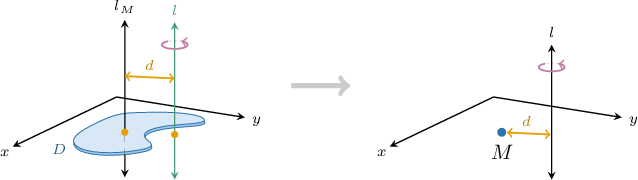

# The Parallel Axis Theorem

Source: https://www.mathacademy.com/topics/2028?courseId=155
Topic ID: 2028

## Prerequisites

- [Moments of Inertia of Laminas About Other Axes](./4173-moments-of-inertia-of-laminas-about-other-axes.md)

## Lesson

### Introduction

Consider a plane lamina that occupies the region $D \subseteq \mathbb{R}^2$ of mass $M$ where the center of mass is at $\left(\bar{x},\bar{y}\right).$

We know that the lamina has some moment of inertia $I_M$ about the line $l_M$ that passes through the center of mass and is perpendicular to the lamina.

Now, if $l$ is a line parallel to $l_M,$ then the lamina also has moment of inertia about $l,$ say $I_l.$

Given the value of $I_M,$ we can find $I_l$ using the **parallel axis theorem**, which states that

$$

I_l = I_M + d^2M,

$$

where $d$ is the distance between the lines.

The term $d^2M$ is the moment of inertia about $l$ of the lamina when its entire mass is concentrated at the center of mass.

So, our interpretation of the parallel axis theorem is the following:

$$

\underbrace{\text{moment of inertia of }D \ \text{about a parallel line }l}_{I_l} \:=\: \underbrace{\text{moment of inertia of }D \ \text{about the center of mass}}_{I_M} \:+\: \underbrace{\text{moment of inertia of point mass }M \ \text{about the parallel line } l}_{d^2M}

$$

Finally, since $d^2M$ is always positive, we have $I_M \leq I_l$ for any line $l$ perpendicular to the lamina. In other words, the moment of inertia about the line through its center of mass is the *smallest* moment of inertia about any line in that direction.

### Example: Calculating a Moment of Inertia About a Perpendicular Axis

#### Question

Consider a plane lamina of mass $2\,\textrm{kg}$ and center of mass $(0,1),$ where $x$ and $y$ are measured in meters. If the moment of inertia of the lamina about an axis perpendicular to the lamina passing through its center of mass is $2.5\,\textrm{kg}\cdot\textrm{m}^2,$ what is the moment of inertia of the lamina about an axis parallel to the first passing through the point $(2,1)?$

#### Explanation

For a plane lamina of mass $M$ and a line $l_M$ perpendicular to the lamina passing through its center of mass, the parallel axis theorem states that the moment of inertia of the lamina about a line $l$ parallel to $l_M$ is given by

$$

I_l = I_M + d^2M,

$$

where $d$ is the distance between the lines, and $I_M$ and $I_l$ are the moments of inertia about the lines $l_M$ and $l,$ respectively.

The distance between the line through the center of mass $(0,1)$ and the line through the point $(2,1)$ is

$$

\begin{aligned}𝑑 & =\sqrt{√(2−0)^{2}+(1−1)^{2}} \\ & =\sqrt{√4+0} \\ & =\sqrt{√4} \\ & =2.\end{aligned}

$$

Then, applying the parallel axis theorem, we get

$$

\begin{aligned}𝐼_{𝑙} & =2.5+2^{2}⋅2 \\ & =2.5+8 \\ & =10.5.\end{aligned}

$$

Therefore, the moment of inertia is $10.5\,\mathrm{kg}\cdot\mathrm{m^2}.$

### A Formula for the Moment of Inertia About the Line Through the Center of Mass

In a previous lesson, we saw that the moment of inertia about an axis $l$ of a plane lamina occupying the region $D$ with mass density function $\lambda(x,y)$ is given by

$$

I_l = \iint\limits_D [r(x,y)]^2\,\lambda(x,y) \:\textrm{d}A.

$$

Therefore, the moment of inertia of $D$ about the line through the center of mass $\left(\bar{x}, \bar{y}\right)$ and perpendicular to the lamina is given by

$$

I_M = \iint\limits_D \left((x-\bar{x})^2+(y-\bar{y})^2\right) \lambda(x,y) \:\textrm{d}A.

$$

### Example: Calculating a Moment of Inertia of a Rectangular Plate About a Perpendicular Axis

#### Question

A rectangular plate of mass $3\,\textrm{kg}$ and uniform mass density occupies the region $D = \big\{(x,y) \:: \: 0 \le x \le 2, \: 0 \le y \le 4 \big\},$ where $x$ and $y$ are measured in meters. Find the moment of inertia of the plate about a line perpendicular to $D$ at a distance of $1\,\textrm{m}$ from a parallel line passing through its center of mass.

#### Explanation

For a plane lamina of mass $M$ and a line $l_M$ perpendicular to the lamina passing through its center of mass, the parallel axis theorem states that the moment of inertia of the lamina about a line $l$ parallel to $l_M$ is given by

$$

I_l = I_M + d^2M,

$$

where $d$ is the distance between the lines, and $I_M$ and $I_l$ are the moments of inertia about the lines $l_M$ and $l,$ respectively.

The area of the rectangular plate $D$ is $\mathcal{A} = 2 \cdot 4 = 8\,\textrm{m}^2.$ Since the plate has a uniform density, the mass density function is given by

$$

\lambda(x,y) = \dfrac{M}{\mathcal{A}} = \dfrac{3}8\,\textrm{kg}/\textrm{m}^2,

$$

and its center of mass is its centroid:

$$

\left(\bar{x},\bar{y}\right) = \left( \dfrac{0+2}2, \dfrac{0+4}2 \right) = (1,2)

$$

Then, the moment of inertia about the perpendicular line through the center of mass is

$$

\begin{aligned}𝐼_{𝑀} & =\underset{𝐷}{∬}((𝑥−\overset{𝑥}{¯})^{2}+(𝑦−\overset{𝑦}{¯})^{2})𝜆(𝑥,𝑦)\,d𝐴 \\ & =∫_{20}^{}∫_{40}^{}\frac{3}{8}((𝑥−1)^{2}+(𝑦−2)^{2})\,d𝑦\,d𝑥 \\ & =\frac{1}{8}∫_{20}^{}∫_{40}^{}3(𝑥−1)^{2}+3(𝑦−2)^{2}\,d𝑦\,d𝑥 \\ & =\frac{1}{8}∫_{20}^{}[3(𝑥−1)^{2}𝑦+(𝑦−2)^{3}]_{𝑦=4𝑦=0}^{}\,d𝑥 \\ & =\frac{1}{8}∫_{20}^{}12(𝑥−1)^{2}+16\,d𝑥 \\ & =\frac{1}{8}[4(𝑥−1)^{3}+16𝑥]_{20}^{} \\ & =\frac{1}{8}(4+32−(−4+0)) \\ & =5\,kg⋅m^{2}.\end{aligned}

$$

Finally, applying the parallel axis theorem, the moment of inertia about a line $1\,\textrm{m}$ from the center of mass is

$$

\begin{aligned}𝐼 & =𝐼_{𝑀}+𝑑^{2}𝑀 \\ & =5+1^{2}⋅3 \\ & =5+3 \\ & =8\,kg⋅m^{2}.\end{aligned}

$$

### Example: Calculating a Moment of Inertia About a Perpendicular Axis Using Polar Coordinates

#### Question

Calculate the moment of inertia of a circular plate that occupies the region of a disk $D$ of radius $1\,\textrm{m}$ with mass density $\lambda(x, y) =2(x^2+y^2),$ measured in $\textrm{kg}/\textrm{m}^2,$ about a line perpendicular to the disk passing through a point on the circumference.

#### Explanation

For a plane lamina of mass $M$ and a line $l_M$ perpendicular to the lamina passing through its center of mass, the parallel axis theorem states that the moment of inertia of the lamina about a line $l$ parallel to $l_M$ is given by

$$

I_l = I_M + d^2M,

$$

where $d$ is the distance between the lines, and $I_M$ and $I_l$ are the moments of inertia about the lines $l_M$ and $l,$ respectively.

First, notice that the region $D$ can be expressed in polar coordinates as

$$

D = \big\{ (r,\theta) \: : \: 0 \leq r \leq 1, \:\: 0 \leq \theta \lt 2\pi \big\}.

$$

Since the mass density is symmetric in $x$ and $y,$ $D$'s center of mass is at $(0,0).$ The mass density function, in polar coordinates, is given by $\lambda(r,\theta) = 2r^2.$

Next, we find the mass of the plate as follows:

$$

\begin{aligned}𝑀 & =\underset{𝐷}{∬}𝜆(𝑟,𝜃)⋅𝑟\,d𝑟\,d𝜃 \\ & =∫_{2𝜋0}^{}∫_{10}^{}2𝑟^{2}⋅𝑟\,d𝑟\,d𝜃 \\ & =∫_{10}^{}2𝑟^{3}\,d𝑟⋅∫_{2𝜋0}^{}\,d𝜃 \\ & =\frac{1}{2}𝑟^{4}_{10}^{}⋅𝜃_{2𝜋0}^{} \\ & =\frac{1}{2}⋅2𝜋 \\ & =𝜋\,kg\end{aligned}

$$

Then, the moment of inertia about the perpendicular line through the center of mass is

$$

\begin{aligned}𝐼_{𝑀} & =\underset{𝐷}{∬}𝜆(𝑟,𝜃)⋅𝑟^{3}\,d𝑟\,d𝜃 \\ & =∫_{2𝜋0}^{}∫_{10}^{}2𝑟^{2}⋅𝑟^{3}\,d𝑟\,d𝜃 \\ & =∫_{10}^{}2𝑟^{5}\,d𝑟⋅∫_{2𝜋0}^{}\,d𝜃 \\ & =\frac{1}{3}𝑟^{6}_{10}^{}⋅𝜃_{2𝜋0}^{} \\ & =\frac{1}{3}⋅2𝜋 \\ & =\frac{2𝜋}{3}\,kg⋅m^{2}.\end{aligned}

$$

Finally, applying the parallel axis theorem, the moment of inertia about a line passing through a point on the circumference is

$$

\begin{aligned}𝐼 & =𝐼_{𝑀}+𝑑^{2}𝑀 \\ & =\frac{2𝜋}{3}+1^{2}⋅𝜋 \\ & =\frac{2𝜋}{3}+𝜋 \\ & =\frac{5𝜋}{3}\,kg⋅m^{2}.\end{aligned}

$$

### Example: Finding the Distance Between Two Parallel Axes

#### Question

A circular plate of mass $2 \, \textrm{kg}$ with uniform mass density occupies the region of a disk $D$ of radius $4 \, \textrm{m}$ and is centered at the origin. Given that the moment of inertia of the plate about a line $l$ perpendicular to the plate is $24 \, \textrm{kg} \cdot \textrm{m}^2,$ find the distance of the line $l$ from the center of mass of $D.$

#### Explanation

For a plane lamina of mass $M$ and a line $l_M$ perpendicular to the lamina passing through its center of mass, the parallel axis theorem states that the moment of inertia of the lamina about a line $l$ parallel to $l_M$ is given by

$$

I_l = I_M + d^2M,

$$

where $d$ is the distance between the lines, and $I_M$ and $I_l$ are the moments of inertia about the lines $l_M$ and $l,$ respectively.

First, notice that the region $D$ can be expressed in polar coordinates as

$$

D = \big\{ (r,\theta) \: : \: 0 \leq r \leq 4, \: 0 \leq \theta \lt 2\pi \big\}.

$$

The area of the circular plate $D$ is $\mathcal{A} = \pi \cdot 4^2 = 16\pi\,\textrm{m}^2.$ Since the plate has a uniform density, the mass density function is given by

$$

\lambda(r,\theta) = \dfrac{M}{\mathcal{A}} = \dfrac{2}{16\pi} = \dfrac{1}{8\pi}\,\textrm{kg}/\textrm{m}^2,

$$

and its center of mass is its centroid $(0,0).$

Then, the moment of inertia about the perpendicular line through the center of mass is

$$

\begin{aligned}𝐼_{𝑀} & =\underset{𝐷}{∬}𝜆(𝑟,𝜃)⋅𝑟^{3}\,d𝑟\,d𝜃 \\ & =\frac{1}{8𝜋}∫_{40}^{}𝑟^{3}\,d𝑟∫_{2𝜋0}^{}\,d𝜃 \\ & =\frac{1}{8𝜋}⋅\frac{1}{4}𝑟^{4}\,_{40}^{}⋅𝜃\,_{2𝜋0}^{} \\ & =\frac{1}{8𝜋}⋅64⋅2𝜋 \\ & =16\,kg⋅m^{2}.\end{aligned}

$$

Finally, applying the parallel axis theorem and solving for $d,$ we have

$$

\begin{aligned}𝐼 & =𝐼_{𝑀}+𝑑^{2}𝑀 \\ 24 & =16+2𝑑^{2} \\ 2𝑑^{2} & =8 \\ 𝑑^{2} & =4 \\ 𝑑 & =2\,m.\end{aligned}

$$
