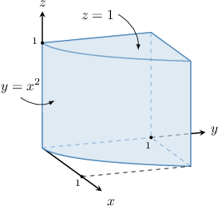
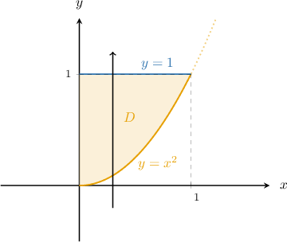
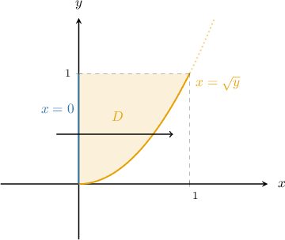
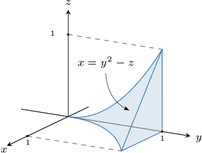
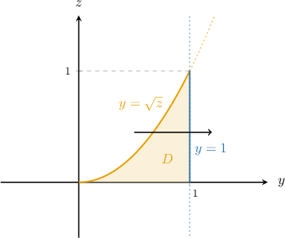
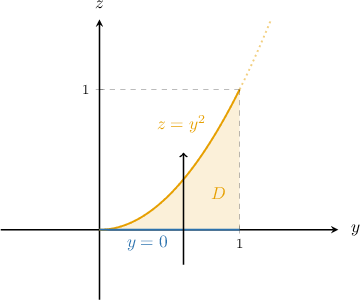
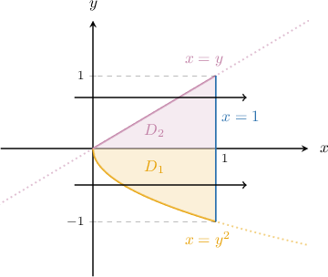
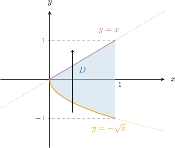
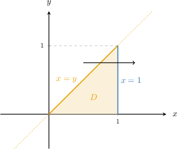
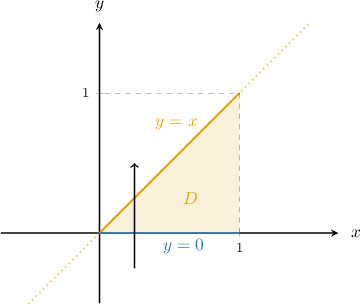

# Changing the Order of Integration in Triple Integrals: Changing Projection

Source: https://www.mathacademy.com/topics/2056?courseId=155
Topic ID: 2056

## Prerequisites

- [Changing the Order of Integration in Double Integrals](../mathematical-methods-for-the-physical-sciences-i/1997-changing-the-order-of-integration-in-double-integrals.md)
- [Triple Integrals Over Type II Regions](./2141-triple-integrals-over-type-ii-regions.md)
- [Triple Integrals Over Type III Regions](./2142-triple-integrals-over-type-iii-regions.md)

## Lesson

### Introduction

Suppose we want to evaluate the following repeated integral:

$$

\int_0^1\int_{x^2}^{1} \int_{0}^{1}\,\dfrac{e^{y}}{\sqrt{y}}\,\textrm{d}z\, \textrm{d}y\, \textrm{d}x

$$

For this repeated integral, the integration domain is the type I region

$$

R = \big\{ (x,y,z) \: : \: 0 \leq x \leq 1, \:\: x^2 \leq y \leq 1, \:\: 0 \leq z \leq 1 \big\}

$$

as illustrated below.

The expression '$\,\textrm{d}z\, \textrm{d}y\, \textrm{d}x$' means we should integrate first with respect to $z,$ then with respect to $y,$ and lastly with respect to $x.$ Let's see what happens when we attempt to integrate in this order:

$$

\begin{aligned}∫_{10}^{}∫_{1𝑥^{2}}^{}∫_{10}^{}\,\frac{𝑒^{𝑦}}{\sqrt{√𝑦}}\,d𝑧\,d𝑦\,d𝑥 & =∫_{10}^{}∫_{1𝑥^{2}}^{}\,\frac{𝑒^{𝑦}}{\sqrt{√𝑦}}[∫_{10}^{}\,d𝑧]d𝑦\,d𝑥 \\ & =∫_{10}^{}∫_{1𝑥^{2}}^{}\,\frac{𝑒^{𝑦}}{\sqrt{√𝑦}}⋅[𝑧]_{10}^{}\,d𝑦\,d𝑥 \\ & =∫_{10}^{}∫_{1𝑥^{2}}^{}\,\frac{𝑒^{𝑦}}{\sqrt{√𝑦}}\,d𝑦\,d𝑥\end{aligned}

$$

Notice that we cannot proceed any further because we cannot find a simple antiderivative of $\dfrac{e^{y}}{\sqrt{y}}.$

To resolve this issue, we first note that the projection of $R$ onto the $xy$-plane is the type I plane region $D$ shown below.

This region can also be represented as the type II plane region.

Using set notation, $D$'s representation as a type II plane region is

$$

D = \big\{ (x,y) \: : \: 0 \leq y \leq 1, \:\: 0 \leq x \leq \sqrt{y} \big\}.

$$

Therefore, we can evaluate this integral by keeping the inner integral the same and swapping the order of integration in the middle and outer integrals:

$$

\begin{aligned}∫_{10}^{}∫_{1𝑥^{2}}^{}∫_{10}^{}\,\frac{𝑒^{𝑦}}{\sqrt{√𝑦}}\,d𝑧\,d𝑦\,d𝑥 & =∫_{10}^{}∫_{\sqrt{√𝑦}0}^{}∫_{10}^{}\,\frac{𝑒^{𝑦}}{\sqrt{√𝑦}}\,d𝑧\,d𝑥\,d𝑦\end{aligned}

$$

Now, we evaluate this integral.

$$

\begin{aligned}∫_{10}^{}∫_{\sqrt{√𝑦}0}^{}∫_{10}^{}\,\frac{𝑒^{𝑦}}{\sqrt{√𝑦}}\,d𝑧\,d𝑥\,d𝑦 & =∫_{10}^{}∫_{\sqrt{√𝑦}0}^{}\,\frac{𝑒^{𝑦}}{\sqrt{√𝑦}}[∫_{10}^{}\,d𝑧]d𝑥\,d𝑦 \\ & =∫_{10}^{}∫_{\sqrt{√𝑦}0}^{}\,\frac{𝑒^{𝑦}}{\sqrt{√𝑦}}[𝑧]_{10}^{}d𝑥\,d𝑦 \\ & =∫_{10}^{}∫_{\sqrt{√𝑦}0}^{}\,\frac{𝑒^{𝑦}}{\sqrt{√𝑦}}\,d𝑥\,d𝑦 \\ & =∫_{10}^{}\,\frac{𝑒^{𝑦}}{\sqrt{√𝑦}}[∫_{\sqrt{√𝑦}0}^{}d𝑥]d𝑦 \\ & =∫_{10}^{}\,\frac{𝑒^{𝑦}}{\sqrt{√𝑦}}⋅[𝑥]_{\sqrt{√𝑦}0}^{}\,d𝑦 \\ & =∫_{10}^{}\,\frac{𝑒^{𝑦}}{\sqrt{√𝑦}}⋅\sqrt{√𝑦}\,d𝑦 \\ & =∫_{10}^{}\,𝑒^{𝑦}\,d𝑦 \\ & =𝑒^{𝑦}_{10}^{} \\ & =𝑒−1\end{aligned}

$$

Note the following:

- In this lesson, we'll learn how to compute triple integrals by changing the representation of the projection $D$ of $R$ from a type I plane region to type II (and vice-versa).

- It's also possible to change the spatial (i.e., three-dimensional) representation of $R$ from type I to type II, type I to type III, type II to type III, etc. This is slightly more involved, so we'll leave that discussion for a separate lesson.

$$

\%\begin{aligned} \%\int_0^1\int_0^1\int_{{x}}^{1} \,6z e^{zy^2}\,\textrm{d}y\, \textrm{d}x\, \, \textrm{d}z &= \int_0^1\int_0^1\int_{{0}}^{y} \,6z e^{zy^2}\,\textrm{d}x\, \textrm{d}y\, \, \textrm{d}z\\\%&= \int_0^1\int_0^1 \,6z e^{zy^2} \left[x\right]_{{0}}^{y}\, \textrm{d}y\, \, \textrm{d}z\\\%&= \int_0^1\int_0^1 \,6z ye^{zy^2} \, \textrm{d}y\, \, \textrm{d}z\\\%&= \int_0^1 \, 3 \left[e^{zy^2}\right]_0^1 \, \, \textrm{d}z\\\%&= \int_0^1 \, 3 \left(e^z-1\right) \, \textrm{d}z\\\%&= 3e-6.\end{aligned}

$$

### Example: Swapping the Order of Integration by Changing the Projection Type

#### Question

The triple integral of $f(x,y,z)$ over the region $R$ (shown above) can be expressed as the following repeated integral:

$$

\iiint\limits_R f(x,y,z) \:\textrm{d}V = \int_0^1\int_{\sqrt{z}}^1\int_0^{y^2-z} f(x,y,z) \:\textrm{d}x\:\textrm{d}y\:\textrm{d}z

$$

Rewrite this repeated integral by integrating first with respect to $x,$ then $z,$ and then $y.$

#### Explanation

From the given repeated integral, we see that $R$ can be written as a type II region as follows:

$$

R = \big\{ (x,y,z) \: : \: 0 \leq z \leq 1, \:\: \sqrt{z} \leq y \leq 1, \:\: 0 \leq x \leq y^2-z \big\}

$$

We wish to rewrite our triple integral as follows:

$$

\iiint\limits_R f(x,y,z) \:\textrm{d}V = \int_a^b\int_{v_1(y)}^{v_2(y)}\int_{u_1(y,z)}^{u_2(y,z)} f(x,y,z) \:\textrm{d}x\:\textrm{d}z\:\textrm{d}y

$$

Since both repeated integrals first integrate with respect to $x,$ the $x$-limits remain the same as before:

$$

\iiint\limits_R f(x,y,z) \:\textrm{d}V = \int_a^b\int_{v_1(y)}^{v_2(y)}\int_0^{y^2-z} f(x,y,z) \:\textrm{d}x\:\textrm{d}z\:\textrm{d}y

$$

Now, we consider the projection $D$ of $R$ onto the $yz$-plane shown below.

The region $D$ is a type II region in the $yz$-plane:

$$

D = \big\{ (y,z) \: : \: 0 \leq z \leq 1, \:\: \sqrt{z} \leq y \leq 1 \big\}

$$

To change the order of integration from $\textrm{d}x\:\textrm{d}y\:\textrm{d}z$ to $\textrm{d}x\:\textrm{d}z\:\textrm{d}y,$ we write $D$ as a type I region.

Notice that the top boundary of the region, written in the form $z=z(y),$ is

$$

y=\sqrt{z} \qquad\Longrightarrow\qquad z = y^2

$$

and the bottom boundary of the region is

$$

z=0.

$$

Then, the type I representation of the region $D$ is

$$

D = \big\{ (y,z) \: : \: 0 \leq y \leq 1, \:\: 0 \leq z\leq y^2 \big\},

$$

as shown below.

Therefore, by swapping the order of integration, we obtain

$$

\iiint\limits_R f(x,y,z) \:\textrm{d}V = \int_0^1 \int_{0}^{y^2} \int_0^{y^2-z} f(x,y,z) \:\textrm{d}x\:\textrm{d}z\:\textrm{d}y.

$$

### Example: Swapping the Order of Integration When the Projection Is Partitioned

#### Question

By changing the order of integration in the following repeated integrals so that they are integrated first with respect to $z,$ then $y,$ and then $x,$ express the following sum as a single repeated integral.

$$

\displaystyle \int_{-1}^0 \int_{y^2}^{1} \int_{x-1}^{y^2} f(x,y,z) \:\textrm{d}z\:\textrm{d}x\:\textrm{d}y + \int_0^1 \int_{y}^{1} \int_{x-1}^{y^2} f(x,y,z) \:\textrm{d}z\:\textrm{d}x\:\textrm{d}y

$$

#### Explanation

We wish to find the limits of integration such that our integral can be expressed as

$$

\int_a^b \int_{v_1(x)}^{v_2(x)} \int_{u_1(x,y)}^{u_2(x,y)} f(x,y,z) \:\textrm{d}z\:\textrm{d}y\:\textrm{d}x.

$$

From the repeated integrals, we see that the domain of integration $R = R_1\cup R_2,$ where $R_1$ and $R_2$ are type I regions, is given by

$$

\begin{aligned}𝑅_{1} & ={(𝑥,𝑦,𝑧)\,:\,−1≤𝑦≤0,\,\,𝑦^{2}≤𝑥≤1,\,\,𝑥−1≤𝑧≤𝑦^{2}}, \\ 𝑅_{2} & ={(𝑥,𝑦,𝑧)\,:\,0≤𝑦≤1,\,\,𝑦≤𝑥≤1,\,\,𝑥−1≤𝑧≤𝑦^{2}}.\end{aligned}

$$

Since all repeated integrals first integrate with respect to $z,$ the $z$-limits remain the same as before:

$$

\int_a^b \int_{v_1(x)}^{v_2(x)} \int_{x-1}^{y^2} f(x,y,z) \:\textrm{d}z\:\textrm{d}y\:\textrm{d}x

$$

Now, we consider the projection $D$ of $R$ onto the $xy$-plane shown below.

The region $D$ consists of two type II regions in the $xy$-plane:

$$

D = \left\{ (x,y) \: : \: -1 \leq y \leq 0, \quad y^2 \leq x \leq 1 \right\} \:\cup\: \left\{ (x,y) \: : \: 0 \leq y \leq 1, \quad y \leq x \leq 1 \right\}

$$

To change the order of integration from $\textrm{d}z\:\textrm{d}x\:\textrm{d}y$ to $\textrm{d}z\:\textrm{d}y\:\textrm{d}x,$ we write $D$ as a type I region.

Notice that the lower boundary of the region, written in the form $y=y(x),$ is

$$

x=y^2 \qquad\Longrightarrow\qquad y = -\sqrt{x}

$$

and the upper boundary of the region is

$$

x=y \qquad\Longrightarrow\qquad y =x.

$$

Then, the type I representation of the region is

$$

D = \left\{ (x,y) \: : \: 0 \leq x \leq 1, \quad -\sqrt{x} \leq y \leq x \right\},

$$

as shown in the diagram below.

Therefore, by swapping the order of integration, we obtain

$$

\int_0^{\boxed{1}} \int_{\boxed{-\sqrt{x}}}^{\boxed{x}} \int_{x-1}^{y^2} f(x,y,z) \:\textrm{d}z\:\textrm{d}y\:\textrm{d}x.

$$

### Example: Evaluating Triple Integrals by Changing the Projection Type

#### Question

Evaluate $\displaystyle \int_{0}^{1} \int_{y}^{1} \int_{0}^{y} 3e^{x^3} \: \textrm{d}z \: \textrm{d}x \: \textrm{d}y.$

**

#### Explanation

We wish to find the limits of integration such that our integral can be expressed as

$$

\int_{a}^{b} \int_{v_1(x)}^{v_2(x)} \int_{u_1(x,y)}^{u_2(x,y)} 3e^{x^3} \:\textrm{d}z \: \textrm{d}y \: \textrm{d}x.

$$

From the repeated integral, we see that the domain of integration $R$ can be written as a type I region as follows:

$$

R = \left\{ (x,y,z) \: : \: 0 \leq y \leq 1, \:\: y \leq x \leq 1, \:\: 0 \leq z \leq y \right\}

$$

Since all repeated integrals first integrate with respect to $z,$ the $z$-limits remain the same as before:

$$

\int_{a}^{b} \int_{v_1(x)}^{v_2(x)} \int_{0}^{y} 3e^{x^3} \:\textrm{d}z \: \textrm{d}y \: \textrm{d}x

$$

Now, we consider the projection $D$ of $R$ onto the $xy$-plane shown below.

The region $D$ is type II region in the $xy$-plane:

$$

D = \left\{ (x,y) \::\: 0 \leq y \leq 1, \quad y \leq x \leq 1 \right\}

$$

To change the order of integration from $\textrm{d}z \: \textrm{d}x \: \textrm{d}y$ to $\textrm{d}z \: \textrm{d}y \: \textrm{d}x,$ we write $D$ as a type I region.

Notice that the top boundary of the region, written in the form $y = y(x),$ is

$$

x = y \qquad\Longrightarrow \qquad y = x

$$

and the bottom boundary of the region $D$ is

$$

y = 0.

$$

Then, the type I representation of the region is

$$

D = \left\{ (x,y) \::\: 0 \leq x \leq 1, \quad 0 \leq y \leq x \right\},

$$

as shown in the diagram below.

Therefore, by swapping the order of integration, we obtain

$$

\begin{aligned}∫_{10}^{}∫_{1𝑦}^{}∫_{𝑦0}^{}3𝑒^{𝑥^{3}}\,d𝑧\,d𝑥\,d𝑦 & =∫_{10}^{}∫_{𝑥0}^{}∫_{𝑦0}^{}3𝑒^{𝑥^{3}}\,d𝑧\,d𝑦\,d𝑥 \\ & =∫_{10}^{}∫_{𝑥0}^{}3𝑒^{𝑥^{3}}[∫_{𝑦0}^{}d𝑧]d𝑦\,d𝑥 \\ & =∫_{10}^{}∫_{𝑥0}^{}3𝑒^{𝑥^{3}}[𝑧]_{𝑦0}^{}\,d𝑦\,d𝑥 \\ & =∫_{10}^{}∫_{𝑥0}^{}3𝑦𝑒^{𝑥^{3}}\,d𝑦\,d𝑥 \\ & =∫_{10}^{}3𝑒^{𝑥^{3}}[∫_{𝑥0}^{}𝑦\,d𝑦]d𝑥 \\ & =∫_{10}^{}3𝑒^{𝑥^{3}}[\frac{1}{2}𝑦^{2}]_{𝑥0}^{}\,d𝑥 \\ & =∫_{10}^{}\frac{3}{2}𝑥^{2}𝑒^{𝑥^{3}}\,d𝑥 \\ & =\frac{1}{2}[𝑒^{𝑥^{3}}]_{10}^{} \\ & =\frac{1}{2}(𝑒−1).\end{aligned}

$$
