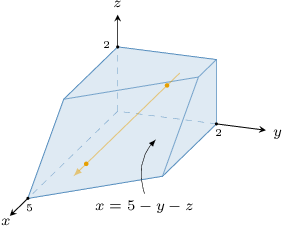
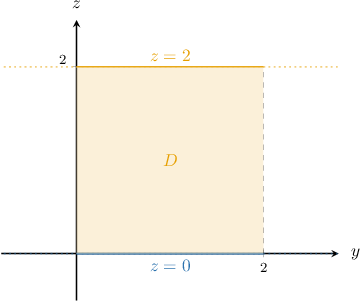
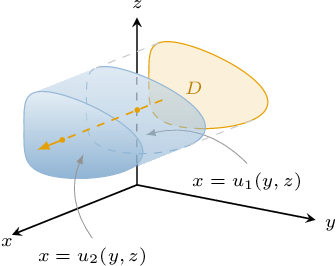
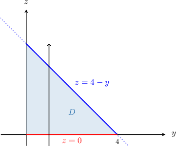
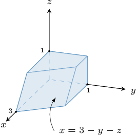
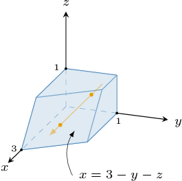
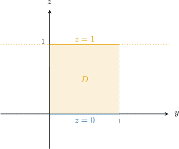

# Triple Integrals Over Type II Regions

Source: https://www.mathacademy.com/topics/2141?courseId=155
Topic ID: 2141

## Prerequisites

- [Triple Integrals Over Type I Regions](./4146-triple-integrals-over-type-i-regions.md)

## Lesson

### Introduction

Let's evaluate the triple integral

where the region is shown below.

The region is a type II region. So, our first task is to fully describe this region.

We start by drawing an arrow parallel to the -axis that

- enters the region through the *back* surface and

- leaves the region through the *front* surface

as shown below.

So, our solid can be written as the type II region

where

is the projection of onto the -plane, shown below.

To evaluate our triple integral, we start by expressing it as a mixed integral:

Now, since the region is a type I plane region, we can express the region as

and therefore, our mixed integral can be written as the following repeated integral:

Evaluating this using the usual methods, we get

Therefore, we conclude that

### Example: Representing a Triple Integral as a Mixed or Repeated Integral

#### Question

Find the missing limits in the repeated integral below

$$

\displaystyle \iiint \limits_{R} f(x,y,z) \: \textrm{d}V = \int_{\ast}^{\ast} \int_{\ast}^{\ast} \int_{\ast}^{\ast} f(x,y,z) \: \mathrm{d}x \: \mathrm{d}z \: \mathrm{d}y

$$

where $R$ is the type II region defined as

$$

R=\left\{ (x,y,z) \: : \: 1 \leq y \leq 4, \: -y^2 \leq z \leq \sqrt{y}, \: -2 \leq x \leq ye^{z+2} \right\}.

$$

#### Explanation

A type II region in three-dimensional space can be written as

$$

R = \big\{ (x,y,z) \: : \: (y,z) \in D, \: u_1(y,z) \leq x \leq u_2(y,z) \big\}.

$$

A typical three-dimensional type II region can be visualized schematically, as shown below.

If $R$ is a type II region, we can express the triple integral of $f(x,y,z)$ over $R$ as a mixed integral, as follows:

$$

\iiint\limits_{R} f(x,y,z)\,\textrm d V = \iint\limits_{D} \left[\int_{u_1(y,z)}^{u_2(y,z)} f(x,y,z)\,\textrm{d}x \right]\,\textrm d A

$$

In our case, we have

$$

u_1(y,z) = -2, \qquad u_2(y,z) = ye^{z+2}.

$$

Therefore, our triple integral can be written as

$$

\displaystyle \iiint \limits_{R} f(x,y,z) \: \textrm{d}V = \iint\limits_{D} \left[ \int_{-2}^{ye^{z+2}} f(x,y,z) \: \mathrm{d}x \right] \mathrm{d}A.

$$

Now, the region $D$ is given by

$$

D =\left\{ (x,y) \: : \: 1 \leq y \leq 4, \: -y^2 \leq z \leq \sqrt{y} \right\}.

$$

Therefore, by expressing the double integral over $D$ as a repeated integral, we get

$$

\begin{aligned}\underset{𝐷}{∬}[∫_{𝑦𝑒^{𝑧+2}−2}^{}𝑓(𝑥,𝑦,𝑧)\,d𝑥]d𝐴 & =∫_{41}^{}∫_{\sqrt{√𝑦}−𝑦^{2}}^{}[∫_{𝑦𝑒^{𝑧+2}−2}^{}𝑓(𝑥,𝑦,𝑧)\,d𝑥]d𝑧\,d𝑦 \\ & =∫_{41}^{}∫_{\sqrt{√𝑦}−𝑦^{2}}^{}∫_{𝑦𝑒^{𝑧+2}−2}^{}𝑓(𝑥,𝑦,𝑧)\,d𝑥\,d𝑧\,d𝑦.\end{aligned}

$$

### Example: Evaluating a Mixed Integral

#### Question

Evaluate the mixed integral

$$

\displaystyle \iint\limits_D \left[ \int_{0}^{z} \dfrac{\cos (2y)}{1-y} \,\textrm{d}x \right] \textrm{d}A

$$

where the region $D$ in the $yz$-plane is given by

$$

D = \left\{ (y,z) \, : \, 0 \leq y \leq \dfrac{\pi}{6}, \: 0 \leq z \leq 2\sqrt{1-y} \right\}.

$$

#### Explanation

First, we evaluate the inner integral with respect to $x,$ treating $y$ and $z$ as constants:

$$

\begin{aligned}\underset{𝐷}{∬}[∫_{𝑧0}^{}\frac{cos⁡(2𝑦)}{1−𝑦}\,d𝑥]\,d𝐴 & =\underset{𝐷}{∬}\frac{cos⁡(2𝑦)}{1−𝑦}[𝑥]_{𝑥=𝑧𝑥=0}^{}\,d𝐴 \\ & =\underset{𝐷}{∬}\frac{cos⁡(2𝑦)}{1−𝑦}(𝑧−0)\,d𝐴 \\ & =\underset{𝐷}{∬}\frac{𝑧cos⁡(2𝑦)}{1−𝑦}\,d𝐴\end{aligned}

$$

Next, we evaluate the double integral:

$$

\begin{aligned}\underset{𝐷}{∬}\frac{𝑧cos⁡(2𝑦)}{1−𝑦}\,d𝐴 & =∫_{𝜋/60}^{}∫_{2\sqrt{√1−𝑦}0}^{}\frac{𝑧cos⁡(2𝑦)}{1−𝑦}\,d𝑧\,d𝑦 \\ & =∫_{𝜋/60}^{}\frac{cos⁡(2𝑦)}{1−𝑦}[\frac{𝑧^{2}}{2}]_{𝑧=2\sqrt{√1−𝑦}𝑧=0}^{}\,d𝑦 \\ & =∫_{𝜋/60}^{}\frac{cos⁡(2𝑦)}{1−𝑦}(\frac{4(1−𝑦)}{2}−0)\,d𝑦 \\ & =∫_{𝜋/60}^{}2cos⁡(2𝑦)\,d𝑦 \\ & =[sin⁡(2𝑦)]_{𝑦=𝜋/6𝑦=0}^{} \\ & =sin⁡(\frac{𝜋}{3})−sin⁡(0) \\ & =\frac{\sqrt{√3}}{2}\end{aligned}

$$

### Example: Evaluating a Triple Integral Over a Type II Region

#### Question

Evaluate the triple integral

$$

\displaystyle \iiint\limits_R 4x^3 \: \mathrm{d}V

$$

where the region $R$ is given by

$$

R = \left\{ (x,y,z) \: : \: (y,z) \in D, \: 0 \leq x \leq \sqrt{y} \right\},

$$

and $D$ is a finite region in $yz$-plane enclosed between the $y$-axis, the $z$-axis, and the line $z = 4-y$ in the first quadrant.

#### Explanation

Writing down our triple integral as a mixed integral, we obtain

$$

\displaystyle \iiint \limits_{R} 4x^3 \, \textrm{d}V = \iint\limits_{D} \left[ \int_{0}^{\sqrt{y}} 4x^3 \, \mathrm{d}x \right] \mathrm{d}A.

$$

First, we evaluate the inner integral with respect to $x,$ treating $y$ and $z$ as constants:

$$

\begin{aligned}\underset{𝐷}{∬}[∫_{\sqrt{√𝑦}0}^{}4𝑥^{3}\,d𝑥]d𝐴 & =\underset{𝐷}{∬}[𝑥^{4}]_{𝑥=\sqrt{√𝑦}𝑥=0}^{}\,d𝐴 \\ & =\underset{𝐷}{∬}(\sqrt{√𝑦})^{4}\,d𝐴 \\ & =\underset{𝐷}{∬}𝑦^{2}\,d𝐴\end{aligned}

$$

We must now evaluate this double integral over the region $D$ in the $yz$-plane shown below.

We can evaluate our double integral as follows:

$$

\begin{aligned}\underset{𝐷}{∬}𝑦^{2}\,d𝐴 & =∫_{40}^{}∫_{4−𝑦0}^{}𝑦^{2}\,d𝑧\,d𝑦 \\ & =∫_{40}^{}[∫_{4−𝑦0}^{}𝑦^{2}\,d𝑧]d𝑦 \\ & =∫_{40}^{}[𝑦^{2}𝑧]_{𝑧=4−𝑦𝑧=0}^{}d𝑦 \\ & =∫_{40}^{}𝑦^{2}(4−𝑦)\,d𝑦 \\ & =∫_{40}^{}4𝑦^{2}−𝑦^{3}\,d𝑦 \\ & =[\frac{4}{3}𝑦^{3}−\frac{1}{4}𝑦^{4}]_{𝑦=4𝑦=0}^{} \\ & =\frac{4}{3}(64−0)−\frac{1}{4}(256−0) \\ & =\frac{64}{3}\end{aligned}

$$

### Skipping the Intermediate Step

When writing down a triple integral as a repeated integral, we can often skip the intermediate step of expressing our triple integral as a mixed integral.

For example, suppose we wish to evaluate

$$

\displaystyle \iiint\limits_R f(x,y,z) \: \mathrm{d}V

$$

where $R$ is the type II region given by

$$

R = \left\{ (x,y,z) \: : \: {\color{red}a} \leq y \leq {\color{red}b}, \: {\color{blue}v_1(y)} \leq z \leq {\color{blue}v_2(y)}, \: {\color{purple}u_1(y,z)} \leq x \leq {\color{purple}u_2(y,z)} \right\}.

$$

Notice that the projection of $R$ onto the $yz$-plane is a type I plane region. Therefore, we can immediately express our triple integral as a repeated integral as follows:

$$

\displaystyle \iiint \limits_{R} f(x,y,z)\: \textrm{d}V = \int_{\color{red}a}^{\color{red}b} \int_{\color{blue}v_1(y)}^{\color{blue}v_2(y)} \int_{\color{purple}u_1(y,z)}^{\color{purple}u_2(y,z)} f(x,y,z)\: \mathrm{d}x \: \mathrm{d}z \: \mathrm{d}y.

$$

### Example: Evaluating a Triple Integral Over a Type II Region Given a Diagram

#### Question

Evaluate the triple integral $\displaystyle \iiint\limits_R 12z^2 \: \mathrm{d}V$ over the region $R,$ shown above.

**

#### Explanation

Notice that our solid can be written as the type II region

$$

R = \big\{ (x,y,z) \: : \: (y,z) \in D, \:\: 0 \leq x \leq 3-y-z \big\},

$$

where

$$

D = \big\{ (y,z) \: : \: 0 \leq y \leq 1, \:\: 0 \leq z \leq 1 \big\}

$$

is the projection of $R$ onto the $yz$-plane, shown below.

Hence, we can express the region $R$ as

$$

R = \big\{ (x,y,z) \: : \: 0 \leq y \leq 1, \:\: 0 \leq z \leq 1, \:\: 0 \leq x \leq 3-y-z \big\}

$$

As a result, by writing down our triple integral as a repeated integral, we obtain

$$

\iiint \limits_{R} 12z^2 \: \textrm{d}V = \int_{0}^{1} \int_{0}^{1} \int_{0}^{3-y-z} 12z^2 \: \mathrm{d}x \: \mathrm{d}z \: \mathrm{d}y.

$$

First, we evaluate the inner integral with respect to $x$, treating $y$ and $z$ as constants:

$$

\begin{aligned}∫_{10}^{}∫_{10}^{}∫_{3−𝑦−𝑧0}^{}12𝑧^{2}\,d𝑥\,d𝑧\,d𝑦 & =∫_{10}^{}∫_{10}^{}[∫_{3−𝑦−𝑧0}^{}12𝑧^{2}\,d𝑥]d𝑧\,d𝑦 \\ & =∫_{10}^{}∫_{10}^{}12𝑧^{2}[𝑥]_{𝑥=3−𝑦−𝑧𝑥=0}^{}\,d𝑧\,d𝑦 \\ & =∫_{10}^{}∫_{10}^{}12𝑧^{2}(3−𝑦−𝑧)\,d𝑧\,d𝑦 \\ & =∫_{10}^{}∫_{10}^{}(36𝑧^{2}−12𝑦𝑧^{2}−12𝑧^{3})\,d𝑧\,d𝑦\end{aligned}

$$

Next, we evaluate the inner integral with respect to $z$, treating $y$ as a constant:

$$

\begin{aligned}∫_{10}^{}∫_{10}^{}(36𝑧^{2}−12𝑦𝑧^{2}−12𝑧^{3})\,d𝑧\,d𝑦 & =∫_{10}^{}[∫_{10}^{}(36𝑧^{2}−12𝑦𝑧^{2}−12𝑧^{3})\,d𝑧]d𝑦 \\ & =∫_{10}^{}[12𝑧^{3}−4𝑦𝑧^{3}−3𝑧^{4}]_{𝑧=1𝑧=0}^{}\,d𝑦 \\ & =∫_{10}^{}(12−4𝑦−3)\,d𝑦 \\ & =∫_{10}^{}(9−4𝑦)\,d𝑦\end{aligned}

$$

Finally, we integrate with respect to $y{:}$

$$

\begin{aligned}∫_{10}^{}(9−4𝑦)\,d𝑦 & =[9𝑦−2𝑦^{2}]_{𝑦=1𝑦=0}^{} \\ & =(9−2)−0 \\ & =7\end{aligned}

$$
