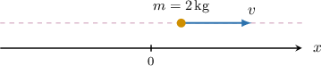

# Newton's Second Law

Source: https://www.mathacademy.com/topics/2722?courseId=155
Topic ID: 2722

## Prerequisites

- [Determining Characteristics of Moving Objects Using Differentiation](../ap-calculus-ab/3581-determining-characteristics-of-moving-objects-using-differentiation.md)

## Lesson

### Introduction

Consider a particle that moves along the $x$-axis. **Newton's second law** states that the **resultant force** acting on the particle equals the product of its mass and acceleration:

$$

F = ma

$$

where $F$ is the resultant force, measured in **Newtons** $(\text N),$ $m$ is the mass, measured in $\textrm{kg},$ and $a$ is the acceleration, measured in $\textrm{m/s}^2.$

Note the following:

- Force, like acceleration, is a *vector* quantity. For one-dimensional motion, a positive value of $F$ means the force acts to the right (in the direction of increasing $x$), and a negative value of $F$ means the force acts to the left.

- The term "resultant force" means the (vector) sum of forces acting on the particle.

- The equation $F=ma$ tells us that $1\,\textrm{N}$ is the total force required to accelerate a mass of $m = 1\,\textrm{kg}$ at a rate of $a = 1\,\textrm{m/s}^2.$

- When the motion is one-dimensional, the **magnitude** of a force is given by its absolute value.

Let's see a concrete example.

### A Concrete Example

Suppose that a body of mass $2 \, \textrm{kg}$ is moving in a straight line along the $x$-axis under the action of a single force $F,$ measured in Newtons. At time $t$ seconds, the body's velocity is given by $v(t) = t^2+e^{-t}$ meters per second.

Let's find an expression for the force acting on the body at time $t.$

Recall that the force, mass, and acceleration of a particle are connected by Newton's second law, given by

$$

F=ma

$$

where $F$ is the force, $m$ is the mass, and $a$ is the acceleration.

For our example above, we first need to compute the acceleration $a(t)$ by differentiating the velocity $v(t){:}$

$$

\begin{aligned}𝑎(𝑡) & =\frac{d𝑣}{d𝑡} \\ & =\frac{d}{d𝑡}(𝑡^{2}+𝑒^{−𝑡}) \\ & =2𝑡−𝑒^{−𝑡}\end{aligned}

$$

Therefore, the force acting on the particle at time $t,$ measured in Newtons, is

$$

\begin{aligned}𝐹 & =𝑚𝑎 \\ & =2⋅(2𝑡−𝑒^{−𝑡}) \\ & =4𝑡−2𝑒^{−𝑡}.\end{aligned}

$$

### Example: Calculating the Force Acting on a Body Given Its Velocity

#### Question

A body of mass $3 \, \textrm{kg}$ is moving in a straight line along the $x$-axis under the action of a single force $F,$ measured in Newtons $(\textrm{N}).$ At time $t$ seconds, the velocity of the body is given by $v(t) =t^2- e^{t-4}$ meters per second. Calculate the magnitude of the force at time $t=4$ seconds.

#### Explanation

According to Newton’s second law

$$

F=ma,

$$

where $F$ is the force, $m$ is the mass, and $a$ is the acceleration.

To find the acceleration $a(t),$ we differentiate the velocity $v(t){:}$

$$

\begin{aligned}𝑎(𝑡) & =\frac{d𝑣}{d𝑡} \\ & =\frac{d}{d𝑡}(𝑡^{2}−𝑒^{𝑡−4}) \\ & =2𝑡−𝑒^{𝑡−4}\end{aligned}

$$

As a result, the acceleration at $t=4 \, \textrm{s}$ is

$$

\begin{aligned}𝑎 & =2(4)−𝑒^{4−4} \\ & =8−1 \\ & =7\,m/s^{2}.\end{aligned}

$$

Therefore, the force, in Newtons, is

$$

\begin{aligned}𝐹 & =𝑚𝑎 \\ & =3⋅(7) \\ & =21.\end{aligned}

$$

Finally, the magnitude of the force is

$$

|F| = |21| = 21 \, \textrm{N}.

$$

### Example: Calculating the Force Acting on a Body Given Its Displacement

#### Question

A body of mass $2 \, \textrm{kg}$ is moving in a straight line along the $x$-axis under the action of a single force $F,$ measured in Newtons. At time $t$ seconds, the position of the body is given by $s(t) = e^{3t-6} + t^2$ meters. Find the expression for the force acting on the body at time $t.$

#### Explanation

According to Newton’s second law

$$

F=ma,

$$

where $F$ is the force, $m$ is the mass, and $a$ is the acceleration.

To find the velocity $v(t),$ we differentiate the displacement $s(t){:}$

$$

\begin{aligned}𝑣(𝑡) & =\frac{d𝑠}{d𝑡} \\ & =\frac{d}{d𝑡}(𝑒^{3𝑡−6}+𝑡^{2}) \\ & =3𝑒^{3𝑡−6}+2𝑡\end{aligned}

$$

To find the acceleration $a(t),$ we differentiate the velocity $v(t){:}$

$$

\begin{aligned}𝑎(𝑡) & =\frac{d𝑣}{d𝑡} \\ & =\frac{d}{d𝑡}(3𝑒^{3𝑡−6}+2𝑡) \\ & =9𝑒^{3𝑡−6}+2\end{aligned}

$$

Therefore, the force acting on the body, in Newtons, is

$$

\begin{aligned}𝐹 & =𝑚𝑎 \\ & =2⋅(9𝑒^{3𝑡−6}+2) \\ & =18𝑒^{3𝑡−6}+4.\end{aligned}

$$

### Example: Determining Moments When a Force Has Zero Magnitude

#### Question

A body of mass $2 \, \textrm{kg}$ moves in a straight line along the $x$-axis under the action of a single force $F,$ measured in Newtons. At time $t\geq 0$ seconds, the velocity of the body is given by $v(t) =2t^3-12t^2-30t+5$ meters per second. Calculate the time when the force acting on the body has a magnitude of zero.

#### Explanation

According to Newton’s second law

$$

F=ma,

$$

where $F$ is the force, $m$ is the mass, and $a$ is the acceleration.

To find the acceleration $a(t),$ we differentiate the velocity $v(t){:}$

$$

\begin{aligned}𝑎(𝑡) & =\frac{d𝑣}{d𝑡} \\ & =\frac{d}{d𝑡}(2𝑡^{3}−12𝑡^{2}−30𝑡+5) \\ & =6𝑡^{2}−24𝑡−30\end{aligned}

$$

Since the mass is always positive, the force has zero magnitude when the acceleration equals zero. So, we set $a(t)=0$ and solve for $t{:}$

$$

\begin{aligned}6𝑡^{2}−24𝑡−30 & =0 \\ 𝑡^{2}−4𝑡−5 & =0 \\ (𝑡+1)(𝑡−5) & =0 \\ 𝑡 & =−1,\,5\end{aligned}

$$

Since $t \geq 0,$ we disregard the negative solution.

Therefore, the force has zero magnitude when $t=5 \, \textrm{s}.$
