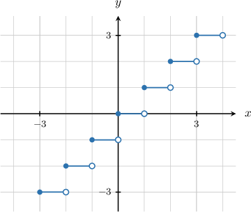
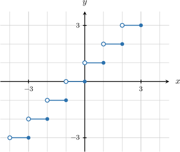

# The Floor and Ceiling Functions

Source: https://www.mathacademy.com/topics/290?courseId=155
Topic ID: 290

## Prerequisites

- [Special Sets](../linear-algebra/47-special-sets.md)
- [The Natural Logarithm](../algebra-ii/818-the-natural-logarithm.md)
- [Exponential Functions](../algebra-i/1153-exponential-functions.md)
- [Evaluating Rational Expressions](../grade-7/2183-evaluating-rational-expressions.md)

## Lesson

### Introduction

The **greatest integer function** (also called the **floor function**) is denoted

$$

f(x)=\lfloor x \rfloor.

$$

This function returns the greatest integer less than or equal to $x,$ where $x\in\mathbb R.$

$$

\lfloor x \rfloor=n \quad \textrm{where}\quad n \leq x < n+1, \quad n\in\mathbb Z

$$

To demonstrate how to evaluate the floor function in practice, let's look at a few different cases:

- If $x$ is an integer, then $\lfloor x \rfloor = x{:}$

- If $x > 0$ but is not an integer, then we simply return the whole number part:

- If $x < 0$ but is not an integer, then we subtract one from the whole number part:

We can also plot the floor function. According to the definition, we have the following:

$$

\begin{aligned}⌊𝑥⌋=−2 & \,for\,𝑥∈[−2,−1) \\ ⌊𝑥⌋=−1 & \,for\,𝑥∈[−1,0) \\ ⌊𝑥⌋=0 & \,for\,𝑥∈[0,1) \\ ⌊𝑥⌋=1 & \,for\,𝑥∈[1,2) \\ ⌊𝑥⌋=2 & \,for\,𝑥∈[2,3)\end{aligned}

$$

And so on. We can use these results to plot the graph of $f(x)=\lfloor x \rfloor{:}$

### Example: Evaluating the Floor Function

#### Question

If $f(x)=2x+\left\lfloor \dfrac{x}{5} \right\rfloor,$ then what is the value of $f(-0.5)?$

#### Explanation

Suppose $x$ is a real number. The greatest integer (or floor) function $\lfloor x \rfloor$ equals the greatest integer that is smaller than or equal to $x{:}$

$$

\lfloor x \rfloor = n, \quad\text{where}\quad n \leq x \lt n+1,\quad n\in \mathbb Z

$$

Evaluating $f(x)$ at $x=-0.5,$ we get

$$

\begin{aligned}𝑓(−0.5) & =2⋅(−0.5)+⌊\frac{−0.5}{5}⌋ \\ & =−1+⌊−0.1⌋.\end{aligned}

$$

Now, from the definition of the greatest integer function we have

$$

\begin{aligned}⌊−0.1⌋=−1.\end{aligned}

$$

Therefore, we conclude that

$$

\begin{aligned}𝑓(−0.5) & =−1+⌊−0.1⌋ \\ & =−1+(−1) \\ & =−2.\end{aligned}

$$

### Example: Evaluating the Floor Function in More Complex Cases

#### Question

Find the value of $f(x) = \dfrac{e^{\left\lfloor x+2 \right\rfloor}}{2x+1}$ at $x = 0.75.$ Round your answer to $2$ decimal places.

#### Explanation

Suppose $x$ is a real number. The greatest integer (or floor) function $\lfloor x \rfloor$ equals the greatest integer that is less than or equal to $x{:}$

$$

\lfloor x \rfloor = n, \quad\text{where}\quad n \leq x \lt n+1,\quad n\in \mathbb Z

$$

Evaluating $f(x)$ at $x = 0.75,$ we get

$$

\begin{aligned}𝑓(0.75) & =\frac{𝑒^{⌊0.75+2⌋}}{2(0.75)+1} \\ & =\frac{𝑒^{⌊2.75⌋}}{2.5}.\end{aligned}

$$

Now, from the definition of the greatest integer function, we have

$$

\left\lfloor 2.75\right\rfloor = 2.

$$

Therefore, we conclude that

$$

\begin{aligned}𝑓(0.75) & =\frac{𝑒^{⌊2.75⌋}}{2.5} \\ & =\frac{𝑒^{2}}{2.5} \\ & =2.955\,62… \\ & ≈2.96,\end{aligned}

$$

rounded to $2$ decimal places.

### The Ceiling Function

The **least integer function** (also called the **ceiling function**) is denoted

$$

f(x)=\lceil x \rceil.

$$

This function returns the smallest integer greater than or equal to $x.$ The domain of the ceiling function is $\mathbb R.$

$$

\lceil x \rceil =n \quad \textrm{where}\quad n-1 < x \leq n, \quad n\in\mathbb Z

$$

To demonstrate how to evaluate the ceiling function in practice, let's look at a few different cases:

- If $x$ is an integer, then $\lceil x \rceil = x{:}$

- If $x > 0$ but is not an integer, then we add one to the whole number part:

- If $x < 0$ but is not an integer, then we simply return the whole number part:

We can also plot the ceiling function. According to the definition, we have the following:

$$

\begin{aligned}⌈𝑥⌉=−2 & \,for\,𝑥∈(−3,−2] \\ ⌈𝑥⌉=−1 & \,for\,𝑥∈(−2,−1] \\ ⌈𝑥⌉=0 & \,for\,𝑥∈(−1,0] \\ ⌈𝑥⌉=1 & \,for\,𝑥∈(0,1] \\ ⌈𝑥⌉=2 & \,for\,𝑥∈(1,2]\end{aligned}

$$

And so on. We can use these results to plot the graph of $f(x)=\lceil x \rceil{:}$

### Example: Evaluating the Ceiling Function

#### Question

Find the value of $f(x)=(\lceil 6x-3 \rceil -2)^3$ at $x=0.4.$

#### Explanation

Suppose that $x$ is a real number. The least integer (or ceiling) function $\lceil x \rceil$ equals the smallest integer that is greater than or equal to $x{:}$

$$

\lceil x \rceil = n, \quad\text{where}\quad n-1 \lt x \leq n, \quad n\in\mathbb Z

$$

Evaluating $f(x)$ at $x=0.4,$ we get

$$

\begin{aligned}𝑓(0.4) & =(⌈6(0.4)−3⌉−2)^{3} \\ & =(⌈2.4−3⌉−2)^{3} \\ & =(⌈−0.6⌉−2)^{3}\end{aligned}

$$

Now, from the definition of the least integer function, we have

$$

\lceil -0.6 \rceil = 0.

$$

Therefore, we conclude that

$$

\begin{aligned}𝑓(0.4) & =(⌈−0.6⌉−2)^{3} \\ & =(0−2)^{3} \\ & =(−2)^{3} \\ & =−8.\end{aligned}

$$

### Example: Evaluating the Ceiling Function in More Complex Cases

#### Question

Find the value of $f(x) = \left \lceil e^{6x-5} \right \rceil$ at $x = 1.25.$

#### Explanation

Suppose that $x$ is a real number. The least integer (or ceiling) function $\lceil x \rceil$ equals the smallest integer that is greater than or equal to $x{:}$

$$

\lceil x \rceil = n, \quad\text{where}\quad n-1 \lt x \leq n, \quad n\in\mathbb Z

$$

Evaluating $f(x)$ at $x = 1.25,$ we get

$$

\begin{aligned}𝑓(1.25) & =⌈𝑒^{6(1.25)−5}⌉ \\ & =⌈𝑒^{7.5−5}⌉ \\ & =⌈𝑒^{2.5}⌉.\end{aligned}

$$

Now, from the definition of the least integer function, we have

$$

\left \lceil e^{2.5} \right \rceil = \left \lceil 12.182\,49 \ldots \right \rceil = 13.

$$

Therefore, we conclude that

$$

\begin{aligned}𝑓(1.25) & =⌈𝑒^{2.5}⌉ \\ & =13.\end{aligned}

$$
