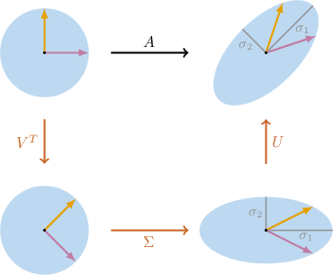

# Singular Value Decomposition of 2x2 Matrices

Source: https://www.mathacademy.com/topics/3132?courseId=155
Topic ID: 3132

## Prerequisites

- [Computing the Singular Values of a Matrix](./3819-computing-the-singular-values-of-a-matrix.md)

## Lesson

### Introduction

The **singular value decomposition** (or SVD) of an $m \times n$ matrix $A$ is a factorization of the form

$$

A=U \Sigma V^T,

$$

where

- $\Sigma$ is an $m \times n$ matrix with the singular values of $A$ (ordered from largest to smallest) on the main diagonal and zeroes outside the main diagonal,

- $U$ is an orthogonal $m \times m$ matrix, and

- $V$ is an orthogonal $n \times n$ matrix.

The columns of $U$ are called the **left singular vectors** of $A,$ and the columns of $V$ are called the **right singular vectors** of $A.$

For example, the matrix

$$

[\begin{aligned}1 & 3 \\ −3 & −1\end{aligned}]

$$

has the following singular value decomposition:

$$

\begin{aligned}\frac{1}{\sqrt{√2}} & \frac{1}{\sqrt{√2}} \\ −\frac{1}{\sqrt{√2}} & \frac{1}{\sqrt{√2}}\end{aligned}

$$

The singular value decomposition of a matrix $A$ can be thought of as a type of diagonalization that works for *any* $m\times n$ matrix! It's also one of linear algebra's most useful forms of matrix factorization with applications in statistics, image compression, machine learning, and more.

### Example: Identifying True Statements Regarding Singular Value Decomposition

#### Question

$$

\begin{aligned}−\frac{1}{\sqrt{√10}} & \,∗\, \\ \frac{3}{\sqrt{√10}} & \,∗\,\end{aligned}

$$

Consider the matrix $U$ shown above. Given that $A=U \Sigma V^T$ is a singular value decomposition of a $2\times2$ matrix $A,$ which of the following could be the second column of the matrix $U?$

$$

\begin{aligned}\frac{1}{\sqrt{√5}} \\ \frac{2}{\sqrt{√5}}\end{aligned}

$$

#### Explanation

Recall that since $A=U \Sigma V^T$ is a singular value decomposition of a $2\times2$ matrix $A,$ the matrix $U$ must be a $2\times 2$ orthogonal matrix. This means that

- the first column must be orthogonal to the second column, and

- the norm of the second column must be equal to $1.$

Among the given options, only the vector $\begin{aligned}\frac{3}{\sqrt{√10}} \\ \frac{1}{\sqrt{√10}}\end{aligned}$ has both properties.

### Finding the Second and Third Matrices of a Singular Value Decomposition

Suppose that $A$ is an $m\times n$ matrix, and

$$

A= U\Sigma V^T

$$

is a singular value decomposition of $A.$ Let's describe how to find the matrices $V$ and $\Sigma$ of this singular value decomposition.

Notice that if we compute $A^TA,$ we get

$$

\begin{aligned}𝐴^{𝑇}\,𝐴 & =(𝑈Σ𝑉^{𝑇})^{𝑇}(𝑈Σ𝑉^{𝑇}) \\ & =(𝑉Σ^{𝑇}\,𝑈^{𝑇})(𝑈Σ𝑉^{𝑇}) \\ & =𝑉Σ^{𝑇}(𝑈^{𝑇}\,𝑈)Σ𝑉^{𝑇} \\ & =𝑉Σ^{𝑇}(𝐼_{𝑛})Σ𝑉^{𝑇} \\ & =𝑉(Σ^{𝑇}\,Σ)𝑉^{𝑇}.\end{aligned}

$$

From here, we note that $A^T \! A$ is always symmetric, and that $\Sigma^T \! \Sigma$ is a diagonal matrix with the squares of the singular values on the main diagonal. As a result,

$$

A^TA = V\left( \Sigma^T \Sigma\right) V^T

$$

is an orthogonal diagonalization of the symmetric matrix $A^T \! A.$ So, to find the matrix $V$ in our SVD, we need to orthogonally diagonalize $A^T A.$

Let's demonstrate how this works in practice by computing the matrices $\Sigma$ and $V$ in the SVD of the matrix $A,$ given by

$$

[\begin{aligned}2 & −3 \\ 0 & 2\end{aligned}]

$$

We proceed as follows:

- Computing $A^T \! A,$ we obtain

- Solving the characteristic equation $|A^T \! A - \lambda I| = 0,$ we get the eigenvalues of $A^T \! A \mathbin{:}$ So, the corresponding singular values are

We now find a unit eigenvector basis of $A^T \! A.$ These unit eigenvectors will be the columns of our matrix $V$ in the orthogonal diagonalization of $A^T \! A$.

- Computing $(A^T \! A - {\color{blue}\lambda_1} I),$ we obtain Seeking a unit solution of $(A^T\! A - 16I)\mathbf{v} = \mathbf{0},$ we get

- Computing $(A^T \! A - {\color{red}\lambda_2} I),$ we obtain Seeking a unit solution of $(A^T\! A - I)\mathbf{v} = \mathbf{0},$ we get

Finally, we construct the matrices $\Sigma$ and $V\mathbin{:}$

$$

[\begin{aligned}4 & 0 \\ 0 & 1\end{aligned}]

$$

### Example: Finding the Columns of the Third Matrix Given Part of a Singular Value Decomposition

#### Question

$$

[\begin{aligned}17 & 8 \\ 8 & 17\end{aligned}]

$$

Consider the matrices shown above. Given that $A=U \Sigma V^T$ is a singular value decomposition of $A,$ what is the value of $|v_{11}|+|v_{21}|?$

#### Explanation

If $A=U \Sigma V^T$ is a singular value decomposition of $A,$ the columns of $V$ must be the right singular vectors of $A,$ i.e., the unit eigenvectors of the matrix $A^T \! A.$

From the matrix $\Sigma,$ we deduce that the singular values are $\sigma_1=5$ and $\sigma_2=3.$ So, the first column of $V$ corresponds to the singular value $\sigma_1=5.$

Hence, we need to find a unit eigenvector of $A^T \!A$ corresponding to $\lambda_1 = \sigma_1^2=25.$ Computing $A^T \! A - 25 I,$ we get

$$

[\begin{aligned}17 & 8 \\ 8 & 17\end{aligned}]

$$

Seeking a non-zero solution of $(A^T\!A-25I)\mathbf{v}=\mathbf{0}$ gives the eigenvector $[\begin{aligned}1 \\ 1\end{aligned}]$ Dividing $\mathbf{v}$ by its norm, we get

$$

[\begin{aligned}1 \\ 1\end{aligned}]

$$

Therefore,

$$

|v_{11}|+|v_{21}| = \left| \dfrac{1}{\sqrt{2}} \right| + \left| \dfrac{1}{\sqrt{2}} \right| = \sqrt{2}.

$$

### Finding the First Matrix of a Singular Value Decomposition

Suppose that is an matrix, and

is a singular value decomposition of Let's now describe how to compute the matrix of the SVD using the matrices and

Recall that is orthogonal, meaning that Consequently, multiplying by on the right, we obtain

In expanded form, our final equation looks as follows:

Therefore,

for Finally, provided that we obtain

We can use this to find the columns of the matrix Let's see an example.

### Calculating the First Matrix - A Worked Example

Consider the matrices $A,$ $\Sigma,$ and $V$ shown below.

$$

[\begin{aligned}3 & 8 \\ 0 & 3\end{aligned}]

$$

Suppose we're given that $A=U \Sigma V^T$ is a singular value decomposition of $A.$ Let's use this information to find the matrix $U.$

From the matrix $\Sigma,$ we deduce that the singular values are $\color{blue}\sigma_1=9$ and $\color{red}\sigma_2=1.$

Earlier, we saw that the columns of $\mathbf u$ are given by

$$

\mathbf{u}_i = \dfrac{1}{\sigma_i} A\mathbf{v}_i

$$

where $\mathbf u_i$ and $\mathbf v_i$ are the $i$th columns of the matrices $U$ and $V,$ respectively. Therefore, we compute the columns of $\mathbf u$ as follows:

- First, we compute the vector $\mathbf u_1\mathbin{:}$

- Then, we compute the vector $\mathbf u_2\mathbin{:}$

As a result, the matrix $U$ in our singular value decomposition of $A$ is given by

$$

\begin{aligned}\frac{3}{\sqrt{√10}} & −\frac{1}{\sqrt{√10}} \\ \frac{1}{\sqrt{√10}} & \frac{3}{\sqrt{√10}}\end{aligned}

$$

### Example: Determining the Columns of the First Matrix Given Part of a Singular Value Decomposition

#### Question

$$

[\begin{aligned}6 & −5 \\ 0 & 6\end{aligned}]

$$

Consider the matrices $A,$ $\Sigma,$ and $V$ shown above. Given that $A=U \Sigma V^T$ is a singular value decomposition of $A,$ what is the second column of $U?$

#### Explanation

Recall that if $A=U \Sigma V^T$ is a singular value decomposition of $A,$ and $\sigma_i \neq 0,$ then the $i$th column of $U$ can be found as

$$

\mathbf{u}_i = \dfrac{1}{\sigma_i} A\mathbf{v}_i,

$$

where $\mathbf v_i$ is the $i$th column of the matrix $V.$

From the matrix $\Sigma,$ we deduce that the singular values are $\sigma_1=9$ and $\sigma_2=4.$ Therefore, the second column of $U$ is

$$

\begin{aligned}𝐮_{2} & =\frac{1}{𝜎_{2}}𝐴𝐯_{2} \\ & =\frac{1}{4}[\begin{aligned}6 & −5 \\ 0 & 6\end{aligned}]\begin{aligned}\frac{3}{\sqrt{√13}} \\ \frac{2}{\sqrt{√13}}\end{aligned} \\ & =\frac{1}{4}\begin{aligned}\frac{8}{\sqrt{√13}} \\ \frac{12}{\sqrt{√13}}\end{aligned} \\ & =\begin{aligned}\frac{2}{\sqrt{√13}} \\ \frac{3}{\sqrt{√13}}\end{aligned}.\end{aligned}

$$

### An Algorithm for Finding a Singular Value Decomposition

We can now fully describe the algorithm for computing the singular value decomposition of $A.$

- **Step 1.** Compute $A^T \! A.$

- **Step 2.** Find the singular values. This allows us to construct the second matrix $\Sigma.$

- **Step 3.** Find the right singular vectors of $A$ (i.e., the unit eigenvectors of $A^T \! A$). This allows us to construct the third matrix $V.$

- **Step 4.** Find the left singular vectors of $A$ using the singular values, right singular vectors, and the formula where $\mathbf u_i$ and $\mathbf v_i$ are the $i$th columns of the matrices $U$ and $V,$ respectively. This allows us to construct the matrix $U.$

Consider the matrices $A$ and $\Sigma$ shown below. Given that $A=U \Sigma V^T$ is a singular value decomposition of $A,$ let's find the matrices $U$ and $V.$

$$

[\begin{aligned}5 & −8 \\ 8 & 7\end{aligned}]

$$

We find the singular value decomposition of $A$ using our algorithm.

- **Step 1.** Compute $A^T \! A\mathbin{:}$

- **Step 2.** Find the singular values: From the matrix $\Sigma,$ we deduce that $\color{blue}\sigma_1=11$ and $\color{red}\sigma_2=9.$

- **Step 3.** Find the right singular vectors of $A$ (i.e., the unit eigenvectors of $A^T \! A$): Seeking a unit solution of $(A^T \! A - 121I)\mathbf{v}=\mathbf{0}$ gives Seeking a unit solution of $(A^T \! A - 81I)\mathbf{v}=\mathbf{0}$ gives

- **Step 4.** Find the left singular vectors of $A$: Since we know the singular values and right singular vectors, we can compute the columns of $U$ as follows:

Finally, we construct the matrices $U$ and $V\mathbin{:}$

$$

\begin{aligned}−\frac{1}{\sqrt{√5}} & −\frac{2}{\sqrt{√5}} \\ \frac{2}{\sqrt{√5}} & −\frac{1}{\sqrt{√5}}\end{aligned}

$$

### Example: The Singular Value Decomposition of a 2x2 Matrix

#### Question

$$

[\begin{aligned}−3 & 8 \\ 0 & 3\end{aligned}]

$$

Consider the matrices $A$ and $\Sigma$ shown above. Given that $A=U \Sigma V^T$ is a singular value decomposition of $A,$ find the matrices $U$ and $V.$

#### Explanation

Let's find the singular value decomposition of $A$ using the usual algorithm.

- **** Compute $A^T \! A\mathbin{:}$

- **** Find the singular values: From the matrix $\Sigma,$ we deduce that $\sigma_1=9$ and $\sigma_2=1.$

- **** Find the right singular vectors of $A$ (i.e., the unit eigenvectors of $A^T \! A$): For $\lambda_1=\sigma_1^2=81,$ we have Seeking a non-zero solution of $(A^T \! A - 81I)\mathbf{v}=\mathbf{0}$ gives a unit eigenvector For $\lambda_2=\sigma_2^2=1,$ we have Seeking a non-zero solution of $(A^T \! A - I)\mathbf{v}=\mathbf{0}$ gives a unit eigenvector

- **** Find the left singular vectors of $A$: Since we know the singular values and right singular vectors, we can compute the columns of $U$ as follows: First, we compute $\mathbf u_1\mathbin{:}$ Then, we compute $\mathbf u_2\mathbin{:}$

Finally, we construct the matrices $U$ and $V\mathbin{:}$

$$

\begin{aligned}\frac{3}{\sqrt{√10}} & −\frac{1}{\sqrt{√10}} \\ \frac{1}{\sqrt{√10}} & \frac{3}{\sqrt{√10}}\end{aligned}

$$

### Geometric Interpretation of the Singular Value Decomposition

Let $A = U \Sigma V^T$ be a singular value decomposition of a $2 \times 2$ matrix $A$ with singular values $\sigma_1$ and $\sigma_2.$

Due to the decomposition, the action of $A$ on $\mathbb{R}^2$ is the same as the action of the sequence $V^T \to \Sigma \to U.$

As shown below, let's consider both equivalent actions on a unit circle (with the two standard basis vectors).

- Since $V^T$ is an orthogonal $2 \times 2$ matrix, it represents a transformation of the plane that preserves distances between vectors. This could be a rotation, a reflection, or a combination of these two, which is sometimes called a **rotoreflection.**

- Since $\Sigma$ is a diagonal matrix, it represents a scaling along the $x$- and $y$-axes by $\sigma_1$ and $\sigma_2,$ respectively.

- Since $U$ is again an orthogonal $2 \times 2$ matrix, it represents a rotation, a reflection, or a rotoreflection.

To summarize, we have the following theorem:

*Any linear transformation on the plane can be decomposed into an orthogonal transformation (rotation, reflection, or rotoreflection), a scaling, and another orthogonal transformation (rotation, reflection, or rotoreflection).*
