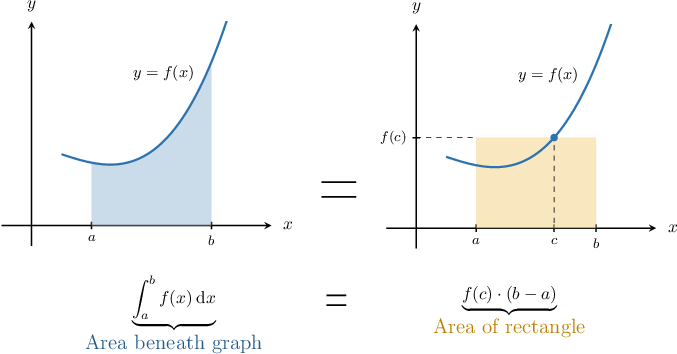
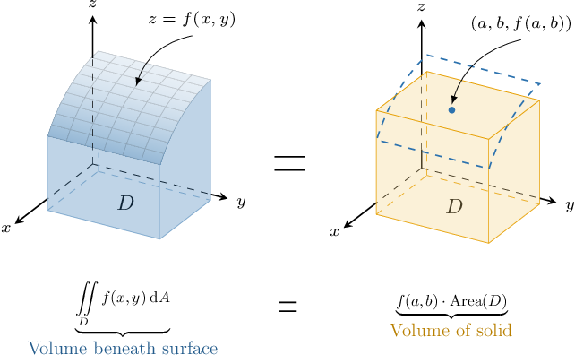
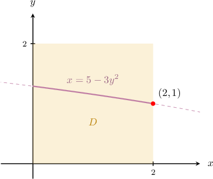
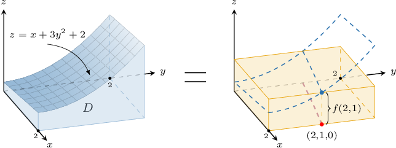
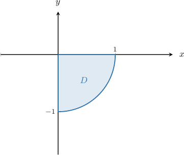

# The Average Value of a Multivariable Function

Source: https://www.mathacademy.com/topics/3147?courseId=155
Topic ID: 3147

## Prerequisites

- [The Average Value of a Function](../ap-calculus-ab/1203-the-average-value-of-a-function.md)
- [Double Integrals in Plane Polar Coordinates](../mathematical-methods-for-the-physical-sciences-i/2030-double-integrals-in-plane-polar-coordinates.md)
- [Double Integrals Over Type II Regions](../mathematical-methods-for-the-physical-sciences-i/2152-double-integrals-over-type-ii-regions.md)

## Lesson

### Introduction

Given a continuous function $f(x)$ on a closed interval $[a, b],$ the mean value theorem for integrals guarantees that there exists a number $c \in [a,b]$ such that

$$

\int_a^b f(x)\, \textrm d x = f(c) \cdot (b-a),

$$

which can be visualized as shown below.

We have a similar theorem for functions with two variables. The so-called **mean value theorem for double integrals** states:

*If the function $f(x,y)$ is continuous on a closed and bounded region $D,$ then there exists a point $(a,b) \in D$ such that*

$$

\iint\limits_D f(x,y) \: \textrm{d}A = f(a,b) \cdot \textrm{Area}(D).

$$

This has a nice geometrical interpretation when $f$ is non-negative on $D.$ In this case, the theorem tells us that there exists a point $(a,b) \in D$ such that the volume of the solid enclosed between the surface $z=f(x,y)$ and the $xy$-plane over the region $D$ equals the volume of the right cylinder with base $D$ and height $f(a,b).$

The diagram below shows the case when $D$ is rectangular, and the corresponding cylinder is a rectangular solid.

In general, the point $(a,b)$ mentioned in the theorem is not unique. Let's see an example.

### A Worked Example

Consider the continuous function

$$

f(x,y) = x+3y^2+2

$$

and the region $D$ given by

$$

D = \big\{ (x,y) \: : \: 0 \leq x \leq 2, \: 0 \leq y \leq 2 \big\}.

$$

According to the mean value theorem for double integrals, there exists a point $(a,b) \in D$ such that

$$

\iint\limits_D f(x,y) \: \textrm{d}A = f(a,b) \cdot \textrm{Area}(D).

$$

Evaluating the integral on the left-hand side, we have

$$

\begin{aligned}\underset{𝐷}{∬}𝑓(𝑥,𝑦)\,d𝐴 & =\underset{𝐷}{∬}(𝑥+3𝑦^{2}+2)\,d𝐴 \\ & =∫_{20}^{}∫_{20}^{}(𝑥+3𝑦^{2}+2)\,d𝑦\,d𝑥 \\ & =∫_{20}^{}[𝑥𝑦+𝑦^{3}+2𝑦]_{𝑦=2𝑦=0}^{}\,d𝑥 \\ & =∫_{20}^{}(2𝑥+12)\,d𝑥 \\ & =[𝑥^{2}+12𝑥]_{𝑥=2𝑥=0}^{} \\ & =28.\end{aligned}

$$

Next, we have

$$

\textrm{Area}(D) = 2 \cdot 2 = 4.

$$

So, our mean-value equation simplifies to

$$

\begin{aligned}28 & =𝑓(𝑎,𝑏)⋅4 \\ 7 & =𝑓(𝑎,𝑏) \\ 7 & =𝑎+3𝑏^{2}+2 \\ 𝑎 & =5−3𝑏^{2}.\end{aligned}

$$

This equation describes part of a parabola in the $xy$-plane, as shown below.

To find a particular point that satisfies the mean value theorem, we can set, for example, $b=1 \in [0,2]$ and obtain $a=2.$ So, the point $(2,1)$ satisfies the mean value theorem for double integrals. Consequently, the two solids below must have the same volume.

### Example: Finding Points That Satisfy the Mean Value Theorem

#### Question

Consider the function $f(x,y)$ and the region $D$ given by

$$

f(x,y) =\dfrac{xy}2, \qquad D = \big\{ (x,y) \: : \: 0 \leq x \leq 2y, \: 0 \leq y \leq 4 \big\}.

$$

According to the mean value theorem for double integrals, there exists a point $(a,b) \in D$ such that the volume of the solid enclosed between the surface $z=f(x,y)$ and the $xy$-plane over the region $D$ equals the volume of the right cylinder with base $D$ and height $f(a,b).$ Find $a$ given that $b=2.$

#### Explanation

According to the mean value theorem for double integrals, there exists a point $(a,b) \in D$ such that

$$

\iint\limits_D f(x,y) \: \textrm{d}A = f(a,b) \cdot \textrm{Area}(D).

$$

Evaluating the integral on the left-hand side, we have

$$

\begin{aligned}\underset{𝐷}{∬}𝑓(𝑥,𝑦)\,d𝐴 & =\underset{𝐷}{∬}\frac{𝑥𝑦}{2}\,d𝐴 \\ & =∫_{40}^{}∫_{2𝑦0}^{}\frac{𝑥𝑦}{2}\,d𝑥\,d𝑦 \\ & =∫_{40}^{}[\frac{𝑥^{2}𝑦}{4}]_{𝑥=2𝑦𝑥=0}^{}\,d𝑦 \\ & =∫_{40}^{}𝑦^{3}\,d𝑦 \\ & =[\frac{𝑦^{4}}{4}]_{𝑦=4𝑦=0}^{} \\ & =64.\end{aligned}

$$

Next, we have

$$

\begin{aligned}Area(𝐷) & =\underset{𝐷}{∬}d𝐴 \\ & =∫_{40}^{}∫_{2𝑦0}^{}d𝑥\,d𝑦 \\ & =∫_{40}^{}[𝑥]_{𝑥=2𝑦𝑥=0}^{}\,d𝑦 \\ & =∫_{40}^{}2𝑦\,d𝑦 \\ & =[𝑦^{2}]_{𝑦=4𝑦=0}^{} \\ & =16.\end{aligned}

$$

Also, we are told that $b=2.$ So, our initial equation simplifies to

$$

\begin{aligned}64 & =𝑓(𝑎,2)⋅16 \\ 64 & =\frac{𝑎⋅2}{2}⋅16 \\ 64 & =16𝑎 \\ 𝑎 & =4.\end{aligned}

$$

Notice that $\left(4,2 \right) \in D.$ Therefore, the answer is $a = 4.$

### The Average Value of a Function

Recall that the average value of a continuous function $f(x)$ on a closed interval $D = [a,b]$ is given by

$$

f_\textrm{ave} = \dfrac{1}{\textrm{Length}(D)}\int_a^b f(x) \: \textrm{d}x.

$$

There is an analogous definition for functions of two variables, stated below:

*Suppose $D$ is a closed and bounded region in $\mathbb{R}^2$ which has non-zero finite area $\textrm{Area}(D).$ If $f (x, y)$ is a continuous function on $D,$ then **** is given by*

$$

f_{\textrm{ave}} =\dfrac{1}{\textrm{Area}(D)} \, \iint\limits_D f(x,y) \: \textrm{d}A.

$$

### Example: Finding the Average Value of a Function

#### Question

Find the average value of the function $f(x,y) = xy$ on the region $D = \big\{(x,y) \:: \: -1 \leq x \leq 2, \: x \leq y \leq 3x \big\}$ given that the area of the region is $3$ square units.

#### Explanation

Applying the average value formula, we find that the average value of the function is

$$

\begin{aligned}𝑓_{ave} & =\frac{1}{Area(𝐷)}\,\underset{𝐷}{∬}𝑓(𝑥,𝑦)\,d𝐴 \\ & =\frac{1}{3}\underset{𝐷}{∬}𝑥𝑦\,d𝐴 \\ & =\frac{1}{3}∫_{2−1}^{}∫_{3𝑥𝑥}^{}𝑥𝑦\,d𝑦\,d𝑥 \\ & =\frac{1}{3}∫_{2−1}^{}[\frac{𝑥𝑦^{2}}{2}]_{𝑦=3𝑥𝑦=𝑥}^{}\,d𝑥 \\ & =\frac{1}{3}∫_{2−1}^{}4𝑥^{3}\,d𝑥 \\ & =\frac{1}{3}[𝑥^{4}]_{𝑥=2𝑥=−1}^{} \\ & =\frac{1}{3}(16−1) \\ & =5.\end{aligned}

$$

### Example: Finding the Average Value of a Function Over a Polar Region

#### Question

Find the average value of the function $f(x,y) = 15xy^2$ on the portion of the disk of radius $1$ centered at the origin, where $x\geq 0,$ and $y \leq 0.$

#### Explanation

First, let's sketch our region $D\mathbin{:}$

Notice that

$$

\textrm{Area}(D) = \dfrac{1}{4} \cdot \pi \cdot 1^2 = \dfrac\pi 4.

$$

The average value of the function over a region $D$ is given by

$$

f_{\textrm{ave}} = \dfrac{1}{\textrm{Area}(D)} \, \iint\limits_D f(x,y) \: \textrm{d}A.

$$

We will use the change of variables formula in the form

$$

\iint\limits_{D} f(x,y) \ \mathrm d A = \iint\limits_{\Delta} \ f(r\cos\theta, r\sin\theta) \: r \ \mathrm d r \mathrm d \theta.

$$

In polar coordinates $(r, \theta),$ the region can be expressed as

$$

\Delta = \left\{ (r,\theta) \: : \: 0 \leq r \leq 1, \: \dfrac{3\pi}{2} \leq \theta \leq 2\pi\right\}.

$$

Using the change of variables formula, we obtain

$$

\begin{aligned}\underset{𝐷}{∬}15𝑥𝑦^{2}\,d𝐴 & =\underset{Δ}{∬}15𝑟cos⁡𝜃⋅(𝑟sin⁡𝜃)^{2}\,𝑟\,d𝑟d𝜃 \\ & =∫_{2𝜋3𝜋/2}^{}∫_{10}^{}15𝑟^{4}cos⁡𝜃sin^{2}⁡𝜃\,d𝑟\,d𝜃 \\ & =∫_{2𝜋3𝜋/2}^{}3cos⁡𝜃sin^{2}⁡𝜃∫_{10}^{}5𝑟^{4}\,d𝑟\,d𝜃 \\ & =∫_{2𝜋3𝜋/2}^{}3cos⁡𝜃sin^{2}⁡𝜃\,[𝑟^{5}]_{10}^{}\,d𝜃 \\ & =∫_{2𝜋3𝜋/2}^{}3cos⁡𝜃sin^{2}⁡𝜃(1^{5}−0)d𝜃 \\ & =∫_{2𝜋3𝜋/2}^{}3cos⁡𝜃sin^{2}⁡𝜃\,d𝜃 \\ & =[sin^{3}⁡𝜃]_{2𝜋3𝜋/2}^{} \\ & =(sin^{3}⁡(2𝜋)−sin^{3}⁡(\frac{3𝜋}{2})) \\ & =(0−(−1)) \\ & =1.\end{aligned}

$$

Therefore,

$$

f_{\textrm{ave}} = \dfrac{4}{\pi} \cdot 1 = \dfrac{4}{\pi}.

$$
