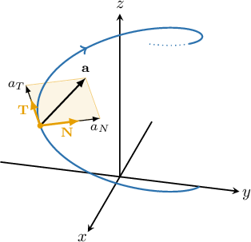

# The Components of Acceleration

Source: https://www.mathacademy.com/topics/3177?courseId=155
Topic ID: 3177

## Prerequisites

- [Calculating Acceleration for Plane Motion Using Differentiation](../ap-calculus-bc/825-calculating-acceleration-for-plane-motion-using-differentiation.md)
- [The Osculating Plane](../mathematical-methods-for-the-physical-sciences-i/1796-the-osculating-plane.md)
- [The Curvature of a Plane Curve](../mathematical-methods-for-the-physical-sciences-i/1839-the-curvature-of-a-plane-curve.md)

## Lesson

### Introduction

We know that the acceleration $\mathbf{a}(t)$ of a particle is the second derivative of its position $\mathbf{r}(t).$ But we can also break down acceleration into two components:

- The **tangential component** of acceleration, $a_T$, measures the rate of change in the magnitude of the velocity vector (speed). That is, it tells us how much of the acceleration acts in the direction of motion. It is given by

- The **normal component** of acceleration, $a_N$, measures the rate of change in the direction of the velocity vector. That is, it tells us how much of the acceleration is orthogonal to the tangential direction. It is given by

Let's find the tangential component of a particle $P$ if its velocity $\mathbf{v}$ at time $t$ is given by $\mathbf v(t) = \langle t, \, t^2,\, t^3 \rangle.$

First, we need to compute the acceleration vector by differentiating the velocity vector, as follows:

$$

\begin{aligned}𝐚 & =⟨\frac{d}{d𝑡}(𝑡),\,\frac{d}{d𝑡}(𝑡^{2}),\,\frac{d}{d𝑡}(𝑡^{3})⟩ \\ & =⟨1,\,2𝑡,\,3𝑡^{2}⟩\end{aligned}

$$

Next, we compute $\mathbf v \cdot \mathbf a$ and $||\mathbf v||\mathbin{:}$

$$

\begin{aligned}𝐯⋅𝐚 & =⟨𝑡,\,𝑡^{2},\,𝑡^{3}⟩⋅⟨1,\,2𝑡,\,3𝑡^{2}⟩ \\ & =𝑡+2𝑡^{3}+3𝑡^{5}, \\ ||𝐯|| & =\sqrt{√(𝑡)^{2}+(𝑡^{2})^{2}+(𝑡^{3})^{2}} \\ & =\sqrt{√𝑡^{2}+𝑡^{4}+𝑡^{6}}.\end{aligned}

$$

Finally, calculating the tangential component of the acceleration, we get

$$

\begin{aligned}𝑎_{𝑇} & =\frac{𝐯⋅𝐚}{||𝐯||} \\ & =\frac{𝑡+2𝑡^{3}+3𝑡^{5}}{\sqrt{√𝑡^{2}+𝑡^{4}+𝑡^{6}}}.\end{aligned}

$$

### Example: Finding the Tangental Component of Acceleration Given a Position or Velocity

#### Question

The velocity $\mathbf v$ of a particle $P$ at time $t$ is given by $\mathbf v(t) = \langle 1, \, \sqrt{2} t,\, -t^2 \rangle.$ Find the tangential component of acceleration at time $t.$

#### Explanation

The tangential component of acceleration is given by

$$

a_T = \dfrac{\mathbf v \cdot \mathbf a}{||\mathbf v||}.

$$

First, we need to compute the acceleration vector by differentiating the velocity vector, as follows:

$$

\begin{aligned}𝐚 & =⟨\frac{d}{d𝑡}(1),\,\frac{d}{d𝑡}(\sqrt{√2}𝑡),\,\frac{d}{d𝑡}(−𝑡^{2})⟩ \\ & =⟨0,\,\sqrt{√2},\,−2𝑡⟩\end{aligned}

$$

Next, we compute $\mathbf v \cdot \mathbf a$ and $||\mathbf v||\mathbin{:}$

$$

\begin{aligned}𝐯⋅𝐚 & =⟨1,\,\sqrt{√2}𝑡,\,−𝑡^{2}⟩⋅⟨0,\,\sqrt{√2},\,−2𝑡⟩ \\ & =2𝑡+2𝑡^{3} \\ & =2𝑡(𝑡^{2}+1), \\ ||𝐯|| & =\sqrt{√(1)^{2}+(\sqrt{√2}𝑡)^{2}+(−𝑡^{2})^{2}} \\ & =\sqrt{√𝑡^{4}+2𝑡^{2}+1} \\ & =\sqrt{√(𝑡^{2}+1)^{2}} \\ & =𝑡^{2}+1.\end{aligned}

$$

Finally, we calculate tangential component of the acceleration, and we get

$$

\begin{aligned}𝑎_{𝑇} & =\frac{𝐯⋅𝐚}{||𝐯||} \\ & =\frac{2𝑡(𝑡^{2}+1)}{𝑡^{2}+1} \\ & =2𝑡.\end{aligned}

$$

### Example: Finding the Normal Component of Acceleration Given a Position or Velocity

#### Question

The velocity $\mathbf v$ of a particle $P$ at time $t$ is given by $\mathbf v(t)= \left\langle -4, \, \cos{(2t)},\, \sin{(2t)} \right\rangle.$ Find the normal component of the acceleration of $P$ at time $t.$

#### Explanation

The normal component of acceleration is given by

$$

a_N = \dfrac{||\mathbf v \times \mathbf a||}{||\mathbf v||}.

$$

First, we compute the acceleration vector by differentiating the velocity vector, as follows:

$$

\begin{aligned}𝐚 & =⟨\frac{d}{d𝑡}(−4),\,\frac{d}{d𝑡}(cos⁡(2𝑡)),\,\frac{d}{d𝑡}(sin⁡(2𝑡))⟩ \\ & =⟨0,\,−2sin⁡(2𝑡),\,2cos⁡(2𝑡)⟩\end{aligned}

$$

Next, we compute $\mathbf v \times \mathbf a{:}$

$$

\begin{aligned}𝐯×𝐚 & =⟨−4,\,cos⁡(2𝑡),\,sin⁡(2𝑡)⟩×⟨0,\,−2sin⁡(2𝑡),\,2cos⁡(2𝑡)⟩ \\ & =\begin{aligned}𝐢 & 𝐣 & 𝐤 \\ −4 & cos⁡(2𝑡) & sin⁡(2𝑡) \\ 0 & −2sin⁡(2𝑡) & 2cos⁡(2𝑡)\end{aligned} \\ & = \begin{aligned}cos⁡(2𝑡) & sin⁡(2𝑡) \\ −2sin⁡(2𝑡) & 2cos⁡(2𝑡)\end{aligned}\,𝐢−\begin{aligned}−4 & sin⁡(2𝑡) \\ 0 & 2cos⁡(2𝑡)\end{aligned}\,𝐣+\begin{aligned}−4 & cos⁡(2𝑡) \\ 0 & −2sin⁡(2𝑡)\end{aligned}\,𝐤 \\ & =⟨2cos^{2}⁡(2𝑡)+2sin^{2}⁡(2𝑡),8cos⁡(2𝑡),8sin⁡(2𝑡)⟩ \\ & =⟨2,8cos⁡(2𝑡),8sin⁡(2𝑡)⟩\end{aligned}

$$

Now, we compute $||\mathbf v||$ and $||\mathbf v \times \mathbf a||\mathbin{:}$

$$

\begin{aligned}||𝐯|| & =\sqrt{√(−4)^{2}+(cos⁡(2𝑡))^{2}+(sin⁡(2𝑡))^{2}} \\ & =\sqrt{√16+cos^{2}⁡(2𝑡)+sin^{2}⁡(2𝑡)} \\ & =\sqrt{√16+1} \\ & =\sqrt{√17}, \\ ||𝐯×𝐚|| & =\sqrt{√(2)^{2}+(8cos⁡(2𝑡))^{2}+(8sin⁡(2𝑡))^{2}} \\ & =\sqrt{√4+64cos^{2}⁡(2𝑡)+64sin^{2}⁡(2𝑡)} \\ & =\sqrt{√4+64(cos^{2}⁡(2𝑡)+sin^{2}⁡(2𝑡))} \\ & =\sqrt{√4+64} \\ & =\sqrt{√68} \\ & =2\sqrt{√17}\end{aligned}

$$

Finally, we calculate the normal component of the acceleration, and we get

$$

\begin{aligned}𝑎_{𝑁} & =\frac{||𝐯×𝐚||}{||𝐯||} \\ & =\frac{2\sqrt{√17}}{\sqrt{√17}} \\ & =2.\end{aligned}

$$

### Example: Calculating Components of Acceleration at a Particular Moment

#### Question

The position $\mathbf r,$ in meters, of a particle $P$ at time $t$ is given by $r(t)= \langle e^{2t}, \, e^{-t}, \, 1 \rangle,$ where $t$ is measured in seconds. Find the tangential component of the acceleration of $P$ at time $t = 0\,\textrm s.$

#### Explanation

The tangential component of acceleration is given by

$$

a_T = \dfrac{\mathbf v \cdot \mathbf a}{||\mathbf v||}.

$$

First, we compute the velocity vector by differentiating the position vector and evaluating it at $t = 0,$ as follows:

$$

\begin{aligned}𝐯 & =⟨\frac{d}{d𝑡}(𝑒^{2𝑡}),\,\frac{d}{d𝑡}(𝑒^{−𝑡}),\,\frac{d}{d𝑡}(1)⟩ \\ & =⟨2𝑒^{2𝑡},\,−𝑒^{−𝑡},\,0⟩, \\ 𝐯(0) & =⟨2𝑒^{2(0)},\,−𝑒^{−0},\,0⟩ \\ & =⟨2,\,−1,\,0⟩\end{aligned}

$$

Next, we compute the acceleration vector by differentiating the velocity vector and it evaluating at $t = 0{:}$

$$

\begin{aligned}𝐚 & =⟨\frac{d}{d𝑡}(2𝑒^{2𝑡}),\,\frac{d}{d𝑡}(−𝑒^{−𝑡}),\,\frac{d}{d𝑡}(0)⟩ \\ & =⟨4𝑒^{2𝑡},\,𝑒^{−𝑡},\,0,⟩ \\ 𝐚(0) & =⟨4𝑒^{2(0)},\,𝑒^{−0},\,0⟩ \\ & =⟨4,\,1,\,0⟩\end{aligned}

$$

Then, we compute $\mathbf v(0) \cdot \mathbf a(0)$ and $||\mathbf v(0)||\mathbin{:}$

$$

\begin{aligned}𝐯(0)⋅𝐚(0) & =⟨2,\,−1,\,0⟩⋅⟨4,\,1,\,0⟩ \\ & =7, \\ ||𝐯(0)|| & =\sqrt{√(2)^{2}+(−1)^{2}+(0)^{2}} \\ & =\sqrt{√5}\end{aligned}

$$

Finally, we calculate the tangential component of the acceleration at $t=0,$ and we get

$$

\begin{aligned}𝑎_{𝑇} & =\frac{𝐯(0)⋅𝐚(0)}{||𝐯(0)||} \\ & =\frac{7}{\sqrt{√5}} \\ & =\frac{7\sqrt{√5}}{5}.\end{aligned}

$$

Therefore, the tangential component of the acceleration is $\dfrac{7\sqrt{5}}{5} \, \textrm{ms}^{-2}.$

### Explanation of the Components of Acceleration

Let's suppose that the position of a particle $P$ at time $t$ is given by

$$

\mathbf{r}(t) = \left\langle x(t), y(t), z(t) \right\rangle.

$$

Recall that the unit tangent vector is given by

$$

\mathbf T = \dfrac{\dfrac{\textrm{d}\mathbf r}{\textrm{d}t}}{\left\Vert\dfrac{\textrm{d}\mathbf r}{\textrm{d}t}\right\Vert} = \dfrac{\mathbf{v}}{||\mathbf{v}||}.

$$

Rearranging, we have

$$

\mathbf{v} = ||\mathbf{v}||\mathbf T.

$$

Differentiating gives

$$

\mathbf{a} = \dfrac{\textrm{d}}{\textrm{d}t}(||\mathbf{v}||)\mathbf T + ||\mathbf{v}||\dfrac{\textrm{d}\mathbf T}{\textrm{d}t}.

$$

Now, from the definition of the normal vector $\mathbf{N}$, notice that

$$

\dfrac{\textrm{d}\mathbf T}{\textrm{d}t} = \left\Vert\dfrac{\textrm{d}\mathbf T}{\textrm{d}t}\right\Vert\mathbf N = \kappa ||\mathbf{v}||\mathbf N,

$$

where $\kappa$ is the curvature. Putting this into our equation for acceleration, we get

$$

\begin{aligned}𝐚 & =\frac{d}{d𝑡}(||𝐯||)𝐓+||𝐯||\frac{d𝐓}{d𝑡} \\ & =\frac{d}{d𝑡}(||𝐯||)𝐓+||𝐯||(𝜅||𝐯||𝐍) \\ & =\underset{𝑎_{𝑇}}{\underset{}{\frac{d}{d𝑡}(||𝐯||)}}𝐓+\underset{𝑎_{𝑁}}{\underset{}{𝜅||𝐯||^{2}}}𝐍 \\ & =𝑎_{𝑇}𝐓+𝑎_{𝑁}𝐍.\end{aligned}

$$

This means that the acceleration of the particle lies in the osculating plane spanned by $\mathbf{T}$ and $\mathbf{N},$ where the tangential component is the coefficient of $\mathbf{T}$ and the normal component is the coefficient of $\mathbf{N}.$

Indeed, taking the dot product of $\mathbf{T}$ with $\mathbf{a}$ gives

$$

\begin{aligned}𝐓⋅𝐚 & =𝐓⋅(𝑎_{𝑇}𝐓+𝑎_{𝑁}𝐍) \\ & =𝑎_{𝑇}(𝐓⋅𝐓)+𝑎_{𝑁}(𝐓⋅𝐍) \\ & =𝑎_{𝑇}.\end{aligned}

$$

Therefore,

$$

a_T = \mathbf{T} \cdot \mathbf{a} = \dfrac{\mathbf{v} \cdot \mathbf{a}}{||\mathbf{v}||}.

$$

Also, crossing $\mathbf{T}$ with $\mathbf{a},$ we get

$$

\begin{aligned}𝐓×𝐚 & =𝐓×(𝑎_{𝑇}𝐓+𝑎_{𝑁}𝐍) \\ & =𝑎_{𝑇}(𝐓×𝐓)+𝑎_{𝑁}(𝐓×𝐍) \\ & =𝑎_{𝑁}(𝐓×𝐍).\end{aligned}

$$

Taking the norm of both sides and remembering that $\mathbf{T}$ and $\mathbf{N}$ are orthogonal unit vectors, we have that

$$

\begin{aligned}||𝐓×𝐚|| & =||𝑎_{𝑁}(𝐓×𝐍)|| \\ & =𝑎_{𝑁}||𝐓×𝐍|| \\ & =𝑎_{𝑁}||𝐓||||𝐍||sin⁡(\frac{𝜋}{2}) \\ & =𝑎_{𝑁}⋅1⋅1⋅1 \\ & =𝑎_{𝑁}.\end{aligned}

$$

Therefore

$$

a_N = ||\mathbf{T} \times \mathbf{a}|| = \dfrac{||\mathbf{v} \times \mathbf{a}||}{||\mathbf{v}||}.

$$
