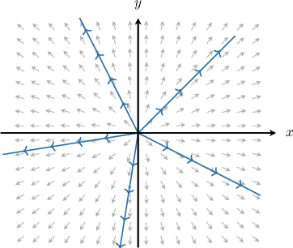
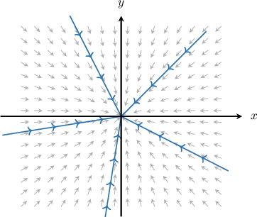
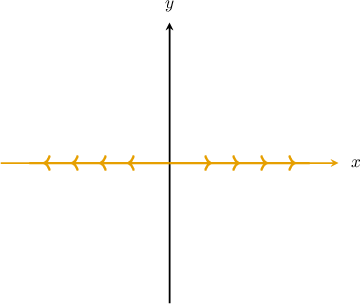
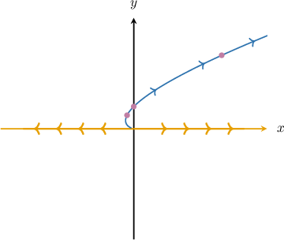
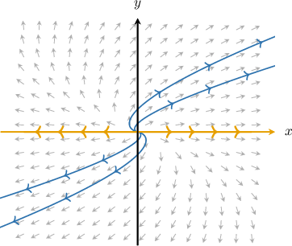
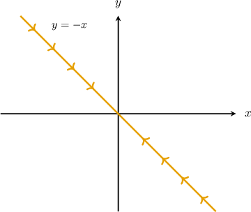
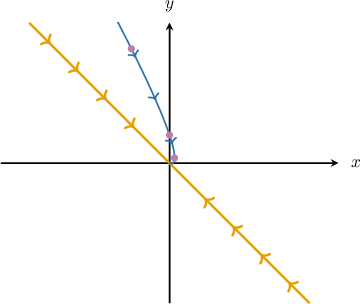
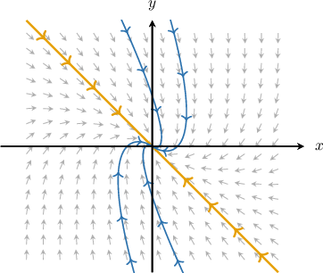
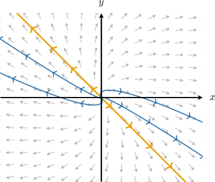

# Phase Portraits for Linear Systems With Repeated Eigenvalues

Source: https://www.mathacademy.com/topics/3240?courseId=155
Topic ID: 3240

## Prerequisites

- [Solving Homogeneous Systems of ODEs With Repeated Eigenvalues](./2818-solving-homogeneous-systems-of-odes-with-repeated-eigenvalues.md)
- [Phase Portraits for Linear Systems With Real Distinct Eigenvalues](./3239-phase-portraits-for-linear-systems-with-real-distinct-eigenvalues.md)

## Lesson

### Introduction

In this topic, we'll study phase portraits of linear systems

$$

[\begin{aligned}𝑥(𝑡) \\ 𝑦(𝑡)\end{aligned}]

$$

where the $2 \times 2$ matrix $A$ has a *repeated* real eigenvalue $\lambda$ (algebraic multiplicity $2$).

If $A$ has *two independent eigenvectors*, then $A$ is the scalar matrix

$$

[\begin{aligned}𝜆 & 0 \\ 0 & 𝜆\end{aligned}]

$$

In this case, every direction through the origin behaves like an eigenvector direction, and trajectories are straight lines:

$$

\mathbf{x}(t)=e^{\lambda t} \mathbf{v}, \qquad \mathbf{v} \in \mathbb{R}^2.

$$

So the phase portrait is a **star node**:

- If $\lambda>0,$ trajectories move *away* from the origin and we have an **unstable star node**.

- If $\lambda<0,$ trajectories move *toward* the origin and we have a **stable star node**.

Let's see an example.

### A Worked Example of a Star Node

Let's sketch the phase portrait of the following linear system:

$$

\begin{aligned}𝑥^{′}(𝑡)=2𝑥(𝑡) \\ 𝑦^{′}(𝑡)=2𝑦(𝑡)\end{aligned}

$$

Writing our system in matrix form, we have

$$

[\begin{aligned}2 & 0 \\ 0 & 2\end{aligned}]

$$

where $[\begin{aligned}𝑥(𝑡) \\ 𝑦(𝑡)\end{aligned}]$

Since our system is decoupled, its eigenvalues are $\lambda_1=\lambda_2=2$ with the corresponding eigenvectors $[\begin{aligned}1 \\ 0\end{aligned}]$ and $[\begin{aligned}0 \\ 1\end{aligned}]$

The general solution of the system is

$$

[\begin{aligned}1 \\ 0\end{aligned}]

$$

Notice that for each vector $[\begin{aligned}𝑐_{1} \\ 𝑐_{2}\end{aligned}]$ we get the straight-line solutions of the form $[\begin{aligned}𝑐_{1} \\ 𝑐_{2}\end{aligned}]$ that represent the line passing through the origin and parallel to the vector $[\begin{aligned}𝑐_{1} \\ 𝑐_{2}\end{aligned}]$

Since $e^{2t} \to \infty$ as $t \to \infty,$ these solutions move away from the origin as $t \to \infty,$ so the origin is an unstable node.

The phase portrait satisfying these conditions is the following:

### Example: Identifying the Phase Portrait of a Decoupled System With Repeated Eigenvalues

#### Question

$$

\begin{aligned}𝑥^{′}(𝑡)=−8𝑥(𝑡) \\ 𝑦^{′}(𝑡)=−8𝑦(𝑡)\end{aligned}

$$

Sketch the phase portrait of the linear system above.

#### Explanation

Writing our system in matrix form, we have

$$

[\begin{aligned}−8 & 0 \\ 0 & −8\end{aligned}]

$$

where $[\begin{aligned}𝑥(𝑡) \\ 𝑦(𝑡)\end{aligned}]$

Since our system is decoupled, its eigenvalues are $\lambda_1=\lambda_2=-8$ with the corresponding eigenvectors $[\begin{aligned}1 \\ 0\end{aligned}]$ and $[\begin{aligned}0 \\ 1\end{aligned}]$

The general solution of the system is

$$

[\begin{aligned}1 \\ 0\end{aligned}]

$$

Notice that for each vector $[\begin{aligned}𝑐_{1} \\ 𝑐_{2}\end{aligned}]$ we get the straight-line solutions of the form $[\begin{aligned}𝑐_{1} \\ 𝑐_{2}\end{aligned}]$ that represent the line passing through the origin and parallel to the vector $[\begin{aligned}𝑐_{1} \\ 𝑐_{2}\end{aligned}]$

Since $e^{-8t} \to 0$ as $t \to \infty,$ these solutions approach the origin as $t \to \infty,$ so the origin is a stable node.

The phase portrait satisfying these conditions is the following:

### Systems With Repeated Eigenvalues

Recall that in this topic, we're studying phase portraits of linear systems

$$

[\begin{aligned}𝑥(𝑡) \\ 𝑦(𝑡)\end{aligned}]

$$

where the $2 \times 2$ matrix $A$ has a *repeated* real eigenvalue $\lambda$ (algebraic multiplicity $2$).

If $A$ has *only one eigenvector* $\mathbf{v},$ and if $\mathbf{w}$ is a generalized eigenvector satisfying

$$

(A-\lambda I)\mathbf{w}=\mathbf{v},

$$

then the general solution takes the form

$$

\mathbf{x}(t)=c_1 e^{\lambda t}\mathbf{v}+c_2 e^{\lambda t}\bigl(t\,\mathbf{v}+\mathbf{w}\bigr).

$$

Here, the eigenvector line (the line through the origin parallel to $\mathbf{v}$) is still a straight-line solution, but other trajectories are *curved* and become tangent to that eigenvector line.

In cases like this, the phase portrait is a **degenerate node**:

- If $\lambda>0,$ trajectories move *away* from the origin and we have an **unstable degenerate node**.

- If $\lambda<0,$ trajectories move *toward* the origin and we have a **stable degenerate node**.

Let's see an example.

### A Worked Example for a System With Repeated Eigenvalues

Consider the following system of linear differential equations:

$$

\begin{aligned}𝑥^{′}(𝑡)=𝑥(𝑡)+𝑦(𝑡) \\ 𝑦^{′}(𝑡)=𝑦(𝑡)\end{aligned}

$$

The eigenvector corresponding to the only eigenvalue of the system's matrix $A$ is $[\begin{aligned}1 \\ 0\end{aligned}]$ The vector $[\begin{aligned}0 \\ 1\end{aligned}]$ is such that $(A - \lambda I)\mathbf{w}= \mathbf{v}.$

Let's sketch the phase portrait of the system.

Since we have a repeated eigenvalue $\lambda=1$ (of multiplicity two) and only one corresponding eigenvector $\mathbf{v},$ the solution of the system is given by

$$

\mathbf{x}(t) = c_1\mathbf{v} e^{\lambda t} + c_2 (\mathbf{v} te^{\lambda t} + \mathbf{w}e^{\lambda t} \, ),

$$

where $\mathbf{w}$ is a solution to the equation $(A - \lambda I)\mathbf{w}= \mathbf{v}.$

In our case,

$$

[\begin{aligned}1 \\ 0\end{aligned}]

$$

Thus, the general solution of the system is

$$

\begin{aligned}[\begin{aligned}𝑥(𝑡) \\ 𝑦(𝑡)\end{aligned}] & =𝑐_{1}[\begin{aligned}1 \\ 0\end{aligned}]𝑒^{𝑡}+𝑐_{2}([\begin{aligned}1 \\ 0\end{aligned}]𝑡𝑒^{𝑡}+[\begin{aligned}0 \\ 1\end{aligned}]𝑒^{𝑡}) \\ & =𝑐_{1}𝑒^{𝑡}[\begin{aligned}1 \\ 0\end{aligned}]+𝑐_{2}𝑒^{𝑡}[\begin{aligned}𝑡 \\ 1\end{aligned}],\,𝑐_{1},𝑐_{2}∈ℝ.\end{aligned}

$$

The straight-line solutions of the form $[\begin{aligned}1 \\ 0\end{aligned}]$ lie on the $x$-axis. Since $e^{t} \to \infty$ as $t \to \infty,$ these solutions move toward infinity in the phase plane as $t \to \infty.$

Let's add the solutions to the phase space.

Now, consider solutions of the form $[\begin{aligned}𝑡 \\ 1\end{aligned}]$ When $c_2=1,$ we get the following curve:

$$

\begin{aligned}𝑥=𝑡𝑒^{𝑡} \\ 𝑦=𝑒^{𝑡}\end{aligned}

$$

Computing the coordinates (rounded to two decimal places) of several points on the curve, we get the table below.

Let's add the solutions to the phase space.

The phase portrait of our system looks as follows:

### Example: Identifying the Phase Portrait of a System With Repeated Eigenvalues

#### Question

$$

\begin{aligned}𝑥^{′}(𝑡)=−𝑥(𝑡)+𝑦(𝑡) \\ 𝑦^{′}(𝑡)=−𝑥(𝑡)−3𝑦(𝑡)\end{aligned}

$$

Consider the system of linear differential equations above. The eigenvector $\mathbf{v} = [1, \ -1]^T$ corresponds to the repeated eigenvalue $\lambda=-2$ of the system's matrix $A.$ The vector $\mathbf{w} = [0, \ 1]^T$ is such that $(A - \lambda I)\mathbf{w}= \mathbf{v}.$ Sketch the phase portrait of the linear system above.

#### Explanation

Since we have a repeated eigenvalue $\lambda=-2$ (of multiplicity two) and only one corresponding eigenvector $\mathbf{v},$ the solution of the system is given by

$$

\mathbf{x}(t) = c_1\mathbf{v} e^{\lambda t} + c_2 (\mathbf{v} te^{\lambda t} + \mathbf{w}e^{\lambda t} \, ),

$$

where $\mathbf{w}$ is a solution to the equation $(A - \lambda I)\mathbf{w}= \mathbf{v}.$

In our case,

$$

[\begin{aligned}1 \\ −1\end{aligned}]

$$

Thus, the general solution of the system is

$$

\begin{aligned}[\begin{aligned}𝑥(𝑡) \\ 𝑦(𝑡)\end{aligned}] & =𝑐_{1}[\begin{aligned}1 \\ −1\end{aligned}]𝑒^{−2𝑡}+𝑐_{2}([\begin{aligned}1 \\ −1\end{aligned}]𝑡𝑒^{−2𝑡}+[\begin{aligned}0 \\ 1\end{aligned}]𝑒^{−2𝑡}) \\ & =𝑐_{1}𝑒^{−2𝑡}[\begin{aligned}1 \\ −1\end{aligned}]+𝑐_{2}𝑒^{−2𝑡}[\begin{aligned}𝑡 \\ −𝑡+1\end{aligned}],\,𝑐_{1},𝑐_{2}∈ℝ.\end{aligned}

$$

The line that passes through the origin and is parallel to $[\begin{aligned}1 \\ −1\end{aligned}]$ has the equation

$$

y= -x

$$

and the straight-line solutions of the form $[\begin{aligned}1 \\ −1\end{aligned}]$ lie on that line.

Since $e^{-2t} \to 0$ as $t \to \infty,$ these solutions approach the origin as $t \to \infty.$

Let's add the solutions to the phase space.

Now, consider solutions of the form $[\begin{aligned}𝑡 \\ −𝑡+1\end{aligned}]$ When $c_2=1,$ we get the following curve:

$$

\begin{aligned}𝑥=𝑡𝑒^{−2𝑡} \\ 𝑦=(−𝑡+1)𝑒^{−2𝑡}\end{aligned}

$$

Computing the coordinates (rounded to two decimal places) of several points on the curve, we get the table below.

Let's add the solutions to the phase space.

The phase portrait of our system looks as follows:

### Example: Classifying Systems of Linear Differential Equations With Repeated Eigenvalues

#### Question

$$

\begin{aligned}𝑥^{′}(𝑡)=6𝑥(𝑡)+𝑦(𝑡) \\ 𝑦^{′}(𝑡)=−𝑥(𝑡)+4𝑦(𝑡)\end{aligned}

$$

Consider the system of linear differential equations above, where the system's matrix has repeated eigenvalue $\lambda=5$ of multiplicity two. Determine the type and stability of the equilibrium point for this linear system.

#### Explanation

The matrix of our system is

$$

[\begin{aligned}6 & 1 \\ −1 & 4\end{aligned}]

$$

Notice that:

- Since the only (repeated) eigenvalue of $A$ is positive, we have a unstable node.

- Since $A$ is not diagonal and has a repeated eigenvalue, there is only one linearly independent eigenvector. So, we have a degenerate node.

**** The phase portrait of the system looks as follows:

