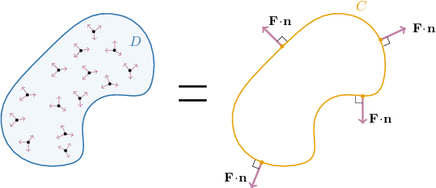
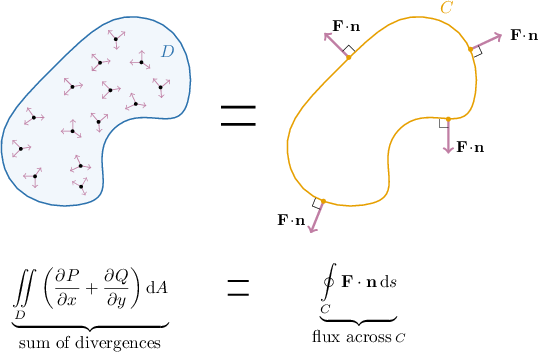
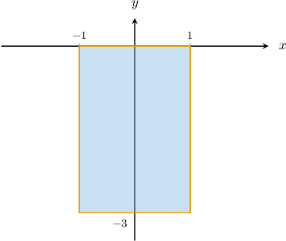
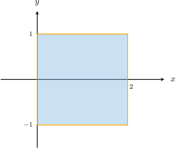
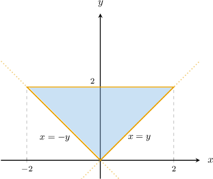

# Green's Theorem in Flux Form

Source: https://www.mathacademy.com/topics/3361?courseId=155
Topic ID: 3361

## Prerequisites

- [Introduction to Green's Theorem](./2116-introduction-to-green-s-theorem.md)
- [The Divergence of a Vector Field](../mathematical-methods-for-the-physical-sciences-i/2131-the-divergence-of-a-vector-field.md)
- [Calculating Flux in Two-Dimensional Vector Fields](./3716-calculating-flux-in-two-dimensional-vector-fields.md)

## Lesson

### Introduction

Green's theorem allows us to write line integrals as double integrals, and we've seen how Green's theorem simplifies circulation calculations. Even more, Green's theorem can also be used to simplify flux calculations!

To see how, we first recall that the flux of $\mathbf{F}(x,y) = P(x,y)\,\mathbf i + Q(x,y)\mathbf j$ across $C$ can be calculated as follows:

$$

\oint\limits_C \mathbf F \cdot \mathbf{n} \: \textrm{d}s= \oint\limits_C P\, \textrm{d}y -Q\, \textrm{d}x

$$

where $C$ is closed and $\mathbf n$ is the outward-pointing unit normal vector to $C.$

Now, let's set $M= -Q$ and $N=P$. Then, by the circulation form of Green's theorem, we have

$$

\begin{aligned}\underset{𝐶}{∮}𝑃\,d𝑦−𝑄\,d𝑥 & =\underset{𝐶}{∮}𝑁\,d𝑦+𝑀\,d𝑥 \\ & =\underset{𝐶}{∮}𝑀\,d𝑥+𝑁\,d𝑦 \\ & =\underset{𝐷}{∬}(\frac{𝜕𝑁}{𝜕𝑥}−\frac{𝜕𝑀}{𝜕𝑦})d𝐴 \\ & =\underset{𝐷}{∬}(\frac{𝜕𝑃}{𝜕𝑥}−(−\frac{𝜕𝑄}{𝜕𝑦}))d𝐴 \\ & =\underset{𝐷}{∬}(\frac{𝜕𝑃}{𝜕𝑥}+\frac{𝜕𝑄}{𝜕𝑦})d𝐴.\end{aligned}

$$

As a result, we've obtained the **Green's theorem in flux form**, which we restate below:

$$

\oint\limits_C \mathbf F \cdot \mathbf{n} \: \textrm{d}s = \iint\limits_D \left(\dfrac{\partial P }{\partial x} +\dfrac{\partial Q}{\partial y}\right)\textrm d A

$$

Now, recall that the divergence of $\mathbf F$ is given by

$$

\textrm{div}\,\mathbf F = \dfrac{\partial P }{\partial x} + \dfrac{\partial Q }{\partial y}.

$$

Therefore, we can also write Green's theorem in flux form as

$$

\oint\limits_C \mathbf F \cdot \mathbf{n} \: \textrm{d}s = \iint\limits_D \textrm{div}\,\mathbf F\,\textrm{d}A.

$$

Green's theorem in flux form allows us to convert a flux line integral into an equivalent double integral.

### Intuition Behind Green's Theorem in Flux Form

There is some nice intuition behind the flux form of Green's theorem that makes it easier to remember.

Suppose that $\mathbf F$ is a vector field on $\mathbb R^2$ with component functions $P$ and $Q$ defined over a region $D.$ So, we have

$$

\mathbf F(x,y) = P(x,y)\,\mathbf i + Q(x,y)\,\mathbf j.

$$

Green's theorem in flux form states that the sum of the microscopic "fluxes" (divergences) of $\mathbf F$ inside $D$ equals the macroscopic flux of $\mathbf F$ across the boundary of $D.$

Recall that the divergence (i.e., the microscopic flux) of $\mathbf F$ at a point is given by

$$

\textrm{div}\,\mathbf F = \nabla \cdot \mathbf F = \dfrac{\partial P }{\partial x} + \dfrac{\partial Q }{\partial y}.

$$

If we sum (integrate) the divergence at every point over the entire domain $D,$ we get

$$

\iint\limits_D \left( \dfrac{\partial P }{\partial x} + \dfrac{\partial Q }{\partial y} \right)\textrm d A.

$$

This expression gives us one side of Green's theorem in flux form.

The macroscopic divergence is simply the flux of $\mathbf F$ across the boundary of $D{:}$

$$

\oint\limits_C\mathbf F\cdot \mathbf n \, \textrm d s

$$

Equating the sum of the divergences with the flux, we have

$$

\iint\limits_D \left( \dfrac{\partial P }{\partial x} + \dfrac{\partial Q }{\partial y} \right)\textrm d A = \oint\limits_C\mathbf F\cdot \mathbf n \, \textrm d s.

$$

The flux form of Green's theorem can be summarized in a single picture, as follows:

### Example: Expressing Flux as a Double Integral Using Green's Theorem in Flux Form

#### Question

Consider the rectangle $C$ with vertices $(-1,0), (-1,-3), (1,-3),$ and $(1,0),$ traversed counterclockwise. Using the flux form of Green's theorem, express the flux of the vector field $\mathbf{F}(x,y) = (7x^2y^6 +x^3)\, \mathbf{i} + (- 2xy^7+4x^2y) \, \mathbf{j}$ through $C$ as a repeated integral.

#### Explanation

Let $C$ be a positively oriented, piecewise-smooth, simple closed curve in the plane, and let $D$ be the region bounded by $C.$ If $\mathbf F = P\,\mathbf i + Q\,\mathbf j,$ and $P$ and $Q$ have continuous first derivatives on an open region containing $D,$ then the flux form of Green's theorem states that

$$

\oint\limits_C \mathbf F\cdot\mathbf n\,\textrm d s = \iint\limits_D \textrm{div}\,\mathbf F\,\textrm{d}A,

$$

which is equivalent to

$$

\oint\limits_C P \,\mathrm{d}y - Q \, \mathrm{d}x = \iint\limits_D \left( \dfrac{\partial P}{\partial x} + \dfrac{\partial Q}{\partial y} \right) \,\textrm{d}A.

$$

The region $D$ and the curve $C$ for this case are shown below.

We have that $P(x,y) = 7x^2y^6 +x^3$ and $Q(x,y) =- 2xy^7+4x^2y.$ So,

$$

\begin{aligned}\frac{𝜕𝑃}{𝜕𝑥}=14𝑥𝑦^{6}+3𝑥^{2},\,\frac{𝜕𝑄}{𝜕𝑦} & =−14𝑥𝑦^{6}+4𝑥^{2}.\end{aligned}

$$

We can express the region $D$ as a type I region as follows:

$$

D = \{(x,y) : -1\leq x\leq 1, \, -3\leq y \leq 0\}

$$

Therefore, applying Green's theorem in flux form, we get

$$

\begin{aligned}\underset{𝐶}{∮}𝑃\,d𝑦−𝑄\,d𝑥 & =\underset{𝐷}{∬}(\frac{𝜕𝑃}{𝜕𝑥}+\frac{𝜕𝑄}{𝜕𝑦})d𝐴 \\ & =\underset{𝐷}{∬}(14𝑥𝑦^{6}+3𝑥^{2})+(−14𝑥𝑦^{6}+4𝑥^{2})\,d𝐴 \\ & =∫_{1−1}^{}∫_{0−3}^{}7𝑥^{2}\,d𝑦\,d𝑥.\end{aligned}

$$

### Example: Calculating Flux Across Rectangles

#### Question

Use the flux form of Green's theorem to calculate the flux of the vector field

$$

\mathbf{F}(x,y) = \left\langle \sin(\pi y) - x , \: \cos(\pi x) + 2xy \right\rangle

$$

through the boundary of the square with vertices $(0,-1), (2,-1), (2,1),$ and $(0,1).$

#### Explanation

Let $C$ be a positively oriented, piecewise-smooth, simple closed curve in the plane, and let $D$ be the region bounded by $C.$ If $\mathbf F = P\,\mathbf i + Q\,\mathbf j,$ and $P$ and $Q$ have continuous first derivatives on an open region containing $D,$ then the flux form of Green's theorem states that

$$

\oint\limits_C \mathbf F\cdot\mathbf n\,\textrm d s = \iint\limits_D \textrm{div}\,\mathbf F\,\textrm{d}A,

$$

which is equivalent to

$$

\oint\limits_C P \,\mathrm{d}y - Q \, \mathrm{d}x = \iint\limits_D \left( \dfrac{\partial P}{\partial x} + \dfrac{\partial Q}{\partial y} \right) \,\textrm{d}A.

$$

The region $D$ and the curve $C$ for this case are shown below.

We have that $P(x,y) = \sin(\pi y) - x$ and $Q(x,y) = \cos(\pi x) + 2xy.$ So,

$$

\begin{aligned}\frac{𝜕𝑃}{𝜕𝑥}=−1,\,\frac{𝜕𝑄}{𝜕𝑦} & =2𝑥.\end{aligned}

$$

We can express the rectangular region $D$ as follows:

$$

D = \left\{(x,y) : 0 \leq x \leq 2, \, -1 \leq y \leq 1 \right\}

$$

Therefore, applying Green's theorem in flux form, we get

$$

\begin{aligned}\underset{𝐶}{∮}𝐅⋅𝐧\,d𝑠 & =\underset{𝐶}{∮}𝑃\,d𝑦−𝑄\,d𝑥 \\ & =\underset{𝐷}{∬}(\frac{𝜕𝑃}{𝜕𝑥}+\frac{𝜕𝑄}{𝜕𝑦})d𝐴 \\ & =\underset{𝐷}{∬}(−1+2𝑥)\,d𝐴 \\ & =∫_{1−1}^{}∫_{20}^{}(2𝑥−1)\,d𝑥\,d𝑦 \\ & =∫_{1−1}^{}(𝑥^{2}−𝑥)\,_{20}^{}\,d𝑦 \\ & =∫_{1−1}^{}(2^{2}−2)\,d𝑦 \\ & =∫_{1−1}^{}2\,d𝑦 \\ & =2𝑦\,_{1−1}^{} \\ & =2(1)−2(−1) \\ & =4.\end{aligned}

$$

### Example: Calculating Flux Across Other Type I and Type II Regions

#### Question

Use the flux form of Green's theorem to calculate the flux of the vector field

$$

\mathbf{F}(x,y) = \left\langle -3xy^2 , \: y+\cos x \right\rangle

$$

through the boundary of the triangle with vertices $(0,0), (2,2),$ and $(-2,2).$

#### Explanation

Let $C$ be a positively oriented, piecewise-smooth, simple closed curve in the plane, and let $D$ be the region bounded by $C.$ If $\mathbf F = P\,\mathbf i + Q\,\mathbf j,$ and $P$ and $Q$ have continuous first derivatives on an open region containing $D,$ then the flux form of Green's theorem states that

$$

\oint\limits_C \mathbf F\cdot\mathbf n\,\textrm d s = \iint\limits_D \textrm{div}\,\mathbf F\,\textrm{d}A,

$$

which is equivalent to

$$

\oint\limits_C P \,\mathrm{d}y - Q \, \mathrm{d}x = \iint\limits_D \left( \dfrac{\partial P}{\partial x} + \dfrac{\partial Q}{\partial y} \right) \,\textrm{d}A.

$$

The region $D$ and the curve $C$ for this case are shown below.

We have that $P(x,y) = -3xy^2$ and $Q(x,y) = y+\cos x.$ Therefore,

$$

\begin{aligned}\frac{𝜕𝑃}{𝜕𝑥}=−3𝑦^{2},\,\frac{𝜕𝑄}{𝜕𝑦} & =1.\end{aligned}

$$

We can express the region $D$ as a type II region as follows:

$$

D = \left\{(x,y) : -y \leq x \leq y, \, 0 \leq y \leq 2 \right\}

$$

Therefore, applying Green's theorem in flux form, we get

$$

\begin{aligned}\underset{𝐶}{∮}𝐅⋅𝐧\,d𝑠 & =\underset{𝐶}{∮}𝑃\,d𝑦−𝑄\,d𝑥 \\ & =\underset{𝐷}{∬}(\frac{𝜕𝑃}{𝜕𝑥}+\frac{𝜕𝑄}{𝜕𝑦})d𝐴 \\ & =\underset{𝐷}{∬}(−3𝑦^{2}+1)\,d𝐴 \\ & =∫_{20}^{}∫_{𝑦−𝑦}^{}(−3𝑦^{2}+1)\,d𝑥\,d𝑦 \\ & =∫_{20}^{}(−3𝑦^{2}+1)[𝑥]_{𝑦−𝑦}^{}\,d𝑦 \\ & =∫_{20}^{}(−3𝑦^{2}+1)(𝑦−(−𝑦))\,d𝑦 \\ & =∫_{20}^{}(−3𝑦^{2}+1)⋅2𝑦\,d𝑦 \\ & =∫_{20}^{}(−6𝑦^{3}+2𝑦)\,d𝑦 \\ & =[−6⋅\frac{𝑦^{4}}{4}+2⋅\frac{𝑦^{2}}{2}]_{20}^{} \\ & =[−\frac{3𝑦^{4}}{2}+𝑦^{2}]_{20}^{} \\ & =(−24+4)−0 \\ & =−20.\end{aligned}

$$
