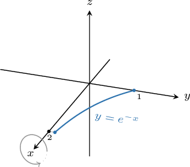
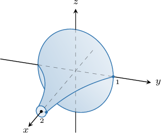
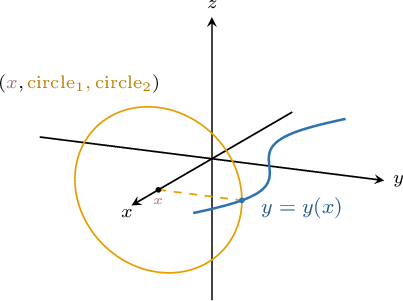
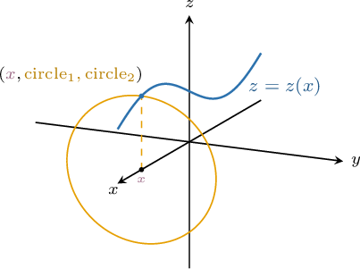
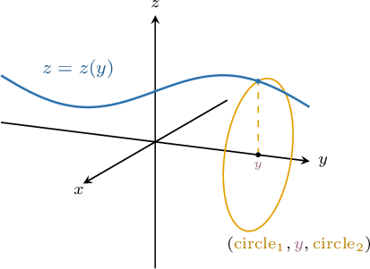
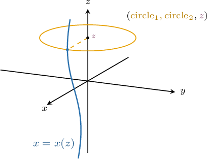
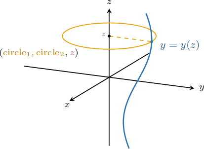
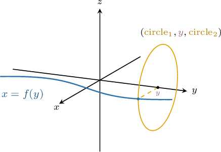

# Surfaces of Revolution

Source: https://www.mathacademy.com/topics/3372?courseId=155
Topic ID: 3372

## Prerequisites

- [Parametric Equations of Circles](../integrated-math-iii-honors/806-parametric-equations-of-circles.md)
- [Areas of Parametric Surfaces](./1790-areas-of-parametric-surfaces.md)

## Lesson

### Introduction

Consider the planar curve $y=e^{-x}$ defined on the interval $x \in [0,2],$ as shown below.

By rotating this curve $2\pi$ radians about the $x$-axis, we get a **surface of revolution**:

We can parametrize this surface in the following way:

- We take a point $P$ on the surface with $x$-coordinate equal to $x_0$ for some fixed $x_0 \in [0,2].$

- Now, by taking the intersection of the surface with the plane $x=x_0,$ we get a circle of radius $e^{-x_0}.$ This circle can be parameterized as follows:

- Finally, by allowing $x_0$ to vary over the interval $[0, 2],$ these circles will trace out the surface of revolution. Therefore, our parameterization is

$$

\mathbf{r}(x,\theta) = \big\langle x, \: e^{-x} \cos{\theta}, \: e^{-x}\sin{\theta} \big\rangle, \quad x \in [0,2], \quad \theta \in [0,2\pi).

$$

Let's now describe some general formulas for parametrizing surfaces of revolution.

### Parametrizing a Surface Generated by Rotating y=y(x) About the x-Axis

Consider the point $(x,y(x),0)$ that lies on the curve $y=y(x)$ in the $xy$-plane. Rotating this point by $2\pi$ radians about the $x$-axis generates a circle, as shown below.

In the diagram above, the pair $(\textrm{circle}_1,\textrm{circle}_2)$ denotes any parametrization of a circle of radius $y(x)$ with parameter $x.$

In general, given a curve $y=y(x)\geq 0$ for $x \in [a,b]$ that is rotated $2\pi$ radians about the $x$-axis, the corresponding surface of revolution can be parametrized as

$$

\mathbf{r} = \big\langle x, \: y(x) \cos\theta, \: y(x) \sin\theta \big\rangle, \quad x\in[a,b], \quad \theta\in [0,2\pi).

$$

Since a parametrization of a circle is not unique, we can obtain different parameterizations of our surface of revolution. For example, the following is also a valid parameterization:

$$

\mathbf{r} = \big\langle x, \: y(x) \sin\theta, \: y(x) \cos\theta \big\rangle, \quad x\in[a,b], \quad \theta\in [0,2\pi)

$$

### Parametrizing a Surface Generated by Rotating z=z(x) About the x-Axis

Now consider the point $(x,0,z(x))$ that lies on a curve $z=z(x)$ in the $xz$-plane. Rotating this point by $2\pi$ radians about the $x$-axis generates a circle, as shown below.

In general, given a curve $z=z(x)\geq 0$ for $x \in [a,b]$ that is rotated $2\pi$ radians about the $x$-axis, the corresponding surface of revolution can be parametrized as

$$

\mathbf{r} = \big\langle x, \: z(x) \cos\theta, \: z(x) \sin\theta \big\rangle, \quad z\in[a,b], \quad \theta\in [0,2\pi).

$$

Again, this parametrization is not unique. An alternative parametrization is

$$

\mathbf{r} = \big\langle x, \: z(x) \sin\theta, \: z(x) \cos\theta \big\rangle, \quad z\in[a,b], \quad \theta\in [0,2\pi).

$$

### Example: Finding a Parametrization of a Surface of Revolution: Rotation About the x-Axis

#### Question

The vector-valued function $\mathbf{r}(x,\theta)$ parametrizes the surface of revolution generated by rotating the curve $y=x^2$ by $2\pi$ radians about the $x$-axis for $x \in \left[0, 1\right].$ What is $\mathbf{r}?$

#### Explanation

A point $(x,y,z)$ on the surface generated by rotating the graph of $y=f(x)$ by $2\pi$ radians about the $x$-axis for $x\in[a,b]$ has the position vector

$$

\begin{aligned}𝐫=⟨𝑥,\,𝑓(𝑥)cos⁡𝜃,\,𝑓(𝑥)sin⁡𝜃⟩,\,𝑥∈[𝑎,𝑏],\,𝜃∈[0,2𝜋).\end{aligned}

$$

First, notice that $y=f(x) = x^2 \geq 0$ for all $x \in \left[0,1\right].$

So, the parametrization of our surface of revolution is

$$

\mathbf{r}(x,\theta) = \big\langle x, \: x^2 \cos\theta, \: x^2\sin\theta \big\rangle, \quad x \in \left[0, 1\right], \quad \theta \in [0,2\pi).

$$

### Formulas for Rotation About the y-Axis

Consider the point $(x(y),y,0)$ that lies on the curve $x=x(y)\geq 0$ for $y\in [a,b]$ in the $xy$-plane. Rotating this point by $2\pi$ radians about the $y$-axis generates a circle, as shown below.

The pair $(\textrm{circle}_1,\textrm{circle}_2)$ denotes any parametrization of a circle of radius $x(y)$ with parameter $y.$

Using arguments similar to those seen earlier, the corresponding surface of revolution can be parametrized as

$$

\mathbf{r} = \big\langle x(y) \cos\theta, \: y, \: x(y) \sin\theta \big\rangle, \quad y\in[a,b], \quad \theta\in [0,2\pi).

$$

Similarly, the rotation of a point $(0,y,z(y))$ on the curve $z=z(y)\geq 0$ in the $yz$-plane about the $y$-axis can be visualized as follows:

The corresponding surface of revolution can be parametrized as

$$

\mathbf{r} = \big\langle z(y) \cos\theta, \: y, \: z(y) \sin\theta \big\rangle, \quad y\in[a,b], \quad \theta\in [0,2\pi).

$$

As mentioned previously, neither of these parameterizations is unique.

### Formulas for Rotation About the z-Axis

Now consider the point $(x(z),0,z)$ on the curve $x=x(z)\geq 0$ for $z\in [a,b]$ in the $xz$-plane. Rotating this point by $2\pi$ radians about the $z$-axis generates a circle, as shown below.

The corresponding surface of revolution can be parametrized as

$$

\mathbf{r} = \big\langle x(z) \cos\theta, \: x(z) \sin\theta, \: z \big\rangle, \quad z\in[a,b], \quad \theta\in [0,2\pi).

$$

Finally, the rotation of a point $(0,y(z),z)$ on a curve $y=y(z)\geq 0$ in the $yz$-plane about the $z$-axis can be visualized as follows:

The corresponding surface of revolution can be parametrized as

$$

\mathbf{r} = \big\langle y(z) \cos\theta, \: y(z) \sin\theta, \: z \big\rangle, \quad z\in[a,b], \quad \theta\in [0,2\pi).

$$

### Example: Finding a Parametrization of a Surface of Revolution: Rotation About the y-Axis or z-Axis

#### Question

The vector-valued function $\mathbf{r}(y,\theta)$ parametrizes the surface of revolution generated by rotating the curve $x=1-\cos{y}$ by $2\pi$ radians about the $y$-axis for $y \in [0, \pi].$ What is $\mathbf{r}?$

#### Explanation

A point $(x,y,z)$ on the surface generated by rotating the graph of $x=f(y)$ by $2\pi$ radians about the $y$-axis has the position vector

$$

\begin{aligned}𝐫=⟨𝑓(𝑦)cos⁡𝜃,\,𝑦,\,𝑓(𝑦)sin⁡𝜃⟩,\,𝑦∈[𝑎,𝑏],\,𝜃=[0,2𝜋).\end{aligned}

$$

First, notice that $x=f(y) = 1-\cos{y} \geq 0$ for all $y \in [0, \pi].$

So, the parametrization of our surface of revolution is

$$

\mathbf{r}(y,\theta) = \big\langle (1-\cos{y}) \cos\theta, \: y, \: (1-\cos{y}) \sin\theta \big\rangle, \quad y \in[0, \pi], \quad \theta \in [0,2\pi).

$$

### Example: The Fundamental Vector Product of a Surface of Revolution

#### Question

The fundamental vector product of the surface of revolution generated by rotating the curve $y=e^{x/2}$ by $2\pi$ radians about the $x$-axis for $x \in [0,2]$ is given by

$$

\big\langle \boxed{\phantom{0}}\,, \:-e^{x/2} \cos\theta, \: -e^{x/2}\sin\theta \big\rangle.

$$

What is the $1$st component of the product?

#### Explanation

Notice that $y=e^{x/2} \geq 0$ for all $x \in [0,2].$ The parametrization of our surface of revolution is

$$

\begin{aligned}𝐫=⟨𝑥,𝑓(𝑥)cos⁡𝜃,\,𝑓(𝑥)sin⁡𝜃⟩,\,(𝑥,𝜃)∈𝐷\end{aligned}

$$

where $f(x)=e^{x/2},$ and

$$

D = \big\{ (x,\theta) \: : \: 0 \leq x \leq 2, \: 0 \leq \theta \lt 2\pi \big\}.

$$

We now compute the tangent vectors to the grid curves:

$$

\begin{aligned}𝐫_{′𝑥}^{} & =⟨\frac{𝜕𝑥}{𝜕𝑥},\,\frac{𝜕𝑦}{𝜕𝑥},\,\frac{𝜕𝑧}{𝜕𝑥}⟩=⟨1,\,𝑓^{′}cos⁡𝜃,\,𝑓^{′}sin⁡𝜃⟩ \\ 𝐫_{′𝜃}^{} & =⟨\frac{𝜕𝑥}{𝜕𝜃},\,\frac{𝜕𝑦}{𝜕𝜃},\,\frac{𝜕𝑧}{𝜕𝜃}⟩=⟨0,\,−𝑓sin⁡𝜃,\,𝑓cos⁡𝜃⟩\end{aligned}

$$

Next, the fundamental vector product is

$$

\begin{aligned}𝐫_{′𝑥}^{}×𝐫_{′𝜃}^{} & =\begin{aligned}𝐢 & 𝐣 & 𝐤 \\ 1 & 𝑓^{′}cos⁡𝜃 & 𝑓^{′}sin⁡𝜃 \\ 0 & −𝑓sin⁡𝜃 & 𝑓cos⁡𝜃\end{aligned} \\ & =⟨\begin{aligned}𝑓^{′}cos⁡𝜃 & 𝑓^{′}sin⁡𝜃 \\ −𝑓sin⁡𝜃 & 𝑓cos⁡𝜃\end{aligned},\,−\begin{aligned}1 & 𝑓^{′}sin⁡𝜃 \\ 0 & 𝑓cos⁡𝜃\end{aligned},\,\begin{aligned}1 & 𝑓^{′}cos⁡𝜃 \\ 0 & −𝑓sin⁡𝜃\end{aligned}⟩ \\ & =⟨𝑓𝑓^{′}cos^{2}⁡𝜃+𝑓𝑓^{′}sin^{2}⁡𝜃,\,−𝑓cos⁡𝜃,\,−𝑓sin⁡𝜃⟩ \\ & =⟨𝑓𝑓^{′},\,−𝑓cos⁡𝜃,\,−𝑓sin⁡𝜃⟩.\end{aligned}

$$

Since $f=e^{x/2},$ we obtain $f' = \dfrac12 e^{x/2}.$ So, finally, we conclude that the fundamental vector product is

$$

\begin{aligned}𝐫_{′𝑥}^{}×𝐫_{′𝜃}^{}=⟨\frac{1}{2}𝑒^{𝑥},\,−𝑒^{𝑥/2}cos⁡𝜃,\,−𝑒^{𝑥/2}sin⁡𝜃⟩.\end{aligned}

$$

Therefore, the $1$st component of the product is $\dfrac{1}{2}e^x.$

### Computing a Surface Area of Revolution

Recall that if $S$ is a surface parametrized by a differentiable vector-valued function

$$

\mathbf{r}(u,v) = \big\langle x(u,v), \: y(u,v), \: z(u,v) \big\rangle

$$

defined over a region $D$ in the $uv$-plane, then the surface area of $S$ is given by

$$

\iint\limits_{S} \: \textrm{d}S = \iint\limits_{D} \| \mathbf{r}'_ u \times \mathbf{r}'_v \| \: \textrm{d}A,

$$

where $\mathbf{r}'_ u \times \mathbf{r}'_v$ is the fundamental vector product of the surface.

Let's apply this formula to find the surface area generated by a surface of revolution.

### Example: Calculating a Surface of Revolution

#### Question

Use a fundamental vector product to find an integral expression for the surface area generated when the curve $x=\sin z$ is rotated by $2\pi$ radians about the $z$-axis for $z \in [0, \pi].$

#### Explanation

Notice that $x=\sin z \geq 0$ for all $z \in [0, \pi].$ The parametrization of our surface of revolution is

$$

\begin{aligned}𝐫=⟨𝑓(𝑧)cos⁡𝜃,\,𝑓(𝑧)sin⁡𝜃,\,𝑧⟩,\,(𝑧,𝜃)∈𝐷\end{aligned}

$$

where $f(z)=\sin z,$ and

$$

D = \big\{ (z,\theta) \, : \, 0 \leq z \leq \pi , \, 0 \leq \theta \leq 2\pi\big\}.

$$

We now compute the tangent vectors to the grid curves:

$$

\begin{aligned}𝐫_{′𝑧}^{} & =⟨\frac{𝜕𝑥}{𝜕𝑧},\,\frac{𝜕𝑦}{𝜕𝑧},\,\frac{𝜕𝑧}{𝜕𝑧}⟩=⟨𝑓^{′}cos⁡𝜃,\,𝑓^{′}sin⁡𝜃,\,1⟩ \\ 𝐫_{′𝜃}^{} & =⟨\frac{𝜕𝑥}{𝜕𝜃},\,\frac{𝜕𝑦}{𝜕𝜃},\,\frac{𝜕𝑧}{𝜕𝜃}⟩=⟨−𝑓sin⁡𝜃,\,𝑓cos⁡𝜃,\,0⟩\end{aligned}

$$

Next, the fundamental vector product is

$$

\begin{aligned}𝐫_{′𝑧}^{}×𝐫_{′𝜃}^{} & =\begin{aligned}𝐢 & 𝐣 & 𝐤 \\ 𝑓^{′}cos⁡𝜃 & 𝑓^{′}sin⁡𝜃 & 1 \\ −𝑓sin⁡𝜃 & 𝑓cos⁡𝜃 & 0\end{aligned} \\ & =⟨\begin{aligned}𝑓^{′}sin⁡𝜃 & 1 \\ 𝑓cos⁡𝜃 & 0\end{aligned},\,−\begin{aligned}𝑓^{′}cos⁡𝜃 & 1 \\ −𝑓sin⁡𝜃 & 0\end{aligned},\,\begin{aligned}𝑓^{′}cos⁡𝜃 & 𝑓^{′}sin⁡𝜃 \\ −𝑓sin⁡𝜃 & 𝑓cos⁡𝜃\end{aligned}⟩ \\ & =⟨−𝑓cos⁡𝜃,\,−𝑓sin⁡𝜃,\,𝑓^{′}𝑓cos^{2}⁡𝜃+𝑓^{′}𝑓sin^{2}⁡𝜃⟩ \\ & =⟨−𝑓cos⁡𝜃,\,−𝑓sin⁡𝜃,\,𝑓^{′}𝑓⟩.\end{aligned}

$$

and

$$

\begin{aligned}𝐫_{′𝑧}^{}×𝐫_{′𝜃}^{} & =\sqrt{√(−𝑓cos⁡𝜃)^{2}+(−𝑓sin⁡𝜃)^{2}+(𝑓^{′}𝑓)^{2}} \\ & =\sqrt{√𝑓^{2}(cos^{2}⁡𝜃+sin^{2}⁡𝜃)+𝑓^{2}(𝑓^{′})^{2}} \\ & =\sqrt{√𝑓^{2}+𝑓^{2}(𝑓^{′})^{2}} \\ & =𝑓\sqrt{√1+(𝑓^{′})^{2}}.\end{aligned}

$$

Therefore, the surface area is

$$

\begin{aligned}𝐴 & =\underset{𝑆}{∬}\,d𝑆 \\ & =\underset{𝐷}{∬}𝐫_{′𝑧}^{}×𝐫_{′𝜃}^{}d𝑧\,d𝜃 \\ & =\underset{𝐷}{∬}𝑓\sqrt{√1+(𝑓^{′})^{2}}\,d𝑧\,d𝜃 \\ & =∫_{𝜋0}^{}𝑓\sqrt{√1+(𝑓^{′})^{2}}∫_{2𝜋0}^{}\,d𝜃\,d𝑧 \\ & =∫_{𝜋0}^{}𝑓\sqrt{√1+(𝑓^{′})^{2}}⋅𝜃\,_{2𝜋0}^{}\,d𝑧 \\ & =2𝜋∫_{𝜋0}^{}𝑓\sqrt{√1+(𝑓^{′})^{2}}\,d𝑧.\end{aligned}

$$

Since $f(z)=\sin z,$ we obtain $f'(z) = \cos z.$ So, finally, we conclude that our expression for the surface area is

$$

\begin{aligned}2𝜋∫_{𝜋0}^{}𝑓\sqrt{√1+(𝑓^{′})^{2}}\,d𝑧 & =2𝜋∫_{𝜋0}^{}sin⁡𝑧\sqrt{√1+(cos⁡𝑧)^{2}}\,d𝑧 \\ & =2𝜋∫_{𝜋0}^{}sin⁡𝑧\sqrt{√1+cos^{2}⁡𝑧}\,d𝑧.\end{aligned}

$$
