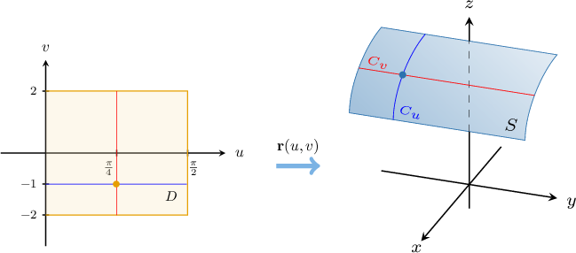
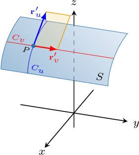

# Tangent Planes to Parametric Surfaces

Source: https://www.mathacademy.com/topics/3373?courseId=155
Topic ID: 3373

## Prerequisites

- [Parametric Surfaces](./1789-parametric-surfaces.md)
- [Geometric Interpretations of Partial Derivatives](../mathematical-methods-for-the-physical-sciences-i/1955-geometric-interpretations-of-partial-derivatives.md)
- [Tangent Planes to Surfaces](../mathematical-methods-for-the-physical-sciences-i/1980-tangent-planes-to-surfaces.md)

## Lesson

### Introduction

Consider the surface $S$ that's parametrized by the vector-valued function $\mathbf r (u,v),$ given by

$$

\mathbf{r}(u,v) =\big\langle \sqrt{2}\cos u, \: v, \: \sqrt{2}\sin u + 2 \big\rangle, \qquad 0\leq u \leq \dfrac{\pi}2, \quad -2\leq v \leq 2.

$$

How can we determine the tangent plane to this surface at the point $P$ where $u=\dfrac{\pi}{4}$ and $v=-1?$

First, notice the following:

- By fixing $v=-1,$ we get the parametric curve ${\color{blue}C_u}$ with vector function $\mathbf{r}\left(u,-1\right)$ that depends only on the parameter $u.$

- By fixing $u=\dfrac{\pi}{4},$ we get the parametric curve ${\color{red}C_v}$ with vector function $\mathbf{r}\left(\dfrac{\pi}{4},v\right)$ that depends only on the parameter $v.$

The curves $C_u$ and $C_v$ are called **grid curves**. The domain of the parameter space $D$ and the grid curves $C_u$ and $C_v$ on the surface $S$ are shown below.

Now, we find the tangent vectors to $C_u$ and $C_v$ at our point $P\mathbin{:}$

- The tangent vector to $C_u$ is denoted $\mathbf{r}'_u,$ and is defined as

- The tangent vector to $C_v$ is denoted $\mathbf{r}'_v,$ and is defined as

If $\mathbf{r}'_u$ and $\mathbf{r}'_v$ are nonparallel, then these two vectors can be used to define a unique tangent plane to the surface at the given point.

The corresponding partial derivatives evaluated at $P$ are calculated as follows:

$$

\begin{aligned} & 𝐫_{′𝑢}^{}=⟨−\sqrt{√2}sin⁡𝑢,\,0,\,\sqrt{√2}cos⁡𝑢⟩ & \,⟹\, & 𝐫_{′𝑢}^{}(\frac{𝜋}{4},−1)=⟨−1,0,1⟩ \\ & 𝐫_{′𝑣}^{}=⟨0,1,0⟩ & \,⟹\, & 𝐫_{′𝑣}^{}(\frac{𝜋}{4},−1)=⟨0,1,0⟩\end{aligned}

$$

Since the vectors are not parallel, they indeed define a unique plane.

Furthermore, we can find a normal vector to the plane by computing the cross product. This gives

$$

\begin{aligned}𝐫_{′𝑢}^{}×𝐫_{′𝑣}^{} & =\begin{aligned}𝐢 & 𝐣 & 𝐤 \\ −1 & 0 & 1 \\ 0 & 1 & 0\end{aligned}=⟨−1,\,0,\,−1⟩.\end{aligned}

$$

### Example: Finding a Normal Vector to a Parametric Surface Given Some Parameter Values

#### Question

Compute a normal vector to the parametric surface defined by the equations

$$

x=u, \quad y=1+u^2, \quad z=v^2

$$

at the point where $u=1$ and $v=2.$

#### Explanation

In vector form, our surface has the equation

$$

\mathbf{r}(u,v) = \big\langle u, \: 1 + u^2, \: v^2\big\rangle.

$$

We first compute the tangent vectors to the grid curves:

$$

\begin{aligned}𝐫_{′𝑢}^{}(𝑢,𝑣) & =⟨\frac{𝜕𝑥}{𝜕𝑢},\,\frac{𝜕𝑦}{𝜕𝑢},\,\frac{𝜕𝑧}{𝜕𝑢}⟩ \\ & =⟨\frac{𝜕}{𝜕𝑢}(𝑢),\,\frac{𝜕}{𝜕𝑢}(1+𝑢^{2}),\,\frac{𝜕}{𝜕𝑢}(𝑣^{2})⟩ \\ & =⟨1,\,2𝑢,\,0⟩ \\ 𝐫_{′𝑣}^{}(𝑢,𝑣) & =⟨\frac{𝜕𝑥}{𝜕𝑣},\,\frac{𝜕𝑦}{𝜕𝑣},\,\frac{𝜕𝑧}{𝜕𝑣}⟩ \\ & =⟨\frac{𝜕}{𝜕𝑣}(𝑢),\,\frac{𝜕}{𝜕𝑣}(1+𝑢^{2}),\,\frac{𝜕}{𝜕𝑣}(𝑣^{2})⟩ \\ & =⟨0,\,0,\,2𝑣⟩\end{aligned}

$$

Next, we evaluate these tangent vectors when $u=1$ and $v=2{:}$

$$

\begin{aligned}𝐫_{′𝑢}^{}(1,2) & =⟨1,\,2(1),\,0⟩ \\ & =⟨1,\,2,\,0⟩ \\ 𝐫_{′𝑣}^{}(1,2) & =⟨0,\,0,\,2(2)⟩ \\ & =⟨0,\,0,\,4⟩\end{aligned}

$$

Therefore, a normal vector to the surface at the point where $u=1$ and $v=2$ is

$$

\begin{aligned}𝐧 & =𝐫_{′𝑢}^{}(1,2)×𝐫_{′𝑣}^{}(1,2) \\ & =\begin{aligned}𝐢 & 𝐣 & 𝐤 \\ 1 & 2 & 0 \\ 0 & 0 & 4\end{aligned} \\ & =⟨\begin{aligned}2 & 0 \\ 0 & 4\end{aligned},\,−\begin{aligned}1 & 0 \\ 0 & 4\end{aligned},\,\begin{aligned}1 & 2 \\ 0 & 0\end{aligned}⟩ \\ & =⟨8,\,−4,\,0⟩.\end{aligned}

$$

### Example: Finding a Normal Vector to a Parametric Surface Given a Point on the Surface

#### Question

Compute a normal vector to the parametric surface generated by the vector-valued function at the point

#### Explanation

First, notice that since lies on the surface, we obtain

We now compute the tangent vectors to the grid curves:

Next, we evaluate these tangent vectors when and

Therefore, a normal vector to the surface at the point is

### Tangent Plane to a Parametric Surface

To find the equation of the tangent plane to the surface generated by a vector-valued function $\mathbf{r}(u,v)$ at $P(x_0,y_0,z_0),$ where $u=u_0$ and $v=v_0,$ we can use the following procedure:

- Compute the partial derivatives $\mathbf{r}'_u(u_0,v_0)$ and $\mathbf{r}'_v(u_0,v_0)$ at the point $P.$

- Compute the cross product $\mathbf{n} = \mathbf{r}'_u \times \mathbf{r}'_v$ at this point.

- If $\mathbf{r}'_u \times \mathbf{r}'_v \neq \mathbf{0},$ then this product gives a normal vector $\mathbf{n}$ to the surface. Therefore, our equation of the tangent plane can be written as

### Example: Finding the Equation of the Tangent Plane to a Parametric Surface Given Some Parameter Values

#### Question

Find the equation of the tangent plane to the surface generated by the vector-valued function $\mathbf{r}(u,v) = \big\langle v^2, \: u-v, \: u^2 \big\rangle$ at the point where $u=2$ and $v=-1.$

#### Explanation

We first compute the tangent vectors to the grid curves:

$$

\begin{aligned}𝐫_{′𝑢}^{}(𝑢,𝑣) & =⟨\frac{𝜕𝑥}{𝜕𝑢},\,\frac{𝜕𝑦}{𝜕𝑢},\,\frac{𝜕𝑧}{𝜕𝑢}⟩ \\ & =⟨\frac{𝜕}{𝜕𝑢}(𝑣^{2}),\,\frac{𝜕}{𝜕𝑢}(𝑢−𝑣),\,\frac{𝜕}{𝜕𝑢}(𝑢^{2})⟩ \\ & =⟨0,\,1,\,2𝑢⟩ \\ 𝐫_{′𝑣}^{}(𝑢,𝑣) & =⟨\frac{𝜕𝑥}{𝜕𝑣},\,\frac{𝜕𝑦}{𝜕𝑣},\,\frac{𝜕𝑧}{𝜕𝑣}⟩ \\ & =⟨\frac{𝜕}{𝜕𝑣}(𝑣^{2}),\,\frac{𝜕}{𝜕𝑣}(𝑢−𝑣),\,\frac{𝜕}{𝜕𝑣}(𝑢^{2})⟩ \\ & =⟨2𝑣,\,−1,\,0⟩\end{aligned}

$$

Next, we evaluate these vectors when $u=2$ and $v=-1{:}$

$$

\begin{aligned}𝐫_{′𝑢}^{}(2,−1) & =⟨0,\,1,\,2(2)⟩ \\ & =⟨0,\,1,\,4⟩ \\ 𝐫_{′𝑣}^{}(2,−1) & =⟨2(−1),\,−1,\,0⟩ \\ & =⟨−2,\,−1,\,0⟩\end{aligned}

$$

Therefore, a normal vector to the surface is

$$

\begin{aligned}𝐧 & =𝐫_{′𝑢}^{}(2,−1)×𝐫_{′𝑣}^{}(2,−1) \\ & =\begin{aligned}𝐢 & 𝐣 & 𝐤 \\ 0 & 1 & 4 \\ −2 & −1 & 0\end{aligned} \\ & =⟨\begin{aligned}1 & 4 \\ −1 & 0\end{aligned},\,−\begin{aligned}0 & 4 \\ −2 & 0\end{aligned},\,\begin{aligned}0 & 1 \\ −2 & −1\end{aligned}⟩ \\ & =⟨4,\,−8,\,2⟩.\end{aligned}

$$

Since the parameters $u=2$ and $v=-1$ correspond to the point

$$

\big( (-1)^2, \: 2-(-1), \: 2^2 \big) = (1, 3, 4),

$$

the equation of the tangent plane is

$$

\begin{aligned}𝐧⋅⟨𝑥−𝑥_{0},\,𝑦−𝑦_{0},\,𝑧−𝑧_{0}⟩ & =0 \\ ⟨4,\,−8,\,2⟩⋅⟨𝑥−1,\,𝑦−3,\,𝑧−4⟩ & =0 \\ 4⋅(𝑥−1)+(−8)⋅(𝑦−3)+2⋅(𝑧−4) & =0 \\ 4𝑥−8𝑦+2𝑧+12 & =0 \\ 2𝑥−4𝑦+𝑧+6 & =0 \\ 2𝑥−4𝑦+𝑧 & =−6.\end{aligned}

$$

### Example: Finding the Equation of the Tangent Plane to a Parametric Surface Given a Point on the Surface

#### Question

Find the equation of the tangent plane to the surface defined by the equations

$$

x=u+v, \quad y=3u^2, \quad z=u-v

$$

at the point $(2,3, 0).$

#### Explanation

In vector form, our surface has the equation

$$

\mathbf{r}(u,v) = \big\langle u+v, \: 3u^2, \: u-v \big\rangle.

$$

First, notice that since $(2, 3, 0)$ lies on the surface, we obtain

$$

\begin{aligned}𝑢+𝑣=2 \\ 3𝑢^{2}=3 \\ 𝑢−𝑣=0\end{aligned}

$$

We now compute the tangent vectors to the grid curves:

$$

\begin{aligned}𝐫_{′𝑢}^{}(𝑢,𝑣) & =⟨\frac{𝜕𝑥}{𝜕𝑢},\,\frac{𝜕𝑦}{𝜕𝑢},\,\frac{𝜕𝑧}{𝜕𝑢}⟩ \\ & =⟨\frac{𝜕}{𝜕𝑢}(𝑢+𝑣),\,\frac{𝜕}{𝜕𝑢}(3𝑢^{2}),\,\frac{𝜕}{𝜕𝑢}(𝑢−𝑣)⟩ \\ & =⟨1,\,6𝑢,\,1⟩ \\ 𝐫_{′𝑣}^{}(𝑢,𝑣) & =⟨\frac{𝜕𝑥}{𝜕𝑣},\,\frac{𝜕𝑦}{𝜕𝑣},\,\frac{𝜕𝑧}{𝜕𝑣}⟩ \\ & =⟨\frac{𝜕}{𝜕𝑣}(𝑢+𝑣),\,\frac{𝜕}{𝜕𝑣}(3𝑢^{2}),\,\frac{𝜕}{𝜕𝑣}(𝑢−𝑣)⟩ \\ & =⟨1,\,0,\,−1⟩\end{aligned}

$$

Next, we evaluate these tangent vectors when $u=1$ and $v=1{:}$

$$

\begin{aligned}𝐫_{′𝑢}^{}(1,1) & =⟨1,\,6(1),\,1⟩ \\ & =⟨1,\,6,\,1⟩ \\ 𝐫_{′𝑣}^{}(1,1) & =⟨1,\,0,\,−1⟩\end{aligned}

$$

Therefore, a normal vector to the surface is

$$

\begin{aligned}𝐧 & =𝐫_{′𝑢}^{}(1,1)×𝐫_{′𝑣}^{}(1,1) \\ & =\begin{aligned}𝐢 & 𝐣 & 𝐤 \\ 1 & 6 & 1 \\ 1 & 0 & −1\end{aligned} \\ & =⟨\begin{aligned}6 & 1 \\ 0 & −1\end{aligned},\,−\begin{aligned}1 & 1 \\ 1 & −1\end{aligned},\,\begin{aligned}1 & 6 \\ 1 & 0\end{aligned}⟩ \\ & =⟨−6,\,2,\,−6⟩.\end{aligned}

$$

Finally, the equation of the tangent plane is

$$

\begin{aligned}𝐧⋅⟨𝑥−𝑥_{0},\,𝑦−𝑦_{0},\,𝑧−𝑧_{0}⟩ & =0 \\ ⟨−6,\,2,\,−6⟩⋅⟨𝑥−2,\,𝑦−3,\,𝑧⟩ & =0 \\ (−6)⋅(𝑥−2)+2⋅(𝑦−3)+(−6)⋅𝑧 & =0 \\ −6𝑥+2𝑦−6𝑧+6 & =0 \\ −3𝑥+𝑦−3𝑧+3 & =0 \\ 3𝑥−𝑦+3𝑧 & =3.\end{aligned}

$$
