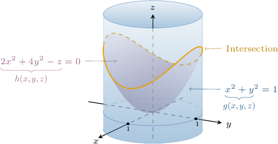
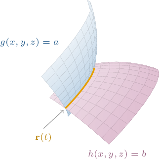
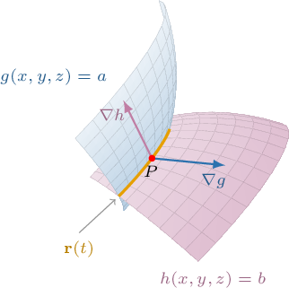
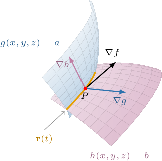

# Lagrange Multipliers With Multiple Constraints

Source: https://www.mathacademy.com/topics/3380?courseId=155
Topic ID: 3380

## Prerequisites

- [The Multivariable Chain Rule in Vector Form](../mathematical-methods-for-the-physical-sciences-i/1936-the-multivariable-chain-rule-in-vector-form.md)
- [Lagrange Multipliers With One Constraint](./1948-lagrange-multipliers-with-one-constraint.md)
- [Intersections of Lines and Planes With Surfaces](../mathematical-methods-for-the-physical-sciences-i/4208-intersections-of-lines-and-planes-with-surfaces.md)

## Lesson

### Introduction

We can find global extrema of multivariable functions subject to multiple constraints using the method of Lagrange multipliers.

For example, suppose that we want to find the minimum value of

$$

f(x,y,z) = 4xy+z^2

$$

subject to the following *two* constraints:

$$

g(x,y,z)=x^2+y^2=1, \qquad h(x,y,z)=2x^2 + 4y^2 - z = 0

$$

Geometrically, this means that we want to minimize $f(x,y,z)$ over the intersection of the cylinder $x^2+y^2=1$ and the elliptic paraboloid $2x^2 + 4y^2 - z = 0,$ as shown below.

The method of Lagrange multipliers states that the extrema of the function $f(x,y,z)$ subject to constraints $g(x,y,z)=a$ and $h(x,y,z)=b$ can be found by solving the following system:

$$

\begin{aligned}∇𝑓(𝑥,𝑦,𝑧)=𝜆∇𝑔(𝑥,𝑦,𝑧)+𝜇∇ℎ(𝑥,𝑦,𝑧) \\ 𝑔(𝑥,𝑦,𝑧)=𝑎 \\ ℎ(𝑥,𝑦,𝑧)=𝑏\end{aligned}

$$

Here, the constants $\lambda$ and $\mu$ are the Lagrange multipliers of this system.

As before, this method assumes that $\nabla g \neq \mathbf{0}$ and $\nabla h \neq \mathbf{0}$ on the curves $g(x,y,z)=a$ and $h(x,y,z)=b,$ and that the extreme values exist.

**Note:** Geometrically, the condition $\nabla f = \lambda \nabla g + \mu \nabla h$ states that

- $\nabla f$ lies in the plane spanned by $\nabla g$ and $\nabla h,$ or, equivalently,

- $\nabla f$ is perpendicular to the level surfaces $g(x,y,z) = a$ and $h(x,y,z) = b.$

We'll explore this geometric intuition further at the end of the lesson.

### Example: Constructing a Lagrange System With Two Constraints

#### Question

Suppose we want to find the minimum of the function $f(x,y,z)=2xz+y^2$ on the intersection of the surfaces $x-z=2$ and $x^2+y^2+2z^2=3$ using the method of Lagrange multipliers. Then, the corresponding Lagrange multipliers $\lambda$ and $\mu$ satisfy the following system:

$$

\begin{aligned}⟨2𝑧,\,𝐴𝐴,\,2𝑥⟩=𝜆⟨1,\,0,\,𝐴𝐴\,⟩+𝜇⟨2𝑥,\,2𝑦,\,𝐴𝐴\,⟩ \\ 𝑥−𝑧=2 \\ 𝑥^{2}+𝑦^{2}+2𝑧^{2}=3\end{aligned}

$$

From left to right, what are the missing parts of the expressions?

#### Explanation

We need to find the minimum value of

$$

f(x,y,z) = 2xz+y^2

$$

subject to the constraints

$$

g(x,y,z)=x-z=2, \qquad h(x,y,z)=x^2+y^2+2z^2=3.

$$

Therefore, by the method of Lagrange multipliers, we must solve the following system:

$$

\begin{aligned}∇𝑓(𝑥,𝑦,𝑧)=𝜆∇𝑔(𝑥,𝑦,𝑧)+𝜇∇ℎ(𝑥,𝑦,𝑧) \\ 𝑔(𝑥,𝑦,𝑧)=2 \\ ℎ(𝑥,𝑦,𝑧)=3\end{aligned}

$$

We now expand the first equation of the system:

$$

\begin{aligned}∇𝑓(𝑥,𝑦,𝑧) & =𝜆∇𝑔(𝑥,𝑦,𝑧)+𝜇∇ℎ(𝑥,𝑦,𝑧) \\ ⟨𝑓_{𝑥},𝑓_{𝑦},𝑓_{𝑧}⟩ & =𝜆⟨𝑔_{𝑥},𝑔_{𝑦},𝑔_{𝑧}⟩+𝜇⟨ℎ_{𝑥},ℎ_{𝑦},ℎ_{𝑧}⟩ \\ ⟨2𝑧,\,2𝑦,\,2𝑥⟩ & =𝜆⟨1,\,0,\,−1⟩+𝜇⟨2𝑥,\,2𝑦,\,4𝑧⟩\end{aligned}

$$

Therefore, the missing parts are $2y,\:$ $-1,\:$ and $4z.$

### Example: Solving a Lagrange System With Two Constraints

#### Question

Use the method of Lagrange multipliers to find the minimum value of the function $f(x,y,z) = x-y-z$ on the intersection of the plane $x+y+z=2$ and the cylinder $x^2+z^2=4.$

#### Explanation

We need to find the minimum value of

$$

f(x,y,z) = x-y-z

$$

subject to the constraints

$$

g(x,y,z)=x+y+z=2, \qquad h(x,y,z)=x^2 + z^2 = 4.

$$

Since $f(x,y,z)$ is continuous and the constraint is closed and bounded, $f(x,y,z)$ reaches a global maximum and a global minimum on the constraint.

Therefore, by the method of Lagrange multipliers, we must solve the following system:

$$

\begin{aligned}∇𝑓(𝑥,𝑦,𝑧)=𝜆∇𝑔(𝑥,𝑦,𝑧)+𝜇∇ℎ(𝑥,𝑦,𝑧) \\ 𝑔(𝑥,𝑦,𝑧)=2 \\ ℎ(𝑥,𝑦,𝑧)=4\end{aligned}

$$

We start by expanding the first equation:

$$

\begin{aligned}∇𝑓(𝑥,𝑦,𝑧) & =𝜆∇𝑔(𝑥,𝑦,𝑧)+𝜇∇ℎ(𝑥,𝑦,𝑧) \\ ⟨𝑓_{𝑥},𝑓_{𝑦},𝑓_{𝑧}⟩ & =𝜆⟨𝑔_{𝑥},𝑔_{𝑦},𝑔_{𝑧}⟩+𝜇⟨ℎ_{𝑥},ℎ_{𝑦},ℎ_{𝑧}⟩ \\ ⟨1,−1,−1⟩ & =𝜆⟨1,1,1⟩+𝜇⟨2𝑥,0,2𝑧⟩\end{aligned}

$$

Therefore, we have the following system:

$$

\begin{aligned}\begin{aligned}1=𝜆+2𝜇𝑥 \\ −1=𝜆 \\ −1=𝜆+2𝜇𝑧\end{aligned}\,⇒\,\begin{aligned}𝑥=\frac{1}{𝜇} \\ 𝜆=−1 \\ 𝜇𝑧=0\end{aligned}\end{aligned}

$$

Notice that $\mu$ can't be zero since this leads to a contradiction. So, from the third equation above, we must have $z=0.$

Next, we substitute $z=0$ into the second constraint:

$$

\begin{aligned}𝑥^{2}+𝑧^{2} & =4 \\ 𝑥^{2} & =4 \\ 𝑥 & =±2\end{aligned}

$$

Finally, we substitute $x$ and $z$ into the first constraint:

- If $x=2$ and $z= 0,$ we have

- If $x=-2$ and $z=0,$ we have

Therefore, $f$ has possible extreme values at the points

$$

(2, 0, 0), \qquad (-2, 4, 0).

$$

We evaluate $f$ at each of these points. These are given in the following table:

Therefore, the function reaches a minimum value at $(-2, 4, 0),$ and its minimum value is $-6.$

### Justification of the Lagrange Multiplier Method With Multiple Constraints

Let's now justify why the Lagrange multipliers method works with multiple constraints.

Suppose we wish to optimize the function $f(x,y,z)$ subject to the constraints $g(x,y,z)=a$ and $h(x,y,z)=b.$

Note the following:

- The natural domain of $f$ is some subset of $\mathbb R^3.$

- If we were to impose the first constraint only, we'd restrict the domain of $f$ to points on the level surface $g(x,y,z)=a.$

- Similarly, if we were to impose the second constraint only, we'd restrict the domain of $f$ to points on the level surface $h(x,y,z)=b.$

- Thus, by imposing *both* constraints, we restrict the domain of $f$ to the *intersection* of these two level surfaces. The intersection of two surfaces is a curve, which we'll denote as $\mathbf r(t)$ for some real parameter $t.$

The curve $\mathbf r(t)$ and the level surfaces are shown below.

Now, let $P(x_0,y_0,z_0)$ be a point that lies on $\mathbf r(t)$ for some $t = t_0$ that is an extrema (max or min) of $f.$

Since $g(x,y,z)=a$ and $h(x,y,z)=b$ are level surfaces of the functions $g(x,y,z)$ and $h(x,y,z),$ we have the following:

- $\nabla g$ is perpendicular to $g(x,y,z)=a$ at $P,$ and is therefore perpendicular to $\mathbf r(t)$ at $P.$

- $\nabla h$ is perpendicular to $h(x,y,z)=b$ at $P,$ and is therefore perpendicular to $\mathbf r(t)$ at $P.$

The situation is sketched below.

Let's now compute $\big[f(\mathbf r(t))\big]',$ the derivative of $f$ over the curve $\mathbf r(t).$ By the chain rule, we get

$$

\begin{aligned}[𝑓(𝐫(𝑡))]^{′} & =[𝑓(𝑥(𝑡),𝑦(𝑡),𝑧(𝑡))]^{′} \\ & =𝑓_{𝑥}(𝑥,𝑦,𝑧)⋅𝑥^{′}(𝑡)+𝑓_{𝑦}(𝑥,𝑦,𝑧)⋅𝑦^{′}(𝑡)+𝑓_{𝑧}(𝑥,𝑦,𝑧)⋅𝑧^{′}(𝑡) \\ & =⟨𝑓_{𝑥}(𝑥,𝑦,𝑧),𝑓_{𝑦}(𝑥,𝑦,𝑧),𝑓_{𝑧}(𝑥,𝑦,𝑧)⟩⋅⟨𝑥^{′}(𝑡),𝑦^{′}(𝑡),𝑧^{′}(𝑡)⟩ \\ & =∇𝑓(𝐫(𝑡))⋅𝐫^{′}(𝑡).\end{aligned}

$$

Since $P$ is an extremum, we must have

$$

\big[f(\mathbf{r}(t_0))\big]' = 0 \qquad\Longrightarrow\qquad \nabla f(\mathbf{r}(t_0)) \cdot \mathbf{r}'(t_0) = 0 \qquad\Longrightarrow\qquad \nabla f(\mathbf{r}(t_0)) \perp \mathbf{r}'(t_0).

$$

Since $\mathbf{r}'(t_0)$ is tangent to $\mathbf r(t)$ at $P,$ we have that $\nabla f(\mathbf{r}(t_0))$ is perpendicular to $\mathbf r(t)$ at $P.$

So, $\nabla g$ and $\nabla h$ are both perpendicular to $\mathbf{r}(t)$ at $P$. Assuming they aren't parallel, they span the two-dimensional space perpendicular to $\mathbf{r}(t)$. Now $\nabla f$ is also perpendicular to $\mathbf{r}(t)$ at $P$. This means that $\nabla f$ lies in the plane spanned by $\nabla g$ and $\nabla h.$ This condition can be represented by the following equation:

$$

\nabla f(x,y,z) = \lambda \nabla g(x,y,z) + \mu \nabla h(x,y,z),

$$

where the real numbers $\lambda$ and $\mu$ are the Lagrange multipliers.

