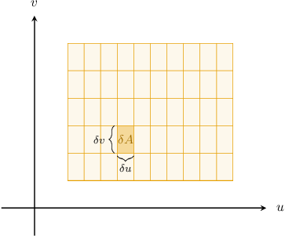
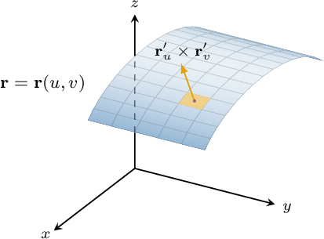

# Surface Integrals Over Parametric Surfaces

Source: https://www.mathacademy.com/topics/3386?courseId=155
Topic ID: 3386

## Prerequisites

- [Areas of Parametric Surfaces](./1790-areas-of-parametric-surfaces.md)

## Lesson

### Introduction

Consider a continuous scalar function $f(x,y,z)$ and a surface $S$ with parametrization $\mathbf{r}(u,v)$ defined for $(u,v) \in D,$ where $D\subseteq \mathbb R^2.$

If our surface is "sufficiently smooth," we can define the **surface integral** of $f$ over $S.$ Let's discuss how we might construct such an integral.

For the sake of simplicity, let's assume that our region $D$ is rectangular. We start by creating a partition $P$ of $D$ in the usual way:

$$

P = \left\{u_0, u_1, \ldots, u_m\right\} \times \left\{v_0, v_1, \ldots, v_n\right\}

$$

Our partition is shown schematically below.

The area $\delta A = \delta u\delta v$ of the small rectangle highlighted in the diagram corresponds to a particular patch $S_{ij}$ of area $\delta S_{ij}$ on our surface.

Let $P_{ij}^*$ be a point on the surface within the patch $S_{ij}.$ We consider the product

$$

f(P_{ij}^*) \cdot \delta S_{ij}.

$$

If we compute this product for all patches and add them together, we get the Riemann sum

$$

\sum_{i=1}^m\sum_{j=1}^n f(P_{ij}^*)\cdot\delta S_{ij}.

$$

Taking the limit as $\delta u, \delta v\to 0$ gives our definition of the surface integral of $f$ over $S,$ which we denote as

$$

\iint\limits_S f(x,y,z) \, \textrm{d}S.

$$

From previous discussions, we know that the area of the small patch can be approximated as follows:

$$

\delta S_{ij} \approx \| \mathbf r'_u \times \mathbf r'_v\|\,\delta u\delta v = \| \mathbf r'_u \times \mathbf r'_v\|\,\delta A

$$

It follows that we can calculate our surface integral using the following formula:

$$

\iint\limits_S f(x,y,z) \, \textrm{d}S = \iint\limits_D f(\mathbf{r}(u,v)) \left\| \mathbf{r}'_u \times \mathbf{r}'_v \right\| \text{d}A

$$

This formula is also valid when $D$ is non-rectangular.

Let's see an example of applying this in practice.

### A Worked Example

Consider the surface integral of the function

$$

f(x,y,z) = x^2+y^2+z^2

$$

over the parametric surface $S,$ defined as

$$

\mathbf{r}(u,v) = \big\langle u, \: 2v, \: -u \big\rangle, \quad (u,v)\in D

$$

where the region $D$ is the unit square in the $uv$-plane given by

$$

D = \{(u,v) \: | \: 0\leq u\leq 1,\: 0\leq v\leq 1\}.

$$

Let's compute the surface integral of $f$ over $S.$

For a surface $S$ with parametrization $\mathbf{r}(u,v)$ for $(u,v) \in D,$ the surface integral of $f$ over $S$ is given by

$$

\iint\limits_S f(x,y,z) \, \textrm{d}S = \iint\limits_D f(\mathbf{r}(u,v)) \left\| \mathbf{r}'_u \times \mathbf{r}'_v \right\| \text{d}A.

$$

We first compute the tangent vectors to the grid curves:

$$

\begin{aligned}𝐫_{′𝑢}^{} & =⟨\frac{𝜕𝑥}{𝜕𝑢},\,\frac{𝜕𝑦}{𝜕𝑢},\,\frac{𝜕𝑧}{𝜕𝑢}⟩ \\ & =⟨\frac{𝜕}{𝜕𝑢}(𝑢),\,\frac{𝜕}{𝜕𝑢}(2𝑣),\,\frac{𝜕}{𝜕𝑢}(−𝑢)⟩ \\ & =⟨1,\,0,\,−1⟩ \\ 𝐫_{′𝑣}^{} & =⟨\frac{𝜕𝑥}{𝜕𝑣},\,\frac{𝜕𝑦}{𝜕𝑣},\,\frac{𝜕𝑧}{𝜕𝑣}⟩ \\ & =⟨\frac{𝜕}{𝜕𝑣}(𝑢),\,\frac{𝜕}{𝜕𝑣}(2𝑣),\,\frac{𝜕}{𝜕𝑣}(−𝑢)⟩ \\ & =⟨0,\,2,\,0⟩\end{aligned}

$$

Then, we calculate the fundamental vector product:

$$

\begin{aligned}𝐫_{′𝑢}^{}×𝐫_{′𝑣}^{} & =\begin{aligned}𝐢 & 𝐣 & 𝐤 \\ 1 & 0 & −1 \\ 0 & 2 & 0\end{aligned} \\ & =⟨\begin{aligned}0 & −1 \\ 2 & 0\end{aligned},\,−\begin{aligned}1 & −1 \\ 0 & 0\end{aligned},\,\begin{aligned}1 & 0 \\ 0 & 2\end{aligned}⟩ \\ & =⟨2,\,0,\,2⟩\end{aligned}

$$

Therefore,

$$

\begin{aligned}𝐫_{′𝑢}^{}×𝐫_{′𝑣}^{} & =∥⟨2,\,0,\,2⟩∥ \\ & =\sqrt{√2^{2}+0^{2}+2^{2}} \\ & =2\sqrt{√2}.\end{aligned}

$$

Next, we substitute the coordinate expressions of $\mathbf{r}(u,v)$ into $f(x,y,z){:}$

$$

\begin{aligned}𝑓(𝐫(𝑢,𝑣)) & =(𝑥^{2}+𝑦^{2}+𝑧^{2})\,_{𝑥=𝑢\,𝑦=2𝑣\,𝑧=−𝑢} \\ & =𝑢^{2}+(2𝑣)^{2}+(−𝑢)^{2} \\ & =𝑢^{2}+4𝑣^{2}+𝑢^{2} \\ & =2𝑢^{2}+4𝑣^{2}\end{aligned}

$$

Therefore, the surface integral can be written as

$$

\begin{aligned}\underset{𝑆}{∬}𝑓(𝑥,𝑦,𝑧)\,d𝑆 & =\underset{𝐷}{∬}𝑓(𝐫(𝑢,𝑣))𝐫_{′𝑢}^{}×𝐫_{′𝑣}^{}d𝐴 \\ & =\underset{𝐷}{∬}\,(2𝑢^{2}+4𝑣^{2})⋅2\sqrt{√2}\,d𝐴 \\ & =4\sqrt{√2}\underset{𝐷}{∬}\,𝑢^{2}+2𝑣^{2}\,d𝐴.\end{aligned}

$$

Finally, we can evaluate this integral as follows:

$$

\begin{aligned}\underset{𝑆}{∬}𝑓(𝑥,𝑦,𝑧)\,d𝑆 & =4\sqrt{√2}\underset{𝐷}{∬}\,𝑢^{2}+2𝑣^{2}\,d𝐴 \\ & =4\sqrt{√2}\underset{𝐷}{∬}\,𝑢^{2}+4\sqrt{√2}\underset{𝐷}{∬}2𝑣^{2}\,d𝐴 \\ & =4\sqrt{√2}\underset{𝐷}{∬}\,𝑢^{2}+8\sqrt{√2}\underset{𝐷}{∬}𝑣^{2}\,d𝐴 \\ & =4\sqrt{√2}∫_{10}^{}∫_{10}^{}𝑢^{2}\,d𝑢\,d𝑣+8\sqrt{√2}∫_{10}^{}∫_{10}^{}𝑣^{2}\,d𝑢\,d𝑣 \\ & =4\sqrt{√2}∫_{10}^{}∫_{10}^{}𝑢^{2}\,d𝑢\,d𝑣+8\sqrt{√2}∫_{10}^{}∫_{10}^{}𝑢^{2}\,d𝑢\,d𝑣 \\ & =12\sqrt{√2}∫_{10}^{}∫_{10}^{}𝑢^{2}\,d𝑢\,d𝑣 \\ & =12\sqrt{√2}∫_{10}^{}\,d𝑣∫_{10}^{}𝑢^{2}\,d𝑢 \\ & =12\sqrt{√2}⋅(1−0)⋅∫_{10}^{}𝑢^{2}\,d𝑢 \\ & =12\sqrt{√2}⋅[\frac{1}{3}𝑢^{3}]_{10}^{} \\ & =12\sqrt{√2}⋅\frac{1}{3} \\ & =4\sqrt{√2}\end{aligned}

$$

### Example: Constructing Surface Integrals Over Parametric Surfaces

#### Question

$$

𝐴𝐴𝐴𝐴𝐴𝐴𝐴

$$

Consider the surface integral of the function $f(x,y,z) = z-y$ over the parametric surface

$$

\mathbf{r}(u,v) = \big\langle u^2, \: -v, \: v \big\rangle

$$

for $(u,v) \in D \subseteq \mathbb{R}^2,$ where $u \geq 0.$ What is the missing expression?

**

#### Explanation

For a surface $S$ with parametrization $\mathbf{r}(u,v)$ for $(u,v)\in D,$ the surface integral of a scalar function $f$ over $S$ is given by

$$

\iint\limits_S f(x,y,z) \, \textrm{d}S = \iint\limits_D f(\mathbf{r}(u,v)) \left\| \mathbf{r}'_u \times \mathbf{r}'_v \right\| \text{d}A.

$$

Notice that we are told that the norm of the fundamental vector product for our surface is

$$

\| \mathbf{r}'_u \times \mathbf{r}'_v \| = 2\sqrt{2}u.

$$

Next, we substitute the coordinate expressions of $\mathbf{r}(u,v)$ into $f(x,y,z){:}$

$$

\begin{aligned}𝑓(𝐫(𝑢,𝑣)) & =(𝑧−𝑦)\,_{𝑥=𝑢^{2}\,𝑦=−𝑣\,𝑧=𝑣} \\ & =𝑣−(−𝑣) \\ & =2𝑣\end{aligned}

$$

Therefore, the surface integral can be written as

$$

\begin{aligned}\underset{𝑆}{∬}𝑓(𝑥,𝑦,𝑧)\,d𝑆 & =\underset{𝐷}{∬}𝑓(𝐫(𝑢,𝑣))𝐫_{′𝑢}^{}×𝐫_{′𝑣}^{}d𝐴 \\ & =\underset{𝐷}{∬}\,4\sqrt{√2}𝑢𝑣\,\,d𝐴.\end{aligned}

$$

### Example: Evaluating Surface Integrals Over Parametric Surfaces

#### Question

Evaluate the surface integral

$$

\iint\limits_{S} (x-y)\: \textrm{d}S,

$$

where the parametric surface $S$ is defined by the equations

$$

x = u+v, \qquad y = u-v, \qquad z = v

$$

for $0 \leq u \leq 3$ and $0 \leq v \leq 3.$

#### Explanation

For a surface $S$ with parametrization $\mathbf{r}(u,v)$ for $(u,v)\in D,$ the surface integral of a scalar function $f$ over $S$ is given by

$$

\iint\limits_S f(x,y,z) \, \textrm{d}S = \iint\limits_D f(\mathbf{r}(u,v)) \left\| \mathbf{r}'_u \times \mathbf{r}'_v \right\| \text{d}A.

$$

In vector form, our surface has the equation

$$

\mathbf{r}(u,v) = \left\langle u+v, \: u-v, \: v\right\rangle.

$$

We first compute the tangent vectors to the grid curves:

$$

\begin{aligned}𝐫_{′𝑢}^{} & =⟨\frac{𝜕𝑥}{𝜕𝑢},\,\frac{𝜕𝑦}{𝜕𝑢},\,\frac{𝜕𝑧}{𝜕𝑢}⟩ \\ & =⟨\frac{𝜕}{𝜕𝑢}(𝑢+𝑣),\,\frac{𝜕}{𝜕𝑢}(𝑢−𝑣),\,\frac{𝜕}{𝜕𝑢}(𝑣)⟩ \\ & =⟨1,\,1,\,0⟩ \\ 𝐫_{′𝑣}^{} & =⟨\frac{𝜕𝑥}{𝜕𝑣},\,\frac{𝜕𝑦}{𝜕𝑣},\,\frac{𝜕𝑧}{𝜕𝑣}⟩ \\ & =⟨\frac{𝜕}{𝜕𝑣}(𝑢+𝑣),\,\frac{𝜕}{𝜕𝑣}(𝑢−𝑣),\,\frac{𝜕}{𝜕𝑣}(𝑣)⟩ \\ & =⟨1,\,−1,\,1⟩\end{aligned}

$$

Now, the fundamental vector product is

$$

\begin{aligned}𝐫_{′𝑢}^{}×𝐫_{′𝑣}^{} & =\begin{aligned}𝐢 & 𝐣 & 𝐤 \\ 1 & 1 & 0 \\ 1 & −1 & 1\end{aligned} \\ & =⟨\begin{aligned}1 & 0 \\ −1 & 1\end{aligned},\,−\begin{aligned}1 & 0 \\ 1 & 1\end{aligned},\,\begin{aligned}1 & 1 \\ 1 & −1\end{aligned}⟩ \\ & =⟨1,\,−1,\,−2⟩,\end{aligned}

$$

and

$$

\begin{aligned}𝐫_{′𝑢}^{}×𝐫_{′𝑣}^{} & =∥⟨1,\,−1,\,−2⟩∥ \\ & =\sqrt{√1^{2}+(−1)^{2}+(−2)^{2}} \\ & =\sqrt{√1+1+4} \\ & =\sqrt{√6}.\end{aligned}

$$

Next, we substitute the coordinate expressions of $\mathbf{r}(u,v)$ into $f(x,y,z){:}$

$$

\begin{aligned}𝑓(𝐫(𝑢,𝑣)) & =𝑥−𝑦\,_{𝑥=𝑢+𝑣\,𝑦=𝑢−𝑣\,𝑧=𝑣} \\ & =(𝑢+𝑣)−(𝑢−𝑣) \\ & =2𝑣\end{aligned}

$$

Therefore, if we denote

$$

D = \{ (u,v) \: : \: 0 \leq u \leq 3, \: 0 \leq v \leq 3\},

$$

our surface integral can be written as

$$

\begin{aligned}\underset{𝑆}{∬}(𝑥−𝑦)\,d𝑆 & =\underset{𝐷}{∬}𝑓(𝐫(𝑢,𝑣))𝐫_{′𝑢}^{}×𝐫_{′𝑣}^{}d𝐴 \\ & =\underset{𝐷}{∬}\,2𝑣\sqrt{√6}\,d𝐴 \\ & =\sqrt{√6}\underset{𝐷}{∬}\,2𝑣\,d𝐴 \\ & =\sqrt{√6}∫_{30}^{}2𝑣\,d𝑣⋅∫_{30}^{}1\,d𝑢 \\ & =\sqrt{√6}⋅[𝑣^{2}]_{30}^{}⋅[𝑢]_{30}^{} \\ & =\sqrt{√6}⋅9⋅3 \\ & =27\sqrt{√6}.\end{aligned}

$$
