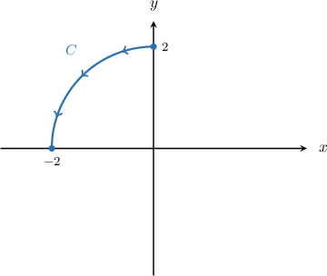

# Line Integrals of Scalar Functions Over Circles

Source: https://www.mathacademy.com/topics/3688?courseId=155
Topic ID: 3688

## Prerequisites

- [Parametric Equations of Circles](../integrated-math-iii-honors/806-parametric-equations-of-circles.md)
- [Properties of Line Integrals of Scalar Functions](./3145-properties-of-line-integrals-of-scalar-functions.md)

## Lesson

### Introduction

Recall that the line integral with respect to arc length of a function $f(x,y)$ along a curve $C$ is given by

$$

\int\limits_C f(x, y) \, \textrm{d}s = \int\limits_a^b f(\mathbf r(t)) \, \| \mathbf r'(t) \| \, \textrm{d}t,

$$

where $\mathbf r(t)$ for $a \leq t \leq b$ is a parametrization of the curve $C.$

Commonly, the curve $C$ is a circle. Therefore, to calculate a line integral along a circle, we need to use the following parameterizations:

- A circle with center $O$ and radius $r$ can be parameterized as

- A circle with center $(h,k)$ and radius $r$ can be parameterized as

We recall that a line integral with respect to arc length is independent of the choice of parametrization and orientation. Therefore, it does not matter which direction we traverse our circle in, nor does it matter which parametrization we use.

When given the equation of a circle in Cartesian form, we need to write down the corresponding parametric equations before computing the line integral. Let's see an example.

### Example: Constructing the Line Integral of a Function Over a Circle

#### Question

Find, as a definite integral, an expression for the line integral of the function $f(x,y) = x^2-1,$ traversed once along the circle $C$ with equation $x^2 + y^2 = 1.$

#### Explanation

We will use the formula

$$

\int\limits_C f(x, y) \, \textrm{d}s = \int\limits_a^b f(\mathbf r(t)) \, \| \mathbf r'(t) \| \, \textrm{d}t.

$$

The curve $C$ is a circle of radius $1$ centered at $O.$ It can be parametrized as

$$

\mathbf{r}(t) = \big\langle \cos{t}, \: \sin{t} \big\rangle, \qquad 0 \le t \lt 2\pi.

$$

Computing $\mathbf{r}'(t)$ and $\| \mathbf{r}'(t) \|,$ we get the following:

$$

\begin{aligned}𝐫^{′}(𝑡) & =\frac{d𝑥}{d𝑡}\,𝐢+\frac{d𝑦}{d𝑡}\,𝐣 \\ & =\frac{d}{d𝑡}(cos⁡𝑡)𝐢+\frac{d}{d𝑡}(sin⁡𝑡)𝐣 \\ & =−sin⁡𝑡\,𝐢+cos⁡𝑡\,𝐣 \\ ‖𝐫^{′}(𝑡)‖ & =\sqrt{√(\frac{d𝑥}{d𝑡})^{2}+(\frac{d𝑦}{d𝑡})^{2}} \\ & =\sqrt{√(−sin⁡𝑡)^{2}+(cos⁡𝑡)^{2}} \\ & =\sqrt{√sin^{2}⁡𝑡+cos^{2}⁡𝑡} \\ & =1\end{aligned}

$$

Now, since $f(x,y) = x^2-1,$ we obtain

$$

\begin{aligned}𝑓(𝐫(𝑡)) & =(cos⁡𝑡)^{2}−1 \\ & =cos^{2}⁡𝑡−1.\end{aligned}

$$

Therefore, we can write the integral as

$$

\begin{aligned}\underset{𝐶}{∫}𝑓(𝑥,𝑦)\,d𝑠 & =∫_{2𝜋0}^{}𝑓(𝐫(𝑡))\,‖𝐫^{′}(𝑡)‖\,d𝑡 \\ & =∫_{2𝜋0}^{}(cos^{2}⁡𝑡−1)⋅1⋅d𝑡 \\ & =∫_{2𝜋0}^{}cos^{2}⁡𝑡−1\,d𝑡.\end{aligned}

$$

### Example: Constructing the Line Integral of a Function Over a Part-Circle

#### Question

Find, as a definite integral, an expression for the line integral of the function $f(x,y) = 2x+y^2$ along the quarter-circle $x^2+y^2=4,$ traversed from the point $(0,2)$ to the point $(-2,0)$ in the second quadrant.

#### Explanation

We will use the formula

$$

\int\limits_C f(x, y) \, \textrm{d}s = \int\limits_a^b f(\mathbf r(t)) \, \| \mathbf r'(t) \| \, \textrm{d}t.

$$

The curve $C$ is a quarter-circle of radius $2$ centered at $O,$ shown below.

The curve $C$ can be parametrized as

$$

\mathbf{r}(t) = \big\langle 2\cos{t}, \: 2\sin{t} \big\rangle, \qquad \dfrac{\pi}{2} \le t \le \pi.

$$

Computing $\mathbf{r}'(t)$ and $\| \mathbf{r}'(t) \|,$ we get following:

$$

\begin{aligned}𝐫^{′}(𝑡) & =\frac{d𝑥}{d𝑡}\,𝐢+\frac{d𝑦}{d𝑡}\,𝐣 \\ & =\frac{d}{d𝑡}(2cos⁡𝑡)𝐢+\frac{d}{d𝑡}(2sin⁡𝑡)𝐣 \\ & =−2sin⁡𝑡\,𝐢+2cos⁡𝑡\,𝐣 \\ ‖𝐫^{′}(𝑡)‖ & =\sqrt{√(\frac{d𝑥}{d𝑡})^{2}+(\frac{d𝑦}{d𝑡})^{2}} \\ & =\sqrt{√(−2sin⁡𝑡)^{2}+(2cos⁡𝑡)^{2}} \\ & =\sqrt{√4(sin^{2}⁡𝑡+cos^{2}⁡𝑡)} \\ & =2\end{aligned}

$$

Now, since $f(x,y) = 2x+y^2,$ we obtain

$$

\begin{aligned}𝑓(𝐫(𝑡)) & =2(2cos⁡𝑡)+(2sin⁡𝑡)^{2} \\ & =4(cos⁡𝑡+sin^{2}⁡𝑡).\end{aligned}

$$

Therefore, we can write the integral as

$$

\begin{aligned}\underset{𝐶}{∫}(2𝑥+𝑦^{2})\,d𝑠 & =∫_{𝜋𝜋/2}^{}𝑓(𝐫(𝑡))\,‖𝐫^{′}(𝑡)‖\,d𝑡 \\ & =∫_{𝜋𝜋/2}^{}4(cos⁡𝑡+sin^{2}⁡𝑡)⋅2⋅d𝑡 \\ & =8∫_{𝜋𝜋/2}^{}(cos⁡𝑡+sin^{2}⁡𝑡)\,d𝑡.\end{aligned}

$$

### Example: Computing a Line Integral of a Function Over a Circle

#### Question

Evaluate the line integral of the function $f(x,y) =x^2-2$ along the circle $C$ with equation $x^2 + y^2 = 4.$

#### Explanation

We will use the formula

$$

\int\limits_C f(x, y) \, \textrm{d}s = \int\limits_a^b f(\mathbf r(t)) \, \| \mathbf r'(t) \| \, \textrm{d}t.

$$

The curve $C$ is a circle of radius $2$ centered at $O.$ It can be parametrized as

$$

\mathbf{r}(t) = \big\langle 2\cos{t}, \: 2\sin{t} \big\rangle, \qquad 0 \le t \le 2\pi.

$$

Computing $\mathbf{r}'(t)$ and $\| \mathbf{r}'(t) \|,$ we get the following:

$$

\begin{aligned}𝐫^{′}(𝑡) & =\frac{d𝑥}{d𝑡}\,𝐢+\frac{d𝑦}{d𝑡}\,𝐣 \\ & =\frac{d}{d𝑡}(2cos⁡𝑡)𝐢+\frac{d}{d𝑡}(2sin⁡𝑡)𝐣 \\ & =−2sin⁡𝑡\,𝐢+2cos⁡𝑡\,𝐣 \\ ‖𝐫^{′}(𝑡)‖ & =\sqrt{√(\frac{d𝑥}{d𝑡})^{2}+(\frac{d𝑦}{d𝑡})^{2}} \\ & =\sqrt{√(−2sin⁡𝑡)^{2}+(2cos⁡𝑡)^{2}} \\ & =\sqrt{√4sin^{2}⁡𝑡+4cos^{2}⁡𝑡} \\ & =\sqrt{√4(sin^{2}⁡𝑡+cos^{2}⁡𝑡)} \\ & =2\end{aligned}

$$

Now, since $f(x,y) = x^2-2,$ we obtain

$$

\begin{aligned}𝑓(𝐫(𝑡)) & =(2cos⁡𝑡)^{2}−2 \\ & =4cos^{2}⁡𝑡−2 \\ & =2(2cos^{2}⁡𝑡−1) \\ & =2cos⁡2𝑡.\end{aligned}

$$

Therefore, we can write the integral as

$$

\begin{aligned}\underset{𝐶}{∫}𝑓(𝑥,𝑦)\,d𝑠 & =∫_{2𝜋0}^{}𝑓(𝐫(𝑡))\,‖𝐫^{′}(𝑡)‖\,d𝑡 \\ & =∫_{2𝜋0}^{}2cos⁡2𝑡⋅2⋅d𝑡 \\ & =4∫_{2𝜋0}^{}cos⁡2𝑡\,d𝑡.\end{aligned}

$$

We can solve this using the substitution $u=2t,$ $\textrm d u=2\,\textrm d t$ as follows:

$$

\begin{aligned}4∫_{2𝜋0}^{}cos⁡2𝑡\,d𝑡 & =2∫_{4𝜋0}^{}cos⁡𝑢\,d𝑢 \\ & =2sin⁡𝑢_{4𝜋0}^{} \\ & =2(0−0) \\ & =0\end{aligned}

$$
