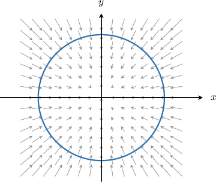

# Circulation

Source: https://www.mathacademy.com/topics/3713?courseId=155
Topic ID: 3713

## Prerequisites

- [Path Independence of Line Integrals](./3360-path-independence-of-line-integrals.md)
- [Interpreting Line Integrals of Vector-Valued Functions](./3694-interpreting-line-integrals-of-vector-valued-functions.md)

## Lesson

### Introduction

Given a vector field $\mathbf{F}$ and a path $C$ defined by $\mathbf{r}=\mathbf{r}(t)$ for $t \in [a,b],$ the line integral

$$

\int\limits_C \mathbf F \cdot \textrm d\mathbf r

$$

gives the total work done by $\mathbf F$ in moving a particle from the initial point $\mathbf{r}(a)$ to the terminal point $\mathbf{r}(b)$ on the curve.

Now suppose that $C$ is a *closed* curve. The **circulation** of $\mathbf{F}$ along $C,$ denoted using the Greek letter $\Gamma$ (pronounced "gamma"), is given by the line integral

$$

\Gamma = \oint\limits_C \mathbf F \cdot \textrm d\mathbf r = \int_a^b \mathbf F(r(t)) \cdot \mathbf r'(t) \; \textrm{d}t.

$$

Remember that the notation $\displaystyle\oint$ simply reminds us that we're integrating along a closed path.

The circulation $\Gamma$ gives the total work done by $\mathbf F$ in moving a particle along the entire closed path. We can also think of $\Gamma$ as a measure of how much $\mathbf F$ circulates around $C.$

Let's build some intuition by considering some examples.

- Consider the vector field $\mathbf{F}$ and the closed curve $C$ traversed in the counterclockwise direction, shown below. It's clear from the picture that $\mathbf{F}$ *assists* the motion of a particle as it moves counterclockwise along the path. Therefore, we can conclude that

- Now imagine that $C$ is traversed in the clockwise direction. We see that $\mathbf F$ works *against* the particle's motion as it moves clockwise along the path. Therefore,

- Finally, consider the vector field $\mathbf{G}$ and the closed curve $C$ traversed in the clockwise direction, shown below. Since the force $\mathbf G$ acts perpendicular to the particle's motion as it moves around the path, it neither helps nor hinders its motion. Therefore, we conclude that

### Example: Determining the Sign of a Circulation From a Diagram

#### Question

Consider the circle $S$ and vector field $\mathbf F,$ shown above. Let $C$ be any path where $S$ is traversed once in the counterclockwise direction. Which of the following statements are true?

1. $\displaystyle\oint_C\mathbf F\cdot \textrm d \mathbf r = 0$

2. $\displaystyle\oint_C\mathbf F\cdot \textrm d \mathbf r > 0$

3. $\displaystyle\oint_{-C}\mathbf F\cdot \textrm d \mathbf r > 0$

#### Explanation

The circulation $\Gamma$ measures the total work done by a force $\mathbf F$ in moving a particle along a ** curve $C.$ It is given by the formula

$$

\Gamma = \oint\limits_C \mathbf F \cdot \textrm{d} \mathbf r = \int_a^b \mathbf F(r(t)) \cdot \mathbf r'(t) \; \textrm{d}t.

$$

We now recall the following:

- If the force works ** the motion of the particle (i.e., the force helps to push the particle along the path), then $\displaystyle\oint_C\mathbf F\cdot \textrm d \mathbf r > 0.$

- If the force works ** the motion of the particle (i.e., the force impedes the motion of the particle as it moves along the path), then $\displaystyle\oint_C\mathbf F\cdot \textrm d \mathbf r < 0.$

With that in mind, let's check each statement.

- Statement I is true, while statement II is false. Since the force $\mathbf F$ acts perpendicular to the motion of the particle as it moves around $C,$ it neither helps nor hinders its motion. So, $\displaystyle\oint_C\mathbf F\cdot \textrm d \mathbf r = 0.$

- Statement III is false. If we reverse the orientation of $C,$ then the situation with regards to the work done by $\mathbf F$ remains unchanged. So, $\displaystyle\oint_{-C}\mathbf F\cdot \textrm d \mathbf r = 0.$

Therefore, the correct answer is "I only."

### Example: Calculating Circulation

#### Question

Calculate the circulation $\Gamma$ of the vector field $\mathbf F(x,y) = -y\,\mathbf{i} +x\,\mathbf{j}$ along the circle $C$ with equation $x^2 + y^2 = 1,$ oriented counterclockwise.

#### Explanation

The closed curve $C$ is the unit circle. It can be parameterized in the counterclockwise direction as

$$

\mathbf{r}(t) = \cos{t}\,\mathbf{i} + \sin{t}\,\mathbf{j}, \qquad 0 \leq t \lt 2\pi.

$$

The circulation $\Gamma$ measures the total work done by a force $\mathbf F$ in moving a particle along a ** curve $C.$ It is given by the formula

$$

\Gamma = \oint\limits_C \mathbf F \cdot \textrm{d} \mathbf r = \int_a^b \mathbf F(r(t)) \cdot \mathbf r'(t) \; \textrm{d}t.

$$

Along the curve $C,$ we have

$$

x = \cos t, \qquad y = \sin t.

$$

So,

$$

\begin{aligned}𝐅(𝐫(𝑡))=−𝑦\,𝐢+𝑥\,𝐣=−sin⁡𝑡\,𝐢+cos⁡𝑡\,𝐣.\end{aligned}

$$

Computing $\mathbf r'(t),$ we get

$$

\begin{aligned}𝐫^{′}(𝑡) & =\frac{d}{d𝑡}(cos⁡𝑡)\,𝐢+\frac{d}{d𝑡}(sin⁡𝑡)\,𝐣 \\ & =−sin⁡𝑡\,𝐢+cos⁡𝑡\,𝐣.\end{aligned}

$$

Therefore,

$$

\begin{aligned}𝐅(𝐫(𝑡))⋅𝐫^{′}(𝑡) & =(−sin⁡𝑡\,𝐢+cos⁡𝑡\,𝐣)⋅(−sin⁡𝑡\,𝐢+cos⁡𝑡\,𝐣) \\ & =sin^{2}⁡𝑡+cos^{2}⁡𝑡 \\ & =1.\end{aligned}

$$

Finally, we evaluate the integral as follows:

$$

\begin{aligned}Γ=\underset{𝐶}{∮}𝐅⋅d𝐫 & =∫_{2𝜋0}^{}𝐅(𝑟(𝑡))⋅𝐫^{′}(𝑡)\,d𝑡 \\ & =∫_{2𝜋0}^{}\,d𝑡 \\ & =2𝜋.\end{aligned}

$$

### Circulation in Conservative Vector Fields

The fundamental theorem of line integrals states that

$$

\int_{C} \nabla f \cdot \textrm{d}\mathbf r = f(\mathbf r(b)) - f(\mathbf r(a))

$$

where $C$ is a piecewise-smooth curve $\mathbf r(t)$ for $t\in [a,b],$ and $f$ is differentiable function such that $\nabla f$ is continuous on $C.$

Now, if $C$ is a closed path that's traversed once, then $\mathbf r(a) = \mathbf r(b),$ and we have

$$

\Gamma = \oint_{C} \nabla f \cdot \textrm{d}\mathbf r = 0.

$$

Therefore, the circulation of a conservative vector field around *any* closed path equals zero.

### Example: Circulation in Conservative Vector Fields

#### Question

Consider the vector field $\mathbf F(x,y) =(e^y+x)\,\mathbf i +(xe^y+y^2)\,\mathbf j.$ Which of the following statements are true?

1. $\mathbf F$ is conservative

2. $\displaystyle\int\limits_C\mathbf F \cdot \textrm d\mathbf r = 0$ for any piecewise-smooth path $C\in\mathbb R^2$

3. $\displaystyle\oint\limits_C\mathbf F \cdot \textrm d\mathbf r =0$ for any closed path $C\in\mathbb R^2$

#### Explanation

If $\mathbf F$ is a conservative vector field on $\mathbb R^2,$ then the circulation $\Gamma = 0$ for any ** path $C\in\mathbb R^2,$ that is

$$

\Gamma = \oint\limits_C \mathbf F \cdot \textrm{d} \mathbf r = 0.

$$

We notice that $\mathbf F = P\,\mathbf i + Q\,\mathbf j$ is a vector field with domain $D = \mathbb R^2.$ Computing the partial derivatives, we have

$$

\dfrac{\partial P}{\partial y} = \dfrac{\partial Q}{\partial x} = e^y.

$$

With that in mind, let's consider each statement.

- Statement I is true. The vector field $\mathbf F$ is conservative since the partial derivatives are equal and continuous everywhere on $\mathbb R^2.$

- Statement II is false, while statement III is true. The result $\Gamma = 0$ applies to closed curves only.

Therefore, the correct answer is "I and III only."
