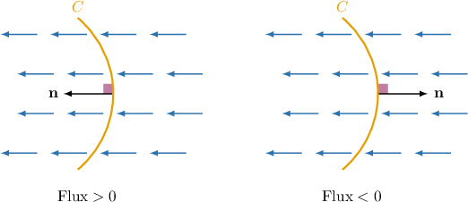
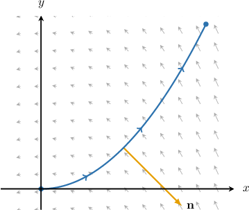
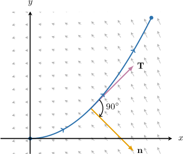

# Calculating Flux in Two-Dimensional Vector Fields

Source: https://www.mathacademy.com/topics/3716?courseId=155
Topic ID: 3716

## Prerequisites

- [Sums of Line Integrals With Respect to X and Y](./3703-sums-of-line-integrals-with-respect-to-x-and-y.md)
- [Flux in Two-Dimensional Vector Fields](./3715-flux-in-two-dimensional-vector-fields.md)

## Lesson

### Introduction

Let $\mathbf F = P\,\mathbf i + Q\,\mathbf j$ be a vector field on $\mathbb R^2$ and $C$ be a *closed* curve in the $xy$-plane. Recall that the flux of $\mathbf F$ through $C$ is given by the line integral

$$

\oint\limits_C \mathbf F \cdot \mathbf{n} \: \textrm{d}s.

$$

Calculating flux using this definition is often cumbersome because we need to calculate $\mathbf n,$ the outward-pointing unit normal vector.

In practice, we often use the following alternative formula to calculate the flux:

$$

\oint\limits_C \mathbf F \cdot \mathbf{n} \: \textrm{d}s = \oint\limits_C P\,\textrm{d}y- Q\,\textrm{d}x

$$

We'll derive this formula at the end of the lesson.

**Watch Out!** When applying this formula, we must choose a positively-oriented parameterization for $C.$ This formula will *not* work if $C$ is negatively oriented!

### Example: Calculating the Flux of a Vector Field Over a Closed Curve in Parametric Form

#### Question

Calculate the flux of the vector field $\mathbf F(x,y) = (y - x)\,\mathbf{i} - (x + y)\,\mathbf{j}$ across the closed curve $C$ given by $\mathbf r(t) = 4\cos t\,\mathbf{i} + 4\sin t\,\mathbf{j}$ for $t \in [0,2\pi).$

#### Explanation

If $\mathbf{F} = P\,\mathbf i + Q\,\mathbf j$ is a vector field and $C$ is a piecewise-smooth, simple, closed curve, then the flux of $\mathbf F$ across $C$ is given by

$$

\oint\limits_C \mathbf F \cdot \mathbf{n} \: \textrm{d}s = \oint\limits_{C}P\,\textrm d y - Q\,\textrm d x,

$$

where $\mathbf{n}$ denotes the outward-pointing unit normal vector to $C.$

Along the curve $C,$ we have

$$

x = 4\cos t, \qquad y = 4\sin t.

$$

Therefore,

$$

\begin{aligned}𝑃(𝑥,𝑦) & =𝑦−𝑥=4(sin⁡𝑡−cos⁡𝑡), \\ 𝑄(𝑥,𝑦) & =−(𝑥+𝑦)=−4(cos⁡𝑡+sin⁡𝑡).\end{aligned}

$$

Computing the derivatives of $x(t)$ and $y(t)$ along the curve, we get

$$

\begin{aligned}\frac{d𝑥}{d𝑡} & =\frac{d}{d𝑡}(4cos⁡𝑡)=−4sin⁡𝑡, \\ \frac{d𝑦}{d𝑡} & =\frac{d}{d𝑡}(4sin⁡𝑡)=4cos⁡𝑡.\end{aligned}

$$

Finally, we evaluate the integral as follows:

$$

\begin{aligned}\underset{𝐶}{∮}𝐅⋅𝐧\,d𝑠 & =\underset{𝐶}{∮}𝑃\,d𝑦−𝑄\,d𝑥 \\ & =∫_{2𝜋0}^{}(𝑃⋅\frac{d𝑦}{d𝑡}−𝑄⋅\frac{d𝑥}{d𝑡})d𝑡 \\ & =∫_{2𝜋0}^{}(4(sin⁡𝑡−cos⁡𝑡))⋅(4cos⁡𝑡)−(−4(cos⁡𝑡+sin⁡𝑡))⋅(−4sin⁡𝑡)\,d𝑡 \\ & =16∫_{2𝜋0}^{}sin⁡𝑡cos⁡𝑡−cos^{2}⁡𝑡−sin⁡𝑡cos⁡𝑡−sin^{2}⁡𝑡\,d𝑡 \\ & =16∫_{2𝜋0}^{}(−1)\,d𝑡 \\ & =−16𝑡_{2𝜋0}^{} \\ & =−16(2𝜋−0) \\ & =−32𝜋\end{aligned}

$$

### Example: Calculating the Flux of a Vector Field Over a Closed Curve in Cartesian Form

#### Question

Calculate the flux of the vector field $\mathbf F(x,y) = xy\,\mathbf{i} + x^2\,\mathbf{j}$ across the ellipse $C$ with equation $9x^2 + y^2 = 9.$

#### Explanation

If $\mathbf{F} = P\,\mathbf i + Q\,\mathbf j$ is a vector field and $C$ is a piecewise-smooth, simple, closed curve, then the flux of $\mathbf F$ across $C$ is given by

$$

\oint\limits_C \mathbf F \cdot \mathbf{n} \: \textrm{d}s = \oint\limits_{C}P\,\textrm d y - Q\,\textrm d x,

$$

where $\mathbf{n}$ denotes the outward-pointing unit normal vector to $C.$

First, we write the equation of our curve as

$$

\dfrac{x^2}{1^2}+\dfrac{y^2}{3^2} = 1.

$$

The closed curve $C$ is an ellipse centered at the origin with horizontal and vertical semiaxes $1$ and $3,$ respectively. It can be parameterized in the counterclockwise direction as

$$

\mathbf{r}(t) = \cos{t}\,\mathbf{i} +3\sin{t}\,\mathbf{j}, \qquad 0 \leq t \leq 2\pi.

$$

Along the curve $C,$ we have

$$

x = \cos t, \qquad y = 3\sin t.

$$

Therefore,

$$

\begin{aligned}𝑃(𝑥,𝑦) & =𝑥𝑦=3sin⁡𝑡cos⁡𝑡, \\ 𝑄(𝑥,𝑦) & =𝑥^{2}=cos^{2}⁡𝑡.\end{aligned}

$$

Computing the derivatives of $x(t)$ and $y(t)$ along the curve, we get

$$

\begin{aligned}\frac{d𝑥}{d𝑡} & =\frac{d}{d𝑡}(cos⁡𝑡)=−sin⁡𝑡, \\ \frac{d𝑦}{d𝑡} & =\frac{d}{d𝑡}(3sin⁡𝑡)=3cos⁡𝑡.\end{aligned}

$$

Finally, we evaluate the integral using the substitution $u=\cos t, \textrm d u = -\sin t\,\textrm d t,$ as follows:

$$

\begin{aligned}\underset{𝐶}{∮}𝐅⋅𝐧\,d𝑠 & =\underset{𝐶}{∮}𝑃\,d𝑦−𝑄\,d𝑥 \\ & =∫_{2𝜋0}^{}(𝑃⋅\frac{d𝑦}{d𝑡}−𝑄⋅\frac{d𝑥}{d𝑡})d𝑡 \\ & =∫_{2𝜋0}^{}(3sin⁡𝑡cos⁡𝑡)⋅(3cos⁡𝑡)−(cos^{2}⁡𝑡)⋅(−sin⁡𝑡)\,d𝑡 \\ & =∫_{2𝜋0}^{}9sin⁡𝑡cos^{2}⁡𝑡+sin⁡𝑡cos^{2}⁡𝑡\,d𝑡 \\ & =∫_{2𝜋0}^{}10sin⁡𝑡cos^{2}⁡𝑡\,d𝑡 \\ & =−∫_{11}^{}10𝑢^{2}\,d𝑢 \\ & =0\end{aligned}

$$

### Calculating Flux for Non-Closed Curves

As we've seen, the flux of a vector field $\mathbf F$ through a piecewise-smooth, closed curve $C$ is a unique scalar number that represents the net flow of $\mathbf F$ through $C.$

The question now is, does the notion of flux exist for curves that are not closed?

Indeed, it is possible to define the notion of flux through a non-closed curve. However, there is one crucial difference we need to bear in mind:

- In the case of a smooth, closed curve, it is always clear which direction is "out." Therefore, the outward-pointing unit normal vector $\mathbf n$ is unique at every point on $C.$

- However, on a smooth, non-closed curve, there is no clear notion of "in" and "out." Instead, we can choose between *two* normal vectors at any point on the curve, as shown below.

Therefore, when computing the flux of a vector field through a non-closed curve, we first specify the direction that the unit normal points and then measure the flux relative to that direction.

For example, for the vector field $\mathbf F$ and curve $C$ below, one choice for the unit normal will give a positive number, and the other a negative number.

Finally, to calculate the flux of $\mathbf{F}$ across a non-closed curve $C,$ we can continue to use the formula

$$

\int\limits_C \mathbf F \cdot \mathbf{n} \: \textrm{d}s = \int\limits_{C}P\,\textrm d y - Q\,\textrm d x.

$$

**Watch Out!** To apply this formula, we usually need to parameterize $C.$ It is *vital* that we pick a parameterization where the unit normal vector $\mathbf n$ is a $90^\circ$ *clockwise* rotation of the unit tangent vector $\mathbf T(t).$

### Example: Calculating the Flux of a Vector Field Over a Non-Closed Curve

#### Question

The curve $C$ is given by $y = \dfrac14x^2$ from the point $\left(0,0\right)$ to the point $\left(4,4\right).$ Calculate the flux of the vector field $\mathbf F(x,y) = -2\,\mathbf{i} + x\,\mathbf{j}$ through $C,$ measured with respect to the unit normal vector $\mathbf n$ on $C,$ as shown above.

#### Explanation

If $\mathbf{F} = P\,\mathbf i + Q\,\mathbf j$ is a vector field and $C$ is a piecewise-smooth, simple curve, then the flux of $\mathbf F$ across $C$ measured with respect to a unit normal vector $\mathbf n$ on $C$ is given by

$$

\int\limits_C \mathbf F \cdot \mathbf{n} \: \textrm{d}s = \int\limits_{C}P\,\textrm d y - Q\,\textrm d x.

$$

To apply this formula,

- the curve should be parameterized as $\mathbf r(t)$ for $t\in [a,b],$ and

- the unit normal vector $\mathbf n$ ** be a $90^\circ$ clockwise rotation of the unit tangent vector $\mathbf T(t).$

Parameterizing the curve $C,$ we have

$$

x = t, \qquad y = \dfrac{t^2}{4}, \qquad t\in \left[0,4\right].

$$

This parameterization traverses the curve from the point $(0,0)$ to the point $(4,4).$ Therefore, $\mathbf n$ is indeed a $90^\circ$ clockwise rotation of $\mathbf T,$ so we can apply the above formula for the flux.

Therefore,

$$

\begin{aligned}𝑃(𝑥,𝑦) & =−2, \\ 𝑄(𝑥,𝑦) & =𝑥=𝑡.\end{aligned}

$$

Computing the derivatives of $x(t)$ and $y(t)$ along the curve, we get

$$

\begin{aligned}\frac{d𝑥}{d𝑡} & =\frac{d}{d𝑡}(𝑡)=1, \\ \frac{d𝑦}{d𝑡} & =\frac{d}{d𝑡}(\frac{𝑡^{2}}{4})=\frac{𝑡}{2}.\end{aligned}

$$

Finally, we evaluate the integral as follows:

$$

\begin{aligned}\underset{𝐶}{∫}𝐅⋅𝐧\,d𝑠 & =\underset{𝐶}{∫}𝑃\,d𝑦−𝑄\,d𝑥 \\ & =∫_{40}^{}(𝑃⋅\frac{d𝑦}{d𝑡}−𝑄⋅\frac{d𝑥}{d𝑡})d𝑡 \\ & =∫_{40}^{}(−2)⋅(\frac{𝑡}{2})−(𝑡)⋅(1)\,d𝑡 \\ & =∫_{40}^{}−2𝑡\,d𝑡 \\ & =−𝑡^{2}_{40}^{} \\ & =−16−0 \\ & =−16\end{aligned}

$$

### Deriving the Main Formula

Let's now derive the following formula for the flux:

$$

\oint\limits_C \mathbf F \cdot \mathbf{n} \: \textrm{d}s = \oint\limits_C P\,\textrm{d}y- Q\,\textrm{d}x

$$

First, recall that if $C$ is parameterized by the function $\mathbf r(t) = x(t)\,\mathbf i + y(t)\,\mathbf j$ for $t\in [a,b],$ then

$$

\mathbf n = \dfrac{y'(t)\,\mathbf i - x'(t)\,\mathbf j}{||\mathbf r'(t)||},

$$

where it is assumed that $C$ is positively-oriented.

Substituting our expression for $\mathbf n$ into our line integral definition of flux and using the fact that $\textrm d s = ||\mathbf r'(t)|| \,\textrm d t,$ we get

$$

\begin{aligned}\underset{𝐶}{∮}𝐅⋅𝐧\,d𝑠 & =\underset{𝐶}{∮}(𝑃(𝑥(𝑡),𝑦(𝑡))\,𝐢+𝑄(𝑥(𝑡),𝑦(𝑡))\,𝐣)⋅(\frac{𝑦^{′}(𝑡)\,𝐢−𝑥^{′}(𝑡)\,𝐣}{||𝐫^{′}(𝑡)||})||𝐫^{′}(𝑡)||\,d𝑡 \\ & =\underset{𝐶}{∮}(𝑃(𝑥(𝑡),𝑦(𝑡))\,𝐢+𝑄(𝑥(𝑡),𝑦(𝑡))\,𝐣)⋅\frac{𝑦^{′}(𝑡)\,𝐢−𝑥^{′}(𝑡)\,𝐣}{||𝐫^{′}(𝑡)||}||𝐫^{′}(𝑡)||\,d𝑡 \\ & =\underset{𝐶}{∮}(𝑃(𝑥(𝑡),𝑦(𝑡))\,𝐢+𝑄(𝑥(𝑡),𝑦(𝑡))\,𝐣)⋅(𝑦^{′}(𝑡)\,𝐢−𝑥^{′}(𝑡)\,𝐣)\,d𝑡 \\ & =\underset{𝐶}{∮}𝑃(𝑥(𝑡),𝑦(𝑡))𝑦^{′}(𝑡)−𝑄(𝑥(𝑡),𝑦(𝑡))𝑥^{′}(𝑡)\,d𝑡 \\ & =\underset{𝐶}{∮}𝑃\,d𝑦−𝑄\,d𝑥.\end{aligned}

$$
