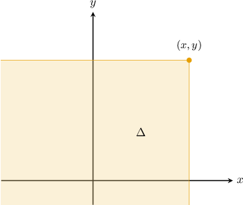

# Properties of the Joint CDF of Two Continuous Random Variables

Source: https://www.mathacademy.com/topics/3866?courseId=155
Topic ID: 3866

## Prerequisites

- [Higher-Order Partial Derivatives](../mathematical-methods-for-the-physical-sciences-i/1933-higher-order-partial-derivatives.md)
- [The Joint CDF of Two Continuous Random Variables](./3640-the-joint-cdf-of-two-continuous-random-variables.md)

## Lesson

### Introduction

Recall that the **joint cumulative distribution function** (or joint CDF) of two random variables $X$ and $Y$ is defined as

$$

F(x,y)=P(X \leq x,Y \leq y).

$$

If $X$ and $Y$ are continuous random variables with the joint probability density function $f(x, y)$, we have the following relationship between the joint PDF and joint CDF:

$$

F(x,y)=\int^y_{-\infty}\int^x_{-\infty} f(u,v)\; \textrm{d}u\textrm{d}v.

$$

Geometrically, the joint CDF gives the probability that the random pair $(X,Y)$ will lie inside the infinite rectangular region $\Delta$ that has its top-right corner at $(x,y)$ and whose sides are parallel to the coordinate axes.

The joint CDF satisfies the following properties:

- $0\leq F(x,y)\leq 1$

- $F(\infty, \infty)=1$

- $F(-\infty,y)=F(x,-\infty)=0$

- The **marginal CDF** of $X$ is given by $F_X(x)=F(x,\infty).$

- The **marginal CDF** of $Y$ is given by $F_Y(y)=F(\infty,y).$

- If $X$ and $Y$ are independent random variables, then $F(x,y)=F_X(x)\cdot F_Y(y).$

- The joint probability density function $f(x, y)$ is given by

In this lesson, we'll explore the last four of these properties in more detail.

### Recovering a Marginal CDF

The first property to consider is how to recover the marginal CDFs of $X$ and $Y$ from the joint CDF.

Suppose the joint CDF of two continuous random variables $X$ and $Y$ is given by

$$

\begin{aligned}(1−𝑒^{−𝑥})(1−𝑒^{−2𝑦}), & 𝑥≥0,\,𝑦≥0 \\ 0, & otherwise.\end{aligned}

$$

Let's calculate $F_Y(y),$ the marginal CDF of $Y$ using the following property:

$$

F_Y(y) = F(\infty,y) = \lim\limits_{x \to \infty} F(x,y)

$$

Therefore, for $y \geq 0,$ we have

$$

\begin{aligned}𝐹_{𝑌}(𝑦) & =\underset{𝑥→∞}{lim}[(1−𝑒^{−𝑥})(1−𝑒^{−2𝑦})] \\ & =(1−𝑒^{−2𝑦})\underset{𝑥→∞}{lim}(1−\frac{1}{𝑒^{𝑥}}) \\ & =(1−𝑒^{−2𝑦})\underset{𝑥→∞}{lim}(1−0) \\ & =1−𝑒^{−2𝑦}.\end{aligned}

$$

So, the full expression for the marginal CDF is as follows:

$$

\begin{aligned}1−𝑒^{−2𝑦}, & \,𝑦≥0 \\ 0, & \,otherwise\end{aligned}

$$

Let's see another example.

### Example: Finding a Marginal CDF Using a Joint CDF

#### Question

The joint CDF of two continuous random variables $X$ and $Y,$ for $(x,y) \in [0,1] \times [0,2],$ is given by

$$

F(x,y)= \dfrac{xy}{8}(2x^2+y).

$$

Find $F_X(x),$ the marginal CDF of $X,$ for $0 \leq x \leq 1.$

#### Explanation

The marginal CDF of $X$ is given by

$$

F_X(x) = F(x,\infty) = \lim\limits_{y \to \infty} F(x,y).

$$

Therefore, for $0\leq x\leq 1,$ we have

$$

\begin{aligned}𝐹_{𝑋}(𝑥) & =𝐹(𝑥,∞) \\ & =𝐹(𝑥,2) \\ & =\frac{𝑥(2)}{8}(2𝑥^{2}+(2)) \\ & =\frac{4𝑥}{8}(𝑥^{2}+1) \\ & =\frac{1}{2}(𝑥^{3}+𝑥).\end{aligned}

$$

### Example: Finding Part of a Joint CDF from Marginal CDFs for Continuous Random Variables

#### Question

The marginal CDFs of two continuous independent random variables $X$ and $Y$ are given below.

$$

\begin{aligned}1−\frac{1}{𝑥}, & 𝑥≥1 \\ 0, & otherwise\end{aligned}

$$

Find the expression for the joint CDF when $x \geq 1$ and $y\geq 1.$

#### Explanation

If $X$ and $Y$ are independent continuous random variables with marginal CDFs $F_X(x)$ and $F_Y(y),$ respectively, then the corresponding joint CDF of $F(x,y)$ is given by

$$

F(x,y) = F_X(x) \cdot F_Y (y).

$$

Therefore, for $x \geq 1$ and $y \geq 1,$ the joint CDF for our random variables is

$$

\begin{aligned}𝐹(𝑥,𝑦) & =𝐹_{𝑋}(𝑥)⋅𝐹_{𝑌}(𝑦) \\ & =(1−\frac{1}{𝑥})(1−\frac{1}{\sqrt{√𝑦^{3}}}) \\ & =1−\frac{1}{𝑥}−\frac{1}{\sqrt{√𝑦^{3}}}+\frac{1}{𝑥\sqrt{√𝑦^{3}}}.\end{aligned}

$$

Therefore, the full expression for the joint CDF is

$$

\begin{aligned}1−\frac{1}{𝑥}−\frac{1}{\sqrt{√𝑦^{3}}}+\frac{1}{𝑥\sqrt{√𝑦^{3}}}, & 𝑥≥1,\,𝑦≥1 \\ 0, & otherwise.\end{aligned}

$$

### Example: Recovering the Joint PDF from a Joint CDF

#### Question

The joint CDF of two continuous random variables $X$ and $Y$ is given by

$$

\begin{aligned}0, & 𝑥<0\,or\,𝑦<0 \\ 𝑥^{2}(1−𝑒^{−𝑦}), & 0≤𝑥≤1,\,𝑦≥0 \\ 𝐹_{𝑌}(𝑦), & 𝑥>1,\,𝑦≥0.\end{aligned}

$$

Find the joint PDF $f(x,y)$ for $0 \leq x \leq 1, \; y \geq 0.$

#### Explanation

Since the partial derivatives of $F(x,y)$ are defined, the joint probability density function $f(x, y)$ is given by

$$

f(x,y) = \dfrac{\partial^2}{\partial x \partial y} F(x,y).

$$

For $0 \leq x \leq 1$ and $y \geq 0,$ we have

$$

\begin{aligned}𝑓(𝑥,𝑦) & =\frac{𝜕^{2}}{𝜕𝑥𝜕𝑦}𝐹(𝑥,𝑦) \\ & =\frac{𝜕}{𝜕𝑥}(\frac{𝜕}{𝜕𝑦}(𝑥^{2}(1−𝑒^{−𝑦}))) \\ & =\frac{𝜕}{𝜕𝑥}(𝑥^{2}\frac{𝜕}{𝜕𝑦}(1−𝑒^{−𝑦})) \\ & =\frac{𝜕}{𝜕𝑥}(𝑥^{2}𝑒^{−𝑦}) \\ & =𝑒^{−𝑦}⋅\frac{𝜕}{𝜕𝑥}(𝑥^{2}) \\ & =𝑒^{−𝑦}⋅2𝑥 \\ & =2𝑥𝑒^{−𝑦}.\end{aligned}

$$

Otherwise, $f(x,y) = 0.$

Therefore, we have

$$

\begin{aligned}2𝑥𝑒^{−𝑦}, & 0≤𝑥≤1,\,𝑦≥0 \\ 0, & otherwise.\end{aligned}

$$
