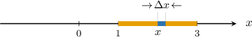
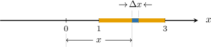

# Moments and Centers of Mass of Thin Rods

Source: https://www.mathacademy.com/topics/4167?courseId=155
Topic ID: 4167

## Prerequisites

- [The Sum and Constant Multiple Rules for Definite Integrals](../ap-calculus-ab/1685-the-sum-and-constant-multiple-rules-for-definite-integrals.md)
- [Moments and Center of Mass](./2026-moments-and-center-of-mass.md)

## Lesson

### Introduction

In this lesson, we'll learn how to determine the center of mass of a thin rod whose mass is unevenly distributed.

We describe the mass distribution along a thin rod using a so-called **mass density function** $\lambda (x).$ This function tells us the *mass per unit length* at any point $x$ on the rod. The units of $\lambda$ are usually $\textrm{kg}/\textrm{m}.$

Consider a thin rod between the points $x=1$ and $x=3$ along the $x$-axis, as shown below.

Suppose the mass density function of the rod is given by

$$

\lambda(x) = 3x^2 \, \textrm{kg/m},

$$

where $x$ is measured in meters. What is the total mass of the rod?

To answer this, consider a point $x \in (1,3)$ on the rod and cut out a small piece of length $\Delta{x},$ as shown below.

If $\Delta{x}$ is very small, we can assume that our density function is approximately constant over the selected piece. As a result, the mass of this piece is

$$

\Delta{m} \approx 3x^2 \Delta{x}.

$$

Note that the units of $\Delta{m}$ are $\dfrac{\textrm{kg}}{\textrm{m}} \cdot \textrm{m} = \textrm{kg},$ as we'd expect.

To find the total mass of the rod, we add together the masses of all such pieces and take the limit as $\Delta x \to 0.$ By doing this, we get

$$

m = \int_{1}^{3} 3x^2 \: \textrm{d}x.

$$

Carrying out the integration, we find that the total mass of the rod is

$$

\begin{aligned}𝑚 & =∫_{31}^{}3𝑥^{2}\,d𝑥 \\ & =[𝑥^{3}]_{31}^{} \\ & =3^{3}−1^{3} \\ & =26\,kg.\end{aligned}

$$

In general, given a thin rod oriented along the $x$-axis over the interval $a \leq x \leq b,$ if $\lambda(x)$ denotes the rod's mass density function, then the total mass of the rod is given by

$$

m = \int_a^b \lambda(x) \: \textrm{d}x.

$$

### Example: Calculating the Mass of a Thin Rod

#### Question

The thin rod below has the mass density function $\lambda(x) =2x\, \textrm{kg/m},$ where $x$ is measured in meters. What is the total mass of the rod?

#### Explanation

Given a thin rod oriented along the $x$-axis over the interval $a \leq x \leq b,$ if $\lambda(x)$ denotes the mass density function of the rod, then the total mass of the rod is given by

$$

m = \int_a^b \lambda(x) \: \textrm{d}x.

$$

In this case, we have

$$

\lambda(x) = 2x, \qquad a=1, \qquad b=3.

$$

We calculate the mass of the rod as follows:

$$

\begin{aligned}𝑚 & =∫_{31}^{}2𝑥\,d𝑥 \\ & =[𝑥^{2}]_{31}^{} \\ & =3^{2}−1^{2} \\ & =8\end{aligned}

$$

Therefore, the mass of the rod is $8\,\textrm{kg}.$

### The Moment of a Rod About the Origin

In a previous lesson, we saw how to calculate the total moment about the origin of a collection of masses distributed along the $x$-axis. We'll now extend our understanding to include moments of thin rods.

Consider a thin rod between the points $x=1$ and $x=3$ along the $x$-axis with mass density function $\lambda(x) = 3x^2 \, \textrm{kg/m},$ shown below.

How can we find the total moment of the rod about the origin?

To answer this, we once again consider a small piece of rod located in the interval $(x, x+\Delta x),$ as shown below.

If $\Delta{x}$ is very small, we can approximate this piece as a point mass.

The moment of this piece about the origin, denoted $\Delta{M_O},$ is given by

$$

\begin{aligned}Δ𝑀_{𝑂} & ≈𝑥⋅Δ𝑚 \\ & ≈𝑥⋅𝜆(𝑥)Δ𝑥 \\ & =𝑥⋅3𝑥^{2}Δ𝑥 \\ & =3𝑥^{3}Δ𝑥.\end{aligned}

$$

Thus, to find the moment of the entire rod about the origin, we sum the moments of all such pieces and take the limit as $\Delta x.$ By doing so, we get

$$

M_O = \int_{1}^{3} 3x^3 \: \textrm{d}x.

$$

Evaluating this integral, we find that the total moment about $O$ of the rod is given by

$$

\begin{aligned}𝑀_{𝑂} & =∫_{31}^{}3𝑥^{3}\,d𝑥 \\ & =[\frac{3𝑥^{4}}{4}]_{31}^{} \\ & =\frac{3(3)^{4}}{4}−\frac{3(1)^{4}}{4} \\ & =60\,kg⋅m.\end{aligned}

$$

In general, the moment about the origin of a rod with mass density function $\lambda(x)$ for $a \leq x \leq b$ is given by

$$

M_O = \int_a^b x\, \lambda(x) \: \textrm{d}x.

$$

### Example: Calculating the Moment of a Rod About the Origin

#### Question

The thin rod below has the mass density function $\lambda (x) = (x+4)\,\textrm{kg/m}.$ Find the moment of the rod about the origin.

#### Explanation

The moment about the origin $O$ of a rod with mass density function $\lambda(x)$ for $a \leq x \leq b$ is given by

$$

M_O = \int_a^b x\, \lambda(x) \: \textrm{d}x.

$$

In our case, we have

$$

\lambda (x) = x+4, \qquad a=0, \qquad b=3.

$$

We calculate the moment of the rod about the origin as follows:

$$

\begin{aligned}𝑀_{𝑂} & =∫_{30}^{}𝑥⋅(𝑥+4)\,d𝑥 \\ & =∫_{30}^{}𝑥^{2}+4𝑥\,d𝑥 \\ & =[\frac{𝑥^{3}}{3}+2𝑥^{2}]_{30}^{} \\ & =(\frac{3^{3}}{3}+2⋅3^{2})−0 \\ & =27.\end{aligned}

$$

Therefore, the required moment is $27\,\textrm{kg}\cdot \textrm{m}.$

### The Center of Mass of a Rod

A thin rod's **center of mass** is the point $\bar{x}$ on the $x$-axis where the system's total mass could be concentrated to give the same moment as the original rod.

Analogous to the case of point masses, the center of mass of a thin rod with mass density function $\lambda(x)$ placed along the $x$-axis over the interval $a \leq x \leq b$ is given by

$$

\overline{x} = \dfrac{M_O}{m},

$$

where

- $\displaystyle m = \int_a^b \lambda (x) \: \textrm{d}x$ is the mass of the rod, and

- $\displaystyle M_O = \int_a^b \, x\lambda (x) \: \textrm{d}x$ is the moment of the rod about the origin.

### Example: Calculating the Center of Mass of a Rod

#### Question

The thin rod above has the mass density function $\lambda (x) = x^3.$ Given that the rod's mass is $4$ units, what is the $x$-coordinate of its center of mass?

#### Explanation

The center of mass of a rod placed along the $x$-axis over the interval $a \leq x \leq b$ whose mass density function is $\lambda(x)$ is given by

$$

\overline{x} = \dfrac{M_O}{m},

$$

where

- $\displaystyle m = \int_a^b \lambda (x) \: \textrm{d}x$ is the mass of the rod,

- $\displaystyle M_O = \int_a^b \, x\lambda (x) \: \textrm{d}x$ is the moment of the rod about the origin $O.$

In our case, we have

$$

\lambda (x) = x^3, \qquad a=0, \qquad b=2.

$$

So, the moment of the rod about the origin is

$$

\begin{aligned}𝑀_{𝑂} & =∫_{20}^{}𝑥⋅𝑥^{3}\,d𝑥 \\ & =∫_{20}^{}𝑥^{4}\,d𝑥 \\ & =[\frac{1}{5}𝑥^{5}]_{20}^{} \\ & =\frac{1}{5}(32−0) \\ & =\frac{32}{5}.\end{aligned}

$$

Therefore,

$$

\overline{x}= \dfrac{M_O}{m} = \dfrac{\left(\dfrac{32}{5}\right)}{4} = \dfrac{8}{5}.

$$

Note that this result makes intuitive sense. Since $\lambda$ is an increasing function of $x,$ we would expect the center of mass to be located closer to the right endpoint and further from the left endpoint.
