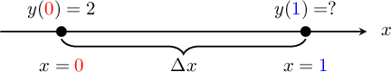
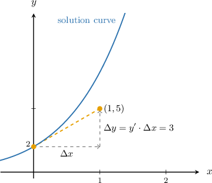
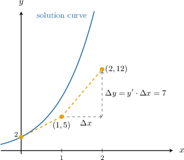

# Euler's Method: Calculating One Step

Source: https://www.mathacademy.com/topics/602?courseId=155
Topic ID: 602

## Prerequisites

- [Approximating Functions Using Local Linearity and Linearization](../ap-calculus-ab/621-approximating-functions-using-local-linearity-and-linearization.md)
- [Qualitative Analysis of First-Order ODEs](../ap-calculus-ab/2976-qualitative-analysis-of-first-order-odes.md)

## Lesson

### Introduction

With many differential equations, it is tricky to find an algebraic formula for the solution. For this reason, we often resort to numerical methods, which involve computing approximations of points that lie on the solution curve.

For example, consider the following initial value problem:

$$

y' = x+y+1, \qquad y(0)=2

$$

Let's suppose that we want to approximate $y(1).$ Since we know that the solution must pass through $(0,2),$ and that the differential equation gives us an expression for the slope of the solution curve, we can use a tangent line approximation at $x=0$ to approximate $y(1).$

Recall that the tangent line approximation to $y(x)$ at $a=0$ is given by

$$

\begin{aligned}𝐿(𝑥) & =𝑦(𝑎)+𝑦^{′}(𝑎)(𝑥−𝑎) \\ & =𝑦(0)+𝑦^{′}(0)(𝑥−0).\end{aligned}

$$

Now, from the initial condition, we know that $y(0) = 2.$ We also know that $y'(x) = x+y+1,$ so

$$

y'(0) = 0+2+1 = 3.

$$

Substituting our values for $y(0)$ and $y'(0)$ into the tangent line approximation gives

$$

\begin{aligned}𝐿(𝑥) & =2+3⋅(𝑥−0) \\ & =3𝑥+2.\end{aligned}

$$

Finally, we can approximate $y(1)$ using $L(1).$ We get

$$

y(1)\approx L(1) = 3(1) + 2 = 5.

$$

### Example: Approximating a Solution to an Initial Value Problem Using a Tangent Line Approximation

#### Question

For the initial value problem

$$

y' = 2xy, \qquad y(1)=2,

$$

use the tangent line approximation at $x=1$ to approximate $y\left(\dfrac 3 2\right).$

#### Explanation

The tangent line approximation to $y(x)$ at the point $a=1$ is given by

$$

\begin{aligned}𝐿(𝑥) & =𝑦(𝑎)+𝑦^{′}(𝑎)(𝑥−𝑎) \\ & =𝑦(1)+𝑦^{′}(1)(𝑥−1).\end{aligned}

$$

From the initial condition, we know that $y(1) = 2.$ We also know that $y'(x) = 2xy,$ so

$$

y'(1) = 2(1)(2) = 4.

$$

Substituting our values for $y(1)$ and $y'(1)$ into our expression for $L(x)$ gives

$$

\begin{aligned}𝐿(𝑥) & =2+(4)(𝑥−1) \\ & =2+4𝑥−4 \\ & =4𝑥−2.\end{aligned}

$$

Finally, we can approximate $y\left(\dfrac 3 2\right)$ using $L\left(\dfrac 3 2\right).$ We get

$$

y\left(\dfrac 3 2 \right)\approx L\left(\dfrac 3 2 \right) = 4\left(\dfrac 3 2\right) - 2 = 4.

$$

### Euler's Method

Let's go back to our tangent line approximation of $y(x)$ at $x=a.$

$$

L(x) = y(a) + y'(a)(x-a)

$$

We can rewrite this equation as follows:

$$

L(x) - y(a) = y'(a)(x-a)

$$

Now, let's denote the left-hand side as $\Delta y,$ $y'(a)$ as $y',$ and $(x-a)$ as $\Delta x.$ Then, we have

$$

\Delta y = y'\cdot \Delta x.

$$

This formula is known as **Euler's method**. As we'll see, Euler's method gives a systematic way of approximating the solution of a differential equation at multiple points in its domain.

Note the following:

- The quantity $\Delta x$ represents the change in $x,$ and is called the **step size.**

- The quantity $\Delta y$ represents the change in $y$ that we get if we use the tangent line approximation.

### A Worked Example of Euler's Method

Let's return to the following initial value problem:

$$

y' = x+y+1, \qquad y(0)=2

$$

We will now use Euler's method to approximate the value of $y(1).$

Our problem can be viewed schematically, as shown below.

Since we know $y({\color{red}{0}})$ and wish to estimate $y({\color{blue}{1}}),$ we will use a step size of

$$

\Delta x = {\color{blue}{1}}-{\color{red}{0}} = 1.

$$

It's best to use a table like the one below when applying Euler's method. First, we add the initial condition data:

Now, using the differential equation, we have

$$

\begin{aligned}𝑦^{′} & =𝑥+𝑦+1 \\ & =0+2+1 \\ & =3.\end{aligned}

$$

So, we add $y'= 3$ to our table.

Next, using Euler's method, we have

$$

\begin{aligned}Δ𝑦 & =𝑦^{′}⋅Δ𝑥 \\ & =3⋅1 \\ & =3.\end{aligned}

$$

We add $\Delta y = 3$ to our table.

Finally, to get the values of $x$ and $y$ in the *next* row, we add $\Delta x$ to $x$ and $\Delta y$ to $y,$ as follows:

$$

\begin{aligned}𝑥_{new} & =𝑥+Δ𝑥 \\ & =0+1 \\ & =1 \\ 𝑦_{new} & =𝑦+Δ𝑦 \\ & =2+3 \\ & =5\end{aligned}

$$

Adding these entries to our table gives the following:

Therefore, we conclude that $y(1) \approx 5.$

### Example: Completing the First Row of a Table Using Euler's Method

#### Question

Consider the following initial value problem:

$$

y' =7x-2y, \qquad y(1)=-4

$$

We wish to approximate the solution using Euler's method. What entry should be placed in the column for $\Delta y$ in the table below if the step size is $\Delta x = \dfrac{1}{10}?$

#### Explanation

First, because the initial condition is $y(1)=-4,$ we fill $y=-4$ into the table.

Next, we compute $y'$ according to the given rule:

$$

\begin{aligned}𝑦^{′} & =7𝑥−2𝑦 \\ & =7⋅1−2⋅(−4) \\ & =15\end{aligned}

$$

So, we add this to our table.

Finally, we compute $\Delta y$ using Euler's method:

$$

\begin{aligned}Δ𝑦 & =𝑦^{′}⋅Δ𝑥 \\ & =15⋅\frac{1}{10} \\ & =\frac{3}{2}\end{aligned}

$$

We add this to our table.

### Example: Approximating the Solution to an Initial Value Problem Using Euler's Method With One Step

#### Question

Consider the following initial value problem:

$$

y' =2y^2-x^2, \qquad y(1)=3

$$

Use Euler's method with one step to approximate $y(2).$

#### Explanation

Since we want to find the value of $y$ at $x=2,$ we will use a step size of

$$

\Delta x = 2-1 = 1.

$$

First, we add the initial condition data:

Next, we compute $y'$ according to the given rule:

$$

\begin{aligned}𝑦^{′} & =2𝑦^{2}−𝑥^{2} \\ & =2⋅3^{2}−1^{2} \\ & =18−1 \\ & =17\end{aligned}

$$

So, we add this to our table:

Next, we compute $\Delta y$ using Euler's method:

$$

\begin{aligned}Δ𝑦 & =𝑦^{′}⋅Δ𝑥 \\ & =17⋅1 \\ & =17\end{aligned}

$$

We add this to our table:

To get the values of $x$ and $y$ in the ** row, we add $\Delta x$ to $x$ and $\Delta y$ to $y,$ as follows:

$$

\begin{aligned}𝑥_{new} & =𝑥+Δ𝑥 \\ & =1+1 \\ & =2 \\ 𝑦_{new} & =𝑦+Δ𝑦 \\ & =3+17 \\ & =20\end{aligned}

$$

Adding these results to our table gives the following:

Therefore, we conclude that $y(2) \approx 20.$

### A Graphical Explanation of Euler's Method

Let's go back to the following initial value problem:

$$

y' = x+y+1, \qquad y(0)=2

$$

Carrying out Euler's method, we got the following table:

We can view our approximation in the coordinate plane as follows:

The beauty of Euler's method is that we can apply it iteratively, meaning that we can continue to make approximations to the solution curve in a systematic way.

For example, it can be shown that by applying one more iteration of Euler's method, we get the following:

We will learn how to apply multiple iterations of Euler's method in a future lesson.
