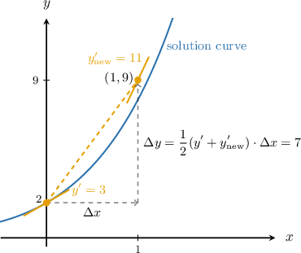
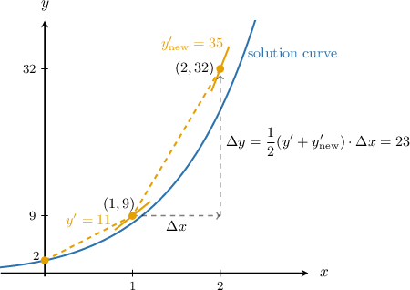

# The Trapezoidal Method

Source: https://www.mathacademy.com/topics/6373?courseId=155
Topic ID: 6373

## Prerequisites

- [The Implicit Euler Method](./6396-the-implicit-euler-method.md)

## Lesson

### Introduction

We have seen how, for an initial value problem

$$

y' = f(x,y), \qquad y(a) = c,

$$

Euler's method approximates a solution by evaluating the slope at the current point,

$$

\Delta y = y' \cdot \Delta x,

$$

while the implicit Euler method approximates a solution by evaluating the slope at the next point,

$$

\Delta y = y'_\text{new} \cdot \Delta x.

$$

Both have their advantages, but is there a way to combine them into one numerical method, applying the slope at both the current point and next point to update $y?$

Yes, there is! One such method is the trapezoidal method, which takes the *average slope in the interval between $x$ and $x_\text{new} = x + \Delta x.$*

More formally, the **trapezoidal method** with step size $\Delta x$ is given by

$$

\Delta y = \dfrac12(y' + y'_\text{new}) \cdot \Delta x,

$$

with $y'_\text{new} = f(x_\text{new},y_\text{new})$ evaluated at the next $x$ and $y$ values.

Like the implicit Euler method, the trapezoidal method is an implicit numerical method. To apply the method, we substitute the formula for $\Delta y$ into the update formula

$$

\begin{aligned}𝑦_{new} & =𝑦+Δ𝑦 \\ 𝑦_{new} & =𝑦+\frac{1}{2}(𝑦^{′}+𝑦_{′new}^{})⋅Δ𝑥 \\ 𝑦_{new} & =𝑦+\frac{1}{2}(𝑓(𝑥,𝑦)+𝑓(𝑥_{new},𝑦_{new}))⋅Δ𝑥,\end{aligned}

$$

and solve the resulting implicit equation for $y_\text{new}$ directly, rather than explicitly calculating the value of $\Delta y$ beforehand.

In this lesson, we'll focus on IVPs whose slope function is linear in $y,$ i.e., of the form

$$

f(x,y) = a(x)y + b(x).

$$

In such cases, we can simply solve the implicit equation for $y_\text{new},$ as demonstrated in the following worked example.

For more complex slope functions, we require a root-finding method, such as Newton's method, to solve the implicit equation iteratively. We'll cover this in a later lesson.

### A Worked Example

Consider the following initial value problem:

$$

y' = x + y + 1, \qquad y(0) = 2

$$

Let's use the trapezoidal method with one step to approximate the value of $y(1).$

First, since we want to find the value of $y$ at $x=1,$ we will use a step size of

$$

\Delta x = 1 - 0 = 1.

$$

Then, in general, the change $\Delta y$ for our ODE is given by

$$

\begin{aligned}Δ𝑦 & =\frac{1}{2}(𝑦^{′}+𝑦_{′new}^{})⋅Δ𝑥 \\ & =\frac{1}{2}(𝑥+𝑦+1+(𝑥_{new}+𝑦_{new}+1))⋅1 \\ & =\frac{1}{2}(𝑥+𝑥_{new}+𝑦+𝑦_{new}+2).\end{aligned}

$$

Now, we substitute this into $y_\text{new} = y + \Delta y{:}$

$$

\begin{aligned}𝑦_{new} & =𝑦+Δ𝑦 \\ 𝑦_{new} & =𝑦+\frac{1}{2}(𝑥+𝑥_{new}+𝑦+𝑦_{new}+2) \\ 𝑦_{new} & =\frac{1}{2}(𝑥+𝑥_{new}+3𝑦+𝑦_{new}+2)\end{aligned}

$$

Finally, we solve for the general formula for $y_\text{new}{:}$

$$

\begin{aligned}𝑦_{new} & =\frac{1}{2}(𝑥+𝑥_{new}+3𝑦+2)+\frac{1}{2}𝑦_{new} \\ \frac{1}{2}𝑦_{new} & =\frac{1}{2}(𝑥+𝑥_{new}+3𝑦+2) \\ 𝑦_{new} & =𝑥+𝑥_{new}+3𝑦+2\end{aligned}

$$

Now, in the first step, the new $x$ value is $x_\text{new} = 0 + 1 = 1.$ Hence, the new $y$ value is

$$

y_\text{new} = 0 + 1 + 3\cdot2 + 2= 9.

$$

Therefore, we conclude that $y(1) \approx 9.$ We can view our approximation made by the trapezoidal method in the coordinate plane as follows:

### Example: Determining a General Update Formula for the Trapezoidal Method

#### Question

Consider the following initial value problem:

$$

y' = 3x^2 - 2y, \qquad y(3) = -1

$$

The trapezoidal method is applied with step size $\Delta x = 4.$ Find the general formula for the new $y$ value, $y_\text{new},$ in terms of the current values $x$ and $y,$ and the new value $x_\text{new}.$

#### Explanation

For an initial value problem

$$

y' = f(x,y), \qquad y(a) = c,

$$

the trapezoidal method with step size $\Delta x$ is given by

$$

\Delta y = \dfrac12(y' + y'_\text{new}) \cdot \Delta x,

$$

with $y'_\text{new} = f(x_\text{new}, y_\text{new})$ evaluated at the next $x$ and $y$ values.

In this example, $\Delta y$ is given by

$$

\begin{aligned}Δ𝑦 & =\frac{1}{2}(𝑦^{′}+𝑦_{′new}^{})⋅Δ𝑥 \\ & =\frac{1}{2}(3𝑥^{2}−2𝑦+(3(𝑥_{new})^{2}−2𝑦_{new}))⋅4 \\ & =6𝑥^{2}+6𝑥_{2new}^{}−4𝑦−4𝑦_{new}.\end{aligned}

$$

We substitute this into $y_\text{new} = y + \Delta y{:}$

$$

\begin{aligned}𝑦_{new} & =𝑦+Δ𝑦 \\ 𝑦_{new} & =𝑦+6𝑥^{2}+6𝑥_{2new}^{}−4𝑦−4𝑦_{new} \\ 𝑦_{new} & =6𝑥^{2}+6(𝑥_{new})^{2}−3𝑦−4𝑦_{new}\end{aligned}

$$

Finally, we solve for the general formula for $y_\text{new}{:}$

$$

\begin{aligned}5𝑦_{new} & =6𝑥^{2}+6(𝑥_{new})^{2}−3𝑦 \\ 𝑦_{new} & =\frac{1}{5}(6𝑥^{2}+6(𝑥_{new})^{2}−3𝑦)\end{aligned}

$$

### Example: Computing One Step Using the Trapezoidal Method

#### Question

Consider the following initial value problem:

$$

y' = 2x - y, \qquad y(1) = 0

$$

Use the trapezoidal method with one step to approximate $y\!\left(\dfrac43\right),$ rounded to two decimal places.

#### Explanation

For an initial value problem

$$

y' = f(x,y), \qquad y(a) = c,

$$

the trapezoidal method with step size $\Delta x$ is given by

$$

\Delta y = \dfrac12(y' + y'_\text{new}) \cdot \Delta x,

$$

with $y'_\text{new} = f(x_\text{new}, y_\text{new})$ evaluated at the next $x$ and $y$ values.

First, since we want to find the value of $y$ at $x=\dfrac43,$ we will use a step size of

$$

\Delta x = \dfrac43 - 1 = \dfrac13.

$$

Now, let's proceed with the trapezoidal method. In general, $\Delta y$ is given by

$$

\begin{aligned}Δ𝑦 & =\frac{1}{2}(𝑦^{′}+𝑦_{′new}^{})⋅Δ𝑥 \\ & =\frac{1}{2}(2𝑥−𝑦+(2𝑥_{new}−𝑦_{new}))⋅\frac{1}{3} \\ & =\frac{1}{6}(2𝑥−𝑦+2𝑥_{new}−𝑦_{new}) \\ & =\frac{1}{6}(2𝑥−𝑦+2𝑥_{new})−\frac{1}{6}𝑦_{new}.\end{aligned}

$$

We substitute this into $y_\text{new} = y + \Delta y{:}$

$$

\begin{aligned}𝑦_{new} & =𝑦+Δ𝑦 \\ 𝑦_{new} & =𝑦+\frac{1}{6}(2𝑥−𝑦+2𝑥_{new})−\frac{1}{6}𝑦_{new} \\ 𝑦_{new} & =\frac{1}{6}(2𝑥+2𝑥_{new}+5𝑦)−\frac{1}{6}𝑦_{new}\end{aligned}

$$

Then, we solve for the general formula for $y_\text{new}{:}$

$$

\begin{aligned}\frac{7}{6}𝑦_{new} & =\frac{1}{6}(2𝑥+2𝑥_{new}+5𝑦) \\ 𝑦_{new} & =\frac{1}{7}(2𝑥+2𝑥_{new}+5𝑦)\end{aligned}

$$

Now, in the first step, the new $x$ value is $x_\text{new} = 1 + \dfrac13 = \dfrac43.$ Hence, the new $y$ value is

$$

\begin{aligned}𝑦_{new} & =\frac{1}{7}(2𝑥+2𝑥_{new}+5𝑦) \\ & =\frac{1}{7}(2⋅1+2⋅\frac{4}{3}+5⋅0) \\ & =\frac{2}{3} \\ & ≈0.67.\end{aligned}

$$

Therefore, we conclude that $y\!\left(\dfrac43\right) \approx 0.67.$

### Multiple Iterations of the Trapezoidal Method

Once the first iteration of a trapezoidal method implementation is complete, we can continue applying the same general update formula iteratively.

In our previous example, we used one iteration of the trapezoidal method on the initial value problem

$$

y' = x + y + 1, \qquad y(0) = 2,

$$

using the general formula

$$

y_\text{new} = x + x_\text{new} + 3y + 2

$$

to approximate the value $y(1)\approx9.$ Let's now approximate the value of $y(2)$ with one more step.

Since the step size $\Delta x = 1$ remains the same, the update formula derived in the previous step still applies.

From the previous step, we have $x=1$ and $y=9.$ Hence, the new $x$-value is $x_\text{new} = 1+1=2,$ and the new $y$-value is

$$

\begin{aligned}𝑦_{new} & =1+2+3⋅9+2 \\ & =32.\end{aligned}

$$

Therefore, we conclude that $y(2) \approx 32.$ We can visualize this second step as follows:

### Example: Computing Two Steps Using the Trapezoidal Method

#### Question

Consider the following initial value problem:

$$

y' = 4x - y, \qquad y(0) = 0

$$

Use the trapezoidal method with two steps to approximate $y(1)$ and $y(2),$ rounded to two decimal places.

#### Explanation

For an initial value problem

$$

y' = f(x,y), \qquad y(a) = c,

$$

the trapezoidal method with step size $\Delta x$ is given by

$$

\Delta y = \dfrac12(y' + y'_\text{new}) \cdot \Delta x,

$$

with $y'_\text{new} = f(x_\text{new}, y_\text{new})$ evaluated at the next $x$ and $y$ values.

First, note that we are given $y(0)$ and asked to find $y(2).$ The distance from $x=0$ to $x=2$ is $2,$ and since we are asked to use two steps of equal size, our step size must be

$$

\Delta x = \dfrac{2-0}2 = 1.

$$

Now, let's proceed with the trapezoidal method. In general, $\Delta y$ is given by

$$

\begin{aligned}Δ𝑦 & =\frac{1}{2}(𝑦^{′}+𝑦_{′new}^{})⋅Δ𝑥 \\ & =\frac{1}{2}((4𝑥−𝑦)+(4𝑥_{new}−𝑦_{new}))⋅1 \\ & =\frac{1}{2}(4𝑥+4𝑥_{new}−𝑦)−\frac{1}{2}𝑦_{new}.\end{aligned}

$$

We substitute this into $y_\text{new} = y + \Delta y{:}$

$$

\begin{aligned}𝑦_{new} & =𝑦+Δ𝑦 \\ 𝑦_{new} & =𝑦+\frac{1}{2}(4𝑥+4𝑥_{new}−𝑦)−\frac{1}{2}𝑦_{new} \\ 𝑦_{new} & =\frac{1}{2}(4𝑥+4𝑥_{new}+𝑦)−\frac{1}{2}𝑦_{new}\end{aligned}

$$

Then, we solve for the general formula for $y_\text{new}{:}$

$$

\begin{aligned}\frac{3}{2}𝑦_{new} & =\frac{1}{2}(4𝑥+4𝑥_{new}+𝑦) \\ 𝑦_{new} & =\frac{1}{3}(4𝑥+4𝑥_{new}+𝑦)\end{aligned}

$$

We now proceed to calculate our approximations of $y(1)$ and $y(2).$

****.

From the initial conditions, we have

$$

x=0, \qquad y=0.

$$

Therefore, the new $x$ value is

$$

x_\text{new} = x + \Delta x = 0 + 1 = 1.

$$

Hence, the new $y$ value is

$$

\begin{aligned}𝑦_{new} & =\frac{1}{3}(4𝑥+4𝑥_{new}+𝑦) \\ & =\frac{1}{3}(4⋅0+4⋅1+0) \\ & =\frac{4}{3} \\ & ≈1.33.\end{aligned}

$$

****.

From the previous step, we have

$$

x=1, \qquad y=1.33.

$$

Therefore, the new $x$ value is

$$

x_\text{new} = x + \Delta x = 1 + 1 = 2.

$$

Hence, the new $y$ value is

$$

\begin{aligned}𝑦_{new} & =\frac{1}{3}(4𝑥+4𝑥_{new}+𝑦) \\ & =\frac{1}{3}(4⋅1+4⋅2+1.33) \\ & ≈4.44.\end{aligned}

$$

Therefore, we conclude that

$$

y(1) \approx 1.33, \qquad y(2) \approx 4.44.

$$
