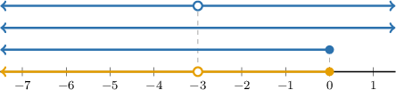
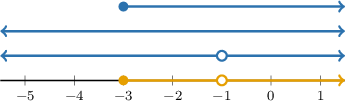
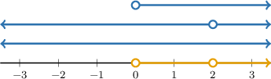

# The Domain of a Vector-Valued Function

Source: https://www.mathacademy.com/topics/1737?courseId=145
Topic ID: 1737

## Prerequisites

- [Intersections of Intervals](../algebra-i/347-intersections-of-intervals.md)
- [Properties of Transformed Secant and Cosecant Functions](../algebra-ii/778-properties-of-transformed-secant-and-cosecant-functions.md)
- [Three-Dimensional Vectors in Component Form](../integrated-math-iii-honors/1166-three-dimensional-vectors-in-component-form.md)
- [Properties of Transformed Exponential Functions](../algebra-ii/1609-properties-of-transformed-exponential-functions.md)
- [Properties of Transformed Logarithmic Functions](../algebra-ii/1610-properties-of-transformed-logarithmic-functions.md)
- [Properties of Transformed Square Root Functions](../algebra-ii/1875-properties-of-transformed-square-root-functions.md)
- [Domain and Range of Quadratic Functions](../algebra-i/1882-domain-and-range-of-quadratic-functions.md)
- [Properties of Transformed Tangent and Cotangent Functions](../algebra-ii/2064-properties-of-transformed-tangent-and-cotangent-functions.md)
- [Domain and Range of Transformed Reciprocal Functions](../algebra-ii/2082-domain-and-range-of-transformed-reciprocal-functions.md)

## Lesson

### Introduction

The domain of a vector-valued function $\mathbf f(t)$ is the set of values of $t$ for which the function is well-defined.

A function is well-defined at some value $t = t_0$ if all its component functions are defined at $t_0.$ Thus, the domain of $\mathbf f$ is the *intersection* of the domains of its component functions.

Let's find the domain of the following function:

$$

\mathbf{f}(t) = \dfrac{1}{3+t} \: \mathbf i + t^2 \: \mathbf j + \sqrt{-t} \: \mathbf k

$$

First, we find the domains of the component functions:

- The domain of $\dfrac{1}{3+t}$ is $t \in (-\infty,-3) \cup (-3,\infty).$

- The domain of $t^2$ is $t \in (-\infty,\infty).$

- The domain of $\sqrt{-t}$ is $t \in (-\infty, 0].$

To find the domain of $\mathbf{f},$ we need the intersection of the component functions' domains. This intersection is illustrated in the diagram below.

Therefore, the domain of the function $\mathbf{f}(t)$ is $t \in (-\infty,-3) \cup (-3,0].$

### Example: Domains of Functions With Reciprocal and Radical Components

#### Question

Find the domain of the vector-valued function $\mathbf f(t) = \left\langle \sqrt{t+3}, \: t^3-t^2, \: \dfrac{1}{t+1}\right\rangle.$

#### Explanation

To find the domain of $\mathbf{f}$, we need the intersection of the domains of the individual components.

- The domain of the 1st component $\sqrt{t+3}$ is $t \in [-3,\infty).$

- The domain of the 2nd component $t^3-t^2$ is $t \in (-\infty,\infty).$

- The domain of the 3rd component $\dfrac{1}{t+1}$ is $t \in (-\infty,-1)\cup(-1,\infty).$

The intersection is illustrated in the diagram below.

Therefore, the domain of the vector-valued function $\mathbf{f}(t)$ is $t \in [-3,-1)\cup(-1,\infty).$

### Example: Domains of Functions With Exponential and Logarithmic Components

#### Question

Find the domain of the vector-valued function $\mathbf f(t),$ given by

$$

\mathbf{f} (t) = \ln{t} \, \mathbf{i} + \frac{1}{t-2} \, \mathbf{j} + e^{2t} \, \mathbf{k}.

$$

#### Explanation

To find the domain of $\mathbf{f}$, we need the intersection of the domains of the individual components.

- The domain of the 1st component $\ln{t}$ is $t \in (0, \infty).$

- The domain of the 2nd component $\dfrac{1}{t-2}$ is $t \in (-\infty,2)\cup(2,\infty).$

- The domain of the 3rd component $e^{2t}$ is $t \in (-\infty,\infty).$

The intersection is illustrated in the diagram below.

Therefore, the domain of the vector-valued function $\mathbf{f}(t)$ is $t \in (0,2)\cup (2,\infty).$

### Example: Domains of Functions With Trigonometric Components

#### Question

The domain of the vector-valued function $\mathbf f (t) = \tan\left(t+\dfrac{\pi}{6} \right) \, \mathbf i + t^3 \,\mathbf j + e^t \,\mathbf k$ is

$$

t\in (-\infty,\infty), \quad t \neq \boxed{\phantom{AAAAA}}.

$$

What is the missing expression?

#### Explanation

To find the domain of $\mathbf{f}$, we need the intersection of the domains of the individual components.

- The domain of the 1st component $\tan\left(t+\dfrac{\pi}{6} \right)$ is $t \in (-\infty,\infty),$ except for the values of $t$ for which where $n$ is an integer.

- The domain of the 2nd component $t^3$ is $t \in (-\infty,\infty).$

- The domain of the 3rd component $e^{t}$ is $t \in (-\infty,\infty).$

Therefore, the domain of the vector-valued function $\mathbf{f}(t)$ is

$$

t\in (-\infty,\infty), \quad t \neq \boxed{\color{blue}\dfrac{\pi}{3} + n\pi},

$$

where $n$ is an integer.
