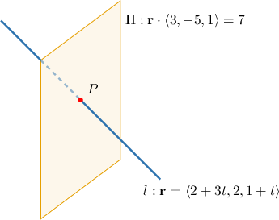

# The Intersection Between a Line and a Plane

Source: https://www.mathacademy.com/topics/1808?courseId=145
Topic ID: 1808

## Prerequisites

- [Calculating the Intersection of Two Lines](../algebra-i/408-calculating-the-intersection-of-two-lines.md)
- [The Parametric Equations of a Plane](./1806-the-parametric-equations-of-a-plane.md)
- [The Cartesian Equation of a Plane](./1807-the-cartesian-equation-of-a-plane.md)

## Lesson

### Introduction

Consider the following equations of a line $l$ and a plane $\Pi\mathbin{:}$

$$

l: \mathbf{r} = \langle 2,2,1 \rangle + t \langle 3,0,1 \rangle, \qquad \Pi:\mathbf{r} \cdot \langle 3,-5,1 \rangle = 7.

$$

How can we find the intersection point $P$ of $l$ and $\Pi?$

We start by writing the equation of the line in the form $\mathbf{r} = \langle 2+3t, 2, 1+t \rangle.$ Now, since $P$ must lie on the line $l,$ we can write its coordinates as $P(2+3t, 2, 1+t)$ for some particular value of $t \in (-\infty,\infty).$

On the other hand, $P$ also lies on the plane $\Pi.$ So, the coordinates $P(2+3t, 2, 1+t)$ must satisfy the equation of the plane as well. Substituting the position vector $\mathbf{r} = \langle 2+3t, 2, 1+t \rangle$ into the equation of the plane and solving for $t,$ we get

$$

\begin{aligned}𝐫⋅⟨3,−5,1⟩ & =7 \\ ⟨2+3𝑡,2,1+𝑡⟩⋅⟨3,−5,1⟩ & =7 \\ 3(2+3𝑡)−5⋅2+(1+𝑡) & =7 \\ 6+9𝑡−10+1+𝑡 & =7 \\ 10𝑡 & =10 \\ 𝑡 & =1.\end{aligned}

$$

To get the position vector $\mathbf{p}$ of the intersection point $P,$ we substitute $t=1$ into the equation of the line:

$$

\begin{aligned}𝐩 & =⟨2+3(1),2,1+(1)⟩ \\ & =⟨5,2,2⟩\end{aligned}

$$

Therefore, the intersection point is $P(5, 2, 2).$

### Example: Finding the Intersection Point of a Line in Vector Form and a Plane in Dot Product Form

#### Question

Find the intersection point of the line $l$ and the plane $\Pi$ with equations

$$

l: \mathbf{r} = \langle 5,3,-4 \rangle + t \langle 4,-2,-3 \rangle, \qquad \Pi: \mathbf{r} \cdot \langle -7,5,1 \rangle = -65.

$$

#### Explanation

Let's write the equation of the line as

$$

\mathbf{r} = \langle 5+4t , 3-2t, -4-3t \rangle.

$$

Now, substituting $\mathbf{r} = \langle 5+4t, 3-2t, -4-3t \rangle$ into the equation of the plane, we get

$$

\begin{aligned}𝐫⋅⟨−7,5,1⟩ & =−65 \\ ⟨5+4𝑡,3−2𝑡,−4−3𝑡⟩⋅⟨−7,5,1⟩ & =−65 \\ −7(5+4𝑡)+5(3−2𝑡)+(−4−3𝑡) & =−65 \\ −35−28𝑡+15−10𝑡−4−3𝑡 & =−65 \\ −41𝑡 & =−41 \\ 𝑡 & =1.\end{aligned}

$$

Finally, the position vector $\mathbf{p}$ of the intersection point is obtained by substituting $t=1$ into the equation of the line, as follows:

$$

\begin{aligned}𝐩 & =⟨5+4(1),3−2(1),−4−3(1)⟩ \\ & =⟨9,1,−7⟩\end{aligned}

$$

Therefore, the intersection point is $P(9, 1, -7).$

### Example: Finding the Intersection Point of a Line in Parametric Form and a Plane in Cartesian Form

#### Question

Find the intersection point of the line $l$ and the plane $\Pi$ with equations

$$

\begin{aligned}𝑥=3−4𝑡 \\ 𝑦=−1+2𝑡 \\ 𝑧=2+3𝑡\end{aligned}

$$

#### Explanation

We can substitute the parametric expressions for $x,$ $y,$ and $z$ of the line into the equation of the plane immediately:

$$

\begin{aligned}3𝑥+4𝑦+6𝑧+25 & =0 \\ 3(3−4𝑡)+4(−1+2𝑡)+6(2+3𝑡)+25 & =0 \\ 9−12𝑡−4+8𝑡+12+18𝑡+25 & =0 \\ 14𝑡 & =−42 \\ 𝑡 & =−3\end{aligned}

$$

To get the position vector $\mathbf{p}$ of the intersection point $P$, we substitute $t=-3$ into the parametric equations of the line:

$$

\begin{aligned}𝑥=3−4(−3)=15 \\ 𝑦=−1+2(−3)=−7 \\ 𝑧=2+3(−3)=−7\end{aligned}

$$

So, the intersection point is $P(15,-7,-7).$

### Example: Finding the Intersection Point of a Line and a Plane Given in Other Forms

#### Question

Find the intersection point of the line $l$ and the plane $\Pi$ with equations

$$

l: \mathbf{r} = \langle 1,3,1 \rangle + t \langle 2,1,0 \rangle, \qquad \Pi:4x-3y+2z-7 = 0.

$$

#### Explanation

Let's start by writing the equation of the line as

$$

\mathbf{r} = \langle 1+2t , 3+t, 1 \rangle .

$$

Let's also write the equation of the plane in the dot product form:

$$

\begin{aligned}4𝑥−3𝑦+2𝑧−7 & =0 \\ 4𝑥−3𝑦+2𝑧 & =7 \\ ⟨𝑥,𝑦,𝑧⟩⋅⟨4,−3,2⟩ & =7 \\ 𝐫⋅⟨4,−3,2⟩ & =7\end{aligned}

$$

Now, substituting $\mathbf{r} = \langle 1+2t, 3+t, 1 \rangle$ into the equation of the plane, we get

$$

\begin{aligned}𝐫⋅⟨4,−3,2⟩ & =7 \\ ⟨1+2𝑡,3+𝑡,1⟩⋅⟨4,−3,2⟩ & =7 \\ 4(1+2𝑡)−3(3+𝑡)+2⋅1 & =7 \\ 4+8𝑡−9−3𝑡+2 & =7 \\ 5𝑡 & =10 \\ 𝑡 & =2.\end{aligned}

$$

Finally, to get the position vector $\mathbf{p}$ of the intersection point $P,$ we substitute $t=2$ into the equation of the line:

$$

\begin{aligned}𝐩 & =⟨1+2(2),3+(2),1⟩ \\ & =⟨5,5,1⟩.\end{aligned}

$$

Therefore, the intersection point is $P(5, 5, 1).$
