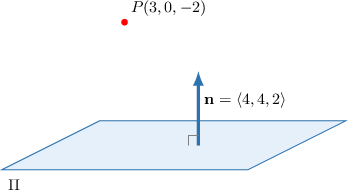
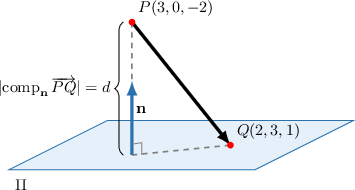

# The Shortest Distance Between a Plane and a Point

Source: https://www.mathacademy.com/topics/1810?courseId=145
Topic ID: 1810

## Prerequisites

- [Calculating a Scalar Projection](../integrated-math-iii-honors/1285-calculating-a-scalar-projection.md)
- [The Parametric Equations of a Plane](./1806-the-parametric-equations-of-a-plane.md)
- [The Cartesian Equation of a Plane](./1807-the-cartesian-equation-of-a-plane.md)

## Lesson

### Introduction

Suppose we want to find the shortest distance between the point $P(3,0,-2)$ and the plane $\Pi$ that is given by the equation

$$

(\mathbf{r}-\langle 2 , 3 , 1 \rangle ) \cdot \langle 4 , 4 , 2 \rangle = 0.

$$

First, note that $\mathbf{n} = \langle 4, 4, 2 \rangle$ is a vector that's normal to the plane.

Let's pick a point on the plane, for instance, $Q(2,3,1)$. Then

$$

\begin{aligned}\overset{𝑃𝑄}{} & =⟨2,3,1⟩−⟨3,0,−2⟩ \\ & =⟨−1,3,3⟩.\end{aligned}

$$

The shortest distance $d$ from the point $P$ to the plane $\Pi$ is the absolute value of the scalar projection of $\overrightarrow{PQ}$ onto the normal vector of the plane, as shown below.

Therefore, we have

$$

\begin{aligned}𝑑 & =|comp_{𝐧}\,\overset{𝑃𝑄}{}| \\ & =\frac{|\overset{𝑃𝑄}{}⋅𝐧|}{|𝐧|} \\ & =\frac{|(−1)⋅4+3⋅4+3⋅2|}{\sqrt{√4^{2}+4^{2}+2^{2}}} \\ & =\frac{|−4+12+6|}{\sqrt{√16+16+4}} \\ & =\frac{|14|}{\sqrt{√36}} \\ & =\frac{7}{3}.\end{aligned}

$$

We conclude that the shortest distance from the point $P$ to the plane $\Pi$ is $\dfrac{7}{3}.$

### Example: Finding the Shortest Distance Between a Point and a Plane Given in Dot Product Form

#### Question

Find the shortest distance between the point $P(5,2,-2)$ and the plane $\Pi$ with equation $\begin{aligned}4 \\ 8 \\ 2\end{aligned}$

#### Explanation

Let's pick a point on the plane, for instance, $Q(4,8,2).$ Then

$$

\begin{aligned}\overset{𝑃𝑄}{} & =\begin{aligned}4 \\ 8 \\ 2\end{aligned}−\begin{aligned}5 \\ 2 \\ −2\end{aligned}=\begin{aligned}−1 \\ 6 \\ 4\end{aligned}.\end{aligned}

$$

Also, from the equation of the plane, we get a normal vector $\begin{aligned}2 \\ 4 \\ −4\end{aligned}$

Finally, the shortest distance from the point $P$ to the plane $\Pi$ is the absolute value of the scalar projection of $\overrightarrow{PQ}$ onto the normal vector of the plane:

$$

\begin{aligned}𝑑 & =|comp_{𝐧}\,\overset{𝑃𝑄}{}| \\ & =\frac{|\overset{𝑃𝑄}{}⋅𝐧|}{|𝐧|} \\ & =\frac{|(−1)⋅2+6⋅4+4⋅(−4)|}{\sqrt{√2^{2}+4^{2}+(−4)^{2}}} \\ & =\frac{|−2+24−16|}{\sqrt{√4+16+16}} \\ & =\frac{|\,6\,|}{\sqrt{√36}} \\ & =1\end{aligned}

$$

### Example: Finding the Shortest Distance Between a Point and a Plane Given in Simplified Dot Product Form

#### Question

Given that $Q(1,-2,-1)$ lies on the plane $\Pi:\mathbf{r} \cdot \langle 2, 0, -2 \rangle = 4,$ find the shortest distance from $P(0, -1, 2)$ to $\Pi.$

#### Explanation

First, we find

$$

\begin{aligned}\overset{𝑃𝑄}{} & =⟨1,−2,−1⟩−⟨0,−1,2⟩ \\ & =⟨1,−1,−3⟩.\end{aligned}

$$

From the equation of a plane, we get a normal vector $\mathbf{n}= \langle 2, 0, -2 \rangle.$

Finally, the shortest distance from the point $P$ to the plane $\Pi$ is the absolute value of the scalar projection of $\overrightarrow{PQ}$ onto the normal vector of the plane:

$$

\begin{aligned}𝑑 & =|comp_{𝐧}\,\overset{𝑃𝑄}{}| \\ & =\frac{|\overset{𝑃𝑄}{}⋅𝐧|}{|𝐧|} \\ & =\frac{|1⋅2+(−1)⋅0+(−3)⋅(−2)|}{\sqrt{√2^{2}+0^{2}+(−2)^{2}}} \\ & =\frac{|2+0+6|}{\sqrt{√4+0+4}} \\ & =\frac{|\,8\,|}{\sqrt{√8}} \\ & =\sqrt{√8} \\ & =2\sqrt{√2}\end{aligned}

$$

### Example: Finding the Shortest Distance Between a Point and a Plane Given in Cartesian Form

#### Question

Find the shortest distance between the point $P(3, -10, 3)$ and the plane $\Pi$ with equation $2x+y-2z = -1$.

#### Explanation

Let's start by picking a point on the plane. To do that, we simply substitute some concrete values for $x$ and $y$ into the equation and solve for $z.$ Let's choose $x=4$ and $y=-5$ (though it doesn't really matter what values we choose). Solving for $z,$ we get

$$

\begin{aligned}2𝑥+𝑦−2𝑧 & =−1 \\ 2(4)+(−5)+1 & =2𝑧 \\ 4 & =2𝑧 \\ 𝑧 & =2.\end{aligned}

$$

So, we get the point $Q(4, -5, 2)$ which lies on the plane.

Computing $\overrightarrow{PQ},$ we get

$$

\begin{aligned}\overset{𝑃𝑄}{} & =⟨4,−5,2⟩−⟨3,−10,3⟩ \\ & =⟨1,5,−1⟩.\end{aligned}

$$

We also need a normal vector to the plane. For any Cartesian equation of a plane $ax+by+cz=d,$ the normal vector is $\mathbf{n}=\langle a,b,c \rangle.$ So, for the plane $\Pi,$ we have $\mathbf{n}= \langle 2, 1, -2 \rangle.$

Finally, the shortest distance from the point $P$ to the plane $\Pi$ is the absolute value of the scalar projection of $\overrightarrow{PQ}$ onto the normal vector of the plane:

$$

\begin{aligned}𝑑 & =|comp_{𝐧}\,\overset{𝑃𝑄}{}| \\ & =\frac{|\overset{𝑃𝑄}{}⋅𝐧|}{|𝐧|} \\ & =\frac{|1⋅2+5⋅1+(−1)⋅(−2)|}{\sqrt{√2^{2}+1^{2}+(−2)^{2}}} \\ & =\frac{|2+5+2|}{\sqrt{√4+1+4}} \\ & =\frac{|\,9\,|}{\sqrt{√9}} \\ & =3\end{aligned}

$$
