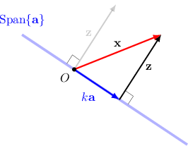
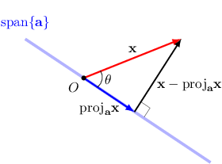
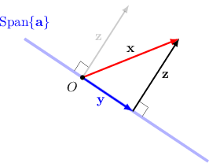

# Projecting Vectors Onto One-Dimensional Subspaces

Source: https://www.mathacademy.com/topics/2122?courseId=145
Topic ID: 2122

## Prerequisites

- [Calculating a Vector Projection](../integrated-math-iii-honors/1295-calculating-a-vector-projection.md)
- [The Cauchy-Schwarz Inequality and the Angle Between Two Vectors](./2101-the-cauchy-schwarz-inequality-and-the-angle-between-two-vectors.md)
- [Orthogonal Complements](./2102-orthogonal-complements.md)

## Lesson

### Introduction

The **orthogonal projection** of a vector $\mathbf{x}$ onto a span $\textrm{Span}\{\mathbf{a}\}$ is the vector in $\textrm{Span}\{\mathbf{a}\}$ that is "closest" to $\mathbf{x}.$ Let's work an example to clarify what we mean by "closest."

Consider the following two vectors:

$$

\begin{aligned}5 \\ −1 \\ 0 \\ 1\end{aligned}

$$

Geometrically, $\mathbf{x}$ can be written as the sum of a vector $k{\mathbf{a}}$ that lies in $\textrm{Span}\{\mathbf{a}\}$ and another vector $\mathbf{z}$ that belongs to the orthogonal complement of $\textrm{Span}\{\mathbf{a}\}$, as illustrated in the picture below.

The vector $k\mathbf a$ is called the **orthogonal projection** of $\mathbf{x}$ onto $\textrm{Span}\{\mathbf{a}\}.$

Symbolically, we can write the vector $\mathbf{x}$ as the sum

$$

\mathbf{x} = k \mathbf{a} + \mathbf{z},

$$

for some $k \in \mathbb{R}$ and ${\mathbf{z}} \perp \mathbf{a}.$

To compute the orthogonal projection $k \mathbf{a},$ we can first find the dot product of both sides of the equation above with $\mathbf{a}$ to get

$$

\begin{aligned}𝐱⋅𝐚 & =(𝑘𝐚+𝐳)⋅𝐚 \\ 𝐱⋅𝐚 & =𝑘(𝐚⋅𝐚)+𝐳⋅𝐚.\end{aligned}

$$

Since $\mathbf{a} \perp \mathbf{z},$ we have $\mathbf{z} \cdot \mathbf{a} = 0.$ As a result,

$$

\begin{aligned}𝐱⋅𝐚 & =𝑘(𝐚⋅𝐚) \\ 𝑘 & =\frac{𝐱⋅𝐚}{𝐚⋅𝐚} \\ 𝑘 & =\frac{5⋅3+(−1)⋅(−6)+0⋅0+1⋅6}{3^{2}+(−6)^{2}+6^{2}} \\ 𝑘 & =\frac{1}{3}.\end{aligned}

$$

Therefore, the orthogonal projection is

$$

\begin{aligned}𝑘𝐚=\frac{1}{3}\begin{aligned}3 \\ −6 \\ 0 \\ 6\end{aligned}=\begin{aligned}1 \\ −2 \\ 0 \\ 2\end{aligned}.\end{aligned}

$$

**Note:** There is a shortcut! Instead of going through this process each time, we can compute the orthogonal projection of $\mathbf{x}$ onto $\textrm{Span}\{\mathbf{a}\}$ using the following formula:

$$

\begin{aligned}proj_{𝐚}\,𝐱 & =\frac{𝐚⋅𝐱}{𝐚⋅𝐚}\,𝐚\end{aligned}

$$

### Example: Finding the Orthogonal Projection of a Vector onto a One-Dimensional Subspace

#### Question

Let $\begin{aligned}2 \\ 9 \\ −1 \\ −1\end{aligned}$ and $\begin{aligned}2 \\ 1 \\ 0 \\ 1\end{aligned}$ Find the orthogonal projection of $\mathbf{a}$ onto $\text{Span}\{\mathbf{b}\}.$

#### Explanation

The orthogonal projection of $\mathbf{a}$ onto $\textrm{Span}\{\mathbf{b}\}$ is given by

$$

\begin{aligned}proj_{𝐛}\,𝐚 & =\frac{𝐛⋅𝐚}{𝐛⋅𝐛}𝐛 \\ & =\frac{2⋅2+1⋅9+0⋅(−1)+1⋅(−1)}{2^{2}+1^{2}+0^{2}+1^{2}}𝐛 \\ & =\frac{4+9+0−1}{4+1+0+1}𝐛 \\ & =\frac{12}{6}𝐛 \\ & =2𝐛 \\ & =2\begin{aligned}2 \\ 1 \\ 0 \\ 1\end{aligned} \\ & =\begin{aligned}4 \\ 2 \\ 0 \\ 2\end{aligned}.\end{aligned}

$$

### The Distance Between a Vector and a One-Dimensional Subspace

We define the **distance** between the vector $\mathbf{x}$ and the vector space $\textrm{Span}\{\mathbf{a}\}$ to be

$$

\Vert \mathbf{x} - \text{proj}_{\mathbf{a}}\,\mathbf{x} \Vert.

$$

We can also define the **angle** $\theta$ between the vector $\mathbf{x}$ and the subspace $\textrm{Span}\{\mathbf{a}\}$ to be the acute angle between the vector $\mathbf{x}$ and its orthogonal projection $\text{proj}_{\mathbf{a}}\,\mathbf{x},$ as shown in the diagram below.

Finally, we now can represent the vector $\mathbf{x}$ as a sum of two orthogonal vectors

$$

\mathbf{x} = \underbrace{\textrm{proj}_{\mathbf{a}}\mathbf{x}}_{\large \mathbf{y}} + \underbrace{(\mathbf{x}-\textrm{proj}_{\mathbf{a}}\mathbf{x})}_{\large \mathbf{z}},

$$

where $\mathbf{y} \in \text{Span}\{\mathbf{a}\}$ and $\mathbf{z} \perp \text{Span}\{\mathbf{a}\}.$

**Note:** The vector $\textbf{x}-\textrm{proj}_{\mathbf{a}}\mathbf{x},$ whose norm $\| \textbf{x}-\textrm{proj}_{\mathbf{a}}\mathbf{x} \|$ represents the distance from $\mathbf{x}$ to $\mathbf{a},$ is sometimes called the **vector rejection of $\mathbf{x}$ from $\mathbf{a}.$**

### Example: Calculating the Distance Between a Vector and a One-Dimensional Subspace

#### Question

Let $\begin{aligned}4 \\ −4 \\ 2 \\ 2\end{aligned}$ and $\begin{aligned}1 \\ −1 \\ 0 \\ −1\end{aligned}$ If $\mathbf{x} = \mathbf{y} + \mathbf{z},$ where $\mathbf{y} \in \text{Span}\{\mathbf{a}\}$ and $\mathbf{z} \perp \text{Span}\{\mathbf{a}\},$ then find $\mathbf{z}.$

#### Explanation

A diagram of the situation is provided below:

First, we find the orthogonal projection of $\mathbf{x}$ onto $\textrm{Span}\{\mathbf{a}\}\mathbin{:}$

$$

\begin{aligned}proj_{𝐚}\,𝐱 & =\frac{𝐚⋅𝐱}{𝐚⋅𝐚}𝐚 \\ & =\frac{1⋅4+(−1)⋅(−4)+0⋅2+(−1)⋅2}{1^{2}+(−1)^{2}+0^{2}+(−1)^{2}}𝐚 \\ & =\frac{4+4+0−2}{1+1+0+1}𝐚 \\ & =\frac{6}{3}𝐚 \\ & =2𝐚 \\ & =2\begin{aligned}1 \\ −1 \\ 0 \\ −1\end{aligned} \\ & =\begin{aligned}2 \\ −2 \\ 0 \\ −2\end{aligned}\end{aligned}

$$

Therefore, we get the following:

$$

\begin{aligned}𝐲 & =proj_{𝐚}\,𝐱=\begin{aligned}2 \\ −2 \\ 0 \\ −2\end{aligned} \\ 𝐳 & =𝐱−proj_{𝐚}\,𝐱=\begin{aligned}4 \\ −4 \\ 2 \\ 2\end{aligned}−\begin{aligned}2 \\ −2 \\ 0 \\ −2\end{aligned}=\begin{aligned}2 \\ −2 \\ 2 \\ 4\end{aligned}\end{aligned}

$$

Notice that $\mathbf{y} \in \text{Span}\{\mathbf{a}\}$ and $\mathbf{z} \perp \text{Span}\{\mathbf{a}\},$ as shown in the picture above.

### Example: Finding the Orthogonal Projection of a Vector onto the Solution Space of a System of Equations

#### Question

Given the vector $\mathbf{x}$ and the system of linear equations below, find the projection of $\mathbf{x}$ onto the solution space of the system.

$$

\begin{aligned}−10 \\ 20 \\ 2\end{aligned}

$$

#### Explanation

First, we need to find the basis of the solution space of the system.

Consider the augmented matrix $M$ of the system, which we reduce to row echelon form, as follows:

$$

\begin{aligned}𝑀 & =[\begin{aligned}1 & 1 & 4 & 0 \\ 1 & 2 & 0 & 0\end{aligned}] & 𝑅_{2} & :=𝑅_{2}−𝑅_{1} \\ & ∼[\begin{aligned}1 & 1 & 4 & 0 \\ 0 & 1 & −4 & 0\end{aligned}]. & & \end{aligned}

$$

In the reduced matrix above, there are $2$ pivot columns ($1$st and $2$nd). Thus, $x_3$ is a free variable. Now, from the second equation, we get $x_2=4x_3.$ Substituting this into the first equation, we obtain

$$

x_1+4x_3+4x_3= 0 \qquad\Longrightarrow\qquad x_1=-8x_3.

$$

So, the general solution is

$$

\begin{aligned}−8𝑥_{3} \\ 4𝑥_{3} \\ 𝑥_{3}\end{aligned}

$$

Consequently, $\begin{aligned}−8 \\ 4 \\ 1\end{aligned}$ is a basis of the solution space of the system.

Finally, we find the projection of $\mathbf{x}$ onto the solution space of the system:

$$

\begin{aligned}proj_{𝐛}\,𝐱 & =\frac{𝐱⋅𝐛}{𝐛⋅𝐛}𝐛 \\ & =\frac{(−10)⋅(−8)+20⋅4+2⋅1}{(−8)^{2}+4^{2}+1^{2}}𝐛 \\ & =\frac{80+80+2}{64+16+1}𝐛 \\ & =\frac{162}{81}𝐛 \\ & =2𝐛 \\ & =2\begin{aligned}−8 \\ 4 \\ 1\end{aligned} \\ & =\begin{aligned}−16 \\ 8 \\ 2\end{aligned}\end{aligned}

$$
