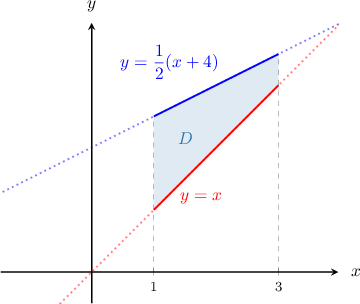
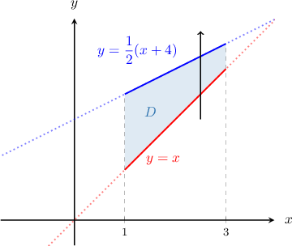
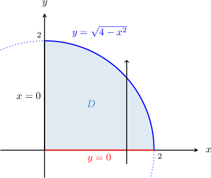
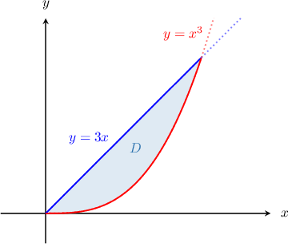
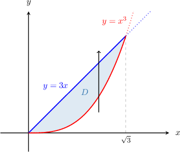
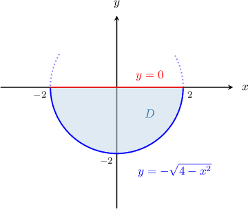
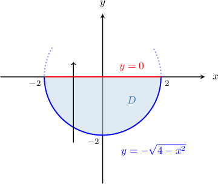

# Double Integrals Over Type I Regions

Source: https://www.mathacademy.com/topics/2151?courseId=145
Topic ID: 2151

## Prerequisites

- [Type I and II Regions in Two-Dimensional Space](./1979-type-i-and-ii-regions-in-two-dimensional-space.md)
- [Properties of Double Integrals](./2000-properties-of-double-integrals.md)

## Lesson

### Introduction

How do we represent the double integral of a function over a non-rectangular region as a repeated integral?

Specifically, let's consider

where is the finite region enclosed by the lines,, and as shown below.

First, notice that is a *type I* region. To determine the lower and upper functions, we draw a vertical arrow through the region.

So, the region can be defined as

Now, we can express the integral as follows:

And that's our answer! Notice that, when we have a type I region,

- the limits for are functions of

- the limits for are constants, and

- we integrate over the variable before integrating over the variable

### Example: Representing a Double Integral as a Repeated Integral When the Limits are Given

#### Question

Consider the finite region $D$ in the $xy$-plane enclosed by the lines $x=0,$ $y=0,$ and the curve $y=\sqrt{4 - x^2}.$ What is $\displaystyle \iint\limits_D (x+y)\,\mathrm{d}A$ expressed as a repeated integral?

#### Explanation

First, let's represent $D$ as a type I region. To determine the lower and upper functions, we draw a vertical arrow through the region, as usual.

As a result, we get

$$

D = \big\{ (x,y) \: : \: 0 \leq x \leq 2, \quad 0 \leq y \leq \sqrt{4-x^2} \big\}.

$$

Therefore, we can express the integral as follows:

$$

\begin{aligned}\underset{𝐷}{∬}(𝑥+𝑦)\,d𝐴 & =∫_{20}^{}∫_{\sqrt{√4−𝑥^{2}}0}^{}(𝑥+𝑦)\,d𝑦\,d𝑥\end{aligned}

$$

### Example: Representing a Double Integral as a Repeated Integral When the Limits are Not Given

#### Question

If $D$ is the finite region in the first quadrant enclosed by the curves $y=3x$ and $y=x^3,$ then what is $\displaystyle \iint\limits_{D} f\left({x,y} \right) \, \mathrm{d}A$ expressed as a repeated integral?

#### Explanation

First, let's sketch our region.

Now, let's represent $D$ as a type I region.

- To determine the $x$-limits, we need to find the $x$-coordinates of the points at which the curves intersect. So, we set the following equation and solve it for $x\mathbin{:}$ So, $x$-limits are $0 \le x \le \sqrt{3}.$ Note that we disregarded the solution $x=-\sqrt 3$ since $x\geq 0$ in our region.

- To determine the lower and upper functions, we draw a vertical arrow through the region, as usual.

As a result, we get

$$

D = \left\{ (x,y) \: : \: 0 \leq x \leq \sqrt{3}, \quad x^3 \leq y \leq 3x \right\}.

$$

Therefore, we can express the integral as follows:

$$

\begin{aligned}\underset{𝐷}{∬}𝑓(𝑥,𝑦)\,d𝐴 & =∫_{\sqrt{√3}0}^{}∫_{3𝑥𝑥^{3}}^{}𝑓(𝑥,𝑦) d𝑦\,d𝑥 \\ & =∫_{\sqrt{√3}0}^{}[∫_{3𝑥𝑥^{3}}^{}𝑓(𝑥,𝑦) d𝑦]d𝑥\end{aligned}

$$

### Evaluating Repeated Integrals With Variable Limits

Suppose that we want to evaluate the repeated integral

$$

\int_{0}^{1}\int_{x}^{2x} (x-2y) \ \mathrm{d} y \ \mathrm{d} x.

$$

Notice that the domain of integration is a type I region.

To compute this integral, we must bear the following important points in mind.

- We start with the inner integral, as usual.

- When integrating with respect to $y,$ we treat $x$ as though it were a constant.

- The limits of integration for the inner integral are functions of $x.$ Once again, we treat $x$ as though it were a constant and substitute the integration limits as usual. After this step, there should be no more $y$'s in our integral.

- Finally, we compute the outer integral.

Let's apply these steps to solve the given problem.

First, we evaluate the inner integral by integrating with respect to $y,$ treating $x$ as a constant:

$$

\begin{aligned}∫_{10}^{}[∫_{2𝑥𝑥}^{}(𝑥−2𝑦) d𝑦]\,d𝑥 & =∫_{10}^{}[𝑥𝑦−𝑦^{2}]_{2𝑥𝑥}^{} d𝑥 \\ & =∫_{10}^{}[𝑥⋅(2𝑥)−(2𝑥)^{2}]−[𝑥⋅(𝑥)−(𝑥)^{2}]d𝑥 \\ & =∫_{10}^{}[2𝑥^{2}−4𝑥^{2}]−[𝑥^{2}−𝑥^{2}]d𝑥 \\ & =∫_{10}^{}−2𝑥^{2}\,d𝑥 \\ & =−2∫_{10}^{}𝑥^{2}\,d𝑥\end{aligned}

$$

Then, we integrate with respect to $x\mathbin{:}$

$$

\begin{aligned}−2∫_{10}^{}𝑥^{2}\,d𝑥 & =−2[\frac{𝑥^{3}}{3}]_{10}^{} \\ & =−\frac{2}{3}[𝑥^{3}]_{10}^{} \\ & =−\frac{2}{3}[1^{3}−0^{3}] \\ & =−\frac{2}{3}\end{aligned}

$$

### Example: Evaluating a Repeated Integral Defined Over a Type I Region

#### Question

Calculate $\displaystyle \int_0^1 \int_0^x x^2y \,\textrm{d}y \,\textrm{d}x.$

#### Explanation

The integral is defined over a type I region.

First, we evaluate the inner integral by integrating with respect to $y$, treating $x$ as a constant:

$$

\begin{aligned}∫_{10}^{}∫_{𝑥0}^{}𝑥^{2}𝑦\,d𝑦\,d𝑥 & =∫_{10}^{}𝑥^{2}[∫_{𝑥0}^{}𝑦\,d𝑦]\,d𝑥 \\ & =∫_{10}^{}𝑥^{2}[\frac{𝑦^{2}}{2}]_{𝑥0}^{}\,d𝑥 \\ & =∫_{10}^{}𝑥^{2}(\frac{𝑥^{2}}{2}−0)\,d𝑥 \\ & =\frac{1}{2}∫_{10}^{}𝑥^{4}\,d𝑥\end{aligned}

$$

Then, we integrate with respect to $x\mathbin{:}$

$$

\begin{aligned}\frac{1}{2}∫_{10}^{}𝑥^{4}\,d𝑥 & =\frac{1}{2}[\frac{𝑥^{5}}{5}]_{10}^{} \\ & =\frac{1}{2}(\frac{1}{5}−0) \\ & =\frac{1}{10}\end{aligned}

$$

### Example: Calculating a Double Integral Defined Over a Type I Region

#### Question

Evaluate the double integral $\displaystyle \iint \limits_{D} xy\,\mathrm{d}A,\:$ where $D$ is the finite region below the $x$-axis enclosed by the circle $x^2 + y^2 = 4.$

#### Explanation

Since $y \leq 0,$ we obtain

$$

x^2 + y^2 = 4 \qquad\Longrightarrow\qquad y = -\sqrt{4-x^2}.

$$

Let's sketch our region.

Notice that $D$ is a type I region.

- We already know the intersection of the circle with the line $y=0.$ So, the $x$-limits are $-2 \le x \le 2.$

- To determine the lower and upper functions, we draw a vertical arrow through the region.

As a result, the integral is defined over the following type I region:

$$

D = \Big\{ (x,y) \: : \: -2 \leq x \leq 2, \quad -\sqrt{4-x^2} \leq y \leq 0 \Big\}

$$

So, we can express the integral as follows:

$$

\iint \limits_{D} xy\,\mathrm{d}A = \int_{-2}^2 \int_{-\sqrt{4-x^2}}^{0} xy\,\mathrm{d}y \: \mathrm{d}x

$$

First, we evaluate the inner integral by integrating with respect to $y$, treating $x$ as a constant:

$$

\begin{aligned}∫_{2−2}^{}∫_{0−\sqrt{√4−𝑥^{2}}}^{}𝑥𝑦\,d𝑦\,d𝑥 & =∫_{2−2}^{}𝑥[∫_{0−\sqrt{√4−𝑥^{2}}}^{}𝑦\,d𝑦]d𝑥 \\ & =∫_{2−2}^{}𝑥[\frac{𝑦^{2}}{2}]_{0−\sqrt{√4−𝑥^{2}}}^{}\,d𝑥 \\ & =\frac{1}{2}∫_{2−2}^{}𝑥(0−(−\sqrt{√4−𝑥^{2}})^{2})\,d𝑥 \\ & =\frac{1}{2}∫_{2−2}^{}𝑥(−(4−𝑥^{2}))\,d𝑥 \\ & =\frac{1}{2}∫_{2−2}^{}𝑥(𝑥^{2}−4)\,d𝑥 \\ & =\frac{1}{2}∫_{2−2}^{}(𝑥^{3}−4𝑥)\,d𝑥\end{aligned}

$$

Then, we integrate with respect to $x\mathbin{:}$

$$

\begin{aligned}\frac{1}{2}∫_{2−2}^{}(𝑥^{3}−4𝑥)\,d𝑥 & =\frac{1}{2}[\frac{𝑥^{4}}{4}−2𝑥^{2}]_{2−2}^{} \\ & =\frac{1}{2}((4−8)−(4−8)) \\ & =\frac{1}{2}⋅0 \\ & =0\end{aligned}

$$
