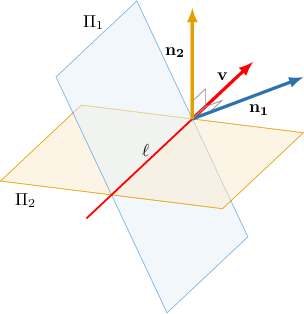

# The Intersection of Two Planes

Source: https://www.mathacademy.com/topics/2539?courseId=145
Topic ID: 2539

## Prerequisites

- [The Cartesian Equation of a Plane](./1807-the-cartesian-equation-of-a-plane.md)

## Lesson

### Introduction

Suppose we are given the planes ${\Pi_{{1}}}: 2x -y+z=0$ and ${\Pi_{{2}}}: -x + y-z=1.$ First, notice that:

- A normal vector to the plane ${\Pi_{{1}}}$ is $\mathbf{n}_1 = \langle 2,\:-1,\: 1 \rangle.$

- A normal vector to the plane ${\Pi_{{2}}}$ is $\mathbf{n}_2 = \langle -1,\: 1,\: -1 \rangle.$

If two distinct planes intersect each other, their intersection will always be a straight line. A direction vector $\mathbf{v}$ for that line can be found by computing the cross product of the normal vectors of the two planes.

In our case, we have

$$

\begin{aligned}𝐯 & =𝐧_{1}×𝐧_{2} \\ & =⟨2,\,−1,\,1⟩×⟨−1,\,1,\,−1⟩ \\ & =\begin{aligned}𝐢 & 𝐣 & 𝐤 \\ 2 & −1 & 1 \\ −1 & 1 & −1\end{aligned} \\ & =𝐣+𝐤 \\ & =⟨0,1,1⟩.\end{aligned}

$$

### Example: Finding the Direction Vector of a Line Given as the Intersection of Two Planes

#### Question

Find a direction vector of the line that is given as the intersection of the following two planes:

$$

\begin{aligned}2𝑥+4𝑦+5=0 \\ 3𝑦−2𝑧−7=0\end{aligned}

$$

#### Explanation

First, we notice:

- For the plane $2x+4y +5= 0,$ a normal vector to the plane is $\mathbf{n}_1 = \langle 2,4,0 \rangle.$

- For the plane $3y-2z-7= 0,$ a normal vector to the plane is $\mathbf{n}_2 = \langle 0,3,-2 \rangle.$

To find a direction vector for the line, we calculate the cross product of these normal vectors:

$$

\begin{aligned}𝐯 & =𝐧_{1}×𝐧_{2} \\ & =⟨2,4,0⟩×⟨0,3,−2⟩ \\ & =\begin{aligned}\,𝐢 & \,𝐣 & \,𝐤\, \\ \,2 & \,4 & \,0\, \\ \,0 & \,3 & \,\,\,−2\,\end{aligned} \\ & =−8𝐢+4𝐣+6𝐤 \\ & =⟨−8,4,6⟩\end{aligned}

$$

### Example: Finding the Vector Equation of a Line Given as the Intersection of Two Planes

#### Question

The intersection of the planes $x+2y+4z=0$ and $2x+4y+2z+18=0$ is given by the line

$$

\mathbf r(t) = \langle 0, a_2, a_3\rangle + t \mathbf b, \quad t\in(-\infty,\infty).

$$

Calculate $a_2+a_3,$ and find a possible direction vector $\mathbf b.$

#### Explanation

We're given that there exists a point on the line where $x=0.$ Substituting this into the first equation gives

$$

0+2y+4z=0\qquad\Longrightarrow\qquad y=-2z,

$$

and substituting $x=0$ and $y=-2z$ into the second equation gives

$$

\begin{aligned}2𝑥+4𝑦+2𝑧+18 & =0 \\ 2(0)+4(−2𝑧)+2𝑧+18 & =0 \\ −6𝑧 & =−18 \\ 𝑧 & =3.\end{aligned}

$$

Therefore, $y=-2z=-6$ and $\mathbf a = \langle 0,-6,3\rangle$ is a position vector of a point on the line.

Next, we notice:

- For the plane $x+2y+4z=0,$ a normal vector to the plane is $\mathbf{n}_1 = \langle 1,2,4 \rangle.$

- For the plane $2x+4y+2z+18=0,$ a normal vector to the plane is $\mathbf{n}_2 = \langle 2,4,2 \rangle.$

To find a direction vector for the line, we calculate the cross product of these normal vectors:

$$

\begin{aligned}𝐧_{1}×𝐧_{2} & =⟨1,2,4⟩×⟨2,4,2⟩ \\ & =\begin{aligned}𝐢 & 𝐣 & 𝐤 \\ 1 & 2 & 4 \\ 2 & 4 & 2\end{aligned} \\ & =−12𝐢+6𝐣 \\ & =⟨−12,6,0⟩\end{aligned}

$$

We can pick any vector that is parallel to $\mathbf{n}_1 \times \mathbf{n}_2$ as a direction vector of the line. So, let

$$

\mathbf{b} =\dfrac{1}{6}(\mathbf{n}_1 \times \mathbf{n}_2) = \langle -2, 1, 0 \rangle.

$$

Hence, the equation of the line is:

$$

\begin{aligned}𝐫(𝑡) & =𝐚+𝑡𝐛 \\ 𝐫(𝑡) & =⟨0,−6,3⟩+𝑡⟨−2,1,0⟩\end{aligned}

$$

Finally then, $a_2 +a_3 = -6+3 = -3,$ and $\mathbf b = \langle -2,1,0\rangle.$

### Intersection of Two Planes in 3D

In general, given two planes

$$

{\Pi_{{1}}}\mathbin{:} \quad a_{1}x+b_{1}y + c_{1}z+ d_1=0 \qquad \text{and} \qquad {\Pi_{{2}}}\mathbin{:} \quad a_{2}x+b_{2}y + c_{2}z+ d_2=0,

$$

we have the following cases, regarding the positions of their normal vectors $\mathbf{n}_1$ and $\mathbf{n}_2 \mathbin{:}$

- *Case 1*: If $\mathbf{n}_1\nparallel \mathbf{n}_2$ then ${\Pi_{{1}}}$ and ${\Pi_{{2}}}$ intersect on a straight line.

- *Case 2*: If $\mathbf{n}_1\parallel \mathbf{n}_2$ but the corresponding equations of the planes are not scalar multiples of each other, then the planes are distinct and are parallel to each other.

- *Case 3*: If the corresponding coefficients of ${\Pi_{{1}}}$ and ${\Pi_{{2}}}$ are all proportional, then the planes are coincident.

### Example: Identifying the Intersection of Two Planes

#### Question

Given the two planes $4x-2y=0$ and $-2x+y+1=0$, which of the following statements are true?

1. The cross product of the normal vectors of the planes is equal to $\mathbf{0}.$

2. The planes are parallel but not coincident.

3. The planes intersect on a straight line.

#### Explanation

First, notice that:

- For the plane $4x-2y=0,$ a normal vector to the plane is $\mathbf{n}_1 = \langle 4,-2,0 \rangle.$

- For the plane $-2x+y+1=0,$ a normal vector to the plane is $\mathbf{n}_2 = \langle -2,1,0 \rangle.$

Now, let's consider the statements.

- Statement I is true. Indeed, computing the cross product of the normal vectors, we get

- Statement II is true. Since $\mathbf{n}_1 \times \mathbf{n}_2 =\mathbf{0}$, the vectors $\mathbf{n}_1$ and $\mathbf{n}_2$ are parallel. However, the first plane passes through the origin $O(0,0,0)$ but the second plane doesn't: So, the planes are parallel but not coincident.

- Statement III is false. Since the planes are parallel but not coincident, they cannot intersect each other.

Therefore, only statements I and II are true.

### The Cartesian Equation of a Line as the Intersection of Two Planes

Consider a line that is given by its vector equation

$$

\begin{aligned}1 \\ 2 \\ −1\end{aligned}

$$

Since $y=2$ at every point on the line, the corresponding Cartesian equations of this line are

$$

\dfrac{x-1}2 =z+1, \quad y=2.

$$

We may therefore interpret this line as the intersection of the planes $\dfrac{x-1}2 =z+1$ and $y=2$.

Let's look at one more example. Given the line

$$

\begin{aligned}2 \\ 1 \\ 1\end{aligned}

$$

we can write its Cartesian equation as

$$

\dfrac{x-2}{-5}=\dfrac{y-1}2 = \dfrac{z-1}3

$$

which can be further written as the system of two equations:

$$

\begin{aligned}\frac{𝑥−2}{−5}=\frac{𝑦−1}{2} \\ \frac{𝑦−1}{2}=\frac{𝑧−1}{3}\end{aligned}

$$

So, again, our line can be represented as the intersection of the planes $2x+5y-9=0$ and $3y-2z-1=0$.
