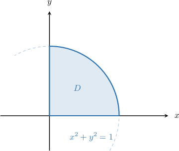
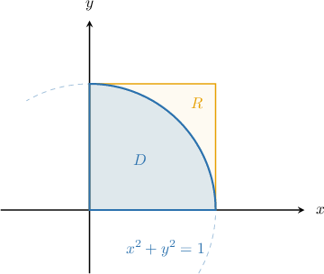
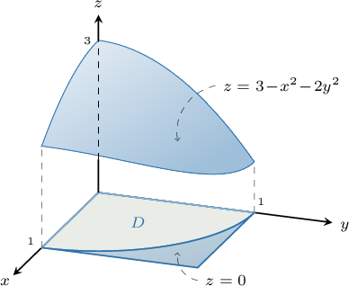
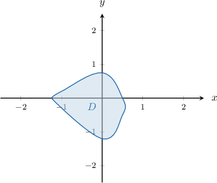
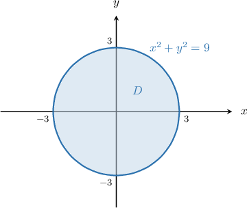
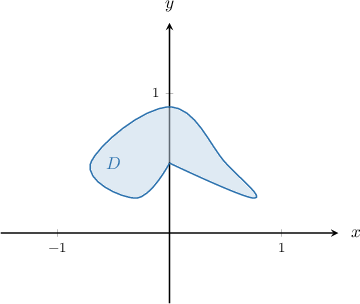
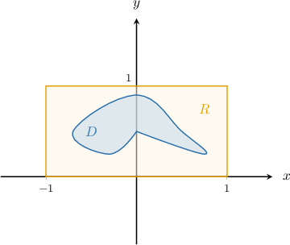

# Double Integrals Over Non-Rectangular Domains

Source: https://www.mathacademy.com/topics/2616?courseId=145
Topic ID: 2616

## Prerequisites

- [Double Integrals Over Rectangular Domains](./1992-double-integrals-over-rectangular-domains.md)

## Lesson

### Introduction

We know how to define the double integral of a function over a rectangular domain. Now, we'll learn how to define a double integral over a non-rectangular region.

Let's consider the non-rectangular region $D$ enclosed by the circle $x^2+y^2=1$ in the first quadrant, as shown below.

We will define the following double integral over this non-rectangular region:

$$

\iint\limits_{D} (3-x^2-2y^2) \, \textrm{d}A

$$

To do this, we will use the following trick. Let's enclose the region $D$ by a rectangle $R$ with sides parallel to the coordinates axes, as shown below.

Now, we extend our function to $R$ by setting a new function $f(x,y)$ that's equal to $0$ outside $D$ and equals $3-x^2-2y^2$ on $D\mathbin{:}$

$$

\begin{aligned}3−𝑥^{2}−2𝑦^{2}, & (𝑥,𝑦)∈𝑅∩𝐷 \\ 0, & (𝑥,𝑦)∈𝑅∖𝐷\end{aligned}

$$

Although $f(x,y)$ might not be continuous at the boundary of $D,$ the double integral of $f(x,y)$ over the rectangular domain $R$ will exist.

Therefore, we define our double integral of $3-x^2-2y^2$ over $D$ as

$$

\iint\limits_D (3-x^2-2y^2) \, \textrm{d}A = \iint\limits_R f(x,y) \, \textrm{d}A.

$$

Geometrically, the value of the double integral will give us the volume of the solid bounded by the surface $z=3-x^2-2y^2$ over the quarter-circular domain $D.$

**Watch out!** The domain $R$ must not necessarily be the smallest possible rectangle that covers the region $D.$ It can be any rectangular domain that covers $D$ completely.

### Example: Determining a Valid Region to Define a Double Integral Over a Non-Rectangular Domain

#### Question

Consider the region $D$ shown above. If

$$

\begin{aligned}𝑥^{2}−𝑦^{2}, & (𝑥,𝑦)∈𝑅∩𝐷 \\ 0, & (𝑥,𝑦)∈𝑅∖𝐷\end{aligned}

$$

which of the following could be the definition of the rectangular domain $R?$

1. $R=[-2,2] \times [-2,1]$

2. $R=[-2,1] \times [-2,2]$

3. $R=[-1,1] \times [-1,1]$

#### Explanation

Notice that if $R$ covers $D$ completely and we define

$$

\begin{aligned}𝑥^{2}−𝑦^{2}, & (𝑥,𝑦)∈𝑅∩𝐷 \\ 0, & (𝑥,𝑦)∈𝑅∖𝐷,\end{aligned}

$$

then, we obtain

$$

\iint\limits_D (x^2-y^2) \: \text{d}A = \iint\limits_R f(x,y) \: \text{d}A.

$$

With that in mind, let's examine each of the given rectangles.

- Rectangles I and II cover the region $D$ completely.

- Rectangle III does not cover the region $D.$

Therefore, the correct answer is "I and II only."

### Example: Identifying True Statements About Double Integrals Over Non-Rectangular Domains

#### Question

Let $D$ be a finite region enclosed by the curve $x^2+y^2=9.$ If

$$

\begin{aligned}cos⁡(𝑥−𝑦), & (𝑥,𝑦)∈𝑅∩𝐷 \\ 0, & (𝑥,𝑦)∈𝑅∖𝐷,\end{aligned}

$$

which of the following statements are true?

1. $\displaystyle \iint\limits_{\large R} \cos(x-y) \: \text{d}A = \iint\limits_{\large D} f(x,y) \: \text{d}A,\quad$ where $R=[-4,4] \times [-4,4]$

2. $\displaystyle \iint\limits_{\large D} \cos(x-y) \: \text{d}A = \iint\limits_{\large R} f(x,y) \: \text{d}A,\quad$ where $R=[-2,2] \times [-2,2]$

3. $\displaystyle \iint\limits_{\large D} \cos(x-y) \: \text{d}A = \iint\limits_{\large R} f(x,y) \: \text{d}A,\quad$ where $R=[-3,3] \times [-3,3]$

#### Explanation

First, let's draw our region $D\mathbin{:}$

Notice that if $R$ covers $D$ completely and we define

$$

\begin{aligned}cos⁡(𝑥−𝑦), & (𝑥,𝑦)∈𝑅∩𝐷 \\ 0, & (𝑥,𝑦)∈𝑅∖𝐷,\end{aligned}

$$

then, we obtain

$$

\iint\limits_{\large D} \cos(x-y) \: \text{d}A = \iint\limits_{\large R} f(x,y) \: \text{d}A.

$$

With that in mind, let's examine each of the given statements.

- Statement I is false. The integrals have not been stated correctly with respect to the domains $R$ and $D$ (they have been swapped).

- Statement II is false. The rectangle $R$ does not cover the region $D.$

- Statement III is true. The rectangle $R$ covers the region $D$ completely.

Therefore, the correct answer is "III only."

### Example: Determining a Correct Function Used to Define a Double Integral Over a Non-Rectangular Domain

#### Question

Consider the region $D$ shown above. If $R=[-1,1] \times [0,1],$ and

$$

\iint\limits_D |x-y| \: \text{d}A = \iint\limits_R f(x,y) \: \text{d}A,

$$

which of the following could be the definition of $f(x,y)?$

1. $\begin{aligned}|𝑥−𝑦|, & (𝑥,𝑦)∈𝑅∖𝐷 \\ 0, & (𝑥,𝑦)∈𝐷∖𝑅\end{aligned}$

2. $\begin{aligned}0, & (𝑥,𝑦)∈𝑅∖𝐷 \\ |𝑥−𝑦|, & (𝑥,𝑦)∈𝐷\end{aligned}$

3. $\begin{aligned}|𝑥−𝑦|, & (𝑥,𝑦)∈𝑅∩𝐷 \\ 0, & (𝑥,𝑦)∉𝐷\end{aligned}$

#### Explanation

First, let's draw our region $D$ and rectangle $R\mathbin{:}$

Notice that the rectangle $R$ contains the region $D$ completely.

Now, if we define $f(x,y)$ to be equal $|x-y|$ on $D$ and to be equal $0$ outside $D,$ we obtain

$$

\iint\limits_D |x-y| \: \text{d}A = \iint\limits_R f(x,y) \: \text{d}A.

$$

With that in mind, let's examine each of the given functions.

- We cannot use function I. This functions are not identically zero for all points in $R\,\backslash D.$ For example, $(x,y) = (1,0) \in R\,\backslash\, D,$ but the function is nonzero at this point.

- Functions II and III equal $|x-y|$ on $D$ and equal $0$ outside $D.$

Therefore, the correct answer is "II and III only."
