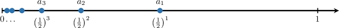
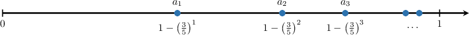
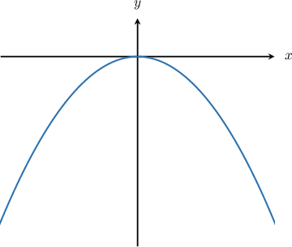
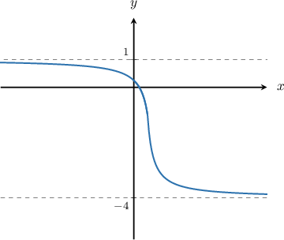

# Supremum and Infimum

Source: https://www.mathacademy.com/topics/3036?courseId=145
Topic ID: 3036

## Prerequisites

- [Limits of Sequences](../ap-calculus-bc/1087-limits-of-sequences.md)
- [Convergence of Geometric Sequences](../ap-calculus-bc/1088-convergence-of-geometric-sequences.md)
- [The Maximum and Minimum of a Set](./4396-the-maximum-and-minimum-of-a-set.md)

## Lesson

### Introduction

In this lesson, we will learn about the **supremum** of a set.

To get started, we first need to understand a related concept: the **upper bounds** of a set.

Given a set $A,$ a number $x$ is called an upper bound for $A$ if every element of $A$ is smaller than or equal to $x.$ Alternatively, $x$ is greater than or equal to every element of $A.$

For example, consider $A = \{1,2,3\}\subseteq \mathbb R.$ In this case, any number $x\geq 3$ is an upper bound of $A,$ since it is greater than or equal to $1, 2,$ and $3.$ So, $[3, \infty)$ is the set of upper bounds of $A.$

We will denote the set of the upper bounds of $A$ as $U_A.$

We can now proceed with the definition of **supremum**.

For a set $A$ that is bounded above, the supremum of $A$ is the minimum of $U_A.$ It is also called the **least upper bound** of $A.$

In our example $A = \{1,2,3\},$ we have

$$

\min(U_A) = \min [3, \infty) = 3.

$$

Thus, $\sup(A) = 3.$

Notice that, when a set has a maximum, the supremum equals the maximum. This holds, in particular, for non-empty finite sets.

This leads to the following result:

For any non-empty finite set, $\max(A) = \sup(A)$

### Infimum

Just as we defined the supremum, we now introduce the **infimum** of a set.

As we did for the supremum, we first need to define the lower bounds of a set.

Given a set $A,$ a number $x$ is called a **lower bound** for $A$ if every element of $A$ is greater than or equal to $x,$ or, alternatively, if $x$ is less than or equal to every element of $A.$

For example, for $A=\{1,2,3\}\subseteq \mathbb R,$ any number $x \leq 1$ is less than $1,$ $2,$ and $3.$ Therefore, $(-\infty, 1]$ is the set of lower bounds of $A.$

We will denote the set of the lower bounds of $A$ as $L_A.$

The infimum of a set $A$ is the maximum of $L_A,$ or the greatest lower bound of $A.$

For our set $A = \{1,2,3\},$ we have

$$

\max(L_A) = \max (-\infty, 1] = 1.

$$

Thus, $\inf(A) = 1.$

Again, we notice that the minimum of a set (provided that it exists) equals the infimum. As finite sets always have a minimum, this holds in particular for finite sets:

For any finite set, $\min(A) = \inf(A)$

### Example: Supremum and Infimum of a Finite Set

#### Question

Consider the set $A,$ defined as

$$

A = \left \{ \dfrac{(-1)^n}{n + 1} : n \in \{0, 1, 2, 3, 4\} \right \}.

$$

What is the infimum of $A?$

#### Explanation

The infimum of a set $A$ is the greatest lower bound of $A.$

If $A$ is a finite set, the infimum of $A$ equals its minimum.

First, let's write down all the terms of our set by substituting $n= 0, 1,2,3,4$ into the expression for the elements of $A{:}$

$$

\begin{aligned}\frac{(−1)^{(0)}}{(0)+1} & =1 \\ \frac{(−1)^{(1)}}{(1)+1} & =−\frac{1}{2} \\ \frac{(−1)^{(2)}}{(2)+1} & =\frac{1}{3} \\ \frac{(−1)^{(3)}}{(3)+1} & =−\frac{1}{4} \\ \frac{(−1)^{(4)}}{(4)+1} & =\frac{1}{5}\end{aligned}

$$

So, we have

$$

A = \left\{1, -\dfrac{1}{2}, \dfrac{1}{3},-\dfrac{1}{4},\dfrac{1}{5}\right\}.

$$

Therefore,

$$

\begin{aligned}inf(𝐴) & =min{1,−\frac{1}{2},\frac{1}{3},−\frac{1}{4},\frac{1}{5}}=−\frac{1}{2}.\end{aligned}

$$

### Supremum and Infimum of a Closed Interval

Let's explore the supremum and infimum of intervals, starting with a closed interval.

**Example A:** $A = [0, 1].$

**Observation (Min/Max):** Recall that if a set has a minimum and maximum, they correspond to the infimum and supremum. Since $0$ and $1$ are bounds contained in $A,$ we have $\min(A)=0$ and $\max(A)=1.$ Thus, we expect:

$$

\inf (A) = 0, \qquad \sup (A) = 1.

$$

**Derivation using Sets of Bounds:** To deepen our understanding, we verify this by finding the sets of lower and upper bounds ($L_A$ and $U_A$).

1. **Infimum:** We identify $L_A$ and find its maximum. Any number $x \leq 0$ is a lower bound for $A.$ Any number $x > 0$ is *not* a lower bound. Since $0 \in A$ and $0 < x,$ the number $x$ fails to be a lower bound. Therefore, $L_A = (-\infty, 0]$ and $\inf (A) = \max (-\infty, 0] = \boxed{0}.$

2. **Supremum:** We identify $U_A$ and find its minimum. Any number $x \geq 1$ is an upper bound for $A.$ Any number $x < 1$ is *not* an upper bound. Since $1 \in A$ and $1 > x,$ the number $x$ fails to be an upper bound. Therefore, $U_A = [1, \infty)$ and $\sup (A) = \min [1, \infty) = \boxed{1}.$

### Supremum and Infimum of an Open Interval

We now consider intervals where the endpoints are not necessarily included.

**Example B:** $B = (0, 1).$ The endpoints $0$ and $1$ are not in $B,$ so the set has **neither a maximum nor a minimum.**

However, the logical boundaries of the set remain the same.

- The set of lower bounds is $L_B = (-\infty, 0].$

- The set of upper bounds is $U_B = [1, \infty).$

### Supremum and Infimum of a Half-Open Interval

We continue by considering a half-open interval.

**Example C:** $C = [0, 1).$ Here, the inclusion is mixed.

- **Lower Bound:** $L_C = (-\infty, 0].$ Since $0 \in C,$ it is also the **minimum.**

- **Upper Bound:** $U_C = [1, \infty).$ Since $1 \notin C,$ the set has **no maximum.**

### Unbounded Sets

So far, we have dealt with bounded sets: sets that have both upper and lower bounds. Now, we consider unbounded sets.

If a set $A$ is unbounded above, then it has no upper bounds. In this case, we write

$$

\sup(A) = +\infty.

$$

Similarly, if a set $A$ is unbounded below, then it has no lower bounds. In this case, we write

$$

\inf(A) = -\infty.

$$

For example, consider the set $A = (1, \infty).$ This set is unbounded above, so $\sup(A) = +\infty.$ However, $A$ is bounded below, and $\inf(A) = 1.$

### Example: Supremum and Infimum of an Interval

#### Question

Consider the set $E = [3,8).$ Determine $\sup(E).$

#### Explanation

The supremum of a set $E$ is the smallest upper bound of $E.$

To find the supremum of this set, we must find the set containing **** upper bounds of $E$ (i.e., the set of upper bounds) and take the minimum of this set.

In our case, we have the following:

- Any number in the set $x \geq 8$ is greater than or equal to the elements of $E.$ Thus, the set $[8, \infty)$ contains only upper bounds of $E.$

- Any number in the set $x < 8$ is **** an upper bound of $E.$ In other words, we can always find an element of $E$ that is greater than $x$ for any $x < 8.$

Therefore, $[8, \infty)$ is the set of upper bounds of $E,$ and

$$

\sup(E) = \min [8, \infty) = 8.

$$

### Sequences

Consider the following set.

$$

A = \left\{ \left(\dfrac 12\right)^n \: : \: n\in \mathbb N \right\}

$$

The elements of $A$ are the terms of the sequence $a_n,$ given by

$$

a_n =\left(\dfrac 12\right)^n, \qquad n \in \mathbb N = \{1,2,3,4,\ldots\}.

$$

Let's draw some points of our sequence on the real line:

Notice that $a_n$ is a decreasing sequence. Therefore, the first term $a_1$ is the maximum of the set. Since $A$ has a maximum, the supremum equals the maximum:

$$

\sup(A) = \max(A) = a_1 = \dfrac 12

$$

Now, our set doesn't have a minimum: the points of the sequence get closer and closer to $0$ without reaching it. Let's find the infimum by determining the set of the lower bounds.

Notice that:

- any number $x \leq 0$ is a lower bound of $A,$

- any number $x > 0$ is **not** a lower bound of $A.$ In other words, we can always find a sufficiently large $n$ so that $\left(\dfrac 12\right)^n$ is smaller than $x$ for any $x > 0.$

Therefore, $(-\infty, 0]$ is the set of lower bounds of $A,$ and

$$

\inf(A) = \max \big({-\infty}, 0\big] = 0.

$$

### Example: Supremum and Infimum of a Sequence

#### Question

Consider the following set:

$$

A = \left\{ 1 - \left(\dfrac 35\right)^n \: : \: n\in \mathbb N \right\}

$$

Determine $\sup(A).$ Also determine whether or not $\sup(A)$ is in the set $A.$

#### Explanation

The supremum of a set $A$ is the smallest upper bound of $A.$

To find the supremum of this set, we must find the set containing **** upper bounds of $A$ (i.e., the set of upper bounds) and take the minimum of this set.

The elements of $A$ are all the terms of the sequence $a_n,$ given by

$$

a_n = 1 - \left(\dfrac 35\right)^n, \qquad n \in \mathbb N = \{1,2,3,4,\ldots\}.

$$

Let's draw some points of our sequence on the real line:

We see that $a_n$ is increasing and converges to $1.$

So, in our case, we have that

- any number in the set $x \geq 1$ is an upper bound of $A,$

- any number in the set $x < 1$ is **** an upper bound of $A.$ In other words, we can always find a sufficiently large $n$ so that $1 - \left(\dfrac 35\right)^n$ is greater than $x$ for any $x < 1.$

Therefore, $[1, \infty)$ is the set of upper bounds of $A,$ and

$$

\sup(A) = \min \left[1, \infty\right) = 1.

$$

Notice that $1$ is ** the maximum of $A$ (the set $A$ has no maximum). Therefore, we conclude that

$$

\sup(A) = 1 \notin A.

$$

### Functions

The concepts of supremum and infimum can be extended to functions.

Given a function $y=f(x),$ the **supremum** and the **infimum** of $f$ are, respectively, the supremum and the infimum of the range of $f.$

The **supremum** and **infimum** of a function will be denoted as

$$

\inf_{x\in D} f(x), \qquad \text{and} \sup_{x\in D} f(x),

$$

where $D$ is the domain of the function.

For example, consider the following parabola:

The range of $f$ is $A = (-\infty, 0].$

Let's find the infimum and the supremum of $A.$

To find the infimum, we must find the set containing **all** lower bounds of $A$ (i.e., the set of lower bounds) and take the maximum of this set.

In our case, $A$ has no lower bounds. For any real number $y,$ we can find an element $x$ such that $f(x) < y.$

Therefore, $\inf_{x\in \mathbb R} f(x) = -\infty.$

Next, to find the supremum, we must find the set containing **all** upper bounds of $A$ (i.e., the set of upper bounds) and take the minimum of this set.

So, in our case, we have that

- any number $y \geq 0$ is an upper bound of $A,$

- any number $y < 0$ cannot be an upper bound of $A$ because $0,$ an element of $A,$ is greater than $y.$

Therefore, $[0,\infty)$ is the set of upper bounds of $A,$ and

$$

\boxed{\sup_{x\in \mathbb R} f(x) = \sup(A) =\min[0,\infty)= 0.}

$$

### Example: Supremum and Infimum of a Function

#### Question

What is the infimum of the function $y=f(x)$ shown above?

#### Explanation

The infimum of a function is the infimum of the range of the function.

In this case, the range of $f$ is $A = (-4, 1).$

To find the infimum of a set $A,$ we must find the set containing **** lower bounds of $A$ (i.e., the set of lower bounds) and take the maximum of this set.

So, in our case, we have that

- any number $y \leq -4$ is a lower bound of $A,$

- any number $y > -4$ is **** a lower bound of $A.$ In other words, we can always find an element of $A$ that is smaller than $y$ for any $y > -4.$

Therefore, $(-\infty, -4]$ is the set of lower bounds of $A,$ and

$$

\inf_{x\in \mathbb R} f(x) = \inf(A) =\max (-\infty, -4] = -4.

$$

### An Important Lemma

**Theorem.** Suppose $A\subseteq \mathbb R$ is a non-empty set and $s$ is an upper bound of $A.$ Then $s = \sup A$ if and only if for all $\varepsilon > 0$ there exists $a\in A$ such that

$$

s - \varepsilon < a.

$$

- **First, we prove that if $s = \sup A$ then for all $\varepsilon > 0$ there exists $a\in A$ such that $s - \varepsilon < a.$** By contradiction, suppose that there exists some $\varepsilon > 0$ such that there does not exist any $a\in A$ with $s - \varepsilon < a.$ Then, every element of $A$ is less than or equal to $s - \varepsilon.$ This implies that $s - \varepsilon$ is an upper bound of $A.$ Since $s$ is the least upper bound, we must have $s \le s - \varepsilon.$ However, since $\varepsilon > 0,$ we know that $s - \varepsilon < s.$ This is a contradiction.

- **Next, we prove that if for all $\varepsilon > 0$ there exists $a\in A$ such that $s - \varepsilon < a,$ then $s = \sup A.$** Again, by contradiction, assume $s \neq \sup A.$ Since $s$ is an upper bound of $A,$ the least upper bound must be strictly smaller than $s.$ Let $s_1 = \sup A,$ so $s_1 < s.$ Let $\varepsilon_1 = s - s_1.$ Since $s_1 < s,$ we have $\varepsilon_1 > 0.$ We can apply the property stated in the hypothesis to our $\varepsilon_1.$ So, there exists $a_1 \in A$ such that Substituting $\varepsilon_1 = s - s_1,$ we get $s - (s - s_1) < a_1,$ which simplifies to Since $s_1$ is an upper bound of $A,$ we must have $a_1 \le s_1.$ This contradicts $s_1 < a_1.$ Thus, $s = \sup A.$

### The Completeness Axiom

In this lesson, we defined the infimum of a set as the maximum of the set of lower bounds, and the supremum as the minimum of the set of upper bounds.

If a set of real numbers is bounded and not empty, then the infimum exists and is a real number, and the supremum exists and is a real number.

This follows from the so-called **axiom of completeness**, a fundamental property of the real numbers that ensures that the real number line has no "gaps."

There are number sets, such as the set of rational numbers, that don't have this property. Consider for example the following subset of $\mathbb Q{:}$

$$

A = \{ q \in \mathbb Q \, : \, 1 < q^2 < 2 \}

$$

Notice that the rational numbers greater than $\sqrt 2$ are the upper bounds of $A.$ However, this set has no minimum *in $\mathbb{Q}$*, so $\sup(A)$ doesn't exist.
