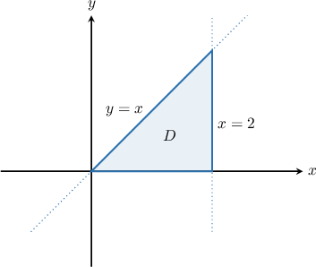

# The Rule of the Lazy Statistician for Two Random Variables

Source: https://www.mathacademy.com/topics/3061?courseId=145
Topic ID: 3061

## Prerequisites

- [The Rule of the Lazy Statistician](./1335-the-rule-of-the-lazy-statistician.md)
- [Joint Distributions for Continuous Random Variables](./3052-joint-distributions-for-continuous-random-variables.md)

## Lesson

### Introduction

Recall that if $X$ is a discrete random variable with support $S_X,$ and $Y = r(X)$ for some function $r,$ then we can compute the expected value of $Y$ using the rule of the lazy statistician, which states that

$$

\textrm{E}[Y] = \sum_{x \in S_X}r(x) \, f_X(x).

$$

Now suppose that $W = r(X,Y)$ is a function of two discrete random variables $X$ and $Y$ with supports $S_X$ and $S_Y,$ respectively. Analogously to the case above, the **rule of the lazy statistician for two random variables** states that

$$

\textrm{E}[W] =\textrm{E}\big[r(X,Y)\big]=\sum_{(x,y)\in S}r(x,y) \, f(x,y),

$$

where $f(x,y)$ is the joint probability mass function of $X$ and $Y.$

The rule of the lazy statistician for two random variables is a helpful rule for two reasons:

- Firstly, it allows us to compute $\textrm{E}[W]$ without needing to find the PMF of $W.$ This turns out to be very useful indeed.

- Secondly, we can use this rule to prove many useful properties of random variables. For example, it can be used to prove that We'll prove some useful results using our rule at the end of this lesson.

### Example: Applying the Rule to Discrete Random Variables

#### Question

The joint probability mass function $f(x,y)$ for the discrete random variables $X$ and $Y$ is given in the table below. Find $\textrm{E}\big[X+2Y \big].$

#### Explanation

Suppose $X$ and $Y$ are discrete random variables with supports $S_X$ and $S_Y,$ respectively, and $f(x,y)$ is their joint probability mass function with support $S = S_X\times S_Y.$ If $r:\mathbb{R}^2 \to \mathbb{R}$ is a function of two variables, then the rule of the lazy statistician states that

$$

\textrm{E}\big[r(X,Y)\big]=\sum_{(x,y)\in S}r(x,y) \, f(x,y).

$$

In our case, we have

$$

r(x,y)=x+2y.

$$

Therefore, we obtain

$$

\begin{aligned}E[𝑋+2𝑌] & =\underset{(𝑥,𝑦)∈𝑆}{∑}𝑟(𝑥,𝑦)\,𝑓(𝑥,𝑦) \\ & =(2+2⋅1)⋅𝑓(2,1)+(2+2⋅3)⋅𝑓(2,3)+(3+2⋅1)⋅𝑓(3,1)+(3+2⋅3)⋅𝑓(3,3) \\ & =4⋅𝑓(2,1)+8⋅𝑓(2,3)+5⋅𝑓(3,1)+9⋅𝑓(3,3) \\ & =4⋅0.1+8⋅0.6+5⋅0+9⋅0.3 \\ & =0.4+4.8+0+2.7 \\ & =7.9.\end{aligned}

$$

### The Rule of the Lazy Statistician for Two Continuous Random Variables

Suppose $X$ and $Y$ are continuous random variables, and $f(x,y)$ is their joint probability density function. If $r:\mathbb{R}^2 \to \mathbb{R}$ is a function of two variables, then the rule of the lazy statistician for two random variables states that

$$

\textrm{E}\big[r(X,Y)] = \iint_{\mathbb{R}^2} r(x,y) \, f(x,y) \: \textrm{d}x \textrm{d}y.

$$

The rule of the lazy statistician for two random variables is especially useful for continuous random variables since computing the PDF of $W = r(X, Y)$ can be challenging.

### Example: Applying the Rule to Continuous Random Variables

#### Question

Find $\textrm{E}\big[2X+Y\big],$ given that random variables $X$ and $Y$ have the joint probability density function

$$

\begin{aligned}𝑥,\, & 0≤𝑥≤1,\,0≤𝑦≤2, \\ 0, & otherwise.\end{aligned}

$$

#### Explanation

Suppose $X$ and $Y$ are continuous random variables, and $f(x,y)$ is their joint probability density function. If $r:\mathbb{R}^2 \to \mathbb{R}$ is a function of two variables, then the rule of the lazy statistician states that

$$

\textrm{E}\big[r(X,Y)] = \iint_{\mathbb{R}^2} r(x,y) \, f(x,y) \: \textrm{d}x \textrm{d}y.

$$

In our case, we have

$$

r(x,y) = 2x+y.

$$

Notice that $f(x,y)$ is nonzero only in the rectangular region $D = \left\{(x,y) \:: \: 0 \leq x \leq 1,\: 0 \leq y \leq 2 \right\}.$

Therefore, we obtain

$$

\begin{aligned}E[2𝑋+𝑌] & =∬_{ℝ^{2}}(2𝑥+𝑦)\,𝑓(𝑥,𝑦)\,d𝑥d𝑦 \\ & =∬_{𝐷}(2𝑥+𝑦)\,𝑓(𝑥,𝑦)\,d𝑥d𝑦 \\ & =∫_{20}^{}∫_{10}^{}(2𝑥+𝑦)⋅𝑥\,d𝑥\,d𝑦 \\ & =∫_{20}^{}[∫_{10}^{}(2𝑥^{2}+𝑥𝑦)\,d𝑥\,]d𝑦 \\ & =∫_{20}^{}[\frac{2𝑥^{3}}{3}+\frac{𝑥^{2}𝑦}{2}]_{𝑥=1𝑥=0}^{}\,d𝑦 \\ & =∫_{20}^{}(\frac{2}{3}+\frac{𝑦}{2})\,d𝑦 \\ & =[\frac{2}{3}𝑦+\frac{𝑦^{2}}{4}]_{20}^{} \\ & =\frac{7}{3}.\end{aligned}

$$

### Example: Applying the Rule to Continuous Random Variables: Non-Rectangular Domains

#### Question

Find $\textrm{E}\left[e^{X+Y} \right],$ given that random variables $X$ and $Y$ have the joint probability density function

$$

\begin{aligned}\frac{1}{2},\, & 0≤𝑥≤2,\,0≤𝑦≤𝑥, \\ 0, & otherwise.\end{aligned}

$$

#### Explanation

Suppose $X$ and $Y$ are continuous random variables, and $f(x,y)$ is their joint probability density function. If $r:\mathbb{R}^2 \to \mathbb{R}$ is a function of two variables, then the rule of the lazy statistician states that

$$

\textrm{E}\big[r(X,Y)] = \iint_{\mathbb{R}^2} r(x,y) \, f(x,y) \: \textrm{d}x \textrm{d}y.

$$

In our case, we have

$$

r(x,y) = e^{x+y}.

$$

Now, let's sketch the region $D = \left\{(x,y) \:: \: 0 \leq x \leq 2,\: 0\leq y \leq x \right\},$ where $f(x,y)$ is nonzero.

Therefore, we obtain

$$

\begin{aligned}E[𝑒^{𝑋+𝑌}] & =∬_{ℝ^{2}}𝑒^{𝑥+𝑦}\,𝑓(𝑥,𝑦)\,d𝑥d𝑦 \\ & =∬_{𝐷}𝑒^{𝑥+𝑦}\,𝑓(𝑥,𝑦)\,d𝑥d𝑦 \\ & =∫_{20}^{}∫_{𝑥0}^{}𝑒^{𝑥+𝑦}⋅\frac{1}{2}\,d𝑦\,d𝑥 \\ & =\frac{1}{2}∫_{20}^{}∫_{𝑥0}^{}𝑒^{𝑥+𝑦}\,d𝑦\,d𝑥 \\ & =\frac{1}{2}∫_{20}^{}[𝑒^{𝑥+𝑦}]_{𝑦=𝑥𝑦=0}^{}\,d𝑥 \\ & =\frac{1}{2}∫_{20}^{}(𝑒^{2𝑥}−𝑒^{𝑥})\,d𝑥 \\ & =\frac{1}{2}[\frac{1}{2}𝑒^{2𝑥}−𝑒^{𝑥}]_{𝑥=2𝑥=0}^{} \\ & =\frac{1}{2}[(\frac{1}{2}𝑒^{4}−𝑒^{2})−(\frac{1}{2}−1)] \\ & =\frac{1}{2}[(\frac{1}{2}𝑒^{4}−𝑒^{2}+\frac{1}{2})] \\ & =\frac{1}{2}[(\frac{1}{2}𝑒^{4}−\frac{2}{2}𝑒^{2}+\frac{1}{2})] \\ & =\frac{1}{4}(𝑒^{4}−2𝑒^{2}+1) \\ & =\frac{1}{4}(𝑒^{2}−1)^{2}.\end{aligned}

$$

### Proof of the Linearity of Expectation

Let's prove that for continuous random variables $X$ and $Y,$ we have

$$

\textrm{E}[X+Y] = \textrm{E}[X] + \textrm{E}[Y].

$$

Let $r(x, y) = x+y.$ By the rule of the lazy statistician, we have

$$

\begin{aligned}E[𝑋+𝑌] & =E[𝑟(𝑋,𝑌)] \\ & =\underset{ℝ^{}}{∬}(𝑥+𝑦)𝑓(𝑥,𝑦)\,d𝑥d𝑦 \\ & =\underset{ℝ^{}}{∬}𝑥𝑓(𝑥,𝑦)\,d𝑥d𝑦+\underset{ℝ^{}}{∬}𝑦𝑓(𝑥,𝑦)\,d𝑥d𝑦 \\ & =∫_{∞−∞}^{}∫_{∞−∞}^{}𝑥𝑓(𝑥,𝑦)\,d𝑥\,d𝑦+∫_{∞−∞}^{}∫_{∞−∞}^{}𝑦𝑓(𝑥,𝑦)\,d𝑥\,d𝑦.\end{aligned}

$$

Now, since the integration domain is rectangular, we can swap the order of integration in the first integral. Therefore,

$$

\begin{aligned}E[𝑋+𝑌] & =∫_{∞−∞}^{}∫_{∞−∞}^{}𝑥𝑓(𝑥,𝑦)\,d𝑦\,d𝑥+∫_{∞−∞}^{}∫_{∞−∞}^{}𝑦𝑓(𝑥,𝑦)\,d𝑥\,d𝑦 \\ & =∫_{∞−∞}^{}𝑥∫_{∞−∞}^{}𝑓(𝑥,𝑦)\,d𝑦\,d𝑥+∫_{∞−∞}^{}𝑦∫_{∞−∞}^{}𝑓(𝑥,𝑦)\,d𝑥\,d𝑦 \\ & =∫_{∞−∞}^{}𝑥𝑓_{𝑋}(𝑥)\,d𝑥+∫_{∞−∞}^{}𝑦𝑓_{𝑌}(𝑦)\,d𝑦 \\ & =E[𝑋]+E[𝑌]\end{aligned}

$$

as required. Note that we made use of the fact that

$$

f_X(x) = \int_{-\infty}^\infty f(x,y)\,\textrm d y, \qquad f_Y(y) = \int_{-\infty}^\infty f(x,y)\,\textrm d x.

$$

The proof for discrete random variables is similar.

### Proof of the Product Rule for Independent Random Variables

Let's prove that for continuous *independent* random variables $X$ and $Y,$ we have

$$

\textrm{E}[XY] = \textrm{E}[X] \cdot \textrm{E}[Y].

$$

Let $r(x, y) = xy.$ By the rule of the lazy statistician, we have

$$

\begin{aligned}E[𝑋𝑌] & =E[𝑟(𝑋,𝑌)] \\ & =\underset{ℝ^{}}{∬}𝑥𝑦𝑓(𝑥,𝑦)\,d𝑥d𝑦.\end{aligned}

$$

Now, since $X$ and $Y$ are independent by assumption, we have $f(x,y) = f_X(x)\cdot f_Y(y).$ Therefore,

$$

\begin{aligned}E[𝑋𝑌] & =\underset{ℝ^{}}{∬}𝑥𝑦𝑓(𝑥,𝑦)\,d𝑥d𝑦 \\ & =\underset{ℝ^{}}{∬}𝑥𝑦𝑓_{𝑋}(𝑥)𝑓_{𝑌}(𝑦)\,d𝑥d𝑦 \\ & =∫_{∞−∞}^{}∫_{∞−∞}^{}𝑥𝑦𝑓_{𝑋}(𝑥)𝑓_{𝑌}(𝑦)\,d𝑥\,d𝑦 \\ & =∫_{∞−∞}^{}𝑥𝑓_{𝑋}(𝑥)\,d𝑥⋅∫_{∞−∞}^{}𝑦𝑓_{𝑌}(𝑦)\,d𝑦 \\ & =E[𝑋]⋅E[𝑌]\end{aligned}

$$

as required.

The proof for discrete random variables is similar.
