# Introduction to Principal Component Analysis

Source: https://www.mathacademy.com/topics/3775?courseId=145
Topic ID: 3775

## Prerequisites

- [The Z-Score](../integrated-math-iii-honors/711-the-z-score.md)
- [The Sample Covariance Matrix](./3138-the-sample-covariance-matrix.md)
- [Diagonalization of 2x2 Symmetric Matrices](./3335-diagonalization-of-2x2-symmetric-matrices.md)

## Lesson

### Introduction

Suppose we are analyzing house prices in a specific neighborhood, gathering data on quantitative features such as the total floor space, number of bedrooms and bathrooms, and distance to the town center. Our goal is to understand the relationship between these features and property values.

Problems involving multi-dimensional data analysis, such as this one, pose several challenges:

- Multi-dimensional data is often difficult to analyze.

- Visualization can be virtually impossible.

- Storing multi-dimensional data on a computer can require substantial hardware resources.

We can overcome these challenges using **dimensionality reduction.** Dimensionality reduction works by compressing data into a smaller number of variables while (ideally) preserving as much information as possible.

To demonstrate the basic idea behind dimensionality reduction, consider the following data set for the variables $x$ and $y{:}$

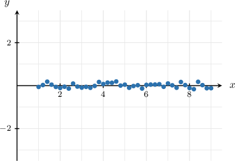

Notice that the data does not vary much in the $y$-direction. Therefore, we can transform the data set by projecting all points onto the $x$-axis. This process removes the variation in $y$ with almost no loss of overall information, as shown below:

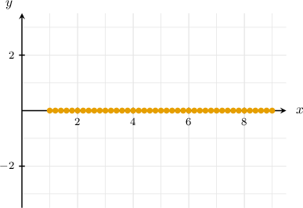

Multi-dimensional data typically exhibit characteristics suitable for dimensionality reduction:

- Many variables are often correlated. In our house prices example, the number of bedrooms and bathrooms likely correlate. This means that one variable can often be expressed in terms of another. Or, we can find a new variable that describes the variation in both original variables.

- Ultimately, we can aim to reduce the higher-dimensional structure of the data to a more fundamental, lower-dimensional structure containing only uncorrelated variables.

By reducing the dimensionality of the data, we can work with a compact representation that retains only the most critical variables and discards the rest. This simplifies analysis and visualization.

### PCA: Data Setup

In the previous section, we saw that dimensionality reduction compresses data into fewer, uncorrelated variables. **Principal Component Analysis (PCA)** is a widely used technique for achieving this.

Suppose we have a sample of $n$ observations, each with $m$ features. We organize this data into an $n \times m$ **observation matrix** $X,$ where each row is an observation and each column is a feature.

For example, if we had $n=3$ observations of $m=2$ features, our observation matrix might look like this:

$$

\begin{aligned}1 & 10 \\ 2 & 20 \\ 3 & 30\end{aligned}

$$

Before applying PCA, we must standardize the data. This is because PCA is sensitive to the scale of features. For instance, measuring a feature in meters versus centimeters would lead to different results. We standardize by giving each column a mean of $0$ and a standard deviation of $1.$

For our example, the first column has mean $2$ and standard deviation $1,$ while the second column has mean $20$ and standard deviation $10.$ Our standardized observation matrix $X$ is:

$$

\begin{aligned}(1−2)/1 & (10−20)/10 \\ (2−2)/1 & (20−20)/10 \\ (3−2)/1 & (30−20)/10\end{aligned}

$$

Next, we'll use this standardized data to analyze the relationships between the features.

### PCA: Constructing the Covariance Matrix

Now that our data matrix $X$ is standardized, we examine the relationships between its features using the **sample covariance matrix**, $C.$ For standardized data, this is calculated as:

$$

C=\dfrac{1}{n-1} X^T X

$$

Using our standardized matrix from the previous slide, where $n=3$:

$$

\begin{aligned}𝐶 & =\frac{1}{3−1}[\begin{aligned}−1 & 0 & 1 \\ −1 & 0 & 1\end{aligned}]\begin{aligned}−1 & −1 \\ 0 & 0 \\ 1 & 1\end{aligned} \\ & =\frac{1}{2}[\begin{aligned}2 & 2 \\ 2 & 2\end{aligned}] \\ & =[\begin{aligned}1 & 1 \\ 1 & 1\end{aligned}]\end{aligned}

$$

The diagonal entries of $C$ are the variances of the features, and the off-diagonal entries are the covariances between pairs of features.

### PCA: Diagonalization

Let's look again at the covariance matrix we just calculated:

$$

[\begin{aligned}1 & 1 \\ 1 & 1\end{aligned}]

$$

Notice that the matrix $C$ is symmetric. In fact, the sample covariance matrix is *always* a real symmetric matrix.

Recall from linear algebra that any real symmetric matrix is **orthogonally diagonalizable**. This means we can find an orthogonal matrix $V$ and a diagonal matrix $D$ such that

$$

V^T C V = D

$$

The entries of the diagonal matrix $D$ are the eigenvalues of $C,$ and the columns of the matrix $V$ are the corresponding orthonormal eigenvectors.

Next, we shall see how to use the matrix $V$ to find uncorrelated features for our data.

### The Principal Components

Recall that our goal is to find new features that are uncorrelated — equivalently, features whose covariance matrix is diagonal. In the previous section, we found an orthogonal matrix $V$ such that $V^T\!CV$ is diagonal. This motivates defining a **transformed observation matrix** $Y = XV.$ The columns of this new matrix $Y$ are our new features.

Substituting $C = \dfrac{1}{n-1} X^T X$ into the expression $V^T\!CV$ and noting that $(XV)^T = V^T X^T{:}$

$$

\begin{aligned}\underset{diagonal}{\underset{}{𝑉^{𝑇}\,𝐶𝑉}} & =𝑉^{𝑇}(\frac{1}{𝑛−1}𝑋^{𝑇}𝑋)𝑉 \\ & =\frac{1}{𝑛−1}(𝑋𝑉)^{𝑇}(𝑋𝑉) \\ & =\underset{covariance of Y}{\underset{}{\frac{1}{𝑛−1}𝑌^{𝑇}𝑌}}\end{aligned}

$$

The covariance matrix of $Y$ is diagonal, so the new features $y_1, y_2, \ldots, y_m$ are uncorrelated. The diagonal entries are the eigenvalues of $C,$ so $\text{Var}(y_i) = \lambda_i.$ By arranging the columns of $V$ in order of decreasing eigenvalue, the new features are also arranged in order of decreasing variance.

The columns of $V$ (the unit eigenvectors of $C$) are called the **principal components**. The $1$st *principal component* is the eigenvector corresponding to the largest eigenvalue, the $2$nd corresponds to the second-largest, and so on.

This procedure is the core of **Principal Component Analysis (PCA)**. To summarize:

*We define the change-of-variables $Y = XV,$ where the columns of $V$ are the **** of the data, arranged in order of decreasing eigenvalue. This ensures that:*

- *The new features $y_1,y_2,\ldots,y_m$ are uncorrelated (diagonal covariance).*

- *The new features are arranged in order of decreasing variance ($\text{Var}(y_i) = \lambda_i$).*

Now let's understand what these vectors mean in terms of the original data.

### Interpretation of Principal Components

The statistical interpretation of the principal components is as follows:

- The $1$st principal component defines a direction along which the original data has the maximum variance.

- The $2$nd principal component is perpendicular to the $1$st component and defines a direction along which the remaining data has the maximum variance.

- The $3$rd principal component is perpendicular to both the $1$st and the $2$nd components and defines a direction along which the remaining data has the maximum variance. $\vdots$ and so on.

To illustrate, let's consider the following scatter plot of a sample of two-dimensional (paired) observations.

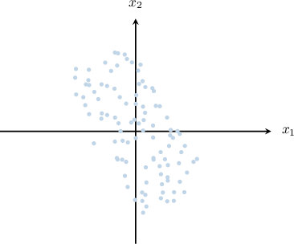

In our diagram, the direction along which the data varies the most corresponds (approximately) to the line shown below.

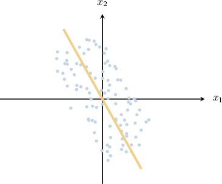

Therefore, the vectors corresponding to the first and second principal components of the data could be the unit vectors shown below.

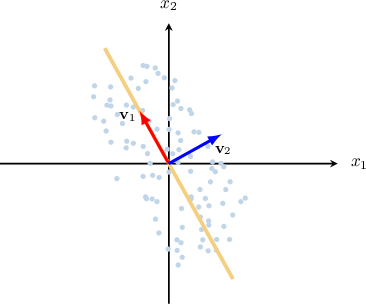

### Example: Identifying the First Principal Component From a Scatter Plot

#### Question

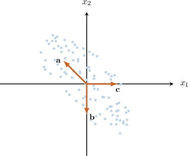

The scatter plot for a sample of paired observations is shown above. What vectors correspond to the direction of the first principal component of the data?

#### Explanation

Recall that the ** of the data corresponds to the direction in which the data varies the most (the direction where we have the maximum variance).

In our diagram, the direction where the variance changes the most corresponds (approximately) to the vector $\mathbf{a},$ as shown below.

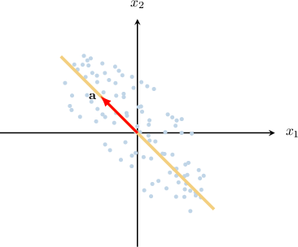

Therefore, the correct answer is "$\mathbf{a}$ only."

### Example: Identifying the Second Principal Component From a Scatter Plot

#### Question

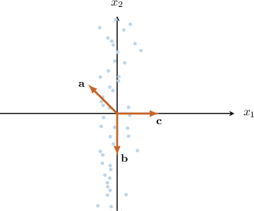

The scatter plot for a sample of paired observations is shown above. What vectors correspond to the direction of the second principal component of the data?

#### Explanation

Recall that the ** of the data corresponds to the direction in which the data varies the most (the direction where we have the maximum variance).

The ** of the data corresponds to the direction perpendicular to the first principal component in which the data varies the most.

In our diagram, the direction where the variance changes the most corresponds (approximately) to the vector $\mathbf{b},$ as shown below. So, $\mathbf{b}$ defines the direction of the first principal component.

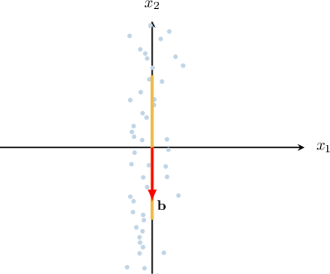

Next, notice that in the 2D case, we have only one direction perpendicular to the first principal component. And this direction corresponds to the vector $\mathbf{c},$ as shown below.

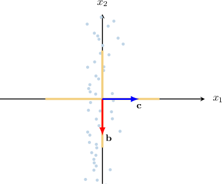

Therefore, the correct answer is "$\mathbf{c}$ only."

### Applications of Principal Component Analysis

Suppose a physician measured two features, $x_1$ and $x_2,$ corresponding to height and weight for each athlete among a group who attended a particular competition. The collected data were stored in a standardized observation matrix, with each row containing both features for each athlete.

A scatter plot of the physician's results is shown below.

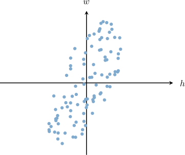

Remember that the first and second principal components, denoted $\mathbf v_1$ and $\mathbf v_2,$ are the unit eigenvectors of the sample covariance matrix for the data set. The physician calculates that the first and second principal components of this data are approximately

$$

[\begin{aligned}0.316 \\ 0.947\end{aligned}]

$$

The first and second principal components are shown below:

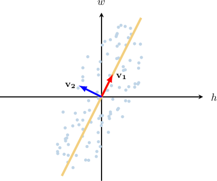

The physician wants to combine the two features linearly into a single feature that preserves the maximum variance. What is the best candidate for the new feature?

The matrix of principal components, denoted $V,$ is given by

$$

\begin{aligned}| & | \\ 𝐯_{1} & 𝐯_{2} \\ | & |\end{aligned}

$$

Applying the change of variables $Y = XV,\,$ we can convert our observation matrix $X$ into a new matrix $Y$ of (linearly) transformed observations such that

- the covariance matrix of $Y$ is diagonal (meaning that the new features $y_1$ and $y_2$ are uncorrelated), and

- the features $y_1$ and $y_2$ are arranged in order of decreasing variance (meaning that most of the variance is concentrated in $y_1$).

Applying the change of variables to a single observation $[\begin{aligned}𝑥_{1} & 𝑥_{2}\end{aligned}]$ we have

$$

\begin{aligned}[\begin{aligned}𝑦_{1} & 𝑦_{2}\end{aligned}] & =[\begin{aligned}𝑥_{1} & 𝑥_{2}\end{aligned}]𝑉 \\ & =[\begin{aligned}𝑥_{1} & 𝑥_{2}\end{aligned}][\begin{aligned}0.316 & −0.947 \\ 0.947 & 0.316\end{aligned}] \\ & =[\begin{aligned}0.316𝑥_{1}+0.947𝑥_{2} & −0.947𝑥_{1}+0.316𝑥_{2}\end{aligned}].\end{aligned}

$$

As a result, $y_1 = 0.316 x_1 + 0.947 x_2$ will contain most of the variance of the data. Therefore, the best candidate for the new single feature is

$$

y_1 = 0.316 x_1 + 0.947 x_2.

$$

### Example: Representing Principal Components as Linear Combinations

#### Question

A geologist has measured two specific features, $x_1$ and $x_2,$ for each rock among a sample of rocks she is studying. The collected data was stored in a standardized observation matrix, where each row contains both features for a particular rock. The first and second principal components of the data are approximately

$$

[\begin{aligned}−0.447 \\ 0.894\end{aligned}]

$$

By combining the two measured features linearly, the geologist wants to construct a single feature that preserves the maximum amount of variance of the collected data. Which of the following could be the best candidate for the new feature?

#### Explanation

Recall the direction in which the data varies the most (the direction where we have the maximum variance) corresponds to the ** of the data.

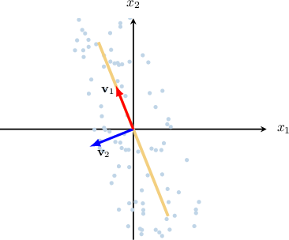

Let

$$

\begin{aligned}| & | \\ 𝐯_{1} & 𝐯_{2} \\ | & |\end{aligned}

$$

be the matrix of principal components. Then, applying the change of variables $Y = XV,$ we can convert our observation matrix $X$ into a new matrix $Y$ of (linearly) transformed observations such that

- the covariance matrix of $Y$ is diagonal (meaning that the new features $y_1$ and $y_2$ are uncorrelated), and

- the features $y_1$ and $y_2$ are arranged in order of decreasing variance (meaning that most of the variance is concentrated in $y_1$).

Applying our change of variables to a single observation $[\begin{aligned}𝑥_{1} & 𝑥_{2}\end{aligned}]$ we get

$$

\begin{aligned}[\begin{aligned}𝑦_{1} & 𝑦_{2}\end{aligned}] & =[\begin{aligned}𝑥_{1} & 𝑥_{2}\end{aligned}]𝑉 \\ & =[\begin{aligned}𝑥_{1} & 𝑥_{2}\end{aligned}][\begin{aligned}−0.447 & −0.894 \\ 0.894 & −0.447\end{aligned}] \\ & =[\begin{aligned}−0.447𝑥_{1}+0.894𝑥_{2} & −0.894𝑥_{1}−0.447𝑥_{2}\end{aligned}].\end{aligned}

$$

As a result, we have that $y_1 = -0.447 x_1 + 0.894 x_2$ will contain most of the variance of the data.

Therefore, the best candidate for the new single feature is

$$

y_1 = -0.447 x_1 + 0.894 x_2.

$$
