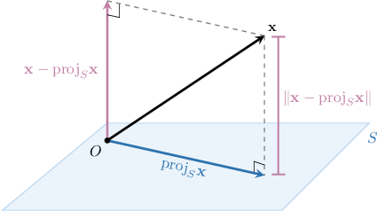
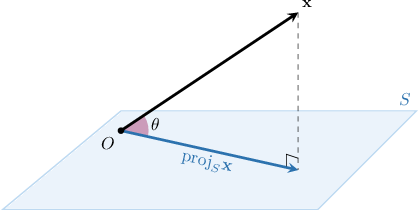

# Projecting Vectors Onto Subspaces in Euclidean Spaces (Arbitrary Bases): Applications

Source: https://www.mathacademy.com/topics/3818?courseId=145
Topic ID: 3818

## Prerequisites

- [Projecting Vectors Onto Subspaces in Euclidean Spaces (Arbitrary Bases)](./2124-projecting-vectors-onto-subspaces-in-euclidean-spaces-arbitrary-bases.md)

## Lesson

### Introduction

One use for finding the orthogonal projection of a vector onto a subspace is to find the shortest distance between the vector and the subspace.

Given a vector $\mathbf{x}$ and a subspace $S = \textrm{Span}\{\mathbf{a}_1, \mathbf{a}_2 \},$ the **distance between $\mathbf{x}$ and $S$** is given by

$$

\Vert \mathbf{x} - \textrm{proj}_{S}\mathbf{x} \Vert

$$

as shown in the diagram below.

Let's find the distance between the vector $\mathbf{x}$ and the subspace spanned by the linearly independent vectors $\{\mathbf{a}_1,\mathbf{a}_2 \},$ where

$$

\begin{aligned}1 \\ 0 \\ −1\end{aligned}

$$

The orthogonal projection of $\mathbf{x}$ onto the subspace spanned by the columns of a matrix $A$ is given by

$$

\textrm{proj}_{S} \: \mathbf{x} = A(A^T\!A)^{-1}\!A^T\,\mathbf{x}.

$$

In this case, we have

$$

\begin{aligned}| & | \\ 𝐚_{1} & 𝐚_{2} \\ | & |\end{aligned}

$$

Therefore, we get the following projection:

$$

\begin{aligned}proj_{𝑆}\,𝐱 & =\begin{aligned}1 & 2 \\ 0 & −1 \\ −1 & −2\end{aligned}⋅[\begin{aligned}1 & 0 & −1 \\ 2 & −1 & −2\end{aligned}]⋅\begin{aligned}1 & 2 \\ 0 & −1 \\ −1 & −2\end{aligned}^{−1}⋅[\begin{aligned}1 & 0 & −1 \\ 2 & −1 & −2\end{aligned}]⋅\begin{aligned}0 \\ 2 \\ 4\end{aligned} \\ & =\begin{aligned}1 & 2 \\ 0 & −1 \\ −1 & −2\end{aligned}⋅[\begin{aligned}2 & 4 \\ 4 & 9\end{aligned}]^{−1}⋅[\begin{aligned}−4 \\ −10\end{aligned}] \\ & =\begin{aligned}1 & 2 \\ 0 & −1 \\ −1 & −2\end{aligned}⋅\frac{1}{2}[\begin{aligned}9 & −4 \\ −4 & 2\end{aligned}]⋅[\begin{aligned}−4 \\ −10\end{aligned}] \\ & =\begin{aligned}1 & 2 \\ 0 & −1 \\ −1 & −2\end{aligned}⋅[\begin{aligned}2 \\ −2\end{aligned}] \\ & =\begin{aligned}−2 \\ 2 \\ 2\end{aligned}=\overset{𝐱}{^}\end{aligned}

$$

Finally, using the distance formula, the distance between $\mathbf{x}$ and the subspace $S$ is given by

$$

\begin{aligned}𝑑(𝐱,\overset{𝐱}{^}) & =‖𝐱−\overset{𝐱}{^}‖ \\ & =\sqrt{√(𝑥_{1}−\overset{𝑥}{^}_{1})^{2}+(𝑥_{2}−\overset{𝑥}{^}_{2})^{2}+(𝑥_{3}−\overset{𝑥}{^}_{3})^{2}} \\ & =\sqrt{√(0−(−2))^{2}+(2−2)^{2}+(4−2)^{2}} \\ & =\sqrt{√4+0+4} \\ & =\sqrt{√8} \\ & =2\sqrt{√2}.\end{aligned}

$$

**Note:** Recall that the vector $\textbf{x}-\textrm{proj}_{S}\,\mathbf{x},$ whose norm $\| \textbf{x}-\textrm{proj}_{S}\,\mathbf{x} \|$ represents the distance from $\mathbf{x}$ to $S,$ is sometimes called the **vector rejection of $\mathbf{x}$ from $S.$**

### Example: Calculating the Distance Between a Vector and a Subspace

#### Question

Find the distance between the vector $\mathbf{x}$ and the subspace spanned by the linearly independent vectors $\{\mathbf{a}_1, \mathbf{a}_2 \},$ where

$$

\begin{aligned}1 \\ 1 \\ 1 \\ 1\end{aligned}

$$

#### Explanation

The orthogonal projection of $\mathbf{x}$ onto the subspace spanned by the columns of a matrix $A$ is given by

$$

\textrm{proj}_{S} \: \mathbf{x} = A(A^T\!A)^{-1}\!A^T\,\mathbf{x}.

$$

In our case, we have

$$

\begin{aligned}| & | \\ 𝐚_{1} & 𝐚_{2} \\ | & |\end{aligned}

$$

Therefore, we get the following projection:

$$

\begin{aligned}proj_{𝑆}\,𝐱 & =\begin{aligned}1 & 1 \\ 1 & 3 \\ 1 & 2 \\ 1 & 2\end{aligned}⋅[\begin{aligned}1 & 1 & 1 & 1 \\ 1 & 3 & 2 & 2\end{aligned}]\,⋅\,\begin{aligned}1 & 1 \\ 1 & 3 \\ 1 & 2 \\ 1 & 2\end{aligned}^{−1}\,\,\,\,⋅\,[\begin{aligned}1 & 1 & 1 & 1 \\ 1 & 3 & 2 & 2\end{aligned}]⋅\begin{aligned}−3 \\ 5 \\ −1 \\ 3\end{aligned} \\ & =\begin{aligned}1 & 1 \\ 1 & 3 \\ 1 & 2 \\ 1 & 2\end{aligned}⋅[\begin{aligned}4 & 8 \\ 8 & 18\end{aligned}]^{−1}⋅[\begin{aligned}4 \\ 16\end{aligned}] \\ & =\begin{aligned}1 & 1 \\ 1 & 3 \\ 1 & 2 \\ 1 & 2\end{aligned}⋅\frac{1}{4}[\begin{aligned}9 & −4 \\ −4 & 2\end{aligned}]⋅[\begin{aligned}4 \\ 16\end{aligned}] \\ & =\begin{aligned}1 & 1 \\ 1 & 3 \\ 1 & 2 \\ 1 & 2\end{aligned}⋅[\begin{aligned}−7 \\ 4\end{aligned}] \\ & =\begin{aligned}−3 \\ 5 \\ 1 \\ 1\end{aligned}=\overset{𝐱}{^}\end{aligned}

$$

Finally, the distance between $\mathbf{x}$ and the subspace $S$ is given by

$$

\begin{aligned}𝑑(𝐱,\overset{𝐱}{^}) & =‖𝐱−\overset{𝐱}{^}‖ \\ & =\sqrt{√(𝑥_{1}−\overset{𝑥}{^}_{1})^{2}+(𝑥_{2}−\overset{𝑥}{^}_{2})^{2}+(𝑥_{3}−\overset{𝑥}{^}_{3})^{2}+(𝑥_{4}−\overset{𝑥}{^}_{4})^{2}} \\ & =\sqrt{√(−3−(−3))^{2}+(5−5)^{2}+(−1−1)^{2}+(3−1)^{2}} \\ & =\sqrt{√0+0+4+4} \\ & =\sqrt{√8} \\ & =2\sqrt{√2}.\end{aligned}

$$

### Angle Between a Vector and a Subspace

As well as finding the distance between a vector and a subspace, we can also use the vector's orthogonal projection onto the subspace to find the angle between the vector and the subspace.

Given a vector $\mathbf{x}$ and a subspace $S = \textrm{Span}\{\mathbf{a}_1, \mathbf{a}_2 \},$ the **acute angle between $\mathbf{x}$ and $S$** is the acute angle formed by $\mathbf{x}$ and its orthogonal projection $\textrm{proj}_S \mathbf{x},$ as shown below:

Let's return to our previous example, where we had

$$

\begin{aligned}1 \\ 0 \\ −1\end{aligned}

$$

Previously, we found that the orthogonal projection of $\mathbf{x}$ into the subspace spanned by $\{\mathbf{a}_1, \mathbf{a}_2 \}$ is

$$

\begin{aligned}−2 \\ 2 \\ 2\end{aligned}

$$

We can compute the cosine of the angle between $\mathbf x$ and $\textrm{proj}_S \mathbf x$ using the dot product:

$$

\begin{aligned}cos⁡𝜃 & =\frac{𝐱⋅proj_{𝑆}𝐱}{||𝐱||⋅||proj_{𝑆}𝐱||} \\ & =\frac{0⋅(−2)+2⋅2+4⋅2}{\sqrt{√0^{2}+2^{2}+4^{2}}\sqrt{√(−2)^{2}+2^{2}+2^{2}}} \\ & =\frac{12}{\sqrt{√20}\sqrt{√12}} \\ & =\frac{2⋅2⋅3}{2\sqrt{√5}⋅2\sqrt{√3}} \\ & =\frac{\sqrt{√3}}{\sqrt{√5}}\end{aligned}

$$

Therefore,

$$

\theta = \arccos\left( \dfrac{\sqrt3}{\sqrt5}\right) \approx 39.23^{\circ},

$$

which is already an acute angle.

### Example: Calculating the Acute Angle Between a Vector and a Subspace

#### Question

Find the acute angle between the vector $\mathbf{x}$ and the subspace spanned by the linearly independent vectors $\{\mathbf{a}_1,\mathbf{a}_2\},$ where

$$

\begin{aligned}3 \\ −3 \\ −3\end{aligned}

$$

#### Explanation

The orthogonal projection of $\mathbf{x}$ onto the subspace spanned by the columns of a matrix $A$ is given by

$$

\textrm{proj}_{S} \: \mathbf{x} = A(A^T\!A)^{-1}\!A^T\,\mathbf{x}.

$$

In our case, we have

$$

\begin{aligned}| & | \\ 𝐚_{1} & 𝐚_{2} \\ | & |\end{aligned}

$$

Therefore, we get the following projection:

$$

\begin{aligned}proj_{𝑆}\,𝐱 & =\begin{aligned}3 & 3 \\ −3 & −3 \\ −3 & 3\end{aligned}⋅[\begin{aligned}3 & −3 & −3 \\ 3 & −3 & 3\end{aligned}]⋅\begin{aligned}3 & 3 \\ −3 & −3 \\ −3 & 3\end{aligned}^{−1}⋅[\begin{aligned}3 & −3 & −3 \\ 3 & −3 & 3\end{aligned}]⋅\begin{aligned}0 \\ 1 \\ 0\end{aligned} \\ & =\begin{aligned}3 & 3 \\ −3 & −3 \\ −3 & 3\end{aligned}⋅[\begin{aligned}27 & 9 \\ 9 & 27\end{aligned}]^{−1}⋅[\begin{aligned}−3 \\ −3\end{aligned}] \\ & =\begin{aligned}3 & 3 \\ −3 & −3 \\ −3 & 3\end{aligned}⋅\frac{1}{72}[\begin{aligned}3 & −1 \\ −1 & 3\end{aligned}]⋅[\begin{aligned}−3 \\ −3\end{aligned}] \\ & =\frac{1}{12}\begin{aligned}3 & 3 \\ −3 & −3 \\ −3 & 3\end{aligned}⋅[\begin{aligned}−1 \\ −1\end{aligned}] \\ & =\frac{1}{2}\begin{aligned}−1 \\ 1 \\ 0\end{aligned}\end{aligned}

$$

The acute angle between $\mathbf{x}$ and $S$ is the acute angle between $\mathbf{x}$ and $\textrm{proj}_S \mathbf{x}.$ Equivalently, it is the acute angle between $\mathbf{x}$ and any non-zero vector that is parallel to $\textrm{proj}_S \mathbf{x}.$ So, to make calculations easier, we can find the angle between the vectors

$$

\begin{aligned}0 \\ 1 \\ 0\end{aligned}

$$

Computing the cosine using the dot product, we obtain

$$

\begin{aligned}cos⁡𝜃 & =\frac{0⋅(−1)+1⋅1+0⋅0}{\sqrt{√0^{2}+1^{2}+0^{2}}\sqrt{√(−1)^{2}+1^{2}+0^{2}}} \\ & =\frac{1}{\sqrt{√1}⋅\sqrt{√2}} \\ & =\frac{\sqrt{√2}}{2}.\end{aligned}

$$

Therefore,

$$

\theta = \arccos\left( \dfrac{\sqrt{2}}2\right)= \dfrac\pi 4,

$$

which is already an acute angle, as desired.

### Example: Finding the Orthogonal Projection of a Vector Onto the Solution Space of a Linear System

#### Question

Given the vector $\mathbf{x}$ and the system of linear equations below, find the projection of $\mathbf{x}$ onto the solution space of the system.

$$

\begin{aligned}4 \\ 2 \\ 14\end{aligned}

$$

#### Explanation

First, we need to find a basis for the solution space of the system.

Consider the augmented matrix $M$ of the system, which we reduce to row echelon form, as follows:

$$

\begin{aligned}𝑀 & =[\begin{aligned}1 & −2 & 3 & 0 \\ 2 & −4 & 6 & 0\end{aligned}] & 𝑅_{2} & :=𝑅_{2}−2𝑅_{1} \\ & ∼[\begin{aligned}1 & −2 & 3 & 0 \\ 0 & 0 & 0 & 0\end{aligned}] & & \end{aligned}

$$

In the reduced matrix above, there is $1$ pivot column (the $1$st one). Thus, $x_2,$ and $x_3$ are free variables. Now, from the first equation, we get $x_1 = 2x_2-3x_3.$ Therefore, the general solution is

$$

\begin{aligned}2𝑥_{2}−3𝑥_{3} \\ 𝑥_{2} \\ 𝑥_{3}\end{aligned}

$$

Consequently,

$$

\begin{aligned}2 \\ 1 \\ 0\end{aligned}

$$

is a basis of the solution space of the system.

Now, we let $A$ be a matrix whose columns equal the elements of $\mathcal B,$ and we find the orthogonal projection of $\mathbf{x}$ onto the solution space of the system as follows:

$$

\begin{aligned}proj_{𝑆}\,𝐱 & =𝐴(𝐴^{𝑇}\,𝐴)^{−1}\,𝐴^{𝑇}\,𝐱 \\ & =\begin{aligned}2 & −3 \\ 1 & 0 \\ 0 & 1\end{aligned}⋅[\begin{aligned}2 & 1 & 0 \\ −3 & 0 & 1\end{aligned}]⋅\begin{aligned}2 & −3 \\ 1 & 0 \\ 0 & 1\end{aligned}^{−1}⋅[\begin{aligned}2 & 1 & 0 \\ −3 & 0 & 1\end{aligned}]⋅\begin{aligned}4 \\ 2 \\ 14\end{aligned} \\ & =\begin{aligned}2 & −3 \\ 1 & 0 \\ 0 & 1\end{aligned}⋅[\begin{aligned}5 & −6 \\ −6 & 10\end{aligned}]^{−1}⋅[\begin{aligned}10 \\ 2\end{aligned}] \\ & =\begin{aligned}2 & −3 \\ 1 & 0 \\ 0 & 1\end{aligned}⋅\frac{1}{14}[\begin{aligned}10 & 6 \\ 6 & 5\end{aligned}]⋅[\begin{aligned}10 \\ 2\end{aligned}] \\ & =\begin{aligned}2 & −3 \\ 1 & 0 \\ 0 & 1\end{aligned}⋅[\begin{aligned}8 \\ 5\end{aligned}] \\ & =\begin{aligned}1 \\ 8 \\ 5\end{aligned}\end{aligned}

$$
