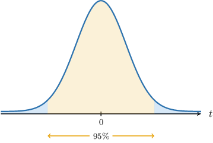
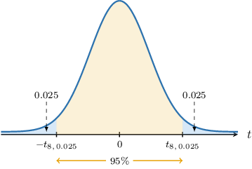
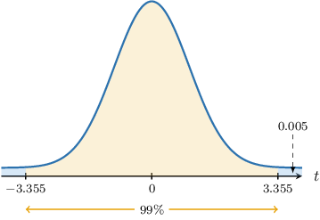
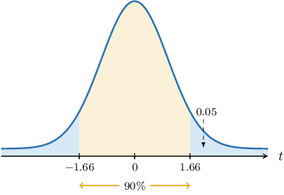
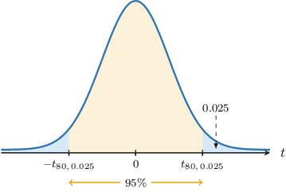

# Confidence Intervals for One Mean: Unknown Population Variance

Source: https://www.mathacademy.com/topics/3855?courseId=145
Topic ID: 3855

## Prerequisites

- [Confidence Intervals for One Mean: Known Population Variance](./260-confidence-intervals-for-one-mean-known-population-variance.md)
- [The Student's T-Distribution](./3069-the-student-s-t-distribution.md)

## Lesson

### Introduction

Suppose we have a random sample of size $n$ drawn from a normal population with unknown population mean $\mu$ and *known* population variance $\sigma^2.$ Recall that a $[100(1-\alpha)]\%$ confidence interval for the population mean $\mu$ is given by

$$

\left(\overline{x} - z_{\alpha/2} \cdot \dfrac{\sigma}{\sqrt{n}}, \: \overline{x} + z_{\alpha/2} \cdot \dfrac{\sigma}{\sqrt{n}}\right)

$$

where $\overline{x}$ is the sample mean, $P(Z > z_{\alpha/2}) = \dfrac{\alpha}{2},$ and $Z \sim N(0,1).$

One thing to realize is that this situation is unrealistic: it's doubtful that we'll not know the population mean yet know the population variance.

A more realistic situation is that $\sigma^2$ is *unknown*, and we must estimate it using the sample data. To estimate the population variance $\sigma^2,$ we use the sample variance $S^2,$ given by

$$

S^2 = \dfrac{1}{n-1} \sum_{i=1}^n \left( X_i - \overline{X} \right)^2.

$$

It can be shown that

$$

\dfrac{\overline{X} - \mu}{S/\sqrt n} \sim T_{n-1}

$$

where $T_{n-1}$ is a student's $t$-distribution with $n-1$ degrees of freedom.

Let's take a look at a concrete example.

### Constructing Confidence Intervals

Suppose we have a random sample of size $n=9$ drawn from a normal population. The sample mean is $\overline{x}=30,$ and the sample standard deviation is $s=3.3.$ We wish to compute a $95\%$ confidence interval for the population mean $\mu.$

Recall that a confidence interval is an interval of the form

$$

(\overline{x}-E, \: \overline{x}+E),

$$

where

- $\overline{x}$ is an estimate of the population mean, and

- $E$ is the margin of error.

In our example, the population is normally distributed. Therefore, the sample mean $\overline{X}$ is also normally distributed, where

$$

\overline{X}\sim N\left(\mu,\dfrac{\sigma^2}{n}\right).

$$

By transforming $\overline{X}$ in the manner described earlier, we have that the random variable $T,$ defined as

$$

T = \dfrac{\overline{X} - \mu}{S/\sqrt n},

$$

follows a student's $t$-distribution $T_{n-1}$ with $n-1$ degrees of freedom.

We wish to find a $t$-interval that we're $95\%$ confident that the random variable $T$ lies within. This interval is indicated in the diagram below:

Since we wish to find a $95\%$ confidence interval, we define our parameter $\alpha$ as

$$

\alpha=1-0.95=0.05\quad\Longrightarrow\quad \dfrac{\alpha}{2}=0.025.

$$

Notice that $\dfrac{\alpha}{2}$ is precisely the area bounded by each "tail" that we're excluding from our confidence interval. Let's label the critical values at the endpoints of our interval as $\pm t_{n-1, \alpha/2}\mathbin{:}$

According to our diagram,

$$

P(T > t_{8,0.025}) = P(T < -t_{8,0.025}) = 0.025.

$$

Using a table of values for the $t$-distribution, we find that $t_{8,0.025} \approx 2.306.$ Therefore,

$$

P(T > 2.306) = P(T < -2.306) = 0.025.

$$

In other words,

$$

\begin{aligned}𝑃(−2.306<𝑇<2.306)=0.95\end{aligned}

$$

Therefore, there is a $95\%$ probability that our random variable $T$ will lie in the interval $(-2.306, 2.306).$

Similar to the case where $\sigma^2$ was known, we find the appropriate confidence interval by solving the inequality inside the parentheses of the last probability statement for the population mean $\mu\mathbin{:}$

$$

\begin{aligned}−2.306 & <𝑇<2.306 \\ −2.306 & <\frac{\overset{𝑥}{}−𝜇}{𝑠/\sqrt{√𝑛}}<2.306 \\ −2.306⋅\frac{𝑠}{\sqrt{√𝑛}} & <\overset{𝑥}{}−𝜇<2.306⋅\frac{𝑠}{\sqrt{√𝑛}} \\ −\overset{𝑥}{}−2.306⋅\frac{𝑠}{\sqrt{√𝑛}} & <−𝜇<−\overset{𝑥}{}+2.306⋅\frac{𝑠}{\sqrt{√𝑛}} \\ \overset{𝑥}{}+2.306⋅\frac{𝑠}{\sqrt{√𝑛}} & >𝜇>\overset{𝑥}{}−2.306⋅\frac{𝑠}{\sqrt{√𝑛}} \\ \overset{𝑥}{}−2.306⋅\frac{𝑠}{\sqrt{√𝑛}} & <𝜇<\overset{𝑥}{}+2.306⋅\frac{𝑠}{\sqrt{√𝑛}}\end{aligned}

$$

Therefore, a $95\%$ confidence interval for the population mean $\mu$ is given by

$$

\left(\overline{x}-2.306 \cdot\dfrac{s}{\sqrt{n}}, \: \overline{x}+2.306 \cdot\dfrac{s}{\sqrt{n}} \right).

$$

Finally, substituting our values

$$

n=9, \qquad \overline{x}=30, \qquad s=3.3,

$$

we obtain that our $95\%$ confidence interval for $\mu$ is

$$

\big( 30- 2.537, \: 30 + 2.537 \big).

$$

Describing this confidence interval using confidence limits, we have

$$

30 \pm 2.537.

$$

Let's now describe the general procedure.

### Summarizing Confidence Intervals for Normal Populations With Unknown Population Variance

Suppose we have a random sample of size $n$ from a normal population with the unknown population mean $\mu$ and sample variance $s^2.$ Then, for a given value $\alpha$ between $0$ and $1,$ a $[100(1-\alpha)]\%$ confidence interval for the population mean $\mu$ is given by

$$

\left(\overline{x} - t_{n-1,\alpha/2} \cdot \dfrac{s}{\sqrt{n}}, \: \overline{x} +t_{n-1,\alpha/2} \cdot \dfrac{s}{\sqrt{n}}\right)

$$

where $P(T > t_{n-1, \alpha/2}) = \dfrac{\alpha}{2},$ and $T \sim T_{n-1}.$

The endpoints of our confidence interval are called **confidence limits** and are given by

$$

\overline{x} \pm t_{n-1, \alpha/2} \cdot \dfrac{s}{\sqrt{n}}.

$$

Each part of the formula above has a name:

- $\overline{x}$ is an estimate of the population mean

- $\dfrac{s}{\sqrt{n}}$ is the standard error of the mean

- $t_{n-1,\alpha/2}$ is the corresponding $t$-score

- $E = t_{n-1, \alpha/2} \cdot \dfrac{s}{\sqrt{n}}$ is the margin of error

$$

𝑡

$$

So, our confidence interval can be written as follows:

$$

\begin{aligned}(\overset{𝑥}{}−[margin of error], & \,\overset{𝑥}{}+[margin of error]) \\ (\overset{𝑥}{}−[t-score]⋅[standard error], & \,\overset{𝑥}{}+[t-score]⋅[standard error]) \\ (\overset{𝑥}{}−𝑡_{𝑛−1,𝛼/2}⋅\frac{𝑠}{\sqrt{√𝑛}}, & \,\overset{𝑥}{}+𝑡_{𝑛−1,𝛼/2}⋅\frac{𝑠}{\sqrt{√𝑛}})\end{aligned}

$$

Notice that the expression for the confidence interval is very similar to when the population variance was known. The only difference is that we now use the $t$-scores instead of $z$-scores and the sample standard deviation $s$ instead of the population standard deviation $\sigma.$

Finally, since computing a confidence interval amounts to finding the corresponding confidence limits, we will use the two terms interchangeably.

### Example: Finding Confidence Intervals From Normal Populations

#### Question

Consider a sample of size $n=9$ from a normal population. Given that the sample mean is $50$ and the sample standard deviation is $1.5,$ find a $99\%$ confidence interval for the population mean $\mu$ of the distribution.

**

#### Explanation

We are told that the population is normally distributed, but we do not know the population variance $\sigma^2.$

In cases like this, the random variable

$$

\dfrac{\overline{X} - \mu}{S/\sqrt n}

$$

follows a student's $t$-distribution $T_{n-1}$ with $n-1$ degrees of freedom, where

- $\overline{X}$ is the sample mean,

- $\mu$ is the population mean,

- $S^2$ is the sample variance, and

- $n$ is the sample size.

Given a value $\alpha$ between $0$ and $1,$ the corresponding $[100(1-\alpha)]\%$ confidence interval for the population mean $\mu$ is given by

$$

\overline{x} \pm t_{n-1,\alpha/2} \cdot \dfrac{s}{\sqrt{n}},

$$

where $P(T > t_{n-1,\alpha/2}) = \dfrac{\alpha}{2},$ and $T$ has a student's $t$-distribution with $n-1$ degrees of freedom.

In our case,

$$

\overline{x}=50, \qquad n = 9, \qquad s = 1.5.

$$

We are interested in finding a $99\%$ confidence interval. So, we have

$$

\alpha=1-0.99=0.01 \qquad\Longrightarrow\qquad \dfrac{\alpha}{2}=0.005.

$$

We are given that $P(T > 3.355) = 0.005.$ As a result,

$$

t_{n-1,\alpha/2} = t_{8,0.005} = 3.355.

$$

Therefore, a $99\%$ confidence interval for the population mean $\mu$ is the following:

$$

\begin{aligned}50 & ±3.355⋅\frac{1.5}{\sqrt{√9}} \\ 50 & ±1.678\end{aligned}

$$

### Large Samples

Up to now, we've assumed that the underlying population is normally distributed. However, if we have a *sufficiently large* sample, then according to the central limit theorem, we have the approximation

$$

\dfrac{\overline{X} - \mu}{\sigma/\sqrt n} \approx N(0,1).

$$

Moreover, since $n$ is sufficiently large, $\sigma^2$ can be approximated as $S^2.$ Therefore, we have that

$$

\dfrac{\overline{X} - \mu}{S/\sqrt n} \approx T_{n-1}.

$$

**Watch out!** If the population is *not* normally distributed, then the sample size $n$ must be sufficiently large for this approximation to apply. Typically, $n\geq 30$ is sufficient.

In such situations, we can use our formula for the confidence limits of the population mean $\mu\mathbin{:}$

$$

\overline{x} \pm t_{n-1,\alpha/2} \cdot \dfrac{s}{\sqrt{n}}

$$

### Example: Finding Confidence Intervals From Large Samples

#### Question

Consider a sample of size $n=100$ from a population. Given that the sample mean is $30,$ and the sample standard deviation is $8,$ find a $90\%$ confidence interval for the population mean $\mu$ of the distribution.

**

#### Explanation

We do not know the distribution of the population, nor do we know the population variance $\sigma^2.$ However, the sample size $n = 100 \geq 30$ is **.

In cases like this, the random variable

$$

\dfrac{\overline{X} - \mu}{S/\sqrt n}

$$

can be approximated by the student's $t$-distribution $T_{n-1}$ with $n-1$ degrees of freedom, where

- $\overline{X}$ is the sample mean,

- $\mu$ is the population mean,

- $S^2$ is the sample variance, and

- $n$ is the sample size.

Given a value $\alpha$ between $0$ and $1,$ the corresponding $[100(1-\alpha)]\%$ confidence interval for the population mean $\mu$ is given by

$$

\overline{x} \pm t_{n-1,\alpha/2} \cdot \dfrac{s}{\sqrt{n}},

$$

where $P(T > t_{n-1,\alpha/2}) = \dfrac{\alpha}{2},$ and $T$ has a student's $t$-distribution with $n-1$ degrees of freedom.

In our case,

$$

\overline{x}=30, \qquad n = 100, \qquad s = 8.

$$

We are interested in finding a $90\%$ confidence interval. So, we have

$$

\alpha=1-0.9=0.1 \qquad\Longrightarrow\qquad \dfrac{\alpha}{2}=0.05.

$$

We are given that $P(T > 1.66) = 0.05.$ As a result,

$$

t_{n-1,\alpha/2} = t_{99,0.05} = 1.66.

$$

Therefore, the $90\%$ confidence interval for the population mean $\mu$ is the following:

$$

\begin{aligned}30 & ±1.66⋅\frac{8}{\sqrt{√100}} \\ 30 & ±1.328\end{aligned}

$$

### Example: Finding Confidence Intervals: Applications

#### Question

A tire manufacturer measures the stopping distance of a new tire model from $60 \, \textrm{mph}$ on a standard test car. A sample of $81$ stopping distances yielded a sample mean of $132\, \textrm{ft}$ with a sample standard deviation of $5.4 \, \textrm{ft}.$ Find a $95\%$ confidence interval for the mean stopping distance $\mu$ of these tires.

**

#### Explanation

We do not know the distribution of the population, nor do we know the population variance $\sigma^2.$ However, the sample size $n = 81 \geq 30$ is **.

In cases like this, the random variable

$$

\dfrac{\overline{X} - \mu}{S/\sqrt n}

$$

can be approximated by the student's $t$-distribution $T_{n-1}$ with $n-1$ degrees of freedom, where

- $\overline{X}$ is the sample mean,

- $\mu$ is the population mean,

- $S^2$ is the sample variance, and

- $n$ is the sample size.

Given a value $\alpha$ between $0$ and $1,$ the corresponding $[100(1-\alpha)]\%$ confidence interval for the population mean $\mu$ is given by

$$

\overline{x} \pm t_{n-1,\alpha/2} \cdot \dfrac{s}{\sqrt{n}},

$$

where $P(T > t_{n-1,\alpha/2}) = \dfrac{\alpha}{2},$ and $T$ has a student's $t$-distribution with $n-1$ degrees of freedom.

In our case,

$$

\overline{x}=132 \, \textrm{ft}, \qquad n = 81, \qquad s = 5.4 \, \textrm{ft}.

$$

We are interested in finding a $95\%$ confidence interval. So, we have

$$

\alpha=1-0.95=0.05 \qquad\Longrightarrow\qquad \dfrac{\alpha}{2}=0.025.

$$

We also need to find the $t$-score value $t_{80,0.025}$ such that $P(T > t_{80, 0.025}) = 0.025,$ where $T$ has a student's $t$-distribution with $n-1=81-1=80$ degrees of freedom.

From the percentage points table of the $t$-distribution, we obtain that $t_{80,0.025}=1.990{:}$

Therefore, the $95\%$ confidence interval for the population mean $\mu$ is the following:

$$

\begin{aligned}132 & ±1.99⋅\frac{5.4}{\sqrt{√81}}\,ft \\ 132 & ±1.194\,ft\end{aligned}

$$
