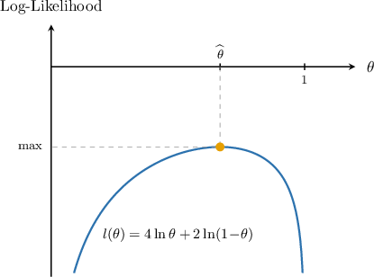

# Log-Likelihood Functions for Discrete Probability Distributions

Source: https://www.mathacademy.com/topics/4124?courseId=145
Topic ID: 4124

## Prerequisites

- [Combining the Laws of Logarithms](../algebra-ii/30-combining-the-laws-of-logarithms.md)
- [Likelihood Functions for Discrete Probability Distributions](./3603-likelihood-functions-for-discrete-probability-distributions.md)

## Lesson

### Introduction

Recall that if $X_1, \: X_2, \: \ldots, \: X_{n}$ are independent and identically distributed discrete random variables with probability mass function $f(x; \theta),$ where $\theta$ is an unknown parameter, then the likelihood function of a random sample $x_1, \: x_2, \: \ldots, \: x_n$ is

$$

L(\theta) = \prod_{i=1}^n f(x_i;\,\theta).

$$

For example, if

$$

X_1,\quad X_2,\quad X_3,\quad X_4,\quad X_5,\quad X_6

$$

is an I.I.D random sample with $X_i\sim \text{Bernoulli}(\theta),$ where $\theta$ is the unknown probability of success, then the likelihood function of the sample

$$

x_1=0, \quad x_2=1, \quad x_3=1, \quad x_4=0, \quad x_5=1, \quad x_6=1

$$

is given by

$$

L(\theta) = \theta^{4}(1-\theta)^{2}.

$$

The likelihood function contains lots of products, which can be cumbersome to work with. To make things easier, we convert the products into sums by finding the natural logarithm of $L(\theta),$ as follows:

$$

\begin{aligned}𝑙(𝜃) & =ln⁡(𝐿(𝜃)) \\ & =ln⁡(\underset{\underset{𝑖=1}{∏}}{\overset{}{𝑛}}𝑓(𝑥_{𝑖};\,𝜃)) \\ & =ln⁡(𝑓(𝑥_{1};\,𝜃)⋅𝑓(𝑥_{2};\,𝜃)⋯𝑓(𝑥_{𝑛};\,𝜃)) \\ & =ln⁡(𝑓(𝑥_{1};\,𝜃))+ln⁡(𝑓(𝑥_{2};\,𝜃))+⋯+ln⁡(𝑓(𝑥_{𝑛};\,𝜃)) \\ & =\underset{\underset{𝑖=1}{∑}}{\overset{}{𝑛}}ln⁡(𝑓(𝑥_{𝑖};\,𝜃))\end{aligned}

$$

This new function $l(\theta)$ is called the **log-likelihood function** of the sample.

For our Bernoulli example above, the corresponding log-likelihood function is as follows:

$$

\begin{aligned}𝑙(𝜃) & =ln⁡(𝜃^{4}(1−𝜃)^{2}) \\ & =ln⁡(𝜃^{4})+ln⁡((1−𝜃)^{2}) \\ & =4ln⁡𝜃+2ln⁡(1−𝜃)\end{aligned}

$$

### Likelihood vs Log-Likelihood

The graph of the likelihood function

$$

L(\theta) = \theta^4(1\!-\!\theta)^2

$$

for the Bernoulli distribution we saw earlier is shown below.

The graph of the corresponding log-likelihood function

$$

l(\theta) = 4 \ln \theta + 2 \ln(1-\theta)

$$

is shown below.

Although the graphs look quite different, they both have a maximum at the same point $\theta = \widehat{\,\theta\,}.$ This will become important later.

Let's see more examples of finding the log-likelihood functions for different distributions and samples.

### Example: Log-Likelihood Functions for Bernoulli Random Variables

#### Question

Suppose $X_1,X_2,\ldots,X_{10}$ is an I.I.D random sample where $X_i\sim \text{Bernoulli}(\theta)$ with unknown probability of success $\theta.$ For a particular sample $x_1, x_2, \ldots, x_{10},$ you're given that there are $7$ successes. Find the log-likelihood function of the sample.

#### Explanation

Recall that if $X_1, X_2, \ldots, X_{n}$ are independent and identically distributed discrete random variables with probability mass function $f(x; \theta),$ where $\theta$ is an unknown parameter, then the log-likelihood function of a random sample $x_1, x_2, \ldots, x_n$ is

$$

\begin{aligned}𝑙(𝜃) & =ln⁡𝐿(𝜃) \\ & =ln⁡(\underset{\underset{𝑖=1}{∏}}{\overset{}{𝑛}}𝑓(𝑥_{𝑖};𝜃)) \\ & =\underset{\underset{𝑖=1}{∑}}{\overset{}{𝑛}}ln⁡(𝑓(𝑥_{𝑖};𝜃)).\end{aligned}

$$

We are given a sample of $n=10$ independent Bernoulli random variables with unknown parameter $\theta.$ Therefore, the probability mass function is

$$

f(x;\theta) = \theta^x(1-\theta)^{1-x}, \qquad x=0, 1.

$$

We can calculate the log-likelihood function as follows:

$$

\begin{aligned}𝑙(𝜃) & =\underset{\underset{𝑖=1}{∑}}{\overset{}{𝑛}}ln⁡(𝜃^{𝑥_{𝑖}}(1−𝜃)^{1−𝑥_{𝑖}}) \\ & =\underset{\underset{𝑖=1}{∑}}{\overset{}{𝑛}}ln⁡(𝜃^{𝑥_{𝑖}})+ln⁡((1−𝜃)^{1−𝑥_{𝑖}}) \\ & =\underset{\underset{𝑖=1}{∑}}{\overset{}{𝑛}}𝑥_{𝑖}ln⁡𝜃+(1−𝑥_{𝑖})ln⁡(1−𝜃) \\ & =ln⁡𝜃\underset{\underset{𝑖=1}{∑}}{\overset{}{𝑛}}𝑥_{𝑖}+ln⁡(1−𝜃)\underset{\underset{𝑖=1}{∑}}{\overset{}{𝑛}}(1−𝑥_{𝑖}) \\ & =𝑆ln⁡𝜃+(𝑛−𝑆)ln⁡(1−𝜃)\end{aligned}

$$

where $\displaystyle S = \sum_ {i=1}^n x_i$ is the number of successes in the sample.

Finally, since there are $7$ successes in the sample, we have

$$

\begin{aligned}𝑙(𝜃) & =7ln⁡𝜃+(10−7)ln⁡(1−𝜃) \\ & =7ln⁡𝜃+3ln⁡(1−𝜃).\end{aligned}

$$

### Example: Log-Likelihood Functions for Binomial Random Variables

#### Question

Suppose $X_1, X_2, X_3$ is an I.I.D random sample with $X_i \sim B(5,\theta)$ with unknown probability of success $\theta.$ You're given the particular sample

$$

x_1 = 4, \qquad x_2 = 1, \qquad x_3 = 1.

$$

Find the log-likelihood function of this sample.

**

$$

f(x) = \displaystyle \binom{5}{x} \theta^x (1-\theta)^{5-x}, \qquad x = 0,1, \ldots, 5.

$$

#### Explanation

Recall that if $X_1, X_2, \ldots, X_{n}$ are independent and identically distributed discrete random variables with probability mass function $f(x; \theta),$ where $\theta$ is an unknown parameter, then the log-likelihood function of a random sample $x_1, x_2, \ldots, x_n$ is

$$

\begin{aligned}𝑙(𝜃) & =ln⁡𝐿(𝜃) \\ & =ln⁡(\underset{\underset{𝑖=1}{∏}}{\overset{}{𝑛}}𝑓(𝑥_{𝑖},𝜃)) \\ & =\underset{\underset{𝑖=1}{∑}}{\overset{}{𝑛}}ln⁡(𝑓(𝑥_{𝑖},𝜃)).\end{aligned}

$$

In our case, we are given a sample of $n = 3$ independent binomial random variables with an unknown probability of success $\theta$ and $N = 5$ as the number of trials. Therefore, the probability mass function is

$$

\begin{aligned}𝑓(𝑥,𝜃) & =(\frac{𝑁}{𝑥})𝜃^{𝑥}(1−𝜃)^{𝑁−𝑥},\,𝑥=0,1,…,𝑁 \\ & =(\frac{5}{𝑥})𝜃^{𝑥}(1−𝜃)^{5−𝑥},\,𝑥=0,1,…,5.\end{aligned}

$$

We can calculate the log-likelihood function as follows:

$$

\begin{aligned}𝑙(𝜃) & =\underset{\underset{𝑖=1}{∑}}{\overset{}{𝑛}}ln⁡((\frac{5}{𝑥_{𝑖}})𝜃^{𝑥_{𝑖}}(1−𝜃)^{5−𝑥_{𝑖}}) \\ & =\underset{\underset{𝑖=1}{∑}}{\overset{}{𝑛}}(ln⁡(\frac{5}{𝑥_{𝑖}})+ln⁡(𝜃^{𝑥_{𝑖}})+ln⁡((1−𝜃)^{5−𝑥_{𝑖}})) \\ & =\underset{\underset{𝑖=1}{∑}}{\overset{}{𝑛}}ln⁡(\frac{5}{𝑥_{𝑖}})+\underset{\underset{𝑖=1}{∑}}{\overset{}{𝑛}}𝑥_{𝑖}ln⁡𝜃+\underset{\underset{𝑖=1}{∑}}{\overset{}{𝑛}}(5−𝑥_{𝑖})ln⁡(1−𝜃) \\ & =\underset{\underset{𝑖=1}{∑}}{\overset{}{𝑛}}ln⁡(\frac{5}{𝑥_{𝑖}})+ln⁡𝜃\underset{\underset{𝑖=1}{∑}}{\overset{}{𝑛}}𝑥_{𝑖}+ln⁡(1−𝜃)\underset{\underset{𝑖=1}{∑}}{\overset{}{𝑛}}(5−𝑥_{𝑖}) \\ & =\underset{\underset{𝑖=1}{∑}}{\overset{}{𝑛}}ln⁡(\frac{5}{𝑥_{𝑖}})+𝑆ln⁡𝜃+(5𝑛−𝑆)ln⁡(1−𝜃)\end{aligned}

$$

where $\displaystyle S = \sum_ {i=1}^n x_i.$

Now, note that

$$

\begin{aligned}\underset{\underset{𝑖=1}{∑}}{\overset{}{𝑛}}ln⁡(\frac{5}{𝑥_{𝑖}}) & =ln⁡(\frac{5}{𝑥_{1}})+ln⁡(\frac{5}{𝑥_{2}})+ln⁡(\frac{5}{𝑥_{3}}) \\ & =ln⁡(\underset{\underset{𝑖=1}{∏}}{\overset{}{𝑛}}(\frac{5}{𝑥_{𝑖}})).\end{aligned}

$$

So, our expression for $l(\theta)$ becomes

$$

l(\theta) = \ln\left( \prod_{i=1}^n {5 \choose x_i}\right) + S\ln \theta + (5n - S) \ln(1-\theta).

$$

Now, using the sample data with $n=3,$ we have

$$

\begin{aligned}\underset{\underset{𝑖=1}{∏}}{\overset{}{𝑛}}(\frac{5}{𝑥_{𝑖}}) & =(\frac{5}{4})⋅(\frac{5}{1})⋅(\frac{5}{1}) \\ & =5⋅5⋅5 \\ & =125,\end{aligned}

$$

and

$$

S = 4 + 1 + 1 = 6.

$$

Substituting the above values into our expression for $l(\theta)$, we get

$$

\begin{aligned}𝑙(𝜃) & =ln⁡(125)+6ln⁡𝜃+(5⋅3−6)ln⁡(1−𝜃) \\ & =ln⁡125+6ln⁡𝜃+9ln⁡(1−𝜃).\end{aligned}

$$

### Example: Log-Likelihood Functions for Poisson Random Variables

#### Question

Suppose $X_1,X_2,X_3$ is an I.I.D random sample with $X_i\sim \mathrm{Po}(\theta)$ with unknown rate parameter $\theta.$ You're given the particular sample

$$

x_1 = 3,\qquad x_2=4,\qquad x_3 = 1.

$$

Find the log-likelihood function of the sample.

#### Explanation

Recall that if $X_1, X_2, \ldots, X_{n}$ are independent and identically distributed discrete random variables with probability mass function $f(x; \theta),$ where $\theta$ is an unknown parameter, then the log-likelihood function of a random sample $x_1, x_2, \ldots, x_n$ is

$$

\begin{aligned}𝑙(𝜃) & =ln⁡𝐿(𝜃) \\ & =ln⁡(\underset{\underset{𝑖=1}{∏}}{\overset{}{𝑛}}𝑓(𝑥_{𝑖},𝜃)) \\ & =\underset{\underset{𝑖=1}{∑}}{\overset{}{𝑛}}ln⁡(𝑓(𝑥_{𝑖},𝜃)).\end{aligned}

$$

In our case, we are given a sample of $n=3$ independent Poisson random variables with unknown parameter $\theta.$ Therefore, the probability mass function is

$$

\begin{aligned}𝑓(𝑥,𝜃) & =𝑒^{−𝜃}⋅\frac{𝜃^{𝑥}}{𝑥!}.\end{aligned}

$$

We can calculate the log-likelihood function as follows:

$$

\begin{aligned}𝑙(𝜃) & =\underset{\underset{𝑖=1}{∑}}{\overset{}{𝑛}}ln⁡(𝑒^{−𝜃}⋅\frac{𝜃^{𝑥_{𝑖}}}{𝑥_{𝑖}!}) \\ & =\underset{\underset{𝑖=1}{∑}}{\overset{}{𝑛}}ln⁡(𝑒^{−𝜃})+ln⁡(𝜃^{𝑥_{𝑖}})−ln⁡(𝑥_{𝑖}!) \\ & =\underset{\underset{𝑖=1}{∑}}{\overset{}{𝑛}}(−𝜃)+\underset{\underset{𝑖=1}{∑}}{\overset{}{𝑛}}ln⁡(𝜃^{𝑥_{𝑖}})−\underset{\underset{𝑖=1}{∑}}{\overset{}{𝑛}}ln⁡(𝑥_{𝑖}!) \\ & =\underset{\underset{𝑖=1}{∑}}{\overset{}{𝑛}}(−𝜃)+\underset{\underset{𝑖=1}{∑}}{\overset{}{𝑛}}𝑥_{𝑖}ln⁡(𝜃)−\underset{\underset{𝑖=1}{∑}}{\overset{}{𝑛}}ln⁡(𝑥_{𝑖}!) \\ & =−𝜃\underset{\underset{𝑖=1}{∑}}{\overset{}{𝑛}}1+ln⁡𝜃\underset{\underset{𝑖=1}{∑}}{\overset{}{𝑛}}𝑥_{𝑖}−\underset{\underset{𝑖=1}{∑}}{\overset{}{𝑛}}ln⁡(𝑥_{𝑖}!) \\ & =−𝑛𝜃+ln⁡𝜃\underset{\underset{𝑖=1}{∑}}{\overset{}{𝑛}}𝑥_{𝑖}−ln⁡(\underset{\underset{𝑖=1}{∏}}{\overset{}{𝑛}}𝑥_{𝑖}!)\end{aligned}

$$

Now, using the sample data with $n=3,$ we have

$$

\begin{aligned}\underset{\underset{𝑖=1}{∏}}{\overset{}{𝑛}}𝑥_{𝑖}! & =3!⋅4!⋅1!=6⋅24⋅1=144, \\ \underset{\underset{𝑖=1}{∑}}{\overset{}{𝑛}}𝑥_{𝑖} & =3+4+1=8.\end{aligned}

$$

Therefore, substituting the above values into our expression for $l(\theta),$ we get

$$

\begin{aligned}𝑙(𝜃) & =−3𝜃+8ln⁡𝜃−ln⁡144.\end{aligned}

$$
