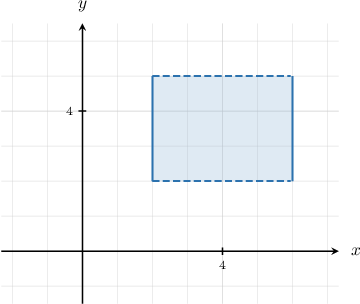
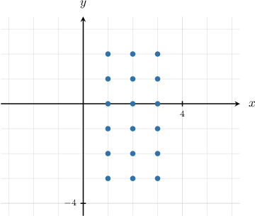
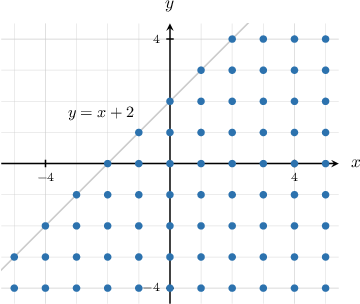
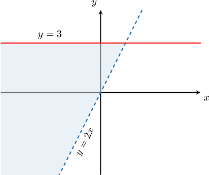
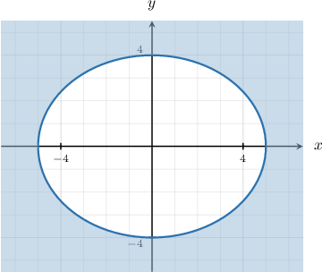

# Describing Planar Regions Using Set-Builder Notation

Source: https://www.mathacademy.com/topics/4392?courseId=145
Topic ID: 4392

## Prerequisites

- [Equations of Ellipses Centered at the Origin](../integrated-math-iii-honors/848-equations-of-ellipses-centered-at-the-origin.md)
- [Left and Right Opening Parabolas](../algebra-ii/1124-left-and-right-opening-parabolas.md)
- [Systems of Linear Inequalities](../algebra-i/1535-systems-of-linear-inequalities.md)
- [Visualizing Cartesian Products](./4387-visualizing-cartesian-products.md)

## Lesson

### Introduction

We can use set-builder notation to represent sets that lie in the coordinate plane.

For example, let's describe the following shaded region using set-builder-notation.

First, notice that a point $P(x,y)$ lies *inside* the rectangle if the following conditions are satisfied:

$$

\begin{aligned}2<𝑥<6,\,2<𝑦<5.\end{aligned}

$$

However, notice that we also need to

- *include* the left edge ($x=2$), and

- *include* the right edge ($x=6$).

Therefore, we change the corresponding inequality symbols to non-strict, as follows:

$$

\begin{aligned}2≤𝑥≤6,\,2<𝑦<5.\end{aligned}

$$

Moreover, since *every* real value in these intervals is included, $x\in \mathbb R, y\in\mathbb R,$ and therefore

$$

(x,y)\in \mathbb R\times\mathbb R = \mathbb R^2.

$$

Thus, we can write our set as follows:

$$

\Big\{ (x,y) \in \mathbb R^2 \: : \: 2 \boxed{\color{blue}\leq} x \boxed{\color{blue}\leq} 6, \: 2 \boxed{\color{blue}\lt} y \boxed{\color{blue}\lt} 5 \Big\}.

$$

### Example: Describing Rectangular Sets Using Set-Builder Notation

#### Question

#### Explanation

Since all points $P(x,y)$ in our set lie at integer values of $x$ and $y,$ we have $x\in \mathbb Z, y\in\mathbb Z,$ and therefore

$$

(x,y)\in \mathbb Z\times\mathbb Z = \mathbb Z^2.

$$

The points $P(x,y)$ satisfy the condition

$$

x \in \{1,2,3\}, \quad y \in \{ -3,-2,-1,0,1,2 \}.

$$

In other words,

$$

1 \leq x \leq 3, \quad -3 \leq y \leq 2

$$

Therefore, we can write our set as follows:

$$

\Big\{ (x,y) \in \boxed{\color{blue}\mathbb Z^2} \: : \: \boxed{\color{blue}1} \leq x \leq \boxed{\color{blue}3} , \: \boxed{\color{blue}-3} \leq y \leq \boxed{\color{blue}2} \Big\}.

$$

### Example: Linear Boundaries, One Condition

#### Question

Describe the shaded region shown above using set-builder notation.

#### Explanation

Since all points $P(x,y)$ in our set lie at integer values of $x$ and $y,$ we have $x\in \mathbb Z, y\in\mathbb Z,$ and therefore

$$

(x,y)\in \mathbb Z\times\mathbb Z = \mathbb Z^2.

$$

The points in our set include all those that lie ** the line $y=x+2.$ For those points, the following condition is satisfied:

$$

y \lt x+2

$$

Also, notice that some points in our set lie ** the line. We include these points by changing the inequality symbol above as follows:

$$

y \boxed{\color{blue}\leq }x+2

$$

Therefore, we can write the set as follows:

$$

\Big\{(x,y) \in \boxed{\color{blue}\mathbb Z ^2} \: : \: y \boxed{\color{blue}\leq }x+2 \Big\}

$$

### Example: Linear Boundaries, Two Conditions

#### Question

Describe the shaded region shown above using set-builder notation.

#### Explanation

The points in our set include all those that lie ** the line $y=2x$ and ** the line $y=3.$

A point $P(x,y)$ lies ** the shaded region if the following conditions are satisfied:

$$

y \gt 2x, \qquad y < 3.

$$

Combining this into a single condition, we have

$$

2x \lt y < 3.

$$

We must also include the line $y= 3$ since the boundary is included in the set (the curve is solid). So, we change the corresponding inequality symbol above as follows:

$$

2x \lt y \boxed{\color{blue}\leq } 3

$$

Moreover, since we're considering ** real value in this region, $x\in \mathbb R, y\in\mathbb R,$ and therefore

$$

(x,y)\in \mathbb R\times\mathbb R = \mathbb R^2.

$$

Therefore, we can write the set as

$$

\Big\{(x,y)\in \boxed{\color{blue}\mathbb R^2 } \: : \: 2x \boxed{\color{blue}\lt } y \boxed{\color{blue}\leq } 3 \Big\}.

$$

### Example: Describing Non-Rectangular Sets Using Set-Builder Notation

#### Question

Use set builder notation to describe the shaded region given in the diagram below:

#### Explanation

The equation of an ellipse centered at the origin with a horizontal radius of length $a$ and a vertical radius of length $b$ is given by

$$

\dfrac{x^2}{a^2}+\dfrac{y^2}{b^2}=1.

$$

Here, the elliptical boundary of our region has horizontal radius $a=5$ and vertical radius $b=4.$ Therefore, the equation of the ellipse is

$$

\begin{aligned}\frac{𝑥^{2}}{25}+\frac{𝑦^{2}}{16} & =1,\end{aligned}

$$

which we can write as

$$

16x^2 + 25y^2 = 400.

$$

We're interested in describing all points that lie ** the ellipse. So, let's pick any point outside the region, say, $(10,0).$ Substituting its coordinates into the equation of the boundary, we obtain

$$

16(10)^2+25(0)^2 \: {\color{blue}>} \: 400.

$$

As a result, the points $P(x,y)$ in our region are any real numbers that satisfy the condition

$$

16x^2 + 25y^2 \gt 400.

$$

We must also include the curve $16x^2 + 25y^2 = 400$ since the boundary is included in the set (the curve is solid). So, we change the inequality symbol above as follows:

$$

16x^2 + 25y^2 \boxed{\color{blue}\geq } 400.

$$

Therefore, we can write the set as

$$

\Big\{(x,y) \in \mathbb{R}^2 \: : \: \boxed{\color{blue}16 }x^2 + \boxed{\color{blue}25 }y^2 \boxed{\color{blue}\geq } 400 \bigg\}.

$$
