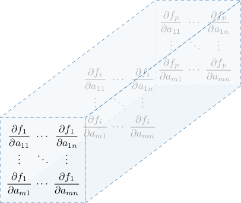
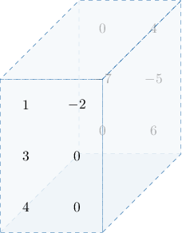

# Total and Tensor Derivatives

Source: https://www.mathacademy.com/topics/5845?courseId=145
Topic ID: 5845

## Prerequisites

- [The Derivative of a Multivariable Function](./4169-the-derivative-of-a-multivariable-function.md)

## Lesson

### Introduction

In this lesson, we’ll continue exploring the *total derivative* of a vector-valued function, which generalizes the derivative to functions with multiple inputs and outputs.

Suppose a transformation $\boldsymbol{f}:\mathbb R^n\to\mathbb R^m$ is defined by

$$

\begin{aligned}𝑥_{1} \\ 𝑥_{2} \\ ⋮ \\ 𝑥_{𝑛}\end{aligned}

$$

where $f_1,f_2,\ldots,f_m$ are scalar functions with $n$ variables.

If $\boldsymbol f$ is differentiable at $\mathbf{x},$ then the **total derivative** of $\boldsymbol f$ at $\mathbf{x},$ denoted $\boldsymbol{f}'(\mathbf{x}),$ is given by the $m \times n$ matrix

$$

\begin{aligned}\frac{𝜕𝑓_{1}}{𝜕𝑥_{1}} & \frac{𝜕𝑓_{1}}{𝜕𝑥_{2}} & ⋯ & \frac{𝜕𝑓_{1}}{𝜕𝑥_{𝑛}} \\ \frac{𝜕𝑓_{2}}{𝜕𝑥_{1}} & \frac{𝜕𝑓_{2}}{𝜕𝑥_{2}} & ⋯ & \frac{𝜕𝑓_{2}}{𝜕𝑥_{𝑛}} \\ ⋮ & ⋮ & ⋮ & ⋮ \\ \frac{𝜕𝑓_{𝑚}}{𝜕𝑥_{1}} & \frac{𝜕𝑓_{𝑚}}{𝜕𝑥_{2}} & ⋯ & \frac{𝜕𝑓_{𝑚}}{𝜕𝑥_{𝑛}}\end{aligned}

$$

This is sometimes called the **Jacobian matrix** of $\boldsymbol{f}$ at $\mathbf{x}$. Each row corresponds to the derivative of one component function $f_i$, and each column corresponds to the rate of change of all the components of $\boldsymbol f$ with respect to one input variable $x_j$. This is sometimes called the **numerator layout** for derivatives because each row corresponds to each function component, which appears in the numerator positions of the partial derivatives.

Notice that if $f: \mathbb{R}^n \to \mathbb{R}$ is a scalar-valued function, then the total derivative is a row vector given by

$$

[\begin{aligned}\frac{𝜕𝑓}{𝜕𝑥_{1}} & \frac{𝜕𝑓}{𝜕𝑥_{2}} & ⋯ & \frac{𝜕𝑓}{𝜕𝑥_{𝑛}}\end{aligned}]

$$

On the other hand, if $\boldsymbol{f}: \mathbb{R} \to \mathbb{R}^m$ is a vector-valued function of a single variable, then the total derivative is a column vector

$$

\begin{aligned}\frac{d𝑓_{1}}{d𝑥} \\ \frac{d𝑓_{2}}{d𝑥} \\ ⋮ \\ \frac{d𝑓_{𝑚}}{d𝑥}\end{aligned}

$$

Now let’s get some practice by working through a few examples of total derivatives.

### Example: Identifying the Shape of a Derivative

#### Question

Consider the function

$$

[\begin{aligned}3 & 0 & −1 & 3 \\ −5 & 1 & 0 & −1\end{aligned}]

$$

where the dot denotes matrix multiplication. What is the shape of the total derivative $\dfrac{\textrm{d} \mathbf{f}}{\textrm{d} \mathbf{x}}?$

#### Explanation

The total derivative of a vector-valued function $\mathbf{f}: \mathbb{R}^{n} \rightarrow \mathbb{R}^m$ with respect to a vector $\mathbf{x} \in \mathbb{R}^n$ is the $m \times n$ matrix

$$

\begin{aligned}\frac{𝜕𝑓_{1}}{𝜕𝑥_{1}} & \frac{𝜕𝑓_{1}}{𝜕𝑥_{2}} & ⋯ & \frac{𝜕𝑓_{1}}{𝜕𝑥_{𝑛}} \\ \frac{𝜕𝑓_{2}}{𝜕𝑥_{1}} & \frac{𝜕𝑓_{2}}{𝜕𝑥_{2}} & ⋯ & \frac{𝜕𝑓_{2}}{𝜕𝑥_{𝑛}} \\ ⋮ & ⋮ & ⋱ & ⋮ \\ \frac{𝜕𝑓_{𝑚}}{𝜕𝑥_{1}} & \frac{𝜕𝑓_{𝑚}}{𝜕𝑥_{2}} & ⋯ & \frac{𝜕𝑓_{𝑚}}{𝜕𝑥_{𝑛}}\end{aligned}

$$

In our case, the function multiplies a vector by a $2 \times 4$ matrix. Thus,

- it must act on $4$-dimensional column vectors as input, and

- output a $2$-dimensional column vector.

Therefore, $\mathbf{f}: \mathbb{R}^{4} \rightarrow \mathbb{R}^2,$ and the total derivative will be a $2 \times 4$ matrix.

### Some Standard Derivatives

Let’s examine examples of functions defined by a matrix of constants multiplied by a vector more carefully.

Consider the vector-valued function $\mathbf{f}: \mathbb{R}^{2} \rightarrow \mathbb{R}^3$ defined by

$$

\begin{aligned}3 & 0 \\ 1 & −1 \\ 0 & 2\end{aligned}

$$

Suppose we want to compute the total derivative $\dfrac{\textrm{d} \mathbf{f}}{\textrm{d} \mathbf{x}}$ at the point $[\begin{aligned}1 \\ 2\end{aligned}]$.

The total derivative of a vector-valued function $\mathbf{f}: \mathbb{R}^{n} \rightarrow \mathbb{R}^m$ with respect to a vector $\mathbf{x} \in \mathbb{R}^n$ is the $m \times n$ matrix

$$

\begin{aligned}\frac{𝜕𝑓_{1}}{𝜕𝑥_{1}} & \frac{𝜕𝑓_{1}}{𝜕𝑥_{2}} & ⋯ & \frac{𝜕𝑓_{1}}{𝜕𝑥_{𝑛}} \\ \frac{𝜕𝑓_{2}}{𝜕𝑥_{1}} & \frac{𝜕𝑓_{2}}{𝜕𝑥_{2}} & ⋯ & \frac{𝜕𝑓_{2}}{𝜕𝑥_{𝑛}} \\ ⋮ & ⋮ & ⋱ & ⋮ \\ \frac{𝜕𝑓_{𝑚}}{𝜕𝑥_{1}} & \frac{𝜕𝑓_{𝑚}}{𝜕𝑥_{2}} & ⋯ & \frac{𝜕𝑓_{𝑚}}{𝜕𝑥_{𝑛}}\end{aligned}

$$

In our case, writing out the function $\mathbf{f}(\mathbf{x})$ where $[\begin{aligned}𝑥_{1} \\ 𝑥_{2}\end{aligned}]$, we get

$$

\begin{aligned}3 & 0 \\ 1 & −1 \\ 0 & 2\end{aligned}

$$

From here, we have

$$

f_1(\mathbf{x}) = 3x_1 + 0 \cdot x_2, \qquad f_2(\mathbf{x}) = x_1 - x_2,\qquad f_3(\mathbf{x}) = 0 \cdot x_1 + 2x_2.

$$

So, the total derivative is

$$

\begin{aligned}\,\,\,\frac{d𝐟}{d𝐱} & =\begin{aligned}\frac{𝜕𝑓_{1}}{𝜕𝑥_{1}} & \frac{𝜕𝑓_{1}}{𝜕𝑥_{2}} \\ \frac{𝜕𝑓_{2}}{𝜕𝑥_{1}} & \frac{𝜕𝑓_{2}}{𝜕𝑥_{2}} \\ \frac{𝜕𝑓_{3}}{𝜕𝑥_{1}} & \frac{𝜕𝑓_{3}}{𝜕𝑥_{2}}\end{aligned} \\ & =\begin{aligned}3 & 0 \\ 1 & −1 \\ 0 & 2\end{aligned}.\end{aligned}

$$

Since this is independent of $\mathbf x,$ we also have

$$

\begin{aligned}3 & 0 \\ 1 & −1 \\ 0 & 2\end{aligned}

$$

In general, if $\mathbf f:\mathbb R^n\to\mathbb R^m$ is defined by

$$

\mathbf f(\mathbf x) = A\mathbf x

$$

where $A\in\mathbb R^{m\times n}$ is constant and $\mathbf x\in\mathbb R^n,$ then

$$

\boxed{\dfrac{\textrm d \mathbf f}{\textrm d \mathbf x} = A}.

$$

### Example: Computing the Total Derivative of a Vector-Valued Function

#### Question

Consider the vector-valued function $\mathbf{f}: \mathbb{R}^{4} \rightarrow \mathbb{R}^2$ defined by

$$

[\begin{aligned}1 & 2 & 4 & 8 \\ 1 & 3 & 9 & 27\end{aligned}]

$$

What is $\dfrac{\textrm{d} \mathbf{f}}{\textrm{d} \mathbf{x}},$ the total derivative of $\mathbf{f}$ with respect to $\mathbf{x}$ at $\begin{aligned}1 \\ 2 \\ 3 \\ 4\end{aligned}$

#### Explanation

The total derivative of a vector-valued function $\mathbf{f}: \mathbb{R}^{n} \rightarrow \mathbb{R}^m$ with respect to a vector $\mathbf{x} \in \mathbb{R}^n$ is the $m \times n$ matrix

$$

\begin{aligned}\frac{𝜕𝑓_{1}}{𝜕𝑥_{1}} & \frac{𝜕𝑓_{1}}{𝜕𝑥_{2}} & ⋯ & \frac{𝜕𝑓_{1}}{𝜕𝑥_{𝑛}} \\ \frac{𝜕𝑓_{2}}{𝜕𝑥_{1}} & \frac{𝜕𝑓_{2}}{𝜕𝑥_{2}} & ⋯ & \frac{𝜕𝑓_{2}}{𝜕𝑥_{𝑛}} \\ ⋮ & ⋮ & ⋱ & ⋮ \\ \frac{𝜕𝑓_{𝑚}}{𝜕𝑥_{1}} & \frac{𝜕𝑓_{𝑚}}{𝜕𝑥_{2}} & ⋯ & \frac{𝜕𝑓_{𝑚}}{𝜕𝑥_{𝑛}}\end{aligned}

$$

In our case, writing out the function $\mathbf{f}(\mathbf{x})$ where $\begin{aligned}𝑥_{1} \\ 𝑥_{2} \\ 𝑥_{3} \\ 𝑥_{4}\end{aligned}$, we get

$$

[\begin{aligned}1 & 2 & 4 & 8 \\ 1 & 3 & 9 & 27\end{aligned}]

$$

From here, we have $f_1(\mathbf{x}) = x_1 + 2x_2 + 4x_3 + 8x_4$ and $f_2(\mathbf{x}) = x_1 + 3x_2 + 9x_3 +27x_4.$ So, the total derivative is

$$

\begin{aligned}\,\,\,\frac{d𝐟}{d𝐱} & =\begin{aligned}\frac{𝜕𝑓_{1}}{𝜕𝑥_{1}} & \frac{𝜕𝑓_{1}}{𝜕𝑥_{2}} & \frac{𝜕𝑓_{1}}{𝜕𝑥_{3}} & \frac{𝜕𝑓_{1}}{𝜕𝑥_{4}} \\ \frac{𝜕𝑓_{2}}{𝜕𝑥_{1}} & \frac{𝜕𝑓_{2}}{𝜕𝑥_{2}} & \frac{𝜕𝑓_{2}}{𝜕𝑥_{3}} & \frac{𝜕𝑓_{2}}{𝜕𝑥_{4}}\end{aligned} \\ & =[\begin{aligned}1 & 2 & 4 & 8 \\ 1 & 3 & 9 & 27\end{aligned}].\end{aligned}

$$

Since the total derivative is a constant matrix, evaluating it at $\begin{aligned}1 \\ 2 \\ 3 \\ 4\end{aligned}$ gives the same matrix.

### Tensor Derivatives

We've learned that the derivative of a vector-valued function is a Jacobian matrix. Now imagine the input to our function $\mathbf f$ is a matrix instead of a vector. In such cases, the Jacobian matrix must expand to account for two input dimensions.

Suppose we have a transformation $\boldsymbol{f}: \mathbb{R}^{m \times n} \to \mathbb{R}^p$ that maps a matrix $\mathbf{A} \in \mathbb{R}^{m \times n}$ to a vector $\mathbf{f}(\mathbf{A}) \in \mathbb{R}^p$, defined as

$$

\begin{aligned}𝑎_{11} & 𝑎_{12} & ⋯ & 𝑎_{1𝑛} \\ 𝑎_{21} & 𝑎_{22} & ⋯ & 𝑎_{2𝑛} \\ ⋮ & ⋮ & ⋱ & ⋮ \\ 𝑎_{𝑚1} & 𝑎_{𝑚2} & ⋯ & 𝑎_{𝑚𝑛}\end{aligned}

$$

where each $f_i$ is a scalar-valued function of all the entries of the matrix $\mathbf{A}.$

Since the input $\mathbf{A}$ varies along two dimensions (rows and columns), and the output $\mathbf{f}(\mathbf{A})$ varies along one (a vector with $p$ components), the total derivative of $\mathbf f,$ which we denote as

$$

\dfrac{\textrm{d}\mathbf{f}}{\textrm{d}\mathbf{A}}

$$

is naturally represented as a *three-dimensional object!* The technical name for this object is a **tensor**. Since it is a three-dimensional object, this particular tensor is a **third-order tensor** (or $3$-**tensor**).

To capture a meaningful derivative, we must differentiate each component $f_i$ with respect to *every element of the matrix* $\mathbf A.$ We can visualize this as a stack of matrices, or layers, as shown below.

Let's apply this concept to a specific example in the next slide.

### A Worked Example

Suppose we have the function $\mathbf f: \mathbb R^{3\times2} \to \mathbb R^{2},$ defined as

$$

\begin{aligned}𝑎_{11} & 𝑎_{12} \\ 𝑎_{21} & 𝑎_{22} \\ 𝑎_{31} & 𝑎_{32}\end{aligned}

$$

We calculate the derivatives of $\mathbf f$ layer by layer as follows:

- **Layer 1**: The derivatives of the first component $f_1$ with respect to $\mathbf A.$

- **Layer 2**: The derivatives of the second component $f_2$ with respect to $\mathbf A.$

Combining these layers into a 3D block, we get the total derivative (a $3$-tensor in $\mathbb R^{2\times3\times2}$):

You've probably realized by now that working with 3-tensors directly is cumbersome! So, rather than trying to visualize the full tensor all at once, focusing on its components is often helpful. Generally,

$$

\left( \dfrac{\textrm{d}\mathbf{f}}{\textrm{d}\mathbf{A}} \right)_{i, j, k} = \dfrac{\partial f_i}{\partial a_{jk}}

$$

is a *scalar* representing the derivative of the $i$th output component with respect to the element $a_{jk}$ of the matrix $\mathbf A.$

For example, the derivative of $f_{\color{red}1}$ with respect to $a_{{\color{blue}3},{\color{blue}2}}$ corresponds to the component at index $({\color{red}1},{\color{blue}3},{\color{blue}2})$ of a tensor. In our example, we saw that

$$

\begin{aligned}1 & −2 \\ 3 & 0 \\ 4 & 0\end{aligned}

$$

Looking at the ${\color{red}1}$st layer (front face), row ${\color{blue}3},$ column ${\color{blue}2},$ we have

$$

\left(\dfrac{\textrm d \mathbf f}{\textrm d \mathbf A}\right)_{{\color{red}1}, {\color{blue}3}, {\color{blue}2}} = \boxed{0}.

$$

Derivatives of matrix functions arise in optimization problems, machine learning (e.g., backpropagation through layers), and physics (e.g., tensor fields). Understanding their structure is key to efficient computation and interpretation.

### Example: Computing a 3-Tensor Derivative

#### Question

Consider a function $\mathbf{f}: \mathbb R^{2\times 3} \to \mathbb R^2$ defined by

$$

\begin{aligned}−1 \\ 3 \\ 7\end{aligned}

$$

Given that $a_{ij}$ denotes the entry of $\mathbf{A}$ in the intersection of the $i$th row and $j$th column, find the value of $\dfrac{\partial f_1}{\partial a_{12}}.$

#### Explanation

We can write the function $\mathbf{f}$ as

$$

[\begin{aligned}𝑎_{11} & 𝑎_{12} & 𝑎_{13} \\ 𝑎_{21} & 𝑎_{22} & 𝑎_{23}\end{aligned}]

$$

Thus,

$$

\dfrac{\partial f_1}{\partial a_{12}} = \dfrac{\partial}{\partial a_{12}} (-a_{11} + 3a_{12} + 7a_{13} ) = 3.

$$
