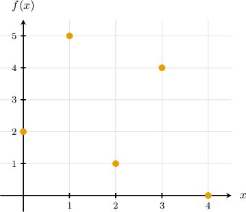

# Finding Argmax and Argmin From Tables and Graphs

Source: https://www.mathacademy.com/topics/6824?courseId=145
Topic ID: 6824

## Prerequisites

- [Argmax and Argmin Notation](./6819-argmax-and-argmin-notation.md)

## Lesson

### Introduction

In a previous lesson, we learned that $\max$ and $\min$ return the largest and smallest *function values,* while $\arg\max$ and $\arg\min$ return the corresponding *input values.*

In this lesson, we practice finding $\max,$ $\arg\max,$ $\min,$ and $\arg\min$ from common representations of a function:

- Tables of values

- Graphs

### Finding Argmax and Argmin From a Table

When a table lists input-output pairs $(x,f(x))$ for $x$ in some set $S,$ we can read:

- $\max_{x \in S} f(x)$ by finding the largest output value in the table.

- $\arg\max_{x \in S} f(x)$ by taking the input value where that largest output occurs.

The same idea applies to $\min$ and $\arg\min,$ except we look for the smallest output value.

### Example: Reading Argmax and Argmin From a Table

#### Question

The table above gives values of $f$ on the set $S=\{-2,-1,0,1,2\}.$ Use the table to compute

$$

\max_{x \in S} f(x),\qquad \arg\max_{x \in S} f(x),\qquad \min_{x \in S} f(x),\qquad \arg\min_{x \in S} f(x).

$$

#### Explanation

Recall that

- $\max\limits_{x \in S} f(x)$ is the maximum output value, while

- $\arg\max\limits_{x \in S} f(x)$ is an input in $S$ where that maximum output occurs.

On the other hand,

- $\min\limits_{x \in S} f(x)$ is the minimum output value, while

- $\arg\min\limits_{x \in S} f(x)$ is an input in $S$ where that minimum output occurs.

The output values in the table are $3,0,5,-1,$ and $2.$

The largest output is $5,$ and it occurs at $x=0.$ Therefore,

$$

\max_{x \in S} f(x)=5 \qquad \textrm{and} \qquad \arg\max_{x \in S} f(x)=0.

$$

The smallest output is $-1,$ and it occurs at $x=1.$ Therefore,

$$

\min_{x \in S} f(x)=-1 \qquad \textrm{and} \qquad \arg\min_{x \in S} f(x)=1.

$$

### Finding Argmax and Argmin From a Graph

When a graph shows the points $(x,f(x))$ for $x$ in a set $S,$ we can find:

- $\max_{x \in S} f(x)$ by locating the highest point on the graph and reading its $y$-coordinate.

- $\arg\max_{x \in S} f(x)$ by taking the corresponding $x$-coordinate.

The same idea applies to $\min$ and $\arg\min,$ except we look for the lowest point.

### Example: Reading Argmax and Argmin From a Graph

#### Question

Let $S=\{0,1,2,3,4\}.$ The graph above shows the value of $f(x)$ for each $x \in S.$ Use the graph to compute

$$

\max_{x \in S} f(x),\qquad \arg\max_{x \in S} f(x),\qquad \min_{x \in S} f(x),\qquad \arg\min_{x \in S} f(x).

$$

#### Explanation

Recall that

- $\max\limits_{x \in S} f(x)$ is the maximum output value, while

- $\arg\max\limits_{x \in S} f(x)$ is an input in $S$ where that maximum output occurs.

On the other hand,

- $\min\limits_{x \in S} f(x)$ is the minimum output value, while

- $\arg\min\limits_{x \in S} f(x)$ is an input in $S$ where that minimum output occurs.

From the graph, the highest point has $y$-coordinate $5,$ and it occurs at $x=1.$ Therefore,

$$

\max_{x \in S} f(x)=\boxed{5} \qquad \textrm{and} \qquad \arg\max_{x \in S} f(x)=\boxed{1}.

$$

The lowest point has $y$-coordinate $0,$ and it occurs at $x=4.$ Therefore,

$$

\min_{x \in S} f(x)=\boxed{0} \qquad \textrm{and} \qquad \arg\min_{x \in S} f(x)=\boxed{4}.

$$
