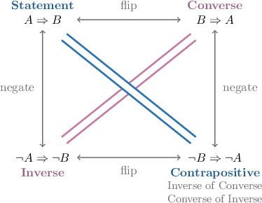

# Converse, Inverse, and Contrapositive

Source: https://www.mathacademy.com/topics/252?courseId=76
Topic ID: 252

## Prerequisites

- [Logical Equivalence with Conditional Statements](./247-logical-equivalence-with-conditional-statements.md)

## Lesson

### Introduction

A conditional statement $A \Rightarrow B$ has three related logical forms:

- the **converse:** $B \Rightarrow A$

- the **inverse:** $\lnot A \Rightarrow \lnot B$

- the **contrapositive:** $\lnot B \Rightarrow \lnot A$

For example, consider the following true statement:

$\qquad$ If I am George Washington, then I am an American.

Here, the antecedent is $A=$ "I am George Washington," and the consequent is $B=$ "I am an American."

- The *converse* is "If I am an American, then I am George Washington."

- The *inverse* is "If I am not George Washington, then I am not an American."

- The *contrapositive* is "If I am not an American, then I am not George Washington."

As we can see from the statements above, only the contrapositive is also true.

### Example: Finding the Converse of a Statement

#### Question

Find the converse of the following statement:

$\qquad$ **** it is summer, **** it is not snowy outside.

#### Explanation

In our conditional statement:

- The antecedent is $A{:}$ It is summer.

- The consequent is $B{:}$ It is not snowy outside.

The converse of a conditional statement $A \Rightarrow B$ is given by

$$

B \Rightarrow A.

$$

Therefore, the converse is the following:

$\qquad$ If it is not snowy outside, then it is summer.

### Example: Finding the Inverse of a Statement

#### Question

Find the inverse of the following statement:

$\qquad$ **** it is summer, **** it is not snowy outside.

#### Explanation

In our conditional statement:

- The antecedent is $A{:}$ It is summer.

- The consequent is $B{:}$ It is not snowy outside.

The inverse of a conditional statement $A \Rightarrow B$ is given by

$$

\neg A \Rightarrow \neg B.

$$

First, we write down the negations of $A$ and $B{:}$

- $\neg A{:}$ It is not summer.

- $\neg B{:}$ It is snowy outside.

Therefore, the inverse is the following:

$\qquad$ If it is not summer, then it is snowy outside.

### Example: Finding the Contrapositive of a Statement

#### Question

Find the contrapositive of the following statement:

$\qquad$ **** it is summer, **** it is not snowy outside.

#### Explanation

In our conditional statement:

- The antecedent is $A{:}$ It is summer.

- The consequent is $B{:}$ It is not snowy outside.

The contrapositive of a conditional statement $A \Rightarrow B$ is given by

$$

\neg B \Rightarrow \neg A.

$$

First, we write down the negations of $A$ and $B{:}$

- $\neg A{:}$ It is not summer.

- $\neg B{:}$ It is snowy outside.

Therefore, the contrapositive is the following:

$\qquad$ If it is snowy outside, then it is not summer.

### Logically Equivalent Conditional Statements

In general, we have the following facts:

- The contrapositive is logically equivalent to the original statement:

- The inverse and the converse are logically equivalent to each other but not to the original statement:

We can prove these results using a truth table, as shown below:

This can be visualized using the following diagram.

### Example: Identifying Logically Equivalent Statements

#### Question

$\qquad$ **** it is summer, **** it is not snowy outside.

Which of the following statements are equivalent to the conditional statement above?

1. If it is not summer, then it is snowy outside.

2. If it is not snowy outside, then it is summer.

3. If it is snowy outside, then it is not summer.

#### Explanation

Let's recall the following facts:

- The contrapositive is logically equivalent to the original statement.

- The inverse and the converse are logically equivalent to each other, but not to the original statement.

So, we are looking for the contrapositive of the given statement.

- Statement I is the inverse, not the contrapositive. $\quad \color{red}\times$

- Statement II is the converse, not the contrapositive. $\quad \color{red}\times$

- Statement III is the contrapositive. $\quad \color{green}\checkmark$

Therefore, the correct answer is "III only."
