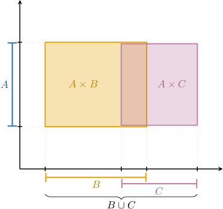
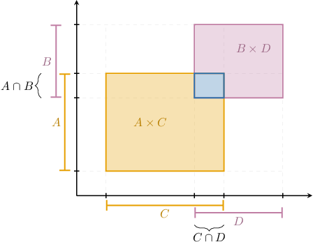
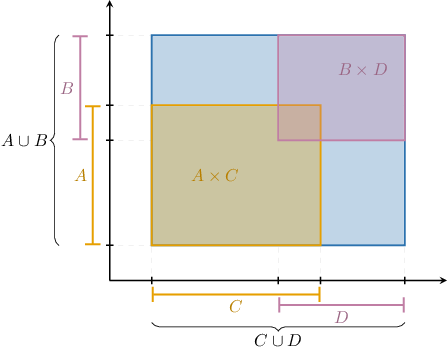

# Proving Distributive Properties of the Cartesian Product

Source: https://www.mathacademy.com/topics/254?courseId=76
Topic ID: 254

## Prerequisites

- [Proving Distributive Properties of Union and Intersection](./4426-proving-distributive-properties-of-union-and-intersection.md)

## Lesson

### Introduction

In this lesson, we will prove some distributive properties of the Cartesian product.

The Cartesian product distributes over unions and intersections in much the same way that unions distribute over intersections and vice versa.

#### Distributivity over Unions

The Cartesian product distributes over the union of two sets according to the following laws:

- $A \times (B \cup C) = (A \times B) \cup (A \times C)$

- $(A \cup B) \times C = (A \times C) \cup (B \times C)$

We can visualize the first rule using the diagram below.

Notice that the rectangle corresponding to the Cartesian product $A \times (B \cup C)$ equals the union of the rectangles corresponding to $\color{SandyBrown}A \times B$ and $\color{Plum}A \times C.$

#### Distributivity over Intersections

The Cartesian product distributes over the intersection of two sets according to the following laws:

- $A \times (B \cap C) = (A \times B) \cap (A \times C)$

- $(A \cap B) \times C = (A \times C) \cap (B \times C)$

Again, we can visualize the first rule using the diagram below.

Notice that the rectangle corresponding to the Cartesian product $A \times (B \cap C)$ equals the intersection of the rectangles corresponding to $\color{SandyBrown}A \times B$ and $\color{Plum}A \times C.$

#### Distributivity over Differences

The Cartesian product distributes over the difference between two sets according to the following laws:

- $A \times (B \setminus C) = (A \times B) \setminus (A \times C)$

- $(A \setminus B) \times C = (A \times C) \setminus (B \times C)$

We can visualize the first rule using the diagram below.

Notice that the rectangle corresponding to the Cartesian product $A \times (B \setminus C)$ equals the difference between rectangles corresponding to $\color{SandyBrown}A \times B$ and $\color{Plum}A \times C.$

### Intersections and Unions of Cartesian Products

Finally, we also have the following law:

$$

(A \times C) \cap (B \times D) = (A \cap B) \times (C \cap D)

$$

We can visualize this rule using the diagram below.

Notice that the rectangle corresponding to the Cartesian product $\color{SteelBlue}(A \times C) \cap (B \times D)$ equals the intersection of rectangles corresponding to $\color{SandyBrown}A \times C$ and $\color{Plum}B \times D.$

However, the analogous law for unions is *not* valid in general:

$$

(A \times C) \cup (B \times D) \neq (A \cup B) \times (C \cup D)

$$

It's clear from the following diagram why this is the case.

Notice that the rectangle corresponding to the Cartesian product $\color{SteelBlue}(A \cup C) \times (B \cup D)$ is *larger than* the union of rectangles corresponding to $\color{SandyBrown}A \times C$ and $\color{Plum}B \times D.$

These diagrams are great for building intuition around these distributive laws. However, they do not constitute a formal mathematical proof of these laws.

One way to prove these laws is to use the property that $X=Y$ if and only if $X \subseteq Y$ and $Y \subseteq X.$ So, let's begin by proving a subset relation for one of these identities.

### Example: Proving Inclusion Statements Involving the Cartesian Product

#### Question

Let $A,$ $B,$ and $C$ be sets. Prove that

$$

(A \times B) \cap (C \times D) \subseteq (A\cap C) \times (B\cap D).

$$

#### Explanation

Suppose $X$ and $Y$ are sets, and $U$ is a universal set. Then we have the following definition for $X \subseteq Y{:}$

$$

X \subseteq Y \quad\Leftrightarrow\quad \forall x\in U,\: x\in X \Rightarrow x\in Y

$$

So, to show that $(A \times B) \cap (C \times D)$ is a subset of $(A\cap C) \times (B\cap D),$ we need to demonstrate that a fixed but arbitrary element of the first set is also an element of the second set.

We start by considering an arbitrary element of $(A \times B) \cap (C \times D)$ and use the definition of intersection.

Suppose $(x, y) \in (A \times B) \cap (C \times D).$ Then, by the definition of intersection, we have $(x,y) \in A \times B$ and $(x,y) \in C \times D.$

Now, let's unfold the second statement using the definition of the Cartesian product.

By the definition of the Cartesian product, since $(x,y) \in A \times B,$ it follows that $x \in A$ and $y \in B.$ Similarly, since $(x,y) \in C \times D,$ it follows that $x \in C$ and $y \in D.$

Next, we combine the results about $x$ and $y$ separately and use the definition of intersection.

According to the definition of intersection, since $x \in A$ and $x \in C,$ we have $x \in A \cap C.$ Similarly, since $y \in B$ and $y \in D,$ we have $y \in B \cap D.$

Finally, we use the definition of the Cartesian product again.

Since $x \in A \cap C$ and $y \in B \cap D,$ using the definition of the Cartesian product, we get

$$

(x,y) \in (A \cap C) \times (B \cap D).

$$

And we draw our conclusion using the definition of a subset.

Therefore, we conclude that

$$

(A \times B) \cap (C \times D) \subseteq (A\cap C) \times (B\cap D).

$$

### Example: Understanding Proofs of Inclusion Statements

#### Question

Consider the following statement:

Given that $A,$ $B,$ and $C$ are sets, $(A \cup B) \times C \subseteq (A \times C) \cup (B \times C).$

A proof of this statement is given below.

$\textrm{L1}{:}\:$ Let $(x, y) \in (A \cup B) \times C.$

$\textrm{L2}{:}\:$ Then, $x \in A \cup B$ and $y \in C.$

$\textrm{L3}{:}\:$ In turn, $x \in A$ or $x \in B.$

$\textrm{L4}{:}\:$ **** Let $x \in A.$

$\textrm{L5}{:}\:$ Then, $(x,y) \in A \times C.$

$\textrm{L6}{:}\:$ **** Let $x \in B.$

$\textrm{L7}{:}\:$ Then, $(x,y) \in B \times C.$

$\textrm{L8}{:}\:$ Therefore, $(x,y) \in (A \times C) \cup (B \times C).$

$\textrm{L9}{:}\:$ Thus, $(A \cup B) \times C \subseteq (A \times C) \cup (B \times C).$

Complete the following reasoning.

- Line $\textrm{L2}$ follows from line $\textrm{L1}$ by the definition of $\_\_\_\_\_\_\_\_\_\_\_\_\_\_\_\_\_\_\_\_.$

- Line $\textrm{L3}$ follows from $00000000$ in line $\textrm{L2}$ by the definition of $\_\_\_\_\_\_\_\_\_\_\_\_\_\_\_\_\_\_\_\_.$

- Line $\textrm{L9}$ follows from line $\textrm{L1}$ and $\textrm{L8}$ by the definition of $\_\_\_\_\_\_\_\_\_\_\_\_\_\_\_\_\_\_\_\_.$

#### Explanation

Let's examine each statement in turn.

- We first consider $\textrm{L1}$ and $\textrm{L2}.$ We have the following equivalence: Therefore, $\textrm{L2}$ follows from $\textrm{L1}$ by the definition of $\boxed{\textrm{the Cartesian product of sets}}.$

- Next consider $\textrm{L2}$ and $\textrm{L3}.$ We have the following equivalence: Therefore, $\textrm{L3}$ follows from $\boxed{x \in A \cup B}$ in $\textrm{L2}$ by the definition of $\boxed{\textrm{the union of sets}}.$

- Finally, we consider $\textrm{L1}, \textrm{L8},$ and $\textrm{L9}.$ Since $(x, y) \in (A \cup B) \times C$ implies $(x,y) \in (A \times C) \cup (B \times C),$ we have that $(A \cup B) \times C \subseteq (A \times C) \cup (B \times C).$ Therefore, line $\textrm{L9}$ follows from line $\textrm{L1}$ and $\textrm{L8}$ by the definition of $\boxed{\textrm{subsets}}.$

### Example: Proving the Distributive Properties of the Cartesian Product

#### Question

Let $A,$ $B,$ and $C$ be sets. Prove that

$$

(A \times B) \cap (C \times D) = (A \cap C) \times (B \cap D).

$$

#### Explanation

To show that the sets are equal, we must demonstrate that a fixed but arbitrary element of the LHS is also an element of the RHS and vice versa.

Suppose $(x,y) \in (A \times B) \cap (C \times D).$

We'll proceed by forming a chain of equivalent statements. We use definitions of the Cartesian product and intersection of sets together with logical laws to demonstrate that $(x,y) \in (A \cap C) \times (B \cap D).$

First, we apply the definition of intersection:

Then, we have the following chain of equivalent statements:

$(x,y) \in (A \times B) \cap (C \times D) \quad\Leftrightarrow\quad \big((x,y) \in A \times B \big) \land \big((x,y) \in C \times D \big)$

Next, we apply the definition of the Cartesian product:

$\big((x,y) \in A \times B \big) \land \big((x,y) \in C \times D \big) \quad\Leftrightarrow\quad \big((x \!\in\! A) \!\land\! (y \!\in\! B) \big) \land \big((x \!\in\! C) \!\land\! (y \!\in\! D) \big)$

Then, we apply the associative and commutative law for conjunction:

$\big((x \!\in\! A) \!\land\! (y \!\in\! B) \big) \land \big((x \!\in\! C) \!\land\! (y \!\in\! D) \big) \quad\Leftrightarrow\quad \big((x \!\in\! A) \!\land\! (x \!\in\! C) \big) \land \big((y \!\in\! B) \!\land\! (y \!\in\! D) \big)$

Applying the definition of intersection once more gives:

$\big((x \in A) \land (x \in C) \big) \land \big((y \in B) \land (y \in D) \big) \quad\Leftrightarrow\quad \big((x \in A \cap C) \big) \land \big((y \in B \cap D) \big)$

Finally, applying the definition of the Cartesian product gives:

$\big((x \in A \cap C) \big) \land \big((y \in B \cap D) \big) \quad\Leftrightarrow\quad (x,y) \in (A \cap C) \times (B \cap D)$

Let's write down our conclusion.

So, $(x,y)$ is an element of $(A \times B) \cap (C \times D)$ if and only if it's an element of $(A \cap C) \times (B \cap D).$ Therefore, by the definition of equivalent sets,

$$

(A \times B) \cap (C \times D) = (A \cap C) \times (B \cap D).

$$
