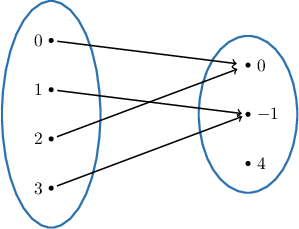
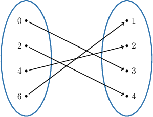
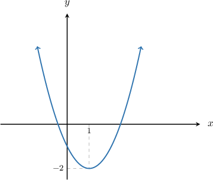
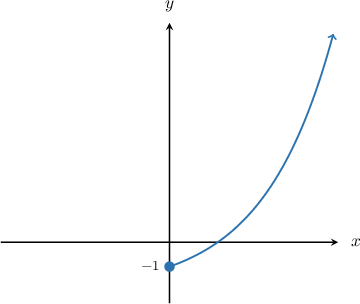

# Surjections

Source: https://www.mathacademy.com/topics/2627?courseId=76
Topic ID: 2627

## Prerequisites

- [Graphing Logarithmic Functions](../algebra-ii/1532-graphing-logarithmic-functions.md)
- [Properties of Transformed Exponential Functions](../algebra-ii/1609-properties-of-transformed-exponential-functions.md)
- [Graphing Elementary Cubic Functions](../algebra-ii/1653-graphing-elementary-cubic-functions.md)
- [Graphing the Square Root Function](../algebra-ii/2038-graphing-the-square-root-function.md)
- [Formal and Informal Language](./2798-formal-and-informal-language.md)
- [Sets and Functions](./3334-sets-and-functions.md)
- [Finding Zeros and Extrema of Transformed Sine and Cosine Functions](../algebra-ii/5088-finding-zeros-and-extrema-of-transformed-sine-and-cosine-functions.md)

## Lesson

### Introduction

A function $f: X\rightarrow Y$ is a **surjection** (also known as **onto**) if, for *every* element $y$ in $Y,$ there is at least one element in $X$ that maps to $y.$

Symbolically, we can write:

$f: X \to Y$ is a surjection if $\forall\, y \in Y,$ $\exists\, x \in X$ such that $f(x)=y.$

We can read the above statement as follows:

*The function $f$ that maps from the domain $X$ to the codomain $Y$ is a surjection if, for all $y$ contained within $Y,$ there exists some $x$ contained within $X$ such that $f(x) = y$.*

The following diagram shows an example of a surjection.

We see that every element of $Y$ has at least one element of $X$ that maps to it.

On the other hand, the following is *not* a surjection because there is no element in the domain $X$ that maps to the element $4.$

### Example: Functions Defined as Mapping Diagrams

#### Question

Which of the following statements are true regarding the function $f:X \to Y$ represented by the mapping diagram above?

1. There exists some $x$ contained within $X$ such that $f(x) = 1$

2. $\forall\, y \in Y,$ $\exists\, x \in X$ such that $f(x)=y$

3. $f$ is a surjection

#### Explanation

A function $f: X \rightarrow Y$ is a surjection (also known as **) if, for ** element $y$ in $Y,$ there is ** element in $X$ that maps to $y\mathbin{:}$

$f: X \to Y$ is a surjection if $\forall\, y \in Y,$ $\exists\, x \in X$ such that $f(x)=y.$

With that in mind, let's consider each statement in turn.

- Statement I is true. According to the diagram, we have $f(6)=1$ (we have an arrow from $6\in X$ to $1\in Y$). So, there exists some $x$ contained within $X$ such that $f(x) = 1.$

- Statement II is true. As we can see from the diagram, for all $y$ contained within $Y,$ there exists some $x$ contained within $X$ such that $f(x) = y.$

- Statement III is true. Since statement II is true, $f$ is a surjection.

Therefore, the correct answer is "I, II and III."

### Example: Functions Whose Domain and Codomain Is the Set of Real Numbers

#### Question

Which of the following statements are true regarding the function $f:\mathbb{R}\to\mathbb{R}$ which is given by $f(x)=(x-1)^2-2?$

1. The range of $f$ is $[-2,\infty)$

2. $\forall\, y \in \mathbb{R},$ $\exists\, x \in \mathbb{R}$ such that $f(x)=y$

3. $f$ is ****

#### Explanation

First, we graph the function.

A function $f: X \rightarrow Y$ is a surjection (also known as **) if, for ** element $y$ in $Y,$ there is ** element in $X$ that maps to $y\mathbin{:}$

$f: X \to Y$ is a surjection if $\forall\, y \in Y,$ $\exists\, x \in X$ such that $f(x)=y.$

With that in mind, let's consider each statement in turn.

- Statement I is true. From the graph, the lowest $y$-value is $-2,$ and it occurs at the point $(1,-2).$ The graph will cover all $y$-values from $y=-2$ and greater, including the number $-2,$ so the range of the function is $[-2,\infty).$

- Statement II is false. Consider $y=-3.$ As we can see from the range, there is no real number $x$ such that $f(x)=-3.$ So, it's ** that for all $y$ contained within $\mathbb{R},$ there exists some $x$ contained within $\mathbb{R}$ such that $f(x) = y.$

- Statement III is false. Since statement II is false, $f$ is not a surjection (also known as **).

Therefore, the correct answer is "I only."

### Example: Functions Whose Codomain Is a Real Interval

#### Question

Which of the following statements are true regarding the function $f:[0,\infty)\to[-1, \infty)$ whose graph is shown above?

1. The range of $f$ is $[0,\infty)$

2. $\forall\, y \in [-1,\infty),$ $\exists\, x \in [0,\infty)$ such that $f(x)=y$

3. $f$ is ****

#### Explanation

A function $f: X \rightarrow Y$ is a surjection (also known as **) if, for ** element $y$ in $Y,$ there is ** element in $X$ that maps to $y\mathbin{:}$

$f: X \to Y$ is a surjection if $\forall\, y \in Y,$ $\exists\, x \in X$ such that $f(x)=y.$

With that in mind, let's consider each statement in turn.

- Statement I is false. As we can see from the graph, the lowest $y$-value is $-1$ and the graph covers all $y$-values greater than or equal to $1$, so the range of the function is $[-1, \infty).$

- Statement II is true. Since the range of the function is $[-1, \infty)$, it follows that for all $y$ contained within $[-1, \infty),$ there exists some $x$ contained within $[0, \infty)$ such that $f(x) = y.$

- Statement III is true. Since statement II is true, $f$ is indeed a surjection of $[0,\infty)$ onto $[-1, \infty).$

Therefore, the correct answer is "II and III only."

### Identifying Surjections For Functions Defined on Arbitrary Sets

Remember that a function $f: X\rightarrow Y$ is called a surjection if for *every* element $y$ in $Y,$ there is at least one element in $X$ that maps to $y.$

Consider, for example, the function $f: \mathbb{R}\rightarrow \mathbb{R}$ defined by $f(x)=10x.$ Let's show that this is a surjection.

Here, we can use the following trick. Given ${\color{blue}y} \in \mathbb{R},$ let's choose $x= \dfrac{y}{10}\in\mathbb{R}.$ Then, we have

$$

f(x)= f\left(\dfrac{y}{10}\right)= 10\cdot \dfrac{y}{10}= {\color{blue}y}.

$$

Thus, we have proved that $\forall\, y \in Y,$ $\exists\, x \in X$ such that $f(x)=y.$ Therefore, $f$ is indeed a surjection.

### Identifying Surjections For Functions When the Domain is a Small Finite Set

Now, suppose that $Y$ is a relatively small finite set, and we want to know if a function $f: X \rightarrow Y$ is a surjection. All we need to do is go through each element $y$ in $Y$ and check if there is at least one element in $X$ that maps to $y.$

For example, consider the function $f: \{0,1,2,3\} \to \{{\color{blue}1},{\color{blue}3},{\color{blue}9},{\color{blue}27},{\color{red}81}\}$ defined by $f(x) = 3^x.$ Is it a surjection?

Since the domain $X$ is a small, finite set, it's easy to compute the range.

$$

f(0)={\color{blue}1}, \quad f(1)={\color{blue}3}, \quad f(2)={\color{blue}9}, \quad f(3)={\color{blue}27}.

$$

But note that there is no $x$ in $\{0,1,2,3\}$ such that $f(x)={\color{red}81}.$

Therefore, $f$ is not a surjection.

### Example: Identifying Surjections For Functions Defined Algebraically

#### Question

Which of the following functions are surjections?

1. $f: \mathbb{Z} \to \mathbb{Z}$ defined by $f(x) = x - 1$

2. $g: \mathbb{R} \to \mathbb{R}$ defined by $g(x) = \sin{x}$

#### Explanation

A function $f: X\rightarrow Y$ is a surjection (also known as onto) if, for ** element $y$ in $Y,$ there is at least one element in $X$ that maps to $y.$

Symbolically, we can write:

$f: X \to Y$ is a surjection if $\forall\, y \in Y,$ $\exists\, x \in X$ such that $f(x)=y.$

With this in mind, let's check each function.

- I is a surjection. Given $y \in \mathbb{Z},$ choose $x = y+1 \in \mathbb{Z}.$ Then $f(x) = f \left(y+1 \right) = (y+1)-1=y.$

- II is ** a surjection. As a counterexample, choose $y=2 \in \mathbb{R}.$ There is no number $x \in \mathbb{R}$ such that $g(x)=2.$
