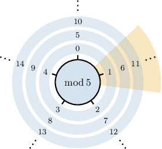

# Modular Congruence

Source: https://www.mathacademy.com/topics/2641?courseId=76
Topic ID: 2641

## Prerequisites

- [The Division Algorithm](./2689-the-division-algorithm.md)

## Lesson

### Introduction

Suppose $a$ is an integer, and ${\color{red}{n}}$ is a positive integer. As we've seen, the *division algorithm* states that there exists a unique integer $q$ and a unique positive integer ${\color{blue}{r}}$ such that

$$

a = q{\color{red}{n}}+{\color{blue}{r}}, \qquad 0\leq {\color{blue}{r}} < {\color{red}{n}}.

$$

When two integers $a$ and $b$ have the *same remainder* ${\color{blue}{r}}$ when divided by ${\color{red}{n}},$ we say they are **congruent modulo** $\boldsymbol n,$ and we write

$$

a\equiv b\qquad (\textrm{mod}\,n).

$$

The number $n$ is called the **modulus**.

To demonstrate this concretely, consider the following list of numbers:

$$

1, \qquad 6, \qquad 11, \qquad 16

$$

These numbers are **congruent modulo** $\boldsymbol 5$ because they each have the same remainder $({\color{blue}{1}})$ when divided by ${\color{red}{5}}.$

$$

\begin{aligned}1 & =0⋅5+1 \\ 6 & =1⋅5+1 \\ 11 & =2⋅5+1 \\ 16 & =3⋅5+1\end{aligned}

$$

Therefore, we can write the following:

$$

\begin{aligned}1 & ≡6 & & (mod\,5) \\ 1 & ≡11 & & (mod\,5) \\ 1 & ≡16 & & (mod\,5) \\ 6 & ≡11 & & (mod\,5) \\ 6 & ≡16 & & (mod\,5) \\ 11 & ≡16 & & (mod\,5)\end{aligned}

$$

Next, consider the following list of numbers:

$$

2, \qquad 7, \qquad 12, \qquad 17

$$

These numbers are *also* congruent modulo $5$ because they each have a remainder of $\color{blue}{2}$ when divided by ${\color{red}{5}}{:}$

$$

\begin{aligned}2 & =0⋅5+2 \\ 7 & =1⋅5+2 \\ 12 & =2⋅5+2 \\ 17 & =3⋅5+2\end{aligned}

$$

We write this as follows:

$$

\begin{aligned}2 & ≡7 & & (mod\,5) \\ 2 & ≡12 & & (mod\,5) \\ 2 & ≡17 & & (mod\,5) \\ 7 & ≡12 & & (mod\,5) \\ 7 & ≡17 & & (mod\,5) \\ 12 & ≡17 & & (mod\,5)\end{aligned}

$$

To visualize congruence modulo $5$ more generally, let's write the sequence $0, \: 1, \: 2, \: 3, \ldots$ in a spiral around a circle so that each "layer" contains exactly $5$ numbers.

Each "spoke" of our wheel contains numbers that are congruent modulo $5.$ Every number on a given spoke is congruent modulo $5$ to every other number on that spoke.

### Determining Congruence Using Divisibility

In general, two integers $a$ and $b$ are congruent modulo $n$ if and only if $n$ divides $(a-b).$

$$

a \equiv b \quad (\textrm{mod}\,n) \qquad \Longleftrightarrow \qquad n \mid (a-b)

$$

We'll prove this result at the end of the lesson.

For example, the following numbers are congruent with respect to the given modulus:

- $6\equiv 1\:(\textrm{mod}\,5)$ because $5\,\mid\, (6-1).$ There is no remainder:

- $-2\equiv -8\:(\textrm{mod}\,6)$ because $6\,\mid\, \left((-2)-(-8)\right).$ There is no remainder:

However, the following numbers are not congruent with respect to the given modulus:

- $6\not\equiv 1\:(\textrm{mod}\,4)$ because $4\,\not\mid\, (6-1).$ Note that $(6-1) = 5,$ which is not divisible by $4.$

- $0\not\equiv 13\:(\textrm{mod}\,12)$ because $12\,\not\mid\, (0-13).$ Note that $(0-13) = -13,$ which is not divisible by $12.$

### Example: Identifying Congruent Integers

#### Question

Which of the following statements are true?

1. $24 \equiv 12 \quad (\textrm{mod}\,3)$

2. $17 \equiv 21 \quad (\textrm{mod}\,4)$

3. $19 \equiv 12 \quad (\textrm{mod}\,9)$

#### Explanation

First, we recall that

$$

a \equiv b \quad (\textrm{mod}\,n) \qquad \Longleftrightarrow \qquad n \mid (a-b).

$$

So, $a$ and $b$ are congruent modulo $n$ if and only if $(a-b)$ is divisible by $n$ (there is no remainder).

With that in mind, let's analyze each statement in turn.

- Case I gives a true statement. Indeed, $3 \mid (24-12).$ There is no remainder:

- Case II gives a true statement. Indeed, $4 \mid (17-21).$ There is no remainder:

- Case III gives a false statement because $9 \not\mid (19-12).$ Notice that $19-12 = 7,$ which is not divisible by $9.$

Therefore, the correct answer is "I and II only."

### Example: Identifying Congruent Negative Integers

#### Question

Which of the following statements are true?

1. $-11 \equiv -29 \quad (\textrm{mod}\,6)$

2. $90 \equiv 0 \quad (\textrm{mod}\,9)$

3. $-10 \equiv 4 \quad (\textrm{mod}\,5)$

#### Explanation

First, we recall that

$$

a \equiv b \quad (\textrm{mod}\,n) \qquad \Longleftrightarrow \qquad n \mid (a-b).

$$

So, $a$ and $b$ are congruent modulo $n$ if and only if $(a-b)$ is divisible by $n$ (there is no remainder).

With that in mind, let's analyze each statement in turn.

- Statement I is true because $6 \mid (-11-(-29)).$ There is no remainder:

- Statement II is true because $9 \, | \, (90-0).$ There is no remainder:

- Statement III is false because $5 \not\mid (-10-4).$ Notice that $-10-4 = -14,$ which is not divisible by $5.$

Therefore, the correct answer is "I and II only."

### Example: Finding an Unknown Modulus

#### Question

Given that $-7 \equiv 17 \,(\textrm{mod}\,n)$, which of the following could be the value of $n?$

1. $n=6$

2. $n=5$

3. $n=4$

#### Explanation

First, we recall that

$$

a \equiv b \quad (\textrm{mod}\,n) \qquad \Longleftrightarrow \qquad n \mid (a-b).

$$

So, $a$ and $b$ are congruent modulo $n$ if and only if $(a-b)$ is divisible by $n$ (there is no remainder).

We have $a-b = -7-17= -24.$

With that in mind, let's analyze each statement in turn.

- Note that $6 \, | \, (-24)$ because $-24 \div 6 = -4,$ and there is no remainder. Therefore, the statement is true when $n=6.$

- Note that $5 \!\not{|} \, (-24).$ Therefore, the statement is false when $n=5.$

- Note that $4 \, | \, (-24)$ because $-24 \div 4 = -6,$ and there is no remainder. Therefore, the statement is true when $n=4.$

Therefore, the correct answer is "I and III only."

### Proof of the Divisibility Property

Throughout this lesson, we've been using the fact that $a$ is congruent to $b$ modulo $n$ if and only if $n$ divides $(a-b){:}$

$$

a \equiv b \quad (\textrm{mod}\,n) \qquad \Longleftrightarrow \qquad n \mid (a-b)

$$

To prove this result, first note that if $a$ and $b$ have the same remainder $r$ when divided by $n,$ then by the division algorithm

$$

\begin{aligned}𝑎 & =𝑝𝑛+𝑟 \\ 𝑏 & =𝑞𝑛+𝑟\end{aligned}

$$

for some integers $p$ and $q.$

Subtracting the second equation from the first gives

$$

(a-b) = (p-q)n.

$$

Now, if we denote $k=p-q\in\mathbb Z,$ then

$$

(a-b) = kn.

$$

So, $(a-b)$ is an integer multiple of $n,$ which means that $(a-b)$ is divisible by $n.$

Conversely, assume that $n \mid (a-b)$. Then there is an integer $k$ such that $a-b= nk.$

Now, by Euclid's division algorithm, there exist unique integers $m$ and $r\in \{0, 1, \dots n-1\}$ such that $b={\color{blue} n}m+\color{red}r.$ Note that this means that $b \, \cong \, r \, \, (\textrm{mod} \, n).$ So, we have

$$

\begin{aligned}𝑎−𝑏=𝑛𝑘 & \,\,⟹\,\,𝑎=𝑏+𝑛𝑘 \\ & \,\,⟹\,\,𝑎=(𝑛𝑚+𝑟)+𝑛𝑘 \\ & \,\,⟹\,\,𝑎=𝑛(𝑚+𝑘)+𝑟.\end{aligned}

$$

Therefore, $a \, \equiv \, r \, \, (\textrm{mod} \, n)$ and $b \, \equiv \, r \, \, (\textrm{mod} \, n),$ so $a \, \equiv \, b \, \, (\textrm{mod} \, n).$

This proves that if $n$ divides $(a-b)$ then $a$ is congruent to $b$ modulo $n.$
